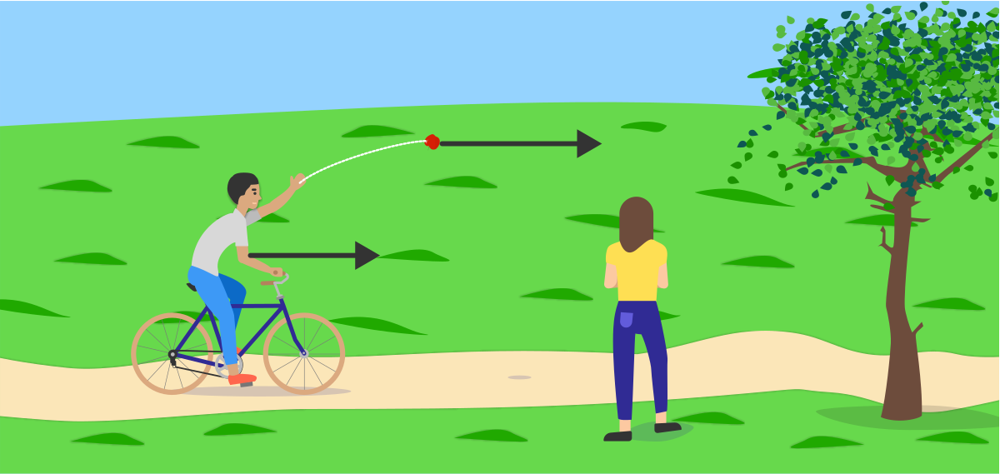
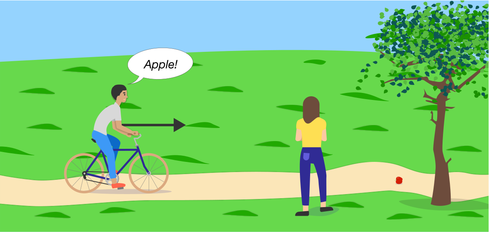
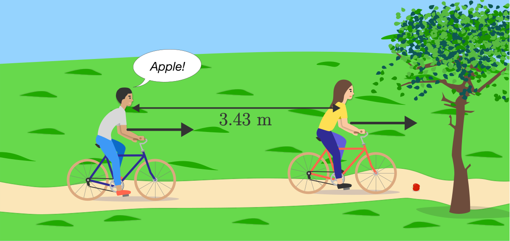

# Can You Hear a Delay?
## https://brilliant.org/daily-problems/sound-propagation/
Voices and other sounds take time to move through the air. However, the time it takes for sound to cross a room is so short that you never notice a delay between hearing a voice and seeing the movement of the speaker's lips.

But if you were in a wind tunnel, might the speed of sound be different? And if so, would you be able to notice the delay between voice and lips?

Sound is a compression wave. As a wave passes, tiny differences in air pressure compress the air for a short time. The speed of a sound wave is set by how responsive the air is to these pressure differences.

A representation of a sound wave traveling through air

The speed of sound in air is  under 343 m/s ordinary circumstances, and can be a little faster or slower depending on temperature and pressure. Sound waves in another medium, like water or railroad track, travel at a completely different speed that depends on the material properties of the medium at rest.

Thinking about moving sounds the same way we think about moving objects can lead to misconceptions. Suppose you're on a bike pedaling at a constant speed while your friend watches from the side of the path. If you throw an apple out in front of you, who will see the apple moving at a higher speed?

Your friend does, because the speed of your bike adds to the speed of your throw.

A sound wave's speed, on the other hand, is set by the medium. If you call out "Apple!" instead of throwing one, your friend would measure the sound of your voice moving at the same speed no matter how fast you're moving.

# Today's Problem

You and your friend are both riding your bikes at the same speed, 13 m/s separated by a distance of 3.43m.

You call out a warning about an apple in the road. How long does it take before the sound wave reaches your friend's ear? 

* Longer than 0.01s
* Shorter than 0.01s
* Exactly 0.01s

======================

# 내 멋대로 발직역
# 지연됨을 느낄 수 있겠습니까?
목소리들과 다른 소리들은 공기를 통해 움직이는데 시간이 걸립니다. 그러나, 소리가 실내를 가로 지르는데 걸리는 시간이 너무 짧아서 당신은 목소리를 듣는것과 말하는 사람의 입술의 움직임을 사이의 지연을 알아차릴수 없을 것이다.

하지만 만약 당신이 바람이부는 터널에 있을때, 소리의 속도가 달라진다면? 그러면 당신이 목소리와 입술사이의 지연을 알아챌 수 있을까?

소리는 물결의 압축이다. 물결이 지나갈때, 공기를 압력의 미세한 차이는 짧은시간 동안 공기를 압축하는 것이다. 그 음파의 속도는 어떻게 공기에 이러한 압력차이에 얼마나 반응하는지에 따라 설정된다.

공기를 통해 움직이는 음파의 표현

그 공기에서 움직이는 속도는 평범한 환경에서 343m/s 아래를 웃돈다. 그리고 온도와 압력에 따라 조금 빠르거나 느려질 수가 있다. 다른 매개물에서의 음파는(물 또는 철도레일) 매개물의 전달력 특성에 따라서 완전히 다른 속도로 움직인다.

소리가 움직이는 것과 물체가 움직이는것을 생각하면 오해가 발생할 수 있다. 가정해보자 당신이 자전거 메달링을 일정한 속도로 길거리에서 친구가 보일때까지 한다. 만약 당신이 당신 앞으로 사과를 던졌을때, 친구는 사과가 그냥 던졌을때보다 더 빠른 스피드로 보일까?

당신의 친구는 그럴것이다. 왜냐하면 당신의 자전거 속도에 당신이 던진속도가 합쳐지기 때문이다.

다른한편으로는 음파속도는 매개물에의해 정해진다. 만약 당신이 사과를 던지는대신 "사과!!"라고 외친다면, 당신의 친구는 당신이 얼마나 빠르게 움직이건 간에 당신의 목소리의 속도가 같다고 측정할 것이다.

# Today's Problem

당신과 당신의 친구는 같은 속도인 13m/s로 자전거를 타고 3.43m를 유지하며 간다.

당신이 길에 있는 사과를 조심하라고 외친다. 당신의 친구의 귀에 음파가 닿는데 걸리는 시간은 평소보다 얼마나 더 걸릴까?

* 0.01초보다 더 길게
* 0.01초보다 더 짧게
* 정확히 0.01초 

=================================

내가 고른 정답 : 1. Longer than 0.01s

이유 : 일반적인 환경인 상온에서 공기를 통해 전달되는 소리의 속도는 343m/s이다.(문제에 쓰여 있음) 13m/s속도로 달리고 있으므로 3.43 / (331-13)이라고 생각했다.

답 : 1. Longer than 0.01s

모범 밤안 :
두 친구의 거리는 3.43m이다.
둘은 13m/s 속도로 움직이고 있다.

친구A가 소리칠때, 3.43미터와 친구B가 같은 시간에 횡단 한 거리를 더해야 한다.

만약 친구B가 가만히 있는다면

3.43/343(친구와의 거리/소리의 속도) = 0.01s

B친구가 소리의 원천과 반대 방향으로 움직이기 때문에 소리가 들릴려면 0.01초 이상 걸릴것이다.