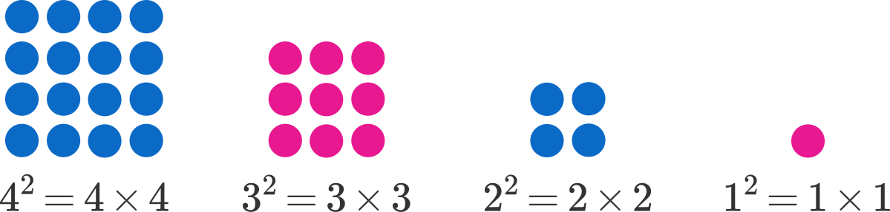
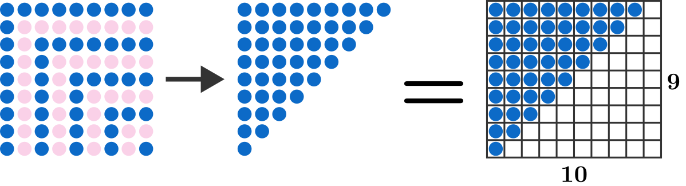

# Series of Squares
## https://brilliant.org/daily-problems/square-series/?wvideo=4nutb4n31g

Humans are a visual species, which is why many of us have trouble with mathematical abstractions. But that also means we can visualize those abstractions, unlocking a powerful tool to quickly solve complex problems.

Algebraic simplification is one route to solving today's problem, but a quick geometric visualization can bypass almost all the algebra. To start, visualize the squared numbers as square arrays of dots:

We can see what happens when a square array is subtracted from another that is slightly larger.

<a href="https://brilliant.org/daily-problems/square-series/?wvideo=4nutb4n31g">(1) Daily Problems | Brilliant</a>

So, 92-82 = 9+8

This might seem familiar if you've seen the difference of squares formula before:

a2-b2 = (a+b)(a-b)

92-82 = (9+8)(9-8)

However, today's problem is a lengthy, alternating sum of squares, a longer version of

92-82+72-62+52-42+32-22+12.

You can simplify this algebraically if you want... or, if we represent the full series of addition and subtraction visually, it's possible to see the simplification visually. The light pink circles are those being "removed" by each subtraction in the sequence.

Lastly, we can rearrange the remaining dots, which represent the total sum of the series. This arrangement can help us determine a simpler calculation to find the total number of dots as this triangle fills exactly half of a  rectangle cells.

# Today's Problem
22-12 = 3

32-22+12 = 6
42-32+22-12 = 10

42-32+22-12 = 10

52-42+32-22+12 = 15

Calculate the value of x :

1002-992+ ... + 22-12 = x.

=============================

# 내 멋대로 발직역
# 연속된 정사각형
인간들은 시각적 종입니다. 이것이 우리에게 많은 추상적 수학문제들이 있는 이유입니다. 하지만 그것 또한 우리가 추상적으로 보고 있다는 것을 의미 합니다. 풀리지않는 문제를 신속하게 풀게해주는 하는 강력한 도구를 말이죠.

대수의 단일화가 오늘의 문제의 한가지 풀이 방법이 될 것입니다. 하지만 기하학적 시각화가 대부분의 대수를 우회 할 수 있습니다. 시작하기위해 제곱으로 된 숫자를 점의 정사각형 배열로 시각화 해봅니다.

우리는 약간더 큰 사각형으로 사각형을 뺄때 어떤일이 일어나는지 볼 수 있습니다.

<a href="https://brilliant.org/daily-problems/square-series/?wvideo=4nutb4n31g">(1) Daily Problems | Brilliant</a>

그래서, 92-82 = 9+8

이전에 이런 제곱 수식을 본적이 있다면 이것은 익숙해 보일것입니다.

a2-b2 = (a+b)(a-b)

92-82 = (9+8)(9-8)

그러나 오늘문제는 깁니다. 번갈아가며 나타나는 사각형의 합의 긴 버젼이죠.

92-82+72-62+52-42+32-22+12.

원한다면 대수적으로 단순화 할 수 있습니다. 또는 우리가 시각적으로 더하기와 빼기 전체 시리즈를 나타낼 경우 시각적으로 단순화를 해 볼 수도 있습니다. 밝은 분홍색 원은 시퀸스에서 각 빼기로 "제거된" 원입니다.

마지막으로, 우리는 남은 점들을 재정렬할 수 있습니다. 어느쪽이든 연속적으로 말이죠. 이 배열은 삼각형이 직사각형 셀의 정확히 절반을 채우는 총 도트 수를 찾는 더 간단한 계산을 결정하는데 도움이 될 수 있습니다. 9*8이라는 수식을요.

# Today's Problem
22-12 = 3

32-22+12 = 6
42-32+22-12 = 10

42-32+22-12 = 10

52-42+32-22+12 = 15

x의 값을 계산하시오 :

1002-992+ ... + 22-12 = x.

=============================

내가 고른 정답 : 2. 5050
이유 : 100개의 수를 양옆으로 두개씩 짝지어 주면 (a+1)2 - a2 = 2a+1 이 되므로 식이 

1002-992+ ... + 22-12 = 

199 + 195 + ... + 7 +3 =

(199+3)*50/2 = 

5050

정답 : 2. 5050

모범 답안 : 

위에서 설명한 용어로 나타나는 시퀸스의 시각적 표현을 잘보세요.

파란색 점들은 45개 입니다, (9 * 10) / 2. 우리는 이것을 n이라 두었을때 n*(n+1)/2라는 것을 알 수 있다.

오늘의 문제에서 n=100이다. 따라서 (100*101)/2 = 5050이다.