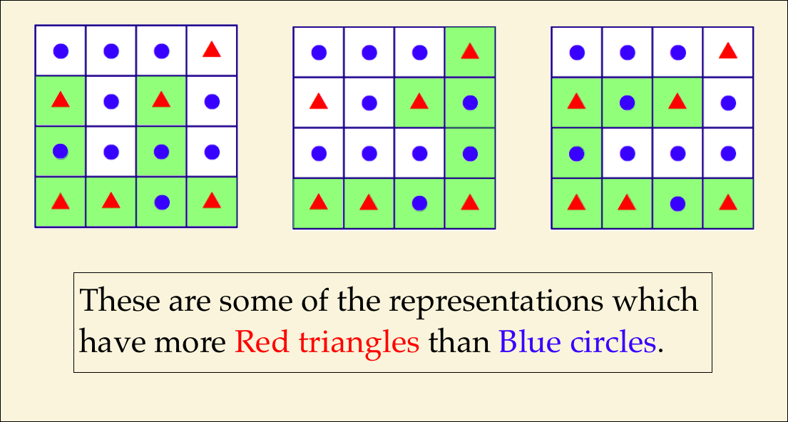

# CartographyorConspiracy?
https://brilliant.org/daily-problems/gerrymander/

Is it possible to change the results of an election just by drawing a map in a certain way? Actually, yes. 

In fact, it's such a common practice that drawing maps with this goal has a name: it's called <strong>gerrymandering</strong>. 

Let's look at a simplified example. Consider the map of nine voting regions below, which need to be divided into three districts.   

As you can see, the red <strong>A</strong>'s are in the majority. However, depending on how the districts are chosen, the results might be different. Consider two different choices below: 

 

In the first allocation, the red <strong>A</strong>'s win two of the districts and the blue <strong>B</strong>'s win one. But in the <em>second</em> allocation, the <strong>B</strong>'s win two districts—the majority—even though they were the minority of the total population. 

Gerrymandering can be accomplished by <em>distributing</em> the votes for party <strong>B</strong> into as many districts as possible (while maintaining a majority) and <em>concentrating</em> votes for <strong>A</strong> into a single district. Even though they were in the minority, it's possible to choose districts that let the voters for party <strong>B</strong> have more influence overall. 

Can you find a way to give the triangle party an advantage in the problem below?

<header class="b-vspace-m">
<h1>Today's Problem</h1>
</header>

The 16-square grid below needs to be divided into two contiguous 8-square districts.

Is it possible to cut the 16-square grid in such a way that the red triangles outnumber the blue circles in one of the districts?

* Yes, it’s possible.
* No, it’s not possible.

===============================================

# 내 멋대로 발직역
# 작도법 or 음모?

특정 방법으로 지도를 그리는것만으로도 선거 결과가 변경 될 수 있을까요? 실제로 그렇습니다.

실제로 선거구를 자기에게 유리하게 만드는것(gerrymandering)이라 불리는 이 지도 작도법이 시행되고 있습니다.

간단한 예시를 보시죠. 9개의 투표지역을 3구역으로 나눌 필요가 있습니다.

보다시피 빨간색 A가 대다수에 있습니다. 그러나 지구를 선택하는 방법에 따라 결과가 다를 수 있스빈다. 아래의 두가지 선택을 고려해봅시다.

한구역은 A가 우세이지만 두구역은 B가 우세하다. 이러면 결과적으로 B가 우세한 곳이 두곳이 되며 전체적으로 B지역구가 되는것이다.

게리맨더링은 가능한 많은 지구에 B당을 위해 투표를 배분하고 A에 대한 투표를 단일 지구에 집중시키며 성취 될 수 있다. 비록 그들이 소수에 있더라도 B를위한 유권자가 전체적인 영향력을 갖도록 할 수 있다.

이런 삼각형 파티가 아래 문제에서 얻을 수 있는 이점은 무엇입니까?

<header class="b-vspace-m">
<h1>Today's Problem</h1>
</header>

격자로 16개의 네모로 나누어진 두개의 집단이 각각 6, 10개씩 있습니다. contiguous 8-square districts.

빨간색 삼각형이 구역 중 하나의 파란색 원보다 많은 격자를 자르는 것이 가능합니까?

* Yes, it’s possible.
* No, it’s not possible.

===============================================

내가 고른 정답 : 1. Yes, it’s possible.

이유 : 이건 머 짜맞추기다

정답 : 1. Yes, it’s possible.

모범 답안 : 

