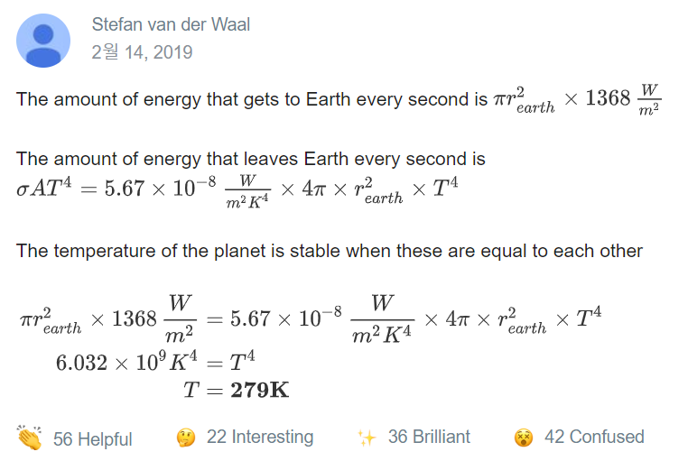

# HowColdisEarth?
https://brilliant.org/daily-problems/how-cold-is-earth/

Last week an unusual string of snowstorms flash-froze the US city of Seattle. The week before last, the central US was put in the deep freeze by record low temperatures and wind chills.

What's with the bitterly cold weather? The parts of Earth in direct sunlight receive a steady dose of <svg xmlns:xlink="http://www.w3.org/1999/xlink" style="width: 11.667ex; height: 2.667ex; vertical-align: -0.778ex; margin-top: 1px; margin-right: 0px; margin-bottom: 1px; margin-left: 0px; " viewBox="0 -854.728417598297 5036.775612815496 1125.6317189263534"><defs><path id="MJMAIN-31-4a05a6ea2f4611e9a5c902b7b6aa388604d2b5388be44709b9f7ea5a890c3534" stroke-width="0" d="M213 578L200 573Q186 568 160 563T102 556H83V602H102Q149 604 189 617T245 641T273 663Q275 666 285 666Q294 666 302 660V361L303 61Q310 54 315 52T339 48T401 46H427V0H416Q395 3 257 3Q121 3 100 0H88V46H114Q136 46 152 46T177 47T193 50T201 52T207 57T213 61V578Z"></path><path id="MJMAIN-33-4a05a6ea2f4611e9a5c902b7b6aa388604d2b5388be44709b9f7ea5a890c3534" stroke-width="0" d="M127 463Q100 463 85 480T69 524Q69 579 117 622T233 665Q268 665 277 664Q351 652 390 611T430 522Q430 470 396 421T302 350L299 348Q299 347 308 345T337 336T375 315Q457 262 457 175Q457 96 395 37T238 -22Q158 -22 100 21T42 130Q42 158 60 175T105 193Q133 193 151 175T169 130Q169 119 166 110T159 94T148 82T136 74T126 70T118 67L114 66Q165 21 238 21Q293 21 321 74Q338 107 338 175V195Q338 290 274 322Q259 328 213 329L171 330L168 332Q166 335 166 348Q166 366 174 366Q202 366 232 371Q266 376 294 413T322 525V533Q322 590 287 612Q265 626 240 626Q208 626 181 615T143 592T132 580H135Q138 579 143 578T153 573T165 566T175 555T183 540T186 520Q186 498 172 481T127 463Z"></path><path id="MJMAIN-36-4a05a6ea2f4611e9a5c902b7b6aa388604d2b5388be44709b9f7ea5a890c3534" stroke-width="0" d="M42 313Q42 476 123 571T303 666Q372 666 402 630T432 550Q432 525 418 510T379 495Q356 495 341 509T326 548Q326 592 373 601Q351 623 311 626Q240 626 194 566Q147 500 147 364L148 360Q153 366 156 373Q197 433 263 433H267Q313 433 348 414Q372 400 396 374T435 317Q456 268 456 210V192Q456 169 451 149Q440 90 387 34T253 -22Q225 -22 199 -14T143 16T92 75T56 172T42 313ZM257 397Q227 397 205 380T171 335T154 278T148 216Q148 133 160 97T198 39Q222 21 251 21Q302 21 329 59Q342 77 347 104T352 209Q352 289 347 316T329 361Q302 397 257 397Z"></path><path id="MJMAIN-38-4a05a6ea2f4611e9a5c902b7b6aa388604d2b5388be44709b9f7ea5a890c3534" stroke-width="0" d="M70 417T70 494T124 618T248 666Q319 666 374 624T429 515Q429 485 418 459T392 417T361 389T335 371T324 363L338 354Q352 344 366 334T382 323Q457 264 457 174Q457 95 399 37T249 -22Q159 -22 101 29T43 155Q43 263 172 335L154 348Q133 361 127 368Q70 417 70 494ZM286 386L292 390Q298 394 301 396T311 403T323 413T334 425T345 438T355 454T364 471T369 491T371 513Q371 556 342 586T275 624Q268 625 242 625Q201 625 165 599T128 534Q128 511 141 492T167 463T217 431Q224 426 228 424L286 386ZM250 21Q308 21 350 55T392 137Q392 154 387 169T375 194T353 216T330 234T301 253T274 270Q260 279 244 289T218 306L210 311Q204 311 181 294T133 239T107 157Q107 98 150 60T250 21Z"></path><path id="MJMAIN-57-4a05a6ea2f4611e9a5c902b7b6aa388604d2b5388be44709b9f7ea5a890c3534" stroke-width="0" d="M792 683Q810 680 914 680Q991 680 1003 683H1009V637H996Q931 633 915 598Q912 591 863 438T766 135T716 -17Q711 -22 694 -22Q676 -22 673 -15Q671 -13 593 231L514 477L435 234Q416 174 391 92T358 -6T341 -22H331Q314 -21 310 -15Q309 -14 208 302T104 622Q98 632 87 633Q73 637 35 637H18V683H27Q69 681 154 681Q164 681 181 681T216 681T249 682T276 683H287H298V637H285Q213 637 213 620Q213 616 289 381L364 144L427 339Q490 535 492 546Q487 560 482 578T475 602T468 618T461 628T449 633T433 636T408 637H380V683H388Q397 680 508 680Q629 680 650 683H660V637H647Q576 637 576 619L727 146Q869 580 869 600Q869 605 863 612T839 627T794 637H783V683H792Z"></path><path id="MJMAIN-2F-4a05a6ea2f4611e9a5c902b7b6aa388604d2b5388be44709b9f7ea5a890c3534" stroke-width="0" d="M423 750Q432 750 438 744T444 730Q444 725 271 248T92 -240Q85 -250 75 -250Q68 -250 62 -245T56 -231Q56 -221 230 257T407 740Q411 750 423 750Z"></path><path id="MJMAIN-6D-4a05a6ea2f4611e9a5c902b7b6aa388604d2b5388be44709b9f7ea5a890c3534" stroke-width="0" d="M41 46H55Q94 46 102 60V68Q102 77 102 91T102 122T103 161T103 203Q103 234 103 269T102 328V351Q99 370 88 376T43 385H25V408Q25 431 27 431L37 432Q47 433 65 434T102 436Q119 437 138 438T167 441T178 442H181V402Q181 364 182 364T187 369T199 384T218 402T247 421T285 437Q305 442 336 442Q351 442 364 440T387 434T406 426T421 417T432 406T441 395T448 384T452 374T455 366L457 361L460 365Q463 369 466 373T475 384T488 397T503 410T523 422T546 432T572 439T603 442Q729 442 740 329Q741 322 741 190V104Q741 66 743 59T754 49Q775 46 803 46H819V0H811L788 1Q764 2 737 2T699 3Q596 3 587 0H579V46H595Q656 46 656 62Q657 64 657 200Q656 335 655 343Q649 371 635 385T611 402T585 404Q540 404 506 370Q479 343 472 315T464 232V168V108Q464 78 465 68T468 55T477 49Q498 46 526 46H542V0H534L510 1Q487 2 460 2T422 3Q319 3 310 0H302V46H318Q379 46 379 62Q380 64 380 200Q379 335 378 343Q372 371 358 385T334 402T308 404Q263 404 229 370Q202 343 195 315T187 232V168V108Q187 78 188 68T191 55T200 49Q221 46 249 46H265V0H257L234 1Q210 2 183 2T145 3Q42 3 33 0H25V46H41Z"></path><path id="MJMAIN-32-4a05a6ea2f4611e9a5c902b7b6aa388604d2b5388be44709b9f7ea5a890c3534" stroke-width="0" d="M109 429Q82 429 66 447T50 491Q50 562 103 614T235 666Q326 666 387 610T449 465Q449 422 429 383T381 315T301 241Q265 210 201 149L142 93L218 92Q375 92 385 97Q392 99 409 186V189H449V186Q448 183 436 95T421 3V0H50V19V31Q50 38 56 46T86 81Q115 113 136 137Q145 147 170 174T204 211T233 244T261 278T284 308T305 340T320 369T333 401T340 431T343 464Q343 527 309 573T212 619Q179 619 154 602T119 569T109 550Q109 549 114 549Q132 549 151 535T170 489Q170 464 154 447T109 429Z"></path></defs><g stroke="black" fill="black" stroke-width="0" transform="matrix(1 0 0 -1 0 0)"><use xlink:href="#MJMAIN-31-4a05a6ea2f4611e9a5c902b7b6aa388604d2b5388be44709b9f7ea5a890c3534"></use><use xlink:href="#MJMAIN-33-4a05a6ea2f4611e9a5c902b7b6aa388604d2b5388be44709b9f7ea5a890c3534" x="500" y="0"></use><use xlink:href="#MJMAIN-36-4a05a6ea2f4611e9a5c902b7b6aa388604d2b5388be44709b9f7ea5a890c3534" x="1000" y="0"></use><use xlink:href="#MJMAIN-38-4a05a6ea2f4611e9a5c902b7b6aa388604d2b5388be44709b9f7ea5a890c3534" x="1500" y="0"></use><g transform="translate(2222,0)"><use xlink:href="#MJMAIN-57-4a05a6ea2f4611e9a5c902b7b6aa388604d2b5388be44709b9f7ea5a890c3534"></use><use xlink:href="#MJMAIN-2F-4a05a6ea2f4611e9a5c902b7b6aa388604d2b5388be44709b9f7ea5a890c3534" x="1028" y="0"></use><g transform="translate(1528,0)"><use xlink:href="#MJMAIN-6D-4a05a6ea2f4611e9a5c902b7b6aa388604d2b5388be44709b9f7ea5a890c3534"></use><use transform="scale(0.7071067811865476)" xlink:href="#MJMAIN-32-4a05a6ea2f4611e9a5c902b7b6aa388604d2b5388be44709b9f7ea5a890c3534" x="1178" y="513"></use></g></g></g></svg> of solar radiation <svg xmlns:xlink="http://www.w3.org/1999/xlink" style="width: 0.889ex; height: 2.444ex; vertical-align: -0.778ex; margin-top: 1px; margin-right: 0px; margin-bottom: 1px; margin-left: 0px; " viewBox="0 -770.9033013280564 389 1041.8066026561128"><defs id="MathJax_SVG_glyphs-ca728940261b11e3937340400601ade9d12ac15170904eedac3406a78aa9356b"><path id="MJMAIN-28-ca728940261b11e3937340400601ade9d12ac15170904eedac3406a78aa9356b" stroke-width="0" d="M94 250Q94 319 104 381T127 488T164 576T202 643T244 695T277 729T302 750H315H319Q333 750 333 741Q333 738 316 720T275 667T226 581T184 443T167 250T184 58T225 -81T274 -167T316 -220T333 -241Q333 -250 318 -250H315H302L274 -226Q180 -141 137 -14T94 250Z"></path></defs><g stroke="black" fill="black" stroke-width="0" transform="matrix(1 0 0 -1 0 0)"><use xlink:href="#MJMAIN-28-ca728940261b11e3937340400601ade9d12ac15170904eedac3406a78aa9356b"></use></g></svg>though it's down to about <svg xmlns:xlink="http://www.w3.org/1999/xlink" style="width: 11.667ex; height: 2.667ex; vertical-align: -0.778ex; margin-top: 1px; margin-right: 0px; margin-bottom: 1px; margin-left: 0px; " viewBox="0 -854.728417598297 5036.775612815496 1125.6317189263534"><defs><path id="MJMAIN-31-4a05a6ea2f4611e9a5c902b7b6aa388604d2b5388be44709b9f7ea5a890c3534" stroke-width="0" d="M213 578L200 573Q186 568 160 563T102 556H83V602H102Q149 604 189 617T245 641T273 663Q275 666 285 666Q294 666 302 660V361L303 61Q310 54 315 52T339 48T401 46H427V0H416Q395 3 257 3Q121 3 100 0H88V46H114Q136 46 152 46T177 47T193 50T201 52T207 57T213 61V578Z"></path><path id="MJMAIN-30-4a05a6ea2f4611e9a5c902b7b6aa388604d2b5388be44709b9f7ea5a890c3534" stroke-width="0" d="M96 585Q152 666 249 666Q297 666 345 640T423 548Q460 465 460 320Q460 165 417 83Q397 41 362 16T301 -15T250 -22Q224 -22 198 -16T137 16T82 83Q39 165 39 320Q39 494 96 585ZM321 597Q291 629 250 629Q208 629 178 597Q153 571 145 525T137 333Q137 175 145 125T181 46Q209 16 250 16Q290 16 318 46Q347 76 354 130T362 333Q362 478 354 524T321 597Z"></path><path id="MJMAIN-30-4a05a6ea2f4611e9a5c902b7b6aa388604d2b5388be44709b9f7ea5a890c3534" stroke-width="0" d="M96 585Q152 666 249 666Q297 666 345 640T423 548Q460 465 460 320Q460 165 417 83Q397 41 362 16T301 -15T250 -22Q224 -22 198 -16T137 16T82 83Q39 165 39 320Q39 494 96 585ZM321 597Q291 629 250 629Q208 629 178 597Q153 571 145 525T137 333Q137 175 145 125T181 46Q209 16 250 16Q290 16 318 46Q347 76 354 130T362 333Q362 478 354 524T321 597Z"></path><path id="MJMAIN-30-4a05a6ea2f4611e9a5c902b7b6aa388604d2b5388be44709b9f7ea5a890c3534" stroke-width="0" d="M96 585Q152 666 249 666Q297 666 345 640T423 548Q460 465 460 320Q460 165 417 83Q397 41 362 16T301 -15T250 -22Q224 -22 198 -16T137 16T82 83Q39 165 39 320Q39 494 96 585ZM321 597Q291 629 250 629Q208 629 178 597Q153 571 145 525T137 333Q137 175 145 125T181 46Q209 16 250 16Q290 16 318 46Q347 76 354 130T362 333Q362 478 354 524T321 597Z"></path><path id="MJMAIN-57-4a05a6ea2f4611e9a5c902b7b6aa388604d2b5388be44709b9f7ea5a890c3534" stroke-width="0" d="M792 683Q810 680 914 680Q991 680 1003 683H1009V637H996Q931 633 915 598Q912 591 863 438T766 135T716 -17Q711 -22 694 -22Q676 -22 673 -15Q671 -13 593 231L514 477L435 234Q416 174 391 92T358 -6T341 -22H331Q314 -21 310 -15Q309 -14 208 302T104 622Q98 632 87 633Q73 637 35 637H18V683H27Q69 681 154 681Q164 681 181 681T216 681T249 682T276 683H287H298V637H285Q213 637 213 620Q213 616 289 381L364 144L427 339Q490 535 492 546Q487 560 482 578T475 602T468 618T461 628T449 633T433 636T408 637H380V683H388Q397 680 508 680Q629 680 650 683H660V637H647Q576 637 576 619L727 146Q869 580 869 600Q869 605 863 612T839 627T794 637H783V683H792Z"></path><path id="MJMAIN-2F-4a05a6ea2f4611e9a5c902b7b6aa388604d2b5388be44709b9f7ea5a890c3534" stroke-width="0" d="M423 750Q432 750 438 744T444 730Q444 725 271 248T92 -240Q85 -250 75 -250Q68 -250 62 -245T56 -231Q56 -221 230 257T407 740Q411 750 423 750Z"></path><path id="MJMAIN-6D-4a05a6ea2f4611e9a5c902b7b6aa388604d2b5388be44709b9f7ea5a890c3534" stroke-width="0" d="M41 46H55Q94 46 102 60V68Q102 77 102 91T102 122T103 161T103 203Q103 234 103 269T102 328V351Q99 370 88 376T43 385H25V408Q25 431 27 431L37 432Q47 433 65 434T102 436Q119 437 138 438T167 441T178 442H181V402Q181 364 182 364T187 369T199 384T218 402T247 421T285 437Q305 442 336 442Q351 442 364 440T387 434T406 426T421 417T432 406T441 395T448 384T452 374T455 366L457 361L460 365Q463 369 466 373T475 384T488 397T503 410T523 422T546 432T572 439T603 442Q729 442 740 329Q741 322 741 190V104Q741 66 743 59T754 49Q775 46 803 46H819V0H811L788 1Q764 2 737 2T699 3Q596 3 587 0H579V46H595Q656 46 656 62Q657 64 657 200Q656 335 655 343Q649 371 635 385T611 402T585 404Q540 404 506 370Q479 343 472 315T464 232V168V108Q464 78 465 68T468 55T477 49Q498 46 526 46H542V0H534L510 1Q487 2 460 2T422 3Q319 3 310 0H302V46H318Q379 46 379 62Q380 64 380 200Q379 335 378 343Q372 371 358 385T334 402T308 404Q263 404 229 370Q202 343 195 315T187 232V168V108Q187 78 188 68T191 55T200 49Q221 46 249 46H265V0H257L234 1Q210 2 183 2T145 3Q42 3 33 0H25V46H41Z"></path><path id="MJMAIN-32-4a05a6ea2f4611e9a5c902b7b6aa388604d2b5388be44709b9f7ea5a890c3534" stroke-width="0" d="M109 429Q82 429 66 447T50 491Q50 562 103 614T235 666Q326 666 387 610T449 465Q449 422 429 383T381 315T301 241Q265 210 201 149L142 93L218 92Q375 92 385 97Q392 99 409 186V189H449V186Q448 183 436 95T421 3V0H50V19V31Q50 38 56 46T86 81Q115 113 136 137Q145 147 170 174T204 211T233 244T261 278T284 308T305 340T320 369T333 401T340 431T343 464Q343 527 309 573T212 619Q179 619 154 602T119 569T109 550Q109 549 114 549Q132 549 151 535T170 489Q170 464 154 447T109 429Z"></path></defs><g stroke="black" fill="black" stroke-width="0" transform="matrix(1 0 0 -1 0 0)"><use xlink:href="#MJMAIN-31-4a05a6ea2f4611e9a5c902b7b6aa388604d2b5388be44709b9f7ea5a890c3534"></use><use xlink:href="#MJMAIN-30-4a05a6ea2f4611e9a5c902b7b6aa388604d2b5388be44709b9f7ea5a890c3534" x="500" y="0"></use><use xlink:href="#MJMAIN-30-4a05a6ea2f4611e9a5c902b7b6aa388604d2b5388be44709b9f7ea5a890c3534" x="1000" y="0"></use><use xlink:href="#MJMAIN-30-4a05a6ea2f4611e9a5c902b7b6aa388604d2b5388be44709b9f7ea5a890c3534" x="1500" y="0"></use><g transform="translate(2222,0)"><use xlink:href="#MJMAIN-57-4a05a6ea2f4611e9a5c902b7b6aa388604d2b5388be44709b9f7ea5a890c3534"></use><use xlink:href="#MJMAIN-2F-4a05a6ea2f4611e9a5c902b7b6aa388604d2b5388be44709b9f7ea5a890c3534" x="1028" y="0"></use><g transform="translate(1528,0)"><use xlink:href="#MJMAIN-6D-4a05a6ea2f4611e9a5c902b7b6aa388604d2b5388be44709b9f7ea5a890c3534"></use><use transform="scale(0.7071067811865476)" xlink:href="#MJMAIN-32-4a05a6ea2f4611e9a5c902b7b6aa388604d2b5388be44709b9f7ea5a890c3534" x="1178" y="513"></use></g></g></g></svg> after absorption by the atmosphere<svg xmlns:xlink="http://www.w3.org/1999/xlink" style="width: 1.5ex; height: 2.375ex; vertical-align: -0.75ex; margin-top: 1px; margin-right: 0px; margin-bottom: 1px; margin-left: 0px; " viewBox="0 -768.5807122916057 667 1037.1614245832113"><defs><path id="MJMAIN-29-d3989670eb4a11e6aa5902f5dad986b7974b17758fa44cec868dbff9bd155c95" stroke-width="0" d="M60 749L64 750Q69 750 74 750H86L114 726Q208 641 251 514T294 250Q294 182 284 119T261 12T224 -76T186 -143T145 -194T113 -227T90 -246Q87 -249 86 -250H74Q66 -250 63 -250T58 -247T55 -238Q56 -237 66 -225Q221 -64 221 250T66 725Q56 737 55 738Q55 746 60 749Z"></path><path id="MJMAIN-2E-d3989670eb4a11e6aa5902f5dad986b7974b17758fa44cec868dbff9bd155c95" stroke-width="0" d="M78 60Q78 84 95 102T138 120Q162 120 180 104T199 61Q199 36 182 18T139 0T96 17T78 60Z"></path></defs><g stroke="black" fill="black" stroke-width="0" transform="matrix(1 0 0 -1 0 0)"><use xlink:href="#MJMAIN-29-d3989670eb4a11e6aa5902f5dad986b7974b17758fa44cec868dbff9bd155c95"></use><use xlink:href="#MJMAIN-2E-d3989670eb4a11e6aa5902f5dad986b7974b17758fa44cec868dbff9bd155c95" x="389" y="0"></use></g></svg> This energy arrives day after day and week after week, so what prevents Earth from warming up, keeping cold weather at bay for good? 

The short answer: solar energy absorbed by Earth is radiated back into space through a process called blackbody radiation. All objects emit radiation, which carries energy away and cools it over time—including Earth.

Two rocks: one cold and one hot. The hot rock emits more energy per second.

Hot objects radiate energy at a higher rate than cool objects. In fact, you can see this radiation as a glow once an object reaches a temperature of several thousand degrees Kelvin. But even when a rock is cool to the touch, it radiates heat, just outside the visible spectrum. 

The visible blackbody colors along a temperature scale in Kelvin.  The surface of the Sun is about <svg xmlns:xlink="http://www.w3.org/1999/xlink" style="width: 7.667ex; height: 2.111ex; vertical-align: -0.556ex; margin-top: 1px; margin-right: 0px; margin-bottom: 1px; margin-left: 0px; " viewBox="0 -703.9033013280564 3278.222222222222 919.8066026561128"><defs><path id="MJMAIN-35-537a94122e6d11e98ea502160d56b37e7e898488666b4d1da88968c11af0009d" stroke-width="0" d="M164 157Q164 133 148 117T109 101H102Q148 22 224 22Q294 22 326 82Q345 115 345 210Q345 313 318 349Q292 382 260 382H254Q176 382 136 314Q132 307 129 306T114 304Q97 304 95 310Q93 314 93 485V614Q93 664 98 664Q100 666 102 666Q103 666 123 658T178 642T253 634Q324 634 389 662Q397 666 402 666Q410 666 410 648V635Q328 538 205 538Q174 538 149 544L139 546V374Q158 388 169 396T205 412T256 420Q337 420 393 355T449 201Q449 109 385 44T229 -22Q148 -22 99 32T50 154Q50 178 61 192T84 210T107 214Q132 214 148 197T164 157Z"></path><path id="MJMAIN-37-537a94122e6d11e98ea502160d56b37e7e898488666b4d1da88968c11af0009d" stroke-width="0" d="M55 458Q56 460 72 567L88 674Q88 676 108 676H128V672Q128 662 143 655T195 646T364 644H485V605L417 512Q408 500 387 472T360 435T339 403T319 367T305 330T292 284T284 230T278 162T275 80Q275 66 275 52T274 28V19Q270 2 255 -10T221 -22Q210 -22 200 -19T179 0T168 40Q168 198 265 368Q285 400 349 489L395 552H302Q128 552 119 546Q113 543 108 522T98 479L95 458V455H55V458Z"></path><path id="MJMAIN-37-537a94122e6d11e98ea502160d56b37e7e898488666b4d1da88968c11af0009d" stroke-width="0" d="M55 458Q56 460 72 567L88 674Q88 676 108 676H128V672Q128 662 143 655T195 646T364 644H485V605L417 512Q408 500 387 472T360 435T339 403T319 367T305 330T292 284T284 230T278 162T275 80Q275 66 275 52T274 28V19Q270 2 255 -10T221 -22Q210 -22 200 -19T179 0T168 40Q168 198 265 368Q285 400 349 489L395 552H302Q128 552 119 546Q113 543 108 522T98 479L95 458V455H55V458Z"></path><path id="MJMAIN-38-537a94122e6d11e98ea502160d56b37e7e898488666b4d1da88968c11af0009d" stroke-width="0" d="M70 417T70 494T124 618T248 666Q319 666 374 624T429 515Q429 485 418 459T392 417T361 389T335 371T324 363L338 354Q352 344 366 334T382 323Q457 264 457 174Q457 95 399 37T249 -22Q159 -22 101 29T43 155Q43 263 172 335L154 348Q133 361 127 368Q70 417 70 494ZM286 386L292 390Q298 394 301 396T311 403T323 413T334 425T345 438T355 454T364 471T369 491T371 513Q371 556 342 586T275 624Q268 625 242 625Q201 625 165 599T128 534Q128 511 141 492T167 463T217 431Q224 426 228 424L286 386ZM250 21Q308 21 350 55T392 137Q392 154 387 169T375 194T353 216T330 234T301 253T274 270Q260 279 244 289T218 306L210 311Q204 311 181 294T133 239T107 157Q107 98 150 60T250 21Z"></path><path id="MJMAIN-4B-537a94122e6d11e98ea502160d56b37e7e898488666b4d1da88968c11af0009d" stroke-width="0" d="M128 622Q121 629 117 631T101 634T58 637H25V683H36Q57 680 180 680Q315 680 324 683H335V637H313Q235 637 233 620Q232 618 232 462L233 307L379 449Q425 494 479 546Q518 584 524 591T531 607V608Q531 630 503 636Q501 636 498 636T493 637H489V683H499Q517 680 630 680Q704 680 716 683H722V637H708Q633 633 589 597Q584 592 495 506T406 419T515 254T631 80Q644 60 662 54T715 46H736V0H728Q719 3 615 3Q493 3 472 0H461V46H469Q515 46 515 72Q515 78 512 84L336 351Q332 348 278 296L232 251V156Q232 62 235 58Q243 47 302 46H335V0H324Q303 3 180 3Q45 3 36 0H25V46H58Q100 47 109 49T128 61V622Z"></path><path id="MJMAIN-2C-537a94122e6d11e98ea502160d56b37e7e898488666b4d1da88968c11af0009d" stroke-width="0" d="M78 35T78 60T94 103T137 121Q165 121 187 96T210 8Q210 -27 201 -60T180 -117T154 -158T130 -185T117 -194Q113 -194 104 -185T95 -172Q95 -168 106 -156T131 -126T157 -76T173 -3V9L172 8Q170 7 167 6T161 3T152 1T140 0Q113 0 96 17Z"></path></defs><g stroke="black" fill="black" stroke-width="0" transform="matrix(1 0 0 -1 0 0)"><use xlink:href="#MJMAIN-35-537a94122e6d11e98ea502160d56b37e7e898488666b4d1da88968c11af0009d"></use><use xlink:href="#MJMAIN-37-537a94122e6d11e98ea502160d56b37e7e898488666b4d1da88968c11af0009d" x="500" y="0"></use><use xlink:href="#MJMAIN-37-537a94122e6d11e98ea502160d56b37e7e898488666b4d1da88968c11af0009d" x="1000" y="0"></use><use xlink:href="#MJMAIN-38-537a94122e6d11e98ea502160d56b37e7e898488666b4d1da88968c11af0009d" x="1500" y="0"></use><use xlink:href="#MJMAIN-4B-537a94122e6d11e98ea502160d56b37e7e898488666b4d1da88968c11af0009d" x="2222" y="0"></use><use xlink:href="#MJMAIN-2C-537a94122e6d11e98ea502160d56b37e7e898488666b4d1da88968c11af0009d" x="3000" y="0"></use></g></svg> which we see as yellow-white.

Blackbodies radiate heat at a rate that's proportional to their surface area and the fourth power of their temperature: 
<svg xmlns:xlink="http://www.w3.org/1999/xlink" style="width: 11.333ex; height: 2.667ex; vertical-align: -0.556ex; margin-top: 1px; margin-right: 0px; margin-bottom: 1px; margin-left: 0px; " viewBox="0 -912.5065921913491 4878.158946148829 1128.4098935194056"><defs><path id="MJMATHI-50-a45f9f7c302911e9a5c902b7b6aa3886c52a84cdb095475092417430b072c77c" stroke-width="0" d="M287 628Q287 635 230 637Q206 637 199 638T192 648Q192 649 194 659Q200 679 203 681T397 683Q587 682 600 680Q664 669 707 631T751 530Q751 453 685 389Q616 321 507 303Q500 302 402 301H307L277 182Q247 66 247 59Q247 55 248 54T255 50T272 48T305 46H336Q342 37 342 35Q342 19 335 5Q330 0 319 0Q316 0 282 1T182 2Q120 2 87 2T51 1Q33 1 33 11Q33 13 36 25Q40 41 44 43T67 46Q94 46 127 49Q141 52 146 61Q149 65 218 339T287 628ZM645 554Q645 567 643 575T634 597T609 619T560 635Q553 636 480 637Q463 637 445 637T416 636T404 636Q391 635 386 627Q384 621 367 550T332 412T314 344Q314 342 395 342H407H430Q542 342 590 392Q617 419 631 471T645 554Z"></path><path id="MJMAIN-3D-a45f9f7c302911e9a5c902b7b6aa3886c52a84cdb095475092417430b072c77c" stroke-width="0" d="M56 347Q56 360 70 367H707Q722 359 722 347Q722 336 708 328L390 327H72Q56 332 56 347ZM56 153Q56 168 72 173H708Q722 163 722 153Q722 140 707 133H70Q56 140 56 153Z"></path><path id="MJMATHI-3C3-a45f9f7c302911e9a5c902b7b6aa3886c52a84cdb095475092417430b072c77c" stroke-width="0" d="M184 -11Q116 -11 74 34T31 147Q31 247 104 333T274 430Q275 431 414 431H552Q553 430 555 429T559 427T562 425T565 422T567 420T569 416T570 412T571 407T572 401Q572 357 507 357Q500 357 490 357T476 358H416L421 348Q439 310 439 263Q439 153 359 71T184 -11ZM361 278Q361 358 276 358Q152 358 115 184Q114 180 114 178Q106 141 106 117Q106 67 131 47T188 26Q242 26 287 73Q316 103 334 153T356 233T361 278Z"></path><path id="MJMATHI-41-a45f9f7c302911e9a5c902b7b6aa3886c52a84cdb095475092417430b072c77c" stroke-width="0" d="M208 74Q208 50 254 46Q272 46 272 35Q272 34 270 22Q267 8 264 4T251 0Q249 0 239 0T205 1T141 2Q70 2 50 0H42Q35 7 35 11Q37 38 48 46H62Q132 49 164 96Q170 102 345 401T523 704Q530 716 547 716H555H572Q578 707 578 706L606 383Q634 60 636 57Q641 46 701 46Q726 46 726 36Q726 34 723 22Q720 7 718 4T704 0Q701 0 690 0T651 1T578 2Q484 2 455 0H443Q437 6 437 9T439 27Q443 40 445 43L449 46H469Q523 49 533 63L521 213H283L249 155Q208 86 208 74ZM516 260Q516 271 504 416T490 562L463 519Q447 492 400 412L310 260L413 259Q516 259 516 260Z"></path><path id="MJMATHI-54-a45f9f7c302911e9a5c902b7b6aa3886c52a84cdb095475092417430b072c77c" stroke-width="0" d="M40 437Q21 437 21 445Q21 450 37 501T71 602L88 651Q93 669 101 677H569H659Q691 677 697 676T704 667Q704 661 687 553T668 444Q668 437 649 437Q640 437 637 437T631 442L629 445Q629 451 635 490T641 551Q641 586 628 604T573 629Q568 630 515 631Q469 631 457 630T439 622Q438 621 368 343T298 60Q298 48 386 46Q418 46 427 45T436 36Q436 31 433 22Q429 4 424 1L422 0Q419 0 415 0Q410 0 363 1T228 2Q99 2 64 0H49Q43 6 43 9T45 27Q49 40 55 46H83H94Q174 46 189 55Q190 56 191 56Q196 59 201 76T241 233Q258 301 269 344Q339 619 339 625Q339 630 310 630H279Q212 630 191 624Q146 614 121 583T67 467Q60 445 57 441T43 437H40Z"></path><path id="MJMAIN-34-a45f9f7c302911e9a5c902b7b6aa3886c52a84cdb095475092417430b072c77c" stroke-width="0" d="M462 0Q444 3 333 3Q217 3 199 0H190V46H221Q241 46 248 46T265 48T279 53T286 61Q287 63 287 115V165H28V211L179 442Q332 674 334 675Q336 677 355 677H373L379 671V211H471V165H379V114Q379 73 379 66T385 54Q393 47 442 46H471V0H462ZM293 211V545L74 212L183 211H293Z"></path><path id="MJMAIN-2C-a45f9f7c302911e9a5c902b7b6aa3886c52a84cdb095475092417430b072c77c" stroke-width="0" d="M78 35T78 60T94 103T137 121Q165 121 187 96T210 8Q210 -27 201 -60T180 -117T154 -158T130 -185T117 -194Q113 -194 104 -185T95 -172Q95 -168 106 -156T131 -126T157 -76T173 -3V9L172 8Q170 7 167 6T161 3T152 1T140 0Q113 0 96 17Z"></path></defs><g stroke="black" fill="black" stroke-width="0" transform="matrix(1 0 0 -1 0 0)"><use xlink:href="#MJMATHI-50-a45f9f7c302911e9a5c902b7b6aa3886c52a84cdb095475092417430b072c77c"></use><use xlink:href="#MJMAIN-3D-a45f9f7c302911e9a5c902b7b6aa3886c52a84cdb095475092417430b072c77c" x="1028" y="0"></use><use xlink:href="#MJMATHI-3C3-a45f9f7c302911e9a5c902b7b6aa3886c52a84cdb095475092417430b072c77c" x="2084" y="0"></use><use xlink:href="#MJMATHI-41-a45f9f7c302911e9a5c902b7b6aa3886c52a84cdb095475092417430b072c77c" x="2656" y="0"></use><g transform="translate(3406,0)"><use xlink:href="#MJMATHI-54-a45f9f7c302911e9a5c902b7b6aa3886c52a84cdb095475092417430b072c77c"></use><use transform="scale(0.7071067811865476)" xlink:href="#MJMAIN-34-a45f9f7c302911e9a5c902b7b6aa3886c52a84cdb095475092417430b072c77c" x="1046" y="583"></use></g><use xlink:href="#MJMAIN-2C-a45f9f7c302911e9a5c902b7b6aa3886c52a84cdb095475092417430b072c77c" x="4600" y="0"></use></g></svg>
where <svg xmlns:xlink="http://www.w3.org/1999/xlink" style="width: 28.125ex; height: 2.875ex; vertical-align: -1ex; margin-top: 1px; margin-right: 0px; margin-bottom: 1px; margin-left: 0px; " viewBox="0 -882.4942434914709 12094.011469765177 1250.5749557830766"><defs><path id="MJMATHI-3C3-94ac2e7e94e411e7ae5f0214570faa501490c57f88a74fdab37646ee41ebee2d" stroke-width="0" d="M184 -11Q116 -11 74 34T31 147Q31 247 104 333T274 430Q275 431 414 431H552Q553 430 555 429T559 427T562 425T565 422T567 420T569 416T570 412T571 407T572 401Q572 357 507 357Q500 357 490 357T476 358H416L421 348Q439 310 439 263Q439 153 359 71T184 -11ZM361 278Q361 358 276 358Q152 358 115 184Q114 180 114 178Q106 141 106 117Q106 67 131 47T188 26Q242 26 287 73Q316 103 334 153T356 233T361 278Z"></path><path id="MJMAIN-3D-94ac2e7e94e411e7ae5f0214570faa501490c57f88a74fdab37646ee41ebee2d" stroke-width="0" d="M56 347Q56 360 70 367H707Q722 359 722 347Q722 336 708 328L390 327H72Q56 332 56 347ZM56 153Q56 168 72 173H708Q722 163 722 153Q722 140 707 133H70Q56 140 56 153Z"></path><path id="MJMAIN-35-94ac2e7e94e411e7ae5f0214570faa501490c57f88a74fdab37646ee41ebee2d" stroke-width="0" d="M164 157Q164 133 148 117T109 101H102Q148 22 224 22Q294 22 326 82Q345 115 345 210Q345 313 318 349Q292 382 260 382H254Q176 382 136 314Q132 307 129 306T114 304Q97 304 95 310Q93 314 93 485V614Q93 664 98 664Q100 666 102 666Q103 666 123 658T178 642T253 634Q324 634 389 662Q397 666 402 666Q410 666 410 648V635Q328 538 205 538Q174 538 149 544L139 546V374Q158 388 169 396T205 412T256 420Q337 420 393 355T449 201Q449 109 385 44T229 -22Q148 -22 99 32T50 154Q50 178 61 192T84 210T107 214Q132 214 148 197T164 157Z"></path><path id="MJMAIN-2E-94ac2e7e94e411e7ae5f0214570faa501490c57f88a74fdab37646ee41ebee2d" stroke-width="0" d="M78 60Q78 84 95 102T138 120Q162 120 180 104T199 61Q199 36 182 18T139 0T96 17T78 60Z"></path><path id="MJMAIN-36-94ac2e7e94e411e7ae5f0214570faa501490c57f88a74fdab37646ee41ebee2d" stroke-width="0" d="M42 313Q42 476 123 571T303 666Q372 666 402 630T432 550Q432 525 418 510T379 495Q356 495 341 509T326 548Q326 592 373 601Q351 623 311 626Q240 626 194 566Q147 500 147 364L148 360Q153 366 156 373Q197 433 263 433H267Q313 433 348 414Q372 400 396 374T435 317Q456 268 456 210V192Q456 169 451 149Q440 90 387 34T253 -22Q225 -22 199 -14T143 16T92 75T56 172T42 313ZM257 397Q227 397 205 380T171 335T154 278T148 216Q148 133 160 97T198 39Q222 21 251 21Q302 21 329 59Q342 77 347 104T352 209Q352 289 347 316T329 361Q302 397 257 397Z"></path><path id="MJMAIN-37-94ac2e7e94e411e7ae5f0214570faa501490c57f88a74fdab37646ee41ebee2d" stroke-width="0" d="M55 458Q56 460 72 567L88 674Q88 676 108 676H128V672Q128 662 143 655T195 646T364 644H485V605L417 512Q408 500 387 472T360 435T339 403T319 367T305 330T292 284T284 230T278 162T275 80Q275 66 275 52T274 28V19Q270 2 255 -10T221 -22Q210 -22 200 -19T179 0T168 40Q168 198 265 368Q285 400 349 489L395 552H302Q128 552 119 546Q113 543 108 522T98 479L95 458V455H55V458Z"></path><path id="MJMAIN-D7-94ac2e7e94e411e7ae5f0214570faa501490c57f88a74fdab37646ee41ebee2d" stroke-width="0" d="M630 29Q630 9 609 9Q604 9 587 25T493 118L389 222L284 117Q178 13 175 11Q171 9 168 9Q160 9 154 15T147 29Q147 36 161 51T255 146L359 250L255 354Q174 435 161 449T147 471Q147 480 153 485T168 490Q173 490 175 489Q178 487 284 383L389 278L493 382Q570 459 587 475T609 491Q630 491 630 471Q630 464 620 453T522 355L418 250L522 145Q606 61 618 48T630 29Z"></path><path id="MJMAIN-31-94ac2e7e94e411e7ae5f0214570faa501490c57f88a74fdab37646ee41ebee2d" stroke-width="0" d="M213 578L200 573Q186 568 160 563T102 556H83V602H102Q149 604 189 617T245 641T273 663Q275 666 285 666Q294 666 302 660V361L303 61Q310 54 315 52T339 48T401 46H427V0H416Q395 3 257 3Q121 3 100 0H88V46H114Q136 46 152 46T177 47T193 50T201 52T207 57T213 61V578Z"></path><path id="MJMAIN-30-94ac2e7e94e411e7ae5f0214570faa501490c57f88a74fdab37646ee41ebee2d" stroke-width="0" d="M96 585Q152 666 249 666Q297 666 345 640T423 548Q460 465 460 320Q460 165 417 83Q397 41 362 16T301 -15T250 -22Q224 -22 198 -16T137 16T82 83Q39 165 39 320Q39 494 96 585ZM321 597Q291 629 250 629Q208 629 178 597Q153 571 145 525T137 333Q137 175 145 125T181 46Q209 16 250 16Q290 16 318 46Q347 76 354 130T362 333Q362 478 354 524T321 597Z"></path><path id="MJMAIN-2212-94ac2e7e94e411e7ae5f0214570faa501490c57f88a74fdab37646ee41ebee2d" stroke-width="0" d="M84 237T84 250T98 270H679Q694 262 694 250T679 230H98Q84 237 84 250Z"></path><path id="MJMAIN-38-94ac2e7e94e411e7ae5f0214570faa501490c57f88a74fdab37646ee41ebee2d" stroke-width="0" d="M70 417T70 494T124 618T248 666Q319 666 374 624T429 515Q429 485 418 459T392 417T361 389T335 371T324 363L338 354Q352 344 366 334T382 323Q457 264 457 174Q457 95 399 37T249 -22Q159 -22 101 29T43 155Q43 263 172 335L154 348Q133 361 127 368Q70 417 70 494ZM286 386L292 390Q298 394 301 396T311 403T323 413T334 425T345 438T355 454T364 471T369 491T371 513Q371 556 342 586T275 624Q268 625 242 625Q201 625 165 599T128 534Q128 511 141 492T167 463T217 431Q224 426 228 424L286 386ZM250 21Q308 21 350 55T392 137Q392 154 387 169T375 194T353 216T330 234T301 253T274 270Q260 279 244 289T218 306L210 311Q204 311 181 294T133 239T107 157Q107 98 150 60T250 21Z"></path><path id="MJMAIN-57-94ac2e7e94e411e7ae5f0214570faa501490c57f88a74fdab37646ee41ebee2d" stroke-width="0" d="M792 683Q810 680 914 680Q991 680 1003 683H1009V637H996Q931 633 915 598Q912 591 863 438T766 135T716 -17Q711 -22 694 -22Q676 -22 673 -15Q671 -13 593 231L514 477L435 234Q416 174 391 92T358 -6T341 -22H331Q314 -21 310 -15Q309 -14 208 302T104 622Q98 632 87 633Q73 637 35 637H18V683H27Q69 681 154 681Q164 681 181 681T216 681T249 682T276 683H287H298V637H285Q213 637 213 620Q213 616 289 381L364 144L427 339Q490 535 492 546Q487 560 482 578T475 602T468 618T461 628T449 633T433 636T408 637H380V683H388Q397 680 508 680Q629 680 650 683H660V637H647Q576 637 576 619L727 146Q869 580 869 600Q869 605 863 612T839 627T794 637H783V683H792Z"></path><path id="MJMAIN-2F-94ac2e7e94e411e7ae5f0214570faa501490c57f88a74fdab37646ee41ebee2d" stroke-width="0" d="M423 750Q432 750 438 744T444 730Q444 725 271 248T92 -240Q85 -250 75 -250Q68 -250 62 -245T56 -231Q56 -221 230 257T407 740Q411 750 423 750Z"></path><path id="MJSZ1-28-94ac2e7e94e411e7ae5f0214570faa501490c57f88a74fdab37646ee41ebee2d" stroke-width="0" d="M152 251Q152 646 388 850H416Q422 844 422 841Q422 837 403 816T357 753T302 649T255 482T236 250Q236 124 255 19T301 -147T356 -251T403 -315T422 -340Q422 -343 416 -349H388Q359 -325 332 -296T271 -213T212 -97T170 56T152 251Z"></path><path id="MJMAIN-6D-94ac2e7e94e411e7ae5f0214570faa501490c57f88a74fdab37646ee41ebee2d" stroke-width="0" d="M41 46H55Q94 46 102 60V68Q102 77 102 91T102 122T103 161T103 203Q103 234 103 269T102 328V351Q99 370 88 376T43 385H25V408Q25 431 27 431L37 432Q47 433 65 434T102 436Q119 437 138 438T167 441T178 442H181V402Q181 364 182 364T187 369T199 384T218 402T247 421T285 437Q305 442 336 442Q351 442 364 440T387 434T406 426T421 417T432 406T441 395T448 384T452 374T455 366L457 361L460 365Q463 369 466 373T475 384T488 397T503 410T523 422T546 432T572 439T603 442Q729 442 740 329Q741 322 741 190V104Q741 66 743 59T754 49Q775 46 803 46H819V0H811L788 1Q764 2 737 2T699 3Q596 3 587 0H579V46H595Q656 46 656 62Q657 64 657 200Q656 335 655 343Q649 371 635 385T611 402T585 404Q540 404 506 370Q479 343 472 315T464 232V168V108Q464 78 465 68T468 55T477 49Q498 46 526 46H542V0H534L510 1Q487 2 460 2T422 3Q319 3 310 0H302V46H318Q379 46 379 62Q380 64 380 200Q379 335 378 343Q372 371 358 385T334 402T308 404Q263 404 229 370Q202 343 195 315T187 232V168V108Q187 78 188 68T191 55T200 49Q221 46 249 46H265V0H257L234 1Q210 2 183 2T145 3Q42 3 33 0H25V46H41Z"></path><path id="MJMAIN-32-94ac2e7e94e411e7ae5f0214570faa501490c57f88a74fdab37646ee41ebee2d" stroke-width="0" d="M109 429Q82 429 66 447T50 491Q50 562 103 614T235 666Q326 666 387 610T449 465Q449 422 429 383T381 315T301 241Q265 210 201 149L142 93L218 92Q375 92 385 97Q392 99 409 186V189H449V186Q448 183 436 95T421 3V0H50V19V31Q50 38 56 46T86 81Q115 113 136 137Q145 147 170 174T204 211T233 244T261 278T284 308T305 340T320 369T333 401T340 431T343 464Q343 527 309 573T212 619Q179 619 154 602T119 569T109 550Q109 549 114 549Q132 549 151 535T170 489Q170 464 154 447T109 429Z"></path><path id="MJMAIN-4B-94ac2e7e94e411e7ae5f0214570faa501490c57f88a74fdab37646ee41ebee2d" stroke-width="0" d="M128 622Q121 629 117 631T101 634T58 637H25V683H36Q57 680 180 680Q315 680 324 683H335V637H313Q235 637 233 620Q232 618 232 462L233 307L379 449Q425 494 479 546Q518 584 524 591T531 607V608Q531 630 503 636Q501 636 498 636T493 637H489V683H499Q517 680 630 680Q704 680 716 683H722V637H708Q633 633 589 597Q584 592 495 506T406 419T515 254T631 80Q644 60 662 54T715 46H736V0H728Q719 3 615 3Q493 3 472 0H461V46H469Q515 46 515 72Q515 78 512 84L336 351Q332 348 278 296L232 251V156Q232 62 235 58Q243 47 302 46H335V0H324Q303 3 180 3Q45 3 36 0H25V46H58Q100 47 109 49T128 61V622Z"></path><path id="MJMAIN-34-94ac2e7e94e411e7ae5f0214570faa501490c57f88a74fdab37646ee41ebee2d" stroke-width="0" d="M462 0Q444 3 333 3Q217 3 199 0H190V46H221Q241 46 248 46T265 48T279 53T286 61Q287 63 287 115V165H28V211L179 442Q332 674 334 675Q336 677 355 677H373L379 671V211H471V165H379V114Q379 73 379 66T385 54Q393 47 442 46H471V0H462ZM293 211V545L74 212L183 211H293Z"></path><path id="MJSZ1-29-94ac2e7e94e411e7ae5f0214570faa501490c57f88a74fdab37646ee41ebee2d" stroke-width="0" d="M305 251Q305 -145 69 -349H56Q43 -349 39 -347T35 -338Q37 -333 60 -307T108 -239T160 -136T204 27T221 250T204 473T160 636T108 740T60 807T35 839Q35 850 50 850H56H69Q197 743 256 566Q305 425 305 251Z"></path></defs><g stroke="black" fill="black" stroke-width="0" transform="matrix(1 0 0 -1 0 0)"><use xlink:href="#MJMATHI-3C3-94ac2e7e94e411e7ae5f0214570faa501490c57f88a74fdab37646ee41ebee2d"></use><use xlink:href="#MJMAIN-3D-94ac2e7e94e411e7ae5f0214570faa501490c57f88a74fdab37646ee41ebee2d" x="849" y="0"></use><g transform="translate(1905,0)"><use xlink:href="#MJMAIN-35-94ac2e7e94e411e7ae5f0214570faa501490c57f88a74fdab37646ee41ebee2d"></use><use xlink:href="#MJMAIN-2E-94ac2e7e94e411e7ae5f0214570faa501490c57f88a74fdab37646ee41ebee2d" x="500" y="0"></use><use xlink:href="#MJMAIN-36-94ac2e7e94e411e7ae5f0214570faa501490c57f88a74fdab37646ee41ebee2d" x="778" y="0"></use><use xlink:href="#MJMAIN-37-94ac2e7e94e411e7ae5f0214570faa501490c57f88a74fdab37646ee41ebee2d" x="1278" y="0"></use><use xlink:href="#MJMAIN-D7-94ac2e7e94e411e7ae5f0214570faa501490c57f88a74fdab37646ee41ebee2d" x="2000" y="0"></use><g transform="translate(3000,0)"><use xlink:href="#MJMAIN-31-94ac2e7e94e411e7ae5f0214570faa501490c57f88a74fdab37646ee41ebee2d"></use><use xlink:href="#MJMAIN-30-94ac2e7e94e411e7ae5f0214570faa501490c57f88a74fdab37646ee41ebee2d" x="500" y="0"></use><g transform="translate(1000,392)"><use transform="scale(0.7071067811865476)" xlink:href="#MJMAIN-2212-94ac2e7e94e411e7ae5f0214570faa501490c57f88a74fdab37646ee41ebee2d"></use><use transform="scale(0.7071067811865476)" xlink:href="#MJMAIN-38-94ac2e7e94e411e7ae5f0214570faa501490c57f88a74fdab37646ee41ebee2d" x="778" y="0"></use></g></g></g><g transform="translate(7131,0)"><use xlink:href="#MJMAIN-57-94ac2e7e94e411e7ae5f0214570faa501490c57f88a74fdab37646ee41ebee2d"></use><use xlink:href="#MJMAIN-2F-94ac2e7e94e411e7ae5f0214570faa501490c57f88a74fdab37646ee41ebee2d" x="1028" y="0"></use><use xlink:href="#MJSZ1-28-94ac2e7e94e411e7ae5f0214570faa501490c57f88a74fdab37646ee41ebee2d" x="1528" y="-1"></use><g transform="translate(1986,0)"><use xlink:href="#MJMAIN-6D-94ac2e7e94e411e7ae5f0214570faa501490c57f88a74fdab37646ee41ebee2d"></use><use transform="scale(0.7071067811865476)" xlink:href="#MJMAIN-32-94ac2e7e94e411e7ae5f0214570faa501490c57f88a74fdab37646ee41ebee2d" x="1178" y="513"></use></g><g transform="translate(3272,0)"><use xlink:href="#MJMAIN-4B-94ac2e7e94e411e7ae5f0214570faa501490c57f88a74fdab37646ee41ebee2d"></use><use transform="scale(0.7071067811865476)" xlink:href="#MJMAIN-34-94ac2e7e94e411e7ae5f0214570faa501490c57f88a74fdab37646ee41ebee2d" x="1100" y="513"></use></g><use xlink:href="#MJSZ1-29-94ac2e7e94e411e7ae5f0214570faa501490c57f88a74fdab37646ee41ebee2d" x="4504" y="-1"></use></g></g></svg> is the Stefan-Boltzmann constant.

Unlike the ideal objects the Stefan-Boltzmann law describes, Earth's surface isn't a uniform temperature. Temperature varies from day to night, and the poles are colder, on average, compared to the equatorial regions. 

Not to scale</strong>)" style="width:600px;max-width:100%;">

Only one side of Earth receives solar energy. On the side that's illuminated, the Sun's intensity on each square meter is <svg xmlns:xlink="http://www.w3.org/1999/xlink" style="width: 8.222ex; height: 1.778ex; vertical-align: -0.222ex; margin-top: 1px; margin-right: 0px; margin-bottom: 1px; margin-left: 0px; " viewBox="0 -703.9033013280564 3528.222222222222 746.8066026561128"><defs><path id="MJMAIN-31-a6f423dc301c11e9a5c902b7b6aa3886514481eb74b5483a8abef8a1324973fd" stroke-width="0" d="M213 578L200 573Q186 568 160 563T102 556H83V602H102Q149 604 189 617T245 641T273 663Q275 666 285 666Q294 666 302 660V361L303 61Q310 54 315 52T339 48T401 46H427V0H416Q395 3 257 3Q121 3 100 0H88V46H114Q136 46 152 46T177 47T193 50T201 52T207 57T213 61V578Z"></path><path id="MJMAIN-33-a6f423dc301c11e9a5c902b7b6aa3886514481eb74b5483a8abef8a1324973fd" stroke-width="0" d="M127 463Q100 463 85 480T69 524Q69 579 117 622T233 665Q268 665 277 664Q351 652 390 611T430 522Q430 470 396 421T302 350L299 348Q299 347 308 345T337 336T375 315Q457 262 457 175Q457 96 395 37T238 -22Q158 -22 100 21T42 130Q42 158 60 175T105 193Q133 193 151 175T169 130Q169 119 166 110T159 94T148 82T136 74T126 70T118 67L114 66Q165 21 238 21Q293 21 321 74Q338 107 338 175V195Q338 290 274 322Q259 328 213 329L171 330L168 332Q166 335 166 348Q166 366 174 366Q202 366 232 371Q266 376 294 413T322 525V533Q322 590 287 612Q265 626 240 626Q208 626 181 615T143 592T132 580H135Q138 579 143 578T153 573T165 566T175 555T183 540T186 520Q186 498 172 481T127 463Z"></path><path id="MJMAIN-36-a6f423dc301c11e9a5c902b7b6aa3886514481eb74b5483a8abef8a1324973fd" stroke-width="0" d="M42 313Q42 476 123 571T303 666Q372 666 402 630T432 550Q432 525 418 510T379 495Q356 495 341 509T326 548Q326 592 373 601Q351 623 311 626Q240 626 194 566Q147 500 147 364L148 360Q153 366 156 373Q197 433 263 433H267Q313 433 348 414Q372 400 396 374T435 317Q456 268 456 210V192Q456 169 451 149Q440 90 387 34T253 -22Q225 -22 199 -14T143 16T92 75T56 172T42 313ZM257 397Q227 397 205 380T171 335T154 278T148 216Q148 133 160 97T198 39Q222 21 251 21Q302 21 329 59Q342 77 347 104T352 209Q352 289 347 316T329 361Q302 397 257 397Z"></path><path id="MJMAIN-38-a6f423dc301c11e9a5c902b7b6aa3886514481eb74b5483a8abef8a1324973fd" stroke-width="0" d="M70 417T70 494T124 618T248 666Q319 666 374 624T429 515Q429 485 418 459T392 417T361 389T335 371T324 363L338 354Q352 344 366 334T382 323Q457 264 457 174Q457 95 399 37T249 -22Q159 -22 101 29T43 155Q43 263 172 335L154 348Q133 361 127 368Q70 417 70 494ZM286 386L292 390Q298 394 301 396T311 403T323 413T334 425T345 438T355 454T364 471T369 491T371 513Q371 556 342 586T275 624Q268 625 242 625Q201 625 165 599T128 534Q128 511 141 492T167 463T217 431Q224 426 228 424L286 386ZM250 21Q308 21 350 55T392 137Q392 154 387 169T375 194T353 216T330 234T301 253T274 270Q260 279 244 289T218 306L210 311Q204 311 181 294T133 239T107 157Q107 98 150 60T250 21Z"></path><path id="MJMAIN-57-a6f423dc301c11e9a5c902b7b6aa3886514481eb74b5483a8abef8a1324973fd" stroke-width="0" d="M792 683Q810 680 914 680Q991 680 1003 683H1009V637H996Q931 633 915 598Q912 591 863 438T766 135T716 -17Q711 -22 694 -22Q676 -22 673 -15Q671 -13 593 231L514 477L435 234Q416 174 391 92T358 -6T341 -22H331Q314 -21 310 -15Q309 -14 208 302T104 622Q98 632 87 633Q73 637 35 637H18V683H27Q69 681 154 681Q164 681 181 681T216 681T249 682T276 683H287H298V637H285Q213 637 213 620Q213 616 289 381L364 144L427 339Q490 535 492 546Q487 560 482 578T475 602T468 618T461 628T449 633T433 636T408 637H380V683H388Q397 680 508 680Q629 680 650 683H660V637H647Q576 637 576 619L727 146Q869 580 869 600Q869 605 863 612T839 627T794 637H783V683H792Z"></path><path id="MJMAIN-2E-a6f423dc301c11e9a5c902b7b6aa3886514481eb74b5483a8abef8a1324973fd" stroke-width="0" d="M78 60Q78 84 95 102T138 120Q162 120 180 104T199 61Q199 36 182 18T139 0T96 17T78 60Z"></path></defs><g stroke="black" fill="black" stroke-width="0" transform="matrix(1 0 0 -1 0 0)"><use xlink:href="#MJMAIN-31-a6f423dc301c11e9a5c902b7b6aa3886514481eb74b5483a8abef8a1324973fd"></use><use xlink:href="#MJMAIN-33-a6f423dc301c11e9a5c902b7b6aa3886514481eb74b5483a8abef8a1324973fd" x="500" y="0"></use><use xlink:href="#MJMAIN-36-a6f423dc301c11e9a5c902b7b6aa3886514481eb74b5483a8abef8a1324973fd" x="1000" y="0"></use><use xlink:href="#MJMAIN-38-a6f423dc301c11e9a5c902b7b6aa3886514481eb74b5483a8abef8a1324973fd" x="1500" y="0"></use><use xlink:href="#MJMAIN-57-a6f423dc301c11e9a5c902b7b6aa3886514481eb74b5483a8abef8a1324973fd" x="2222" y="0"></use><use xlink:href="#MJMAIN-2E-a6f423dc301c11e9a5c902b7b6aa3886514481eb74b5483a8abef8a1324973fd" x="3250" y="0"></use></g></svg> (<strong>Not to scale</strong>)

These temperature differences drive the wind and weather at Earth's surface, which tends to mix cool and warm air together, negating temperature differences. But this mixing doesn't happen fast enough.

The total energy transported by winds is small relative to the flow of radiation energy. The atmosphere is just a thin layer relative to Earth's area. The stratosphere is at most <svg xmlns:xlink="http://www.w3.org/1999/xlink" style="width: 6.375ex; height: 1.75ex; vertical-align: -0.125ex; margin-top: 1px; margin-right: 0px; margin-bottom: 1px; margin-left: 0px; " viewBox="0 -713.5807122916057 2749.8888888888887 754.1614245832114"><defs><path id="MJMAIN-35-927ea080f7b111e6aa5902f5dad986b788a44a936a2443bdad73ed44d130a4b4" stroke-width="0" d="M164 157Q164 133 148 117T109 101H102Q148 22 224 22Q294 22 326 82Q345 115 345 210Q345 313 318 349Q292 382 260 382H254Q176 382 136 314Q132 307 129 306T114 304Q97 304 95 310Q93 314 93 485V614Q93 664 98 664Q100 666 102 666Q103 666 123 658T178 642T253 634Q324 634 389 662Q397 666 402 666Q410 666 410 648V635Q328 538 205 538Q174 538 149 544L139 546V374Q158 388 169 396T205 412T256 420Q337 420 393 355T449 201Q449 109 385 44T229 -22Q148 -22 99 32T50 154Q50 178 61 192T84 210T107 214Q132 214 148 197T164 157Z"></path><path id="MJMAIN-30-927ea080f7b111e6aa5902f5dad986b788a44a936a2443bdad73ed44d130a4b4" stroke-width="0" d="M96 585Q152 666 249 666Q297 666 345 640T423 548Q460 465 460 320Q460 165 417 83Q397 41 362 16T301 -15T250 -22Q224 -22 198 -16T137 16T82 83Q39 165 39 320Q39 494 96 585ZM321 597Q291 629 250 629Q208 629 178 597Q153 571 145 525T137 333Q137 175 145 125T181 46Q209 16 250 16Q290 16 318 46Q347 76 354 130T362 333Q362 478 354 524T321 597Z"></path><path id="MJMAIN-6B-927ea080f7b111e6aa5902f5dad986b788a44a936a2443bdad73ed44d130a4b4" stroke-width="0" d="M36 46H50Q89 46 97 60V68Q97 77 97 91T97 124T98 167T98 217T98 272T98 329Q98 366 98 407T98 482T98 542T97 586T97 603Q94 622 83 628T38 637H20V660Q20 683 22 683L32 684Q42 685 61 686T98 688Q115 689 135 690T165 693T176 694H179V463L180 233L240 287Q300 341 304 347Q310 356 310 364Q310 383 289 385H284V431H293Q308 428 412 428Q475 428 484 431H489V385H476Q407 380 360 341Q286 278 286 274Q286 273 349 181T420 79Q434 60 451 53T500 46H511V0H505Q496 3 418 3Q322 3 307 0H299V46H306Q330 48 330 65Q330 72 326 79Q323 84 276 153T228 222L176 176V120V84Q176 65 178 59T189 49Q210 46 238 46H254V0H246Q231 3 137 3T28 0H20V46H36Z"></path><path id="MJMAIN-6D-927ea080f7b111e6aa5902f5dad986b788a44a936a2443bdad73ed44d130a4b4" stroke-width="0" d="M41 46H55Q94 46 102 60V68Q102 77 102 91T102 122T103 161T103 203Q103 234 103 269T102 328V351Q99 370 88 376T43 385H25V408Q25 431 27 431L37 432Q47 433 65 434T102 436Q119 437 138 438T167 441T178 442H181V402Q181 364 182 364T187 369T199 384T218 402T247 421T285 437Q305 442 336 442Q351 442 364 440T387 434T406 426T421 417T432 406T441 395T448 384T452 374T455 366L457 361L460 365Q463 369 466 373T475 384T488 397T503 410T523 422T546 432T572 439T603 442Q729 442 740 329Q741 322 741 190V104Q741 66 743 59T754 49Q775 46 803 46H819V0H811L788 1Q764 2 737 2T699 3Q596 3 587 0H579V46H595Q656 46 656 62Q657 64 657 200Q656 335 655 343Q649 371 635 385T611 402T585 404Q540 404 506 370Q479 343 472 315T464 232V168V108Q464 78 465 68T468 55T477 49Q498 46 526 46H542V0H534L510 1Q487 2 460 2T422 3Q319 3 310 0H302V46H318Q379 46 379 62Q380 64 380 200Q379 335 378 343Q372 371 358 385T334 402T308 404Q263 404 229 370Q202 343 195 315T187 232V168V108Q187 78 188 68T191 55T200 49Q221 46 249 46H265V0H257L234 1Q210 2 183 2T145 3Q42 3 33 0H25V46H41Z"></path></defs><g stroke="black" fill="black" stroke-width="0" transform="matrix(1 0 0 -1 0 0)"><use xlink:href="#MJMAIN-35-927ea080f7b111e6aa5902f5dad986b788a44a936a2443bdad73ed44d130a4b4"></use><use xlink:href="#MJMAIN-30-927ea080f7b111e6aa5902f5dad986b788a44a936a2443bdad73ed44d130a4b4" x="500" y="0"></use><g transform="translate(1388,0)"><use xlink:href="#MJMAIN-6B-927ea080f7b111e6aa5902f5dad986b788a44a936a2443bdad73ed44d130a4b4"></use><use xlink:href="#MJMAIN-6D-927ea080f7b111e6aa5902f5dad986b788a44a936a2443bdad73ed44d130a4b4" x="528" y="0"></use></g></g></svg> thick while Earth's radius is on average <svg xmlns:xlink="http://www.w3.org/1999/xlink" style="width: 9.375ex; height: 1.75ex; vertical-align: -0.125ex; margin-top: 1px; margin-right: 0px; margin-bottom: 1px; margin-left: 0px; " viewBox="0 -713.5807122916057 4027.8888888888887 754.1614245832114"><defs><path id="MJMAIN-36-e683718e165a11e7aa5902f5dad986b786273055f97e4e0aa78c9978699b1522" stroke-width="0" d="M42 313Q42 476 123 571T303 666Q372 666 402 630T432 550Q432 525 418 510T379 495Q356 495 341 509T326 548Q326 592 373 601Q351 623 311 626Q240 626 194 566Q147 500 147 364L148 360Q153 366 156 373Q197 433 263 433H267Q313 433 348 414Q372 400 396 374T435 317Q456 268 456 210V192Q456 169 451 149Q440 90 387 34T253 -22Q225 -22 199 -14T143 16T92 75T56 172T42 313ZM257 397Q227 397 205 380T171 335T154 278T148 216Q148 133 160 97T198 39Q222 21 251 21Q302 21 329 59Q342 77 347 104T352 209Q352 289 347 316T329 361Q302 397 257 397Z"></path><path id="MJMAIN-33-e683718e165a11e7aa5902f5dad986b786273055f97e4e0aa78c9978699b1522" stroke-width="0" d="M127 463Q100 463 85 480T69 524Q69 579 117 622T233 665Q268 665 277 664Q351 652 390 611T430 522Q430 470 396 421T302 350L299 348Q299 347 308 345T337 336T375 315Q457 262 457 175Q457 96 395 37T238 -22Q158 -22 100 21T42 130Q42 158 60 175T105 193Q133 193 151 175T169 130Q169 119 166 110T159 94T148 82T136 74T126 70T118 67L114 66Q165 21 238 21Q293 21 321 74Q338 107 338 175V195Q338 290 274 322Q259 328 213 329L171 330L168 332Q166 335 166 348Q166 366 174 366Q202 366 232 371Q266 376 294 413T322 525V533Q322 590 287 612Q265 626 240 626Q208 626 181 615T143 592T132 580H135Q138 579 143 578T153 573T165 566T175 555T183 540T186 520Q186 498 172 481T127 463Z"></path><path id="MJMAIN-37-e683718e165a11e7aa5902f5dad986b786273055f97e4e0aa78c9978699b1522" stroke-width="0" d="M55 458Q56 460 72 567L88 674Q88 676 108 676H128V672Q128 662 143 655T195 646T364 644H485V605L417 512Q408 500 387 472T360 435T339 403T319 367T305 330T292 284T284 230T278 162T275 80Q275 66 275 52T274 28V19Q270 2 255 -10T221 -22Q210 -22 200 -19T179 0T168 40Q168 198 265 368Q285 400 349 489L395 552H302Q128 552 119 546Q113 543 108 522T98 479L95 458V455H55V458Z"></path><path id="MJMAIN-31-e683718e165a11e7aa5902f5dad986b786273055f97e4e0aa78c9978699b1522" stroke-width="0" d="M213 578L200 573Q186 568 160 563T102 556H83V602H102Q149 604 189 617T245 641T273 663Q275 666 285 666Q294 666 302 660V361L303 61Q310 54 315 52T339 48T401 46H427V0H416Q395 3 257 3Q121 3 100 0H88V46H114Q136 46 152 46T177 47T193 50T201 52T207 57T213 61V578Z"></path><path id="MJMAIN-6B-e683718e165a11e7aa5902f5dad986b786273055f97e4e0aa78c9978699b1522" stroke-width="0" d="M36 46H50Q89 46 97 60V68Q97 77 97 91T97 124T98 167T98 217T98 272T98 329Q98 366 98 407T98 482T98 542T97 586T97 603Q94 622 83 628T38 637H20V660Q20 683 22 683L32 684Q42 685 61 686T98 688Q115 689 135 690T165 693T176 694H179V463L180 233L240 287Q300 341 304 347Q310 356 310 364Q310 383 289 385H284V431H293Q308 428 412 428Q475 428 484 431H489V385H476Q407 380 360 341Q286 278 286 274Q286 273 349 181T420 79Q434 60 451 53T500 46H511V0H505Q496 3 418 3Q322 3 307 0H299V46H306Q330 48 330 65Q330 72 326 79Q323 84 276 153T228 222L176 176V120V84Q176 65 178 59T189 49Q210 46 238 46H254V0H246Q231 3 137 3T28 0H20V46H36Z"></path><path id="MJMAIN-6D-e683718e165a11e7aa5902f5dad986b786273055f97e4e0aa78c9978699b1522" stroke-width="0" d="M41 46H55Q94 46 102 60V68Q102 77 102 91T102 122T103 161T103 203Q103 234 103 269T102 328V351Q99 370 88 376T43 385H25V408Q25 431 27 431L37 432Q47 433 65 434T102 436Q119 437 138 438T167 441T178 442H181V402Q181 364 182 364T187 369T199 384T218 402T247 421T285 437Q305 442 336 442Q351 442 364 440T387 434T406 426T421 417T432 406T441 395T448 384T452 374T455 366L457 361L460 365Q463 369 466 373T475 384T488 397T503 410T523 422T546 432T572 439T603 442Q729 442 740 329Q741 322 741 190V104Q741 66 743 59T754 49Q775 46 803 46H819V0H811L788 1Q764 2 737 2T699 3Q596 3 587 0H579V46H595Q656 46 656 62Q657 64 657 200Q656 335 655 343Q649 371 635 385T611 402T585 404Q540 404 506 370Q479 343 472 315T464 232V168V108Q464 78 465 68T468 55T477 49Q498 46 526 46H542V0H534L510 1Q487 2 460 2T422 3Q319 3 310 0H302V46H318Q379 46 379 62Q380 64 380 200Q379 335 378 343Q372 371 358 385T334 402T308 404Q263 404 229 370Q202 343 195 315T187 232V168V108Q187 78 188 68T191 55T200 49Q221 46 249 46H265V0H257L234 1Q210 2 183 2T145 3Q42 3 33 0H25V46H41Z"></path><path id="MJMAIN-2E-e683718e165a11e7aa5902f5dad986b786273055f97e4e0aa78c9978699b1522" stroke-width="0" d="M78 60Q78 84 95 102T138 120Q162 120 180 104T199 61Q199 36 182 18T139 0T96 17T78 60Z"></path></defs><g stroke="black" fill="black" stroke-width="0" transform="matrix(1 0 0 -1 0 0)"><use xlink:href="#MJMAIN-36-e683718e165a11e7aa5902f5dad986b786273055f97e4e0aa78c9978699b1522"></use><use xlink:href="#MJMAIN-33-e683718e165a11e7aa5902f5dad986b786273055f97e4e0aa78c9978699b1522" x="500" y="0"></use><use xlink:href="#MJMAIN-37-e683718e165a11e7aa5902f5dad986b786273055f97e4e0aa78c9978699b1522" x="1000" y="0"></use><use xlink:href="#MJMAIN-31-e683718e165a11e7aa5902f5dad986b786273055f97e4e0aa78c9978699b1522" x="1500" y="0"></use><g transform="translate(2388,0)"><use xlink:href="#MJMAIN-6B-e683718e165a11e7aa5902f5dad986b786273055f97e4e0aa78c9978699b1522"></use><use xlink:href="#MJMAIN-6D-e683718e165a11e7aa5902f5dad986b786273055f97e4e0aa78c9978699b1522" x="528" y="0"></use></g><use xlink:href="#MJMAIN-2E-e683718e165a11e7aa5902f5dad986b786273055f97e4e0aa78c9978699b1522" x="3749" y="0"></use></g></svg> The result is a significant temperature variation over time on Earth's surface.

<header class="b-vspace-m">
<h1>Today's Problem</h1>
</header>

The Sun delivers energy at a rate of <svg xmlns:xlink="http://www.w3.org/1999/xlink" style="width: 11.667ex; height: 2.667ex; vertical-align: -0.778ex; margin-top: 1px; margin-right: 0px; margin-bottom: 1px; margin-left: 0px; " viewBox="0 -854.728417598297 5036.775612815496 1125.6317189263534"><defs><path id="MJMAIN-31-537a94122e6d11e98ea502160d56b37e7e898488666b4d1da88968c11af0009d" stroke-width="0" d="M213 578L200 573Q186 568 160 563T102 556H83V602H102Q149 604 189 617T245 641T273 663Q275 666 285 666Q294 666 302 660V361L303 61Q310 54 315 52T339 48T401 46H427V0H416Q395 3 257 3Q121 3 100 0H88V46H114Q136 46 152 46T177 47T193 50T201 52T207 57T213 61V578Z"></path><path id="MJMAIN-33-537a94122e6d11e98ea502160d56b37e7e898488666b4d1da88968c11af0009d" stroke-width="0" d="M127 463Q100 463 85 480T69 524Q69 579 117 622T233 665Q268 665 277 664Q351 652 390 611T430 522Q430 470 396 421T302 350L299 348Q299 347 308 345T337 336T375 315Q457 262 457 175Q457 96 395 37T238 -22Q158 -22 100 21T42 130Q42 158 60 175T105 193Q133 193 151 175T169 130Q169 119 166 110T159 94T148 82T136 74T126 70T118 67L114 66Q165 21 238 21Q293 21 321 74Q338 107 338 175V195Q338 290 274 322Q259 328 213 329L171 330L168 332Q166 335 166 348Q166 366 174 366Q202 366 232 371Q266 376 294 413T322 525V533Q322 590 287 612Q265 626 240 626Q208 626 181 615T143 592T132 580H135Q138 579 143 578T153 573T165 566T175 555T183 540T186 520Q186 498 172 481T127 463Z"></path><path id="MJMAIN-36-537a94122e6d11e98ea502160d56b37e7e898488666b4d1da88968c11af0009d" stroke-width="0" d="M42 313Q42 476 123 571T303 666Q372 666 402 630T432 550Q432 525 418 510T379 495Q356 495 341 509T326 548Q326 592 373 601Q351 623 311 626Q240 626 194 566Q147 500 147 364L148 360Q153 366 156 373Q197 433 263 433H267Q313 433 348 414Q372 400 396 374T435 317Q456 268 456 210V192Q456 169 451 149Q440 90 387 34T253 -22Q225 -22 199 -14T143 16T92 75T56 172T42 313ZM257 397Q227 397 205 380T171 335T154 278T148 216Q148 133 160 97T198 39Q222 21 251 21Q302 21 329 59Q342 77 347 104T352 209Q352 289 347 316T329 361Q302 397 257 397Z"></path><path id="MJMAIN-38-537a94122e6d11e98ea502160d56b37e7e898488666b4d1da88968c11af0009d" stroke-width="0" d="M70 417T70 494T124 618T248 666Q319 666 374 624T429 515Q429 485 418 459T392 417T361 389T335 371T324 363L338 354Q352 344 366 334T382 323Q457 264 457 174Q457 95 399 37T249 -22Q159 -22 101 29T43 155Q43 263 172 335L154 348Q133 361 127 368Q70 417 70 494ZM286 386L292 390Q298 394 301 396T311 403T323 413T334 425T345 438T355 454T364 471T369 491T371 513Q371 556 342 586T275 624Q268 625 242 625Q201 625 165 599T128 534Q128 511 141 492T167 463T217 431Q224 426 228 424L286 386ZM250 21Q308 21 350 55T392 137Q392 154 387 169T375 194T353 216T330 234T301 253T274 270Q260 279 244 289T218 306L210 311Q204 311 181 294T133 239T107 157Q107 98 150 60T250 21Z"></path><path id="MJMAIN-57-537a94122e6d11e98ea502160d56b37e7e898488666b4d1da88968c11af0009d" stroke-width="0" d="M792 683Q810 680 914 680Q991 680 1003 683H1009V637H996Q931 633 915 598Q912 591 863 438T766 135T716 -17Q711 -22 694 -22Q676 -22 673 -15Q671 -13 593 231L514 477L435 234Q416 174 391 92T358 -6T341 -22H331Q314 -21 310 -15Q309 -14 208 302T104 622Q98 632 87 633Q73 637 35 637H18V683H27Q69 681 154 681Q164 681 181 681T216 681T249 682T276 683H287H298V637H285Q213 637 213 620Q213 616 289 381L364 144L427 339Q490 535 492 546Q487 560 482 578T475 602T468 618T461 628T449 633T433 636T408 637H380V683H388Q397 680 508 680Q629 680 650 683H660V637H647Q576 637 576 619L727 146Q869 580 869 600Q869 605 863 612T839 627T794 637H783V683H792Z"></path><path id="MJMAIN-2F-537a94122e6d11e98ea502160d56b37e7e898488666b4d1da88968c11af0009d" stroke-width="0" d="M423 750Q432 750 438 744T444 730Q444 725 271 248T92 -240Q85 -250 75 -250Q68 -250 62 -245T56 -231Q56 -221 230 257T407 740Q411 750 423 750Z"></path><path id="MJMAIN-6D-537a94122e6d11e98ea502160d56b37e7e898488666b4d1da88968c11af0009d" stroke-width="0" d="M41 46H55Q94 46 102 60V68Q102 77 102 91T102 122T103 161T103 203Q103 234 103 269T102 328V351Q99 370 88 376T43 385H25V408Q25 431 27 431L37 432Q47 433 65 434T102 436Q119 437 138 438T167 441T178 442H181V402Q181 364 182 364T187 369T199 384T218 402T247 421T285 437Q305 442 336 442Q351 442 364 440T387 434T406 426T421 417T432 406T441 395T448 384T452 374T455 366L457 361L460 365Q463 369 466 373T475 384T488 397T503 410T523 422T546 432T572 439T603 442Q729 442 740 329Q741 322 741 190V104Q741 66 743 59T754 49Q775 46 803 46H819V0H811L788 1Q764 2 737 2T699 3Q596 3 587 0H579V46H595Q656 46 656 62Q657 64 657 200Q656 335 655 343Q649 371 635 385T611 402T585 404Q540 404 506 370Q479 343 472 315T464 232V168V108Q464 78 465 68T468 55T477 49Q498 46 526 46H542V0H534L510 1Q487 2 460 2T422 3Q319 3 310 0H302V46H318Q379 46 379 62Q380 64 380 200Q379 335 378 343Q372 371 358 385T334 402T308 404Q263 404 229 370Q202 343 195 315T187 232V168V108Q187 78 188 68T191 55T200 49Q221 46 249 46H265V0H257L234 1Q210 2 183 2T145 3Q42 3 33 0H25V46H41Z"></path><path id="MJMAIN-32-537a94122e6d11e98ea502160d56b37e7e898488666b4d1da88968c11af0009d" stroke-width="0" d="M109 429Q82 429 66 447T50 491Q50 562 103 614T235 666Q326 666 387 610T449 465Q449 422 429 383T381 315T301 241Q265 210 201 149L142 93L218 92Q375 92 385 97Q392 99 409 186V189H449V186Q448 183 436 95T421 3V0H50V19V31Q50 38 56 46T86 81Q115 113 136 137Q145 147 170 174T204 211T233 244T261 278T284 308T305 340T320 369T333 401T340 431T343 464Q343 527 309 573T212 619Q179 619 154 602T119 569T109 550Q109 549 114 549Q132 549 151 535T170 489Q170 464 154 447T109 429Z"></path></defs><g stroke="black" fill="black" stroke-width="0" transform="matrix(1 0 0 -1 0 0)"><use xlink:href="#MJMAIN-31-537a94122e6d11e98ea502160d56b37e7e898488666b4d1da88968c11af0009d"></use><use xlink:href="#MJMAIN-33-537a94122e6d11e98ea502160d56b37e7e898488666b4d1da88968c11af0009d" x="500" y="0"></use><use xlink:href="#MJMAIN-36-537a94122e6d11e98ea502160d56b37e7e898488666b4d1da88968c11af0009d" x="1000" y="0"></use><use xlink:href="#MJMAIN-38-537a94122e6d11e98ea502160d56b37e7e898488666b4d1da88968c11af0009d" x="1500" y="0"></use><g transform="translate(2222,0)"><use xlink:href="#MJMAIN-57-537a94122e6d11e98ea502160d56b37e7e898488666b4d1da88968c11af0009d"></use><use xlink:href="#MJMAIN-2F-537a94122e6d11e98ea502160d56b37e7e898488666b4d1da88968c11af0009d" x="1028" y="0"></use><g transform="translate(1528,0)"><use xlink:href="#MJMAIN-6D-537a94122e6d11e98ea502160d56b37e7e898488666b4d1da88968c11af0009d"></use><use transform="scale(0.7071067811865476)" xlink:href="#MJMAIN-32-537a94122e6d11e98ea502160d56b37e7e898488666b4d1da88968c11af0009d" x="1178" y="513"></use></g></g></g></svg> to Earth. Suppose Earth had no atmosphere at all so that all of the Sun's radiation reached the surface.

What would its temperature be to the nearest degree (in Celsius)?

* 
* 
* 
* 

===============================================

# 내 멋대로 발직역
# 지구는 어떻게 추워 질까?

지난주 비정상적으로 눈보라가 미국 시애틀에 길게 이어졌습니다. 지난 주에 미국 중심에 낮은온도와 냉기가 왔었죠.

추운 날씨는 어떤가요? 지구의 일부분은 1367W/m2의 태양광을 직접 받습니다.그것은 대기에 흡수 됨에도 약 1000W/m2입니다. 이 에너지는 매일 그리고 매주같이 도착합니다. 그래서 지구가 계속하여 추운 날씨에 둘러 쌓여있는것을 이것을 방지할까요?

짧은 대답 : 지구에서 흡수된 태양광은 여러 방향으로 흑체복사라 불리는 프로세스를 통하여 방출된다. 모든 물체는 복사에너지를 방출한다. 지구를 포함하여 시간이 자남에 따라 에너지를 운반하고 그것을 식힌다.

뜨거운 물체는 시원한 물체보다 높은 속도로 에너지를 방출합니다. 실제 우리는 이 방출을 볼 수 있습니다. 천도에 육박하는 온도에 
다다른 물체를 볼때 말이죠. 하지만 돌이 시원할 때라도 가시 광선 바깥에서 열을 발산합니다.

흑체복사는 표면적과 온도의 4승에 비례하는 속도로 열을 발산합니다.

Stefan-Boltzmann법칙이 묘사하는 이상적인 물체와 달리 지구의 표면은 일정한 온도가 아닙니다. 기온은 낮과 밤에 다양하며 적도 지역에 비해 기둥은 평균적으로 더 추운 편입니다.

이 온도 차이는 지구의 표면에 바람과 계절을 이끌며, 차가운 바람과 뜨거운 바람이 섞이게 하여 온도차이를 줄입니다. 하지만 이 섞임은 충분히 빠르지가 않습니다.

바람으로 인해 전해지는 전체 에너지는 방사에너지가 흐르는 것과 조금 관계가 있습니다. 대기에 지구의 짧은층이 그겁니다. 성층권은 50km두께이지만 지구 반경은 평균 3434km입니다. 결과는 지구 표면에서 시간 경과에 따라 중요한 온도 변화입니다.

<header class="b-vspace-m">
<h1>Today's Problem</h1>
</header>

태양은 <svg xmlns:xlink="http://www.w3.org/1999/xlink" style="width: 11.667ex; height: 2.667ex; vertical-align: -0.778ex; margin-top: 1px; margin-right: 0px; margin-bottom: 1px; margin-left: 0px; " viewBox="0 -854.728417598297 5036.775612815496 1125.6317189263534"><defs><path id="MJMAIN-31-537a94122e6d11e98ea502160d56b37e7e898488666b4d1da88968c11af0009d" stroke-width="0" d="M213 578L200 573Q186 568 160 563T102 556H83V602H102Q149 604 189 617T245 641T273 663Q275 666 285 666Q294 666 302 660V361L303 61Q310 54 315 52T339 48T401 46H427V0H416Q395 3 257 3Q121 3 100 0H88V46H114Q136 46 152 46T177 47T193 50T201 52T207 57T213 61V578Z"></path><path id="MJMAIN-33-537a94122e6d11e98ea502160d56b37e7e898488666b4d1da88968c11af0009d" stroke-width="0" d="M127 463Q100 463 85 480T69 524Q69 579 117 622T233 665Q268 665 277 664Q351 652 390 611T430 522Q430 470 396 421T302 350L299 348Q299 347 308 345T337 336T375 315Q457 262 457 175Q457 96 395 37T238 -22Q158 -22 100 21T42 130Q42 158 60 175T105 193Q133 193 151 175T169 130Q169 119 166 110T159 94T148 82T136 74T126 70T118 67L114 66Q165 21 238 21Q293 21 321 74Q338 107 338 175V195Q338 290 274 322Q259 328 213 329L171 330L168 332Q166 335 166 348Q166 366 174 366Q202 366 232 371Q266 376 294 413T322 525V533Q322 590 287 612Q265 626 240 626Q208 626 181 615T143 592T132 580H135Q138 579 143 578T153 573T165 566T175 555T183 540T186 520Q186 498 172 481T127 463Z"></path><path id="MJMAIN-36-537a94122e6d11e98ea502160d56b37e7e898488666b4d1da88968c11af0009d" stroke-width="0" d="M42 313Q42 476 123 571T303 666Q372 666 402 630T432 550Q432 525 418 510T379 495Q356 495 341 509T326 548Q326 592 373 601Q351 623 311 626Q240 626 194 566Q147 500 147 364L148 360Q153 366 156 373Q197 433 263 433H267Q313 433 348 414Q372 400 396 374T435 317Q456 268 456 210V192Q456 169 451 149Q440 90 387 34T253 -22Q225 -22 199 -14T143 16T92 75T56 172T42 313ZM257 397Q227 397 205 380T171 335T154 278T148 216Q148 133 160 97T198 39Q222 21 251 21Q302 21 329 59Q342 77 347 104T352 209Q352 289 347 316T329 361Q302 397 257 397Z"></path><path id="MJMAIN-38-537a94122e6d11e98ea502160d56b37e7e898488666b4d1da88968c11af0009d" stroke-width="0" d="M70 417T70 494T124 618T248 666Q319 666 374 624T429 515Q429 485 418 459T392 417T361 389T335 371T324 363L338 354Q352 344 366 334T382 323Q457 264 457 174Q457 95 399 37T249 -22Q159 -22 101 29T43 155Q43 263 172 335L154 348Q133 361 127 368Q70 417 70 494ZM286 386L292 390Q298 394 301 396T311 403T323 413T334 425T345 438T355 454T364 471T369 491T371 513Q371 556 342 586T275 624Q268 625 242 625Q201 625 165 599T128 534Q128 511 141 492T167 463T217 431Q224 426 228 424L286 386ZM250 21Q308 21 350 55T392 137Q392 154 387 169T375 194T353 216T330 234T301 253T274 270Q260 279 244 289T218 306L210 311Q204 311 181 294T133 239T107 157Q107 98 150 60T250 21Z"></path><path id="MJMAIN-57-537a94122e6d11e98ea502160d56b37e7e898488666b4d1da88968c11af0009d" stroke-width="0" d="M792 683Q810 680 914 680Q991 680 1003 683H1009V637H996Q931 633 915 598Q912 591 863 438T766 135T716 -17Q711 -22 694 -22Q676 -22 673 -15Q671 -13 593 231L514 477L435 234Q416 174 391 92T358 -6T341 -22H331Q314 -21 310 -15Q309 -14 208 302T104 622Q98 632 87 633Q73 637 35 637H18V683H27Q69 681 154 681Q164 681 181 681T216 681T249 682T276 683H287H298V637H285Q213 637 213 620Q213 616 289 381L364 144L427 339Q490 535 492 546Q487 560 482 578T475 602T468 618T461 628T449 633T433 636T408 637H380V683H388Q397 680 508 680Q629 680 650 683H660V637H647Q576 637 576 619L727 146Q869 580 869 600Q869 605 863 612T839 627T794 637H783V683H792Z"></path><path id="MJMAIN-2F-537a94122e6d11e98ea502160d56b37e7e898488666b4d1da88968c11af0009d" stroke-width="0" d="M423 750Q432 750 438 744T444 730Q444 725 271 248T92 -240Q85 -250 75 -250Q68 -250 62 -245T56 -231Q56 -221 230 257T407 740Q411 750 423 750Z"></path><path id="MJMAIN-6D-537a94122e6d11e98ea502160d56b37e7e898488666b4d1da88968c11af0009d" stroke-width="0" d="M41 46H55Q94 46 102 60V68Q102 77 102 91T102 122T103 161T103 203Q103 234 103 269T102 328V351Q99 370 88 376T43 385H25V408Q25 431 27 431L37 432Q47 433 65 434T102 436Q119 437 138 438T167 441T178 442H181V402Q181 364 182 364T187 369T199 384T218 402T247 421T285 437Q305 442 336 442Q351 442 364 440T387 434T406 426T421 417T432 406T441 395T448 384T452 374T455 366L457 361L460 365Q463 369 466 373T475 384T488 397T503 410T523 422T546 432T572 439T603 442Q729 442 740 329Q741 322 741 190V104Q741 66 743 59T754 49Q775 46 803 46H819V0H811L788 1Q764 2 737 2T699 3Q596 3 587 0H579V46H595Q656 46 656 62Q657 64 657 200Q656 335 655 343Q649 371 635 385T611 402T585 404Q540 404 506 370Q479 343 472 315T464 232V168V108Q464 78 465 68T468 55T477 49Q498 46 526 46H542V0H534L510 1Q487 2 460 2T422 3Q319 3 310 0H302V46H318Q379 46 379 62Q380 64 380 200Q379 335 378 343Q372 371 358 385T334 402T308 404Q263 404 229 370Q202 343 195 315T187 232V168V108Q187 78 188 68T191 55T200 49Q221 46 249 46H265V0H257L234 1Q210 2 183 2T145 3Q42 3 33 0H25V46H41Z"></path><path id="MJMAIN-32-537a94122e6d11e98ea502160d56b37e7e898488666b4d1da88968c11af0009d" stroke-width="0" d="M109 429Q82 429 66 447T50 491Q50 562 103 614T235 666Q326 666 387 610T449 465Q449 422 429 383T381 315T301 241Q265 210 201 149L142 93L218 92Q375 92 385 97Q392 99 409 186V189H449V186Q448 183 436 95T421 3V0H50V19V31Q50 38 56 46T86 81Q115 113 136 137Q145 147 170 174T204 211T233 244T261 278T284 308T305 340T320 369T333 401T340 431T343 464Q343 527 309 573T212 619Q179 619 154 602T119 569T109 550Q109 549 114 549Q132 549 151 535T170 489Q170 464 154 447T109 429Z"></path></defs><g stroke="black" fill="black" stroke-width="0" transform="matrix(1 0 0 -1 0 0)"><use xlink:href="#MJMAIN-31-537a94122e6d11e98ea502160d56b37e7e898488666b4d1da88968c11af0009d"></use><use xlink:href="#MJMAIN-33-537a94122e6d11e98ea502160d56b37e7e898488666b4d1da88968c11af0009d" x="500" y="0"></use><use xlink:href="#MJMAIN-36-537a94122e6d11e98ea502160d56b37e7e898488666b4d1da88968c11af0009d" x="1000" y="0"></use><use xlink:href="#MJMAIN-38-537a94122e6d11e98ea502160d56b37e7e898488666b4d1da88968c11af0009d" x="1500" y="0"></use><g transform="translate(2222,0)"><use xlink:href="#MJMAIN-57-537a94122e6d11e98ea502160d56b37e7e898488666b4d1da88968c11af0009d"></use><use xlink:href="#MJMAIN-2F-537a94122e6d11e98ea502160d56b37e7e898488666b4d1da88968c11af0009d" x="1028" y="0"></use><g transform="translate(1528,0)"><use xlink:href="#MJMAIN-6D-537a94122e6d11e98ea502160d56b37e7e898488666b4d1da88968c11af0009d"></use><use transform="scale(0.7071067811865476)" xlink:href="#MJMAIN-32-537a94122e6d11e98ea502160d56b37e7e898488666b4d1da88968c11af0009d" x="1178" y="513"></use></g></g></g></svg> 비율의 에너지를 지구에 넘겨줍니다. 지구가 대기가 없고 태양광이 지구 표면에 닿는다고 가정해봅시다.

온도는 몇도에 근접할까요?(섭씨사용C)

* -23C (250K)
* 6C (279K)
* 58C (33K)
* 120C (393K)

===============================================

내가 고른 정답 : 2.6C (279K)

이유 : 잘은 모르겠지만 대기에서 복사에너지가 다시 반사 되지 않으므로 온도가 낮아질것이라 생각했다.

정답 :  2.6C (279K)

모범 답안 : 

정확히는 약 278.686K 나옴