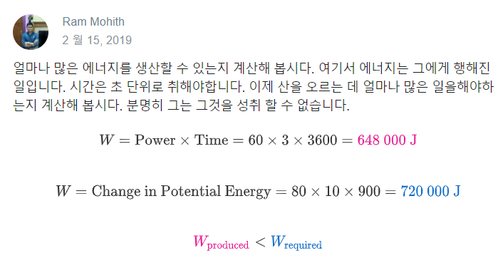

# CantheFreeSoloRecordbeBroken?
https://brilliant.org/daily-problems/mountain-climb-power/

In June of 2017, legendary rock climber Alex Honnold completed the first ever free solo ascent of the famous cliff, El Capitan in Yosemite National Park. To complete this amazing feat, Honnold climbed the <svg xmlns:xlink="http://www.w3.org/1999/xlink" style="width: 4.667ex; height: 1.667ex; vertical-align: -0.222ex; margin-top: 1px; margin-right: 0px; margin-bottom: 1px; margin-left: 0px; " viewBox="0 -686.9033013280564 2000 729.8066026561128"><defs><path id="MJMAIN-32-d5dc673a336511e4b7f7026e3951ed9105cf8f11ef35494280ffa61bcb8b4d37" stroke-width="0" d="M109 429Q82 429 66 447T50 491Q50 562 103 614T235 666Q326 666 387 610T449 465Q449 422 429 383T381 315T301 241Q265 210 201 149L142 93L218 92Q375 92 385 97Q392 99 409 186V189H449V186Q448 183 436 95T421 3V0H50V19V31Q50 38 56 46T86 81Q115 113 136 137Q145 147 170 174T204 211T233 244T261 278T284 308T305 340T320 369T333 401T340 431T343 464Q343 527 309 573T212 619Q179 619 154 602T119 569T109 550Q109 549 114 549Q132 549 151 535T170 489Q170 464 154 447T109 429Z"></path><path id="MJMAIN-39-d5dc673a336511e4b7f7026e3951ed9105cf8f11ef35494280ffa61bcb8b4d37" stroke-width="0" d="M352 287Q304 211 232 211Q154 211 104 270T44 396Q42 412 42 436V444Q42 537 111 606Q171 666 243 666Q245 666 249 666T257 665H261Q273 665 286 663T323 651T370 619T413 560Q456 472 456 334Q456 194 396 97Q361 41 312 10T208 -22Q147 -22 108 7T68 93T121 149Q143 149 158 135T173 96Q173 78 164 65T148 49T135 44L131 43Q131 41 138 37T164 27T206 22H212Q272 22 313 86Q352 142 352 280V287ZM244 248Q292 248 321 297T351 430Q351 508 343 542Q341 552 337 562T323 588T293 615T246 625Q208 625 181 598Q160 576 154 546T147 441Q147 358 152 329T172 282Q197 248 244 248Z"></path><path id="MJMAIN-30-d5dc673a336511e4b7f7026e3951ed9105cf8f11ef35494280ffa61bcb8b4d37" stroke-width="0" d="M96 585Q152 666 249 666Q297 666 345 640T423 548Q460 465 460 320Q460 165 417 83Q397 41 362 16T301 -15T250 -22Q224 -22 198 -16T137 16T82 83Q39 165 39 320Q39 494 96 585ZM321 597Q291 629 250 629Q208 629 178 597Q153 571 145 525T137 333Q137 175 145 125T181 46Q209 16 250 16Q290 16 318 46Q347 76 354 130T362 333Q362 478 354 524T321 597Z"></path><path id="MJMAIN-30-d5dc673a336511e4b7f7026e3951ed9105cf8f11ef35494280ffa61bcb8b4d37" stroke-width="0" d="M96 585Q152 666 249 666Q297 666 345 640T423 548Q460 465 460 320Q460 165 417 83Q397 41 362 16T301 -15T250 -22Q224 -22 198 -16T137 16T82 83Q39 165 39 320Q39 494 96 585ZM321 597Q291 629 250 629Q208 629 178 597Q153 571 145 525T137 333Q137 175 145 125T181 46Q209 16 250 16Q290 16 318 46Q347 76 354 130T362 333Q362 478 354 524T321 597Z"></path></defs><g stroke="black" fill="black" stroke-width="0" transform="matrix(1 0 0 -1 0 0)"><use xlink:href="#MJMAIN-32-d5dc673a336511e4b7f7026e3951ed9105cf8f11ef35494280ffa61bcb8b4d37"></use><use xlink:href="#MJMAIN-39-d5dc673a336511e4b7f7026e3951ed9105cf8f11ef35494280ffa61bcb8b4d37" x="500" y="0"></use><use xlink:href="#MJMAIN-30-d5dc673a336511e4b7f7026e3951ed9105cf8f11ef35494280ffa61bcb8b4d37" x="1000" y="0"></use><use xlink:href="#MJMAIN-30-d5dc673a336511e4b7f7026e3951ed9105cf8f11ef35494280ffa61bcb8b4d37" x="1500" y="0"></use></g></svg> vertical feet <svg xmlns:xlink="http://www.w3.org/1999/xlink" style="width: 10.222ex; height: 2.444ex; vertical-align: -0.778ex; margin-top: 1px; margin-right: 0px; margin-bottom: 1px; margin-left: 0px; " viewBox="0 -770.9033013280564 4389 1041.8066026561128"><defs><path id="MJMAIN-28-417a40002cbf11e98ea502160d56b37ef5ae0de0dcc0497f9efde116ea656b10" stroke-width="0" d="M94 250Q94 319 104 381T127 488T164 576T202 643T244 695T277 729T302 750H315H319Q333 750 333 741Q333 738 316 720T275 667T226 581T184 443T167 250T184 58T225 -81T274 -167T316 -220T333 -241Q333 -250 318 -250H315H302L274 -226Q180 -141 137 -14T94 250Z"></path><path id="MJMAIN-223C-417a40002cbf11e98ea502160d56b37ef5ae0de0dcc0497f9efde116ea656b10" stroke-width="0" d="M55 166Q55 241 101 304T222 367Q260 367 296 349T362 304T421 252T484 208T554 189Q616 189 655 236T694 338Q694 350 698 358T708 367Q722 367 722 334Q722 260 677 197T562 134H554Q517 134 481 152T414 196T355 248T292 293T223 311Q179 311 145 286Q109 257 96 218T80 156T69 133Q55 133 55 166Z"></path><path id="MJMAIN-39-417a40002cbf11e98ea502160d56b37ef5ae0de0dcc0497f9efde116ea656b10" stroke-width="0" d="M352 287Q304 211 232 211Q154 211 104 270T44 396Q42 412 42 436V444Q42 537 111 606Q171 666 243 666Q245 666 249 666T257 665H261Q273 665 286 663T323 651T370 619T413 560Q456 472 456 334Q456 194 396 97Q361 41 312 10T208 -22Q147 -22 108 7T68 93T121 149Q143 149 158 135T173 96Q173 78 164 65T148 49T135 44L131 43Q131 41 138 37T164 27T206 22H212Q272 22 313 86Q352 142 352 280V287ZM244 248Q292 248 321 297T351 430Q351 508 343 542Q341 552 337 562T323 588T293 615T246 625Q208 625 181 598Q160 576 154 546T147 441Q147 358 152 329T172 282Q197 248 244 248Z"></path><path id="MJMAIN-30-417a40002cbf11e98ea502160d56b37ef5ae0de0dcc0497f9efde116ea656b10" stroke-width="0" d="M96 585Q152 666 249 666Q297 666 345 640T423 548Q460 465 460 320Q460 165 417 83Q397 41 362 16T301 -15T250 -22Q224 -22 198 -16T137 16T82 83Q39 165 39 320Q39 494 96 585ZM321 597Q291 629 250 629Q208 629 178 597Q153 571 145 525T137 333Q137 175 145 125T181 46Q209 16 250 16Q290 16 318 46Q347 76 354 130T362 333Q362 478 354 524T321 597Z"></path><path id="MJMAIN-30-417a40002cbf11e98ea502160d56b37ef5ae0de0dcc0497f9efde116ea656b10" stroke-width="0" d="M96 585Q152 666 249 666Q297 666 345 640T423 548Q460 465 460 320Q460 165 417 83Q397 41 362 16T301 -15T250 -22Q224 -22 198 -16T137 16T82 83Q39 165 39 320Q39 494 96 585ZM321 597Q291 629 250 629Q208 629 178 597Q153 571 145 525T137 333Q137 175 145 125T181 46Q209 16 250 16Q290 16 318 46Q347 76 354 130T362 333Q362 478 354 524T321 597Z"></path><path id="MJMAIN-6D-417a40002cbf11e98ea502160d56b37ef5ae0de0dcc0497f9efde116ea656b10" stroke-width="0" d="M41 46H55Q94 46 102 60V68Q102 77 102 91T102 122T103 161T103 203Q103 234 103 269T102 328V351Q99 370 88 376T43 385H25V408Q25 431 27 431L37 432Q47 433 65 434T102 436Q119 437 138 438T167 441T178 442H181V402Q181 364 182 364T187 369T199 384T218 402T247 421T285 437Q305 442 336 442Q351 442 364 440T387 434T406 426T421 417T432 406T441 395T448 384T452 374T455 366L457 361L460 365Q463 369 466 373T475 384T488 397T503 410T523 422T546 432T572 439T603 442Q729 442 740 329Q741 322 741 190V104Q741 66 743 59T754 49Q775 46 803 46H819V0H811L788 1Q764 2 737 2T699 3Q596 3 587 0H579V46H595Q656 46 656 62Q657 64 657 200Q656 335 655 343Q649 371 635 385T611 402T585 404Q540 404 506 370Q479 343 472 315T464 232V168V108Q464 78 465 68T468 55T477 49Q498 46 526 46H542V0H534L510 1Q487 2 460 2T422 3Q319 3 310 0H302V46H318Q379 46 379 62Q380 64 380 200Q379 335 378 343Q372 371 358 385T334 402T308 404Q263 404 229 370Q202 343 195 315T187 232V168V108Q187 78 188 68T191 55T200 49Q221 46 249 46H265V0H257L234 1Q210 2 183 2T145 3Q42 3 33 0H25V46H41Z"></path><path id="MJMAIN-29-417a40002cbf11e98ea502160d56b37ef5ae0de0dcc0497f9efde116ea656b10" stroke-width="0" d="M60 749L64 750Q69 750 74 750H86L114 726Q208 641 251 514T294 250Q294 182 284 119T261 12T224 -76T186 -143T145 -194T113 -227T90 -246Q87 -249 86 -250H74Q66 -250 63 -250T58 -247T55 -238Q56 -237 66 -225Q221 -64 221 250T66 725Q56 737 55 738Q55 746 60 749Z"></path></defs><g stroke="black" fill="black" stroke-width="0" transform="matrix(1 0 0 -1 0 0)"><use xlink:href="#MJMAIN-28-417a40002cbf11e98ea502160d56b37ef5ae0de0dcc0497f9efde116ea656b10"></use><use xlink:href="#MJMAIN-223C-417a40002cbf11e98ea502160d56b37ef5ae0de0dcc0497f9efde116ea656b10" x="389" y="0"></use><g transform="translate(1444,0)"><use xlink:href="#MJMAIN-39-417a40002cbf11e98ea502160d56b37ef5ae0de0dcc0497f9efde116ea656b10"></use><use xlink:href="#MJMAIN-30-417a40002cbf11e98ea502160d56b37ef5ae0de0dcc0497f9efde116ea656b10" x="500" y="0"></use><use xlink:href="#MJMAIN-30-417a40002cbf11e98ea502160d56b37ef5ae0de0dcc0497f9efde116ea656b10" x="1000" y="0"></use></g><use xlink:href="#MJMAIN-6D-417a40002cbf11e98ea502160d56b37ef5ae0de0dcc0497f9efde116ea656b10" x="3167" y="0"></use><use xlink:href="#MJMAIN-29-417a40002cbf11e98ea502160d56b37ef5ae0de0dcc0497f9efde116ea656b10" x="4000" y="0"></use></g></svg> of the Freerider route up the cliff face in just under 4 hours. 

On top of this, in order to be considered a "free solo" climb, he used no ropes or protective equipment of any kind: just the climber, hand chalk, special shoes, and the wall. The feat is the subject of an Oscar-nominated documentary and worldwide acclaim for Honnold. In today's problem, we examine the basic physics of this climb and what it would take to replicate. 

In order to climb vertically, energy must be exerted. Apart from the energy required to simply breathe, think, metabolize, and walk around, a climber is working against gravity. All objects gain what is called <strong>potential energy</strong> based on an increase in height. The higher an object is moved, the more <em>potential</em> it has to gain speed if it were to fall. The potential energy <svg xmlns:xlink="http://www.w3.org/1999/xlink" style="width: 3.667ex; height: 1.778ex; vertical-align: -0.222ex; margin-top: 1px; margin-right: 0px; margin-bottom: 1px; margin-left: 0px; " viewBox="0 -736.9033013280564 1600 779.8066026561128"><defs><path id="MJMAIN-394-6230ef46ba5111e3b181026e3951ed9161ca5ac1740e4706b10cbc28fac5f8fc" stroke-width="0" d="M51 0Q46 4 46 7Q46 9 215 357T388 709Q391 716 416 716Q439 716 444 709Q447 705 616 357T786 7Q786 4 781 0H51ZM507 344L384 596L137 92L383 91H630Q630 93 507 344Z"></path><path id="MJMATHI-55-6230ef46ba5111e3b181026e3951ed9161ca5ac1740e4706b10cbc28fac5f8fc" stroke-width="0" d="M107 637Q73 637 71 641Q70 643 70 649Q70 673 81 682Q83 683 98 683Q139 681 234 681Q268 681 297 681T342 682T362 682Q378 682 378 672Q378 670 376 658Q371 641 366 638H364Q362 638 359 638T352 638T343 637T334 637Q295 636 284 634T266 623Q265 621 238 518T184 302T154 169Q152 155 152 140Q152 86 183 55T269 24Q336 24 403 69T501 205L552 406Q599 598 599 606Q599 633 535 637Q511 637 511 648Q511 650 513 660Q517 676 519 679T529 683Q532 683 561 682T645 680Q696 680 723 681T752 682Q767 682 767 672Q767 650 759 642Q756 637 737 637Q666 633 648 597Q646 592 598 404Q557 235 548 205Q515 105 433 42T263 -22Q171 -22 116 34T60 167V183Q60 201 115 421Q164 622 164 628Q164 635 107 637Z"></path></defs><g stroke="black" fill="black" stroke-width="0" transform="matrix(1 0 0 -1 0 0)"><use xlink:href="#MJMAIN-394-6230ef46ba5111e3b181026e3951ed9161ca5ac1740e4706b10cbc28fac5f8fc"></use><use xlink:href="#MJMATHI-55-6230ef46ba5111e3b181026e3951ed9161ca5ac1740e4706b10cbc28fac5f8fc" x="833" y="0"></use></g></svg> that an object of mass <svg xmlns:xlink="http://www.w3.org/1999/xlink" style="width: 2ex; height: 1.111ex; vertical-align: -0.222ex; margin-top: 1px; margin-right: 0px; margin-bottom: 1px; margin-left: 0px; " viewBox="0 -463.9033013280564 878 495.80660265611283"><defs id="MathJax_SVG_glyphs-4cf34750261311e3937340400601ade99bdda1c7a122439385ee1f9fec86db07"><path id="MJMATHI-6D-4cf34750261311e3937340400601ade99bdda1c7a122439385ee1f9fec86db07" stroke-width="0" d="M21 287Q22 293 24 303T36 341T56 388T88 425T132 442T175 435T205 417T221 395T229 376L231 369Q231 367 232 367L243 378Q303 442 384 442Q401 442 415 440T441 433T460 423T475 411T485 398T493 385T497 373T500 364T502 357L510 367Q573 442 659 442Q713 442 746 415T780 336Q780 285 742 178T704 50Q705 36 709 31T724 26Q752 26 776 56T815 138Q818 149 821 151T837 153Q857 153 857 145Q857 144 853 130Q845 101 831 73T785 17T716 -10Q669 -10 648 17T627 73Q627 92 663 193T700 345Q700 404 656 404H651Q565 404 506 303L499 291L466 157Q433 26 428 16Q415 -11 385 -11Q372 -11 364 -4T353 8T350 18Q350 29 384 161L420 307Q423 322 423 345Q423 404 379 404H374Q288 404 229 303L222 291L189 157Q156 26 151 16Q138 -11 108 -11Q95 -11 87 -5T76 7T74 17Q74 30 112 181Q151 335 151 342Q154 357 154 369Q154 405 129 405Q107 405 92 377T69 316T57 280Q55 278 41 278H27Q21 284 21 287Z"></path></defs><g stroke="black" fill="black" stroke-width="0" transform="matrix(1 0 0 -1 0 0)"><use xlink:href="#MJMATHI-6D-4cf34750261311e3937340400601ade99bdda1c7a122439385ee1f9fec86db07"></use></g></svg> gains by moving to a higher position is <svg xmlns:xlink="http://www.w3.org/1999/xlink" style="width: 13.889ex; height: 2.222ex; vertical-align: -0.667ex; margin-top: 1px; margin-right: 0px; margin-bottom: 1px; margin-left: 0px; " viewBox="0 -736.9033013280564 5978.555555555556 962.8066026561128"><defs><path id="MJMAIN-394-d2f8017830e511e9a5c902b7b6aa38867fbae35442c04850b7cacb7710fc6b35" stroke-width="0" d="M51 0Q46 4 46 7Q46 9 215 357T388 709Q391 716 416 716Q439 716 444 709Q447 705 616 357T786 7Q786 4 781 0H51ZM507 344L384 596L137 92L383 91H630Q630 93 507 344Z"></path><path id="MJMATHI-55-d2f8017830e511e9a5c902b7b6aa38867fbae35442c04850b7cacb7710fc6b35" stroke-width="0" d="M107 637Q73 637 71 641Q70 643 70 649Q70 673 81 682Q83 683 98 683Q139 681 234 681Q268 681 297 681T342 682T362 682Q378 682 378 672Q378 670 376 658Q371 641 366 638H364Q362 638 359 638T352 638T343 637T334 637Q295 636 284 634T266 623Q265 621 238 518T184 302T154 169Q152 155 152 140Q152 86 183 55T269 24Q336 24 403 69T501 205L552 406Q599 598 599 606Q599 633 535 637Q511 637 511 648Q511 650 513 660Q517 676 519 679T529 683Q532 683 561 682T645 680Q696 680 723 681T752 682Q767 682 767 672Q767 650 759 642Q756 637 737 637Q666 633 648 597Q646 592 598 404Q557 235 548 205Q515 105 433 42T263 -22Q171 -22 116 34T60 167V183Q60 201 115 421Q164 622 164 628Q164 635 107 637Z"></path><path id="MJMAIN-3D-d2f8017830e511e9a5c902b7b6aa38867fbae35442c04850b7cacb7710fc6b35" stroke-width="0" d="M56 347Q56 360 70 367H707Q722 359 722 347Q722 336 708 328L390 327H72Q56 332 56 347ZM56 153Q56 168 72 173H708Q722 163 722 153Q722 140 707 133H70Q56 140 56 153Z"></path><path id="MJMATHI-6D-d2f8017830e511e9a5c902b7b6aa38867fbae35442c04850b7cacb7710fc6b35" stroke-width="0" d="M21 287Q22 293 24 303T36 341T56 388T88 425T132 442T175 435T205 417T221 395T229 376L231 369Q231 367 232 367L243 378Q303 442 384 442Q401 442 415 440T441 433T460 423T475 411T485 398T493 385T497 373T500 364T502 357L510 367Q573 442 659 442Q713 442 746 415T780 336Q780 285 742 178T704 50Q705 36 709 31T724 26Q752 26 776 56T815 138Q818 149 821 151T837 153Q857 153 857 145Q857 144 853 130Q845 101 831 73T785 17T716 -10Q669 -10 648 17T627 73Q627 92 663 193T700 345Q700 404 656 404H651Q565 404 506 303L499 291L466 157Q433 26 428 16Q415 -11 385 -11Q372 -11 364 -4T353 8T350 18Q350 29 384 161L420 307Q423 322 423 345Q423 404 379 404H374Q288 404 229 303L222 291L189 157Q156 26 151 16Q138 -11 108 -11Q95 -11 87 -5T76 7T74 17Q74 30 112 181Q151 335 151 342Q154 357 154 369Q154 405 129 405Q107 405 92 377T69 316T57 280Q55 278 41 278H27Q21 284 21 287Z"></path><path id="MJMATHI-67-d2f8017830e511e9a5c902b7b6aa38867fbae35442c04850b7cacb7710fc6b35" stroke-width="0" d="M311 43Q296 30 267 15T206 0Q143 0 105 45T66 160Q66 265 143 353T314 442Q361 442 401 394L404 398Q406 401 409 404T418 412T431 419T447 422Q461 422 470 413T480 394Q480 379 423 152T363 -80Q345 -134 286 -169T151 -205Q10 -205 10 -137Q10 -111 28 -91T74 -71Q89 -71 102 -80T116 -111Q116 -121 114 -130T107 -144T99 -154T92 -162L90 -164H91Q101 -167 151 -167Q189 -167 211 -155Q234 -144 254 -122T282 -75Q288 -56 298 -13Q311 35 311 43ZM384 328L380 339Q377 350 375 354T369 368T359 382T346 393T328 402T306 405Q262 405 221 352Q191 313 171 233T151 117Q151 38 213 38Q269 38 323 108L331 118L384 328Z"></path><path id="MJMAIN-394-d2f8017830e511e9a5c902b7b6aa38867fbae35442c04850b7cacb7710fc6b35" stroke-width="0" d="M51 0Q46 4 46 7Q46 9 215 357T388 709Q391 716 416 716Q439 716 444 709Q447 705 616 357T786 7Q786 4 781 0H51ZM507 344L384 596L137 92L383 91H630Q630 93 507 344Z"></path><path id="MJMATHI-68-d2f8017830e511e9a5c902b7b6aa38867fbae35442c04850b7cacb7710fc6b35" stroke-width="0" d="M137 683Q138 683 209 688T282 694Q294 694 294 685Q294 674 258 534Q220 386 220 383Q220 381 227 388Q288 442 357 442Q411 442 444 415T478 336Q478 285 440 178T402 50Q403 36 407 31T422 26Q450 26 474 56T513 138Q516 149 519 151T535 153Q555 153 555 145Q555 144 551 130Q535 71 500 33Q466 -10 419 -10H414Q367 -10 346 17T325 74Q325 90 361 192T398 345Q398 404 354 404H349Q266 404 205 306L198 293L164 158Q132 28 127 16Q114 -11 83 -11Q69 -11 59 -2T48 16Q48 30 121 320L195 616Q195 629 188 632T149 637H128Q122 643 122 645T124 664Q129 683 137 683Z"></path><path id="MJMAIN-2C-d2f8017830e511e9a5c902b7b6aa38867fbae35442c04850b7cacb7710fc6b35" stroke-width="0" d="M78 35T78 60T94 103T137 121Q165 121 187 96T210 8Q210 -27 201 -60T180 -117T154 -158T130 -185T117 -194Q113 -194 104 -185T95 -172Q95 -168 106 -156T131 -126T157 -76T173 -3V9L172 8Q170 7 167 6T161 3T152 1T140 0Q113 0 96 17Z"></path></defs><g stroke="black" fill="black" stroke-width="0" transform="matrix(1 0 0 -1 0 0)"><use xlink:href="#MJMAIN-394-d2f8017830e511e9a5c902b7b6aa38867fbae35442c04850b7cacb7710fc6b35"></use><use xlink:href="#MJMATHI-55-d2f8017830e511e9a5c902b7b6aa38867fbae35442c04850b7cacb7710fc6b35" x="833" y="0"></use><use xlink:href="#MJMAIN-3D-d2f8017830e511e9a5c902b7b6aa38867fbae35442c04850b7cacb7710fc6b35" x="1877" y="0"></use><use xlink:href="#MJMATHI-6D-d2f8017830e511e9a5c902b7b6aa38867fbae35442c04850b7cacb7710fc6b35" x="2933" y="0"></use><use xlink:href="#MJMATHI-67-d2f8017830e511e9a5c902b7b6aa38867fbae35442c04850b7cacb7710fc6b35" x="3811" y="0"></use><use xlink:href="#MJMAIN-394-d2f8017830e511e9a5c902b7b6aa38867fbae35442c04850b7cacb7710fc6b35" x="4291" y="0"></use><use xlink:href="#MJMATHI-68-d2f8017830e511e9a5c902b7b6aa38867fbae35442c04850b7cacb7710fc6b35" x="5124" y="0"></use><use xlink:href="#MJMAIN-2C-d2f8017830e511e9a5c902b7b6aa38867fbae35442c04850b7cacb7710fc6b35" x="5700" y="0"></use></g></svg> where <svg xmlns:xlink="http://www.w3.org/1999/xlink" style="width: 1.111ex; height: 1.556ex; vertical-align: -0.667ex; margin-top: 1px; margin-right: 0px; margin-bottom: 1px; margin-left: 0px; " viewBox="0 -462.9033013280564 480 688.8066026561128"><defs id="MathJax_SVG_glyphs-1ba43708270911e3bb5c40400601ade9f4bc7dc1367847d289b43a4841303057"><path id="MJMATHI-67-1ba43708270911e3bb5c40400601ade9f4bc7dc1367847d289b43a4841303057" stroke-width="0" d="M311 43Q296 30 267 15T206 0Q143 0 105 45T66 160Q66 265 143 353T314 442Q361 442 401 394L404 398Q406 401 409 404T418 412T431 419T447 422Q461 422 470 413T480 394Q480 379 423 152T363 -80Q345 -134 286 -169T151 -205Q10 -205 10 -137Q10 -111 28 -91T74 -71Q89 -71 102 -80T116 -111Q116 -121 114 -130T107 -144T99 -154T92 -162L90 -164H91Q101 -167 151 -167Q189 -167 211 -155Q234 -144 254 -122T282 -75Q288 -56 298 -13Q311 35 311 43ZM384 328L380 339Q377 350 375 354T369 368T359 382T346 393T328 402T306 405Q262 405 221 352Q191 313 171 233T151 117Q151 38 213 38Q269 38 323 108L331 118L384 328Z"></path></defs><g stroke="black" fill="black" stroke-width="0" transform="matrix(1 0 0 -1 0 0)"><use xlink:href="#MJMATHI-67-1ba43708270911e3bb5c40400601ade9f4bc7dc1367847d289b43a4841303057"></use></g></svg> is the constant acceleration due to Earth's gravity <svg xmlns:xlink="http://www.w3.org/1999/xlink" style="width: 18.667ex; height: 2.667ex; vertical-align: -0.778ex; margin-top: 1px; margin-right: 0px; margin-bottom: 1px; margin-left: 0px; " viewBox="0 -854.728417598297 8018.775612815496 1125.6317189263534"><defs><path id="MJMAIN-28-b32748ee316811e9a5c902b7b6aa3886391903e669fe469697acd03964fdba3f" stroke-width="0" d="M94 250Q94 319 104 381T127 488T164 576T202 643T244 695T277 729T302 750H315H319Q333 750 333 741Q333 738 316 720T275 667T226 581T184 443T167 250T184 58T225 -81T274 -167T316 -220T333 -241Q333 -250 318 -250H315H302L274 -226Q180 -141 137 -14T94 250Z"></path><path id="MJMAIN-72-b32748ee316811e9a5c902b7b6aa3886391903e669fe469697acd03964fdba3f" stroke-width="0" d="M36 46H50Q89 46 97 60V68Q97 77 97 91T98 122T98 161T98 203Q98 234 98 269T98 328L97 351Q94 370 83 376T38 385H20V408Q20 431 22 431L32 432Q42 433 60 434T96 436Q112 437 131 438T160 441T171 442H174V373Q213 441 271 441H277Q322 441 343 419T364 373Q364 352 351 337T313 322Q288 322 276 338T263 372Q263 381 265 388T270 400T273 405Q271 407 250 401Q234 393 226 386Q179 341 179 207V154Q179 141 179 127T179 101T180 81T180 66V61Q181 59 183 57T188 54T193 51T200 49T207 48T216 47T225 47T235 46T245 46H276V0H267Q249 3 140 3Q37 3 28 0H20V46H36Z"></path><path id="MJMAIN-6F-b32748ee316811e9a5c902b7b6aa3886391903e669fe469697acd03964fdba3f" stroke-width="0" d="M28 214Q28 309 93 378T250 448Q340 448 405 380T471 215Q471 120 407 55T250 -10Q153 -10 91 57T28 214ZM250 30Q372 30 372 193V225V250Q372 272 371 288T364 326T348 362T317 390T268 410Q263 411 252 411Q222 411 195 399Q152 377 139 338T126 246V226Q126 130 145 91Q177 30 250 30Z"></path><path id="MJMAIN-75-b32748ee316811e9a5c902b7b6aa3886391903e669fe469697acd03964fdba3f" stroke-width="0" d="M383 58Q327 -10 256 -10H249Q124 -10 105 89Q104 96 103 226Q102 335 102 348T96 369Q86 385 36 385H25V408Q25 431 27 431L38 432Q48 433 67 434T105 436Q122 437 142 438T172 441T184 442H187V261Q188 77 190 64Q193 49 204 40Q224 26 264 26Q290 26 311 35T343 58T363 90T375 120T379 144Q379 145 379 161T380 201T380 248V315Q380 361 370 372T320 385H302V431Q304 431 378 436T457 442H464V264Q464 84 465 81Q468 61 479 55T524 46H542V0Q540 0 467 -5T390 -11H383V58Z"></path><path id="MJMAIN-67-b32748ee316811e9a5c902b7b6aa3886391903e669fe469697acd03964fdba3f" stroke-width="0" d="M329 409Q373 453 429 453Q459 453 472 434T485 396Q485 382 476 371T449 360Q416 360 412 390Q410 404 415 411Q415 412 416 414V415Q388 412 363 393Q355 388 355 386Q355 385 359 381T368 369T379 351T388 325T392 292Q392 230 343 187T222 143Q172 143 123 171Q112 153 112 133Q112 98 138 81Q147 75 155 75T227 73Q311 72 335 67Q396 58 431 26Q470 -13 470 -72Q470 -139 392 -175Q332 -206 250 -206Q167 -206 107 -175Q29 -140 29 -75Q29 -39 50 -15T92 18L103 24Q67 55 67 108Q67 155 96 193Q52 237 52 292Q52 355 102 398T223 442Q274 442 318 416L329 409ZM299 343Q294 371 273 387T221 404Q192 404 171 388T145 343Q142 326 142 292Q142 248 149 227T179 192Q196 182 222 182Q244 182 260 189T283 207T294 227T299 242Q302 258 302 292T299 343ZM403 -75Q403 -50 389 -34T348 -11T299 -2T245 0H218Q151 0 138 -6Q118 -15 107 -34T95 -74Q95 -84 101 -97T122 -127T170 -155T250 -167Q319 -167 361 -139T403 -75Z"></path><path id="MJMAIN-68-b32748ee316811e9a5c902b7b6aa3886391903e669fe469697acd03964fdba3f" stroke-width="0" d="M41 46H55Q94 46 102 60V68Q102 77 102 91T102 124T102 167T103 217T103 272T103 329Q103 366 103 407T103 482T102 542T102 586T102 603Q99 622 88 628T43 637H25V660Q25 683 27 683L37 684Q47 685 66 686T103 688Q120 689 140 690T170 693T181 694H184V367Q244 442 328 442Q451 442 463 329Q464 322 464 190V104Q464 66 466 59T477 49Q498 46 526 46H542V0H534L510 1Q487 2 460 2T422 3Q319 3 310 0H302V46H318Q379 46 379 62Q380 64 380 200Q379 335 378 343Q372 371 358 385T334 402T308 404Q263 404 229 370Q202 343 195 315T187 232V168V108Q187 78 188 68T191 55T200 49Q221 46 249 46H265V0H257L234 1Q210 2 183 2T145 3Q42 3 33 0H25V46H41Z"></path><path id="MJMAIN-6C-b32748ee316811e9a5c902b7b6aa3886391903e669fe469697acd03964fdba3f" stroke-width="0" d="M42 46H56Q95 46 103 60V68Q103 77 103 91T103 124T104 167T104 217T104 272T104 329Q104 366 104 407T104 482T104 542T103 586T103 603Q100 622 89 628T44 637H26V660Q26 683 28 683L38 684Q48 685 67 686T104 688Q121 689 141 690T171 693T182 694H185V379Q185 62 186 60Q190 52 198 49Q219 46 247 46H263V0H255L232 1Q209 2 183 2T145 3T107 3T57 1L34 0H26V46H42Z"></path><path id="MJMAIN-79-b32748ee316811e9a5c902b7b6aa3886391903e669fe469697acd03964fdba3f" stroke-width="0" d="M69 -66Q91 -66 104 -80T118 -116Q118 -134 109 -145T91 -160Q84 -163 97 -166Q104 -168 111 -168Q131 -168 148 -159T175 -138T197 -106T213 -75T225 -43L242 0L170 183Q150 233 125 297Q101 358 96 368T80 381Q79 382 78 382Q66 385 34 385H19V431H26L46 430Q65 430 88 429T122 428Q129 428 142 428T171 429T200 430T224 430L233 431H241V385H232Q183 385 185 366L286 112Q286 113 332 227L376 341V350Q376 365 366 373T348 383T334 385H331V431H337H344Q351 431 361 431T382 430T405 429T422 429Q477 429 503 431H508V385H497Q441 380 422 345Q420 343 378 235T289 9T227 -131Q180 -204 113 -204Q69 -204 44 -177T19 -116Q19 -89 35 -78T69 -66Z"></path><path id="MJMAIN-20-b32748ee316811e9a5c902b7b6aa3886391903e669fe469697acd03964fdba3f" stroke-width="0"></path><path id="MJMAIN-31-b32748ee316811e9a5c902b7b6aa3886391903e669fe469697acd03964fdba3f" stroke-width="0" d="M213 578L200 573Q186 568 160 563T102 556H83V602H102Q149 604 189 617T245 641T273 663Q275 666 285 666Q294 666 302 660V361L303 61Q310 54 315 52T339 48T401 46H427V0H416Q395 3 257 3Q121 3 100 0H88V46H114Q136 46 152 46T177 47T193 50T201 52T207 57T213 61V578Z"></path><path id="MJMAIN-30-b32748ee316811e9a5c902b7b6aa3886391903e669fe469697acd03964fdba3f" stroke-width="0" d="M96 585Q152 666 249 666Q297 666 345 640T423 548Q460 465 460 320Q460 165 417 83Q397 41 362 16T301 -15T250 -22Q224 -22 198 -16T137 16T82 83Q39 165 39 320Q39 494 96 585ZM321 597Q291 629 250 629Q208 629 178 597Q153 571 145 525T137 333Q137 175 145 125T181 46Q209 16 250 16Q290 16 318 46Q347 76 354 130T362 333Q362 478 354 524T321 597Z"></path><path id="MJMAIN-6D-b32748ee316811e9a5c902b7b6aa3886391903e669fe469697acd03964fdba3f" stroke-width="0" d="M41 46H55Q94 46 102 60V68Q102 77 102 91T102 122T103 161T103 203Q103 234 103 269T102 328V351Q99 370 88 376T43 385H25V408Q25 431 27 431L37 432Q47 433 65 434T102 436Q119 437 138 438T167 441T178 442H181V402Q181 364 182 364T187 369T199 384T218 402T247 421T285 437Q305 442 336 442Q351 442 364 440T387 434T406 426T421 417T432 406T441 395T448 384T452 374T455 366L457 361L460 365Q463 369 466 373T475 384T488 397T503 410T523 422T546 432T572 439T603 442Q729 442 740 329Q741 322 741 190V104Q741 66 743 59T754 49Q775 46 803 46H819V0H811L788 1Q764 2 737 2T699 3Q596 3 587 0H579V46H595Q656 46 656 62Q657 64 657 200Q656 335 655 343Q649 371 635 385T611 402T585 404Q540 404 506 370Q479 343 472 315T464 232V168V108Q464 78 465 68T468 55T477 49Q498 46 526 46H542V0H534L510 1Q487 2 460 2T422 3Q319 3 310 0H302V46H318Q379 46 379 62Q380 64 380 200Q379 335 378 343Q372 371 358 385T334 402T308 404Q263 404 229 370Q202 343 195 315T187 232V168V108Q187 78 188 68T191 55T200 49Q221 46 249 46H265V0H257L234 1Q210 2 183 2T145 3Q42 3 33 0H25V46H41Z"></path><path id="MJMAIN-2F-b32748ee316811e9a5c902b7b6aa3886391903e669fe469697acd03964fdba3f" stroke-width="0" d="M423 750Q432 750 438 744T444 730Q444 725 271 248T92 -240Q85 -250 75 -250Q68 -250 62 -245T56 -231Q56 -221 230 257T407 740Q411 750 423 750Z"></path><path id="MJMAIN-73-b32748ee316811e9a5c902b7b6aa3886391903e669fe469697acd03964fdba3f" stroke-width="0" d="M295 316Q295 356 268 385T190 414Q154 414 128 401Q98 382 98 349Q97 344 98 336T114 312T157 287Q175 282 201 278T245 269T277 256Q294 248 310 236T342 195T359 133Q359 71 321 31T198 -10H190Q138 -10 94 26L86 19L77 10Q71 4 65 -1L54 -11H46H42Q39 -11 33 -5V74V132Q33 153 35 157T45 162H54Q66 162 70 158T75 146T82 119T101 77Q136 26 198 26Q295 26 295 104Q295 133 277 151Q257 175 194 187T111 210Q75 227 54 256T33 318Q33 357 50 384T93 424T143 442T187 447H198Q238 447 268 432L283 424L292 431Q302 440 314 448H322H326Q329 448 335 442V310L329 304H301Q295 310 295 316Z"></path><path id="MJMAIN-32-b32748ee316811e9a5c902b7b6aa3886391903e669fe469697acd03964fdba3f" stroke-width="0" d="M109 429Q82 429 66 447T50 491Q50 562 103 614T235 666Q326 666 387 610T449 465Q449 422 429 383T381 315T301 241Q265 210 201 149L142 93L218 92Q375 92 385 97Q392 99 409 186V189H449V186Q448 183 436 95T421 3V0H50V19V31Q50 38 56 46T86 81Q115 113 136 137Q145 147 170 174T204 211T233 244T261 278T284 308T305 340T320 369T333 401T340 431T343 464Q343 527 309 573T212 619Q179 619 154 602T119 569T109 550Q109 549 114 549Q132 549 151 535T170 489Q170 464 154 447T109 429Z"></path><path id="MJMAIN-29-b32748ee316811e9a5c902b7b6aa3886391903e669fe469697acd03964fdba3f" stroke-width="0" d="M60 749L64 750Q69 750 74 750H86L114 726Q208 641 251 514T294 250Q294 182 284 119T261 12T224 -76T186 -143T145 -194T113 -227T90 -246Q87 -249 86 -250H74Q66 -250 63 -250T58 -247T55 -238Q56 -237 66 -225Q221 -64 221 250T66 725Q56 737 55 738Q55 746 60 749Z"></path><path id="MJMAIN-2C-b32748ee316811e9a5c902b7b6aa3886391903e669fe469697acd03964fdba3f" stroke-width="0" d="M78 35T78 60T94 103T137 121Q165 121 187 96T210 8Q210 -27 201 -60T180 -117T154 -158T130 -185T117 -194Q113 -194 104 -185T95 -172Q95 -168 106 -156T131 -126T157 -76T173 -3V9L172 8Q170 7 167 6T161 3T152 1T140 0Q113 0 96 17Z"></path></defs><g stroke="black" fill="black" stroke-width="0" transform="matrix(1 0 0 -1 0 0)"><use xlink:href="#MJMAIN-28-b32748ee316811e9a5c902b7b6aa3886391903e669fe469697acd03964fdba3f"></use><g transform="translate(389,0)"><use xlink:href="#MJMAIN-72-b32748ee316811e9a5c902b7b6aa3886391903e669fe469697acd03964fdba3f"></use><use xlink:href="#MJMAIN-6F-b32748ee316811e9a5c902b7b6aa3886391903e669fe469697acd03964fdba3f" x="392" y="0"></use><use xlink:href="#MJMAIN-75-b32748ee316811e9a5c902b7b6aa3886391903e669fe469697acd03964fdba3f" x="892" y="0"></use><use xlink:href="#MJMAIN-67-b32748ee316811e9a5c902b7b6aa3886391903e669fe469697acd03964fdba3f" x="1448" y="0"></use><use xlink:href="#MJMAIN-68-b32748ee316811e9a5c902b7b6aa3886391903e669fe469697acd03964fdba3f" x="1948" y="0"></use><use xlink:href="#MJMAIN-6C-b32748ee316811e9a5c902b7b6aa3886391903e669fe469697acd03964fdba3f" x="2504" y="0"></use><use xlink:href="#MJMAIN-79-b32748ee316811e9a5c902b7b6aa3886391903e669fe469697acd03964fdba3f" x="2782" y="0"></use><use xlink:href="#MJMAIN-20-b32748ee316811e9a5c902b7b6aa3886391903e669fe469697acd03964fdba3f" x="3310" y="0"></use></g><g transform="translate(3949,0)"><use xlink:href="#MJMAIN-31-b32748ee316811e9a5c902b7b6aa3886391903e669fe469697acd03964fdba3f"></use><use xlink:href="#MJMAIN-30-b32748ee316811e9a5c902b7b6aa3886391903e669fe469697acd03964fdba3f" x="500" y="0"></use></g><g transform="translate(5171,0)"><use xlink:href="#MJMAIN-6D-b32748ee316811e9a5c902b7b6aa3886391903e669fe469697acd03964fdba3f"></use><use xlink:href="#MJMAIN-2F-b32748ee316811e9a5c902b7b6aa3886391903e669fe469697acd03964fdba3f" x="833" y="0"></use><g transform="translate(1333,0)"><use xlink:href="#MJMAIN-73-b32748ee316811e9a5c902b7b6aa3886391903e669fe469697acd03964fdba3f"></use><use transform="scale(0.7071067811865476)" xlink:href="#MJMAIN-32-b32748ee316811e9a5c902b7b6aa3886391903e669fe469697acd03964fdba3f" x="557" y="513"></use></g></g><use xlink:href="#MJMAIN-29-b32748ee316811e9a5c902b7b6aa3886391903e669fe469697acd03964fdba3f" x="7351" y="0"></use><use xlink:href="#MJMAIN-2C-b32748ee316811e9a5c902b7b6aa3886391903e669fe469697acd03964fdba3f" x="7740" y="0"></use></g></svg> and <svg xmlns:xlink="http://www.w3.org/1999/xlink" style="width: 3.222ex; height: 1.778ex; vertical-align: -0.222ex; margin-top: 1px; margin-right: 0px; margin-bottom: 1px; margin-left: 0px; " viewBox="0 -736.9033013280564 1409 768.8066026561128"><defs id="MathJax_SVG_glyphs-ab4d6520288811e3bb5c40400601ade9e3136881be334869abf5db5b699fe199"><path id="MJMAIN-394-ab4d6520288811e3bb5c40400601ade9e3136881be334869abf5db5b699fe199" stroke-width="0" d="M51 0Q46 4 46 7Q46 9 215 357T388 709Q391 716 416 716Q439 716 444 709Q447 705 616 357T786 7Q786 4 781 0H51ZM507 344L384 596L137 92L383 91H630Q630 93 507 344Z"></path><path id="MJMATHI-68-ab4d6520288811e3bb5c40400601ade9e3136881be334869abf5db5b699fe199" stroke-width="0" d="M137 683Q138 683 209 688T282 694Q294 694 294 685Q294 674 258 534Q220 386 220 383Q220 381 227 388Q288 442 357 442Q411 442 444 415T478 336Q478 285 440 178T402 50Q403 36 407 31T422 26Q450 26 474 56T513 138Q516 149 519 151T535 153Q555 153 555 145Q555 144 551 130Q535 71 500 33Q466 -10 419 -10H414Q367 -10 346 17T325 74Q325 90 361 192T398 345Q398 404 354 404H349Q266 404 205 306L198 293L164 158Q132 28 127 16Q114 -11 83 -11Q69 -11 59 -2T48 16Q48 30 121 320L195 616Q195 629 188 632T149 637H128Q122 643 122 645T124 664Q129 683 137 683Z"></path></defs><g stroke="black" fill="black" stroke-width="0" transform="matrix(1 0 0 -1 0 0)"><use xlink:href="#MJMAIN-394-ab4d6520288811e3bb5c40400601ade9e3136881be334869abf5db5b699fe199"></use><use xlink:href="#MJMATHI-68-ab4d6520288811e3bb5c40400601ade9e3136881be334869abf5db5b699fe199" x="833" y="0"></use></g></svg> is the height gained. When we use the standard SI units for all of these quantities, the energy is in units called <strong>joules</strong>. 

In order for this potential energy to be gained by an object, it must be <em>added to</em> the object from some other source. In the case of a climber, the energy comes from their body and the energy from food the climber has eaten. In the case of the Freerider route of El Capitan, based on this equation, a <svg xmlns:xlink="http://www.w3.org/1999/xlink" style="width: 3.444ex; height: 1.667ex; vertical-align: -0.222ex; margin-top: 1px; margin-right: 0px; margin-bottom: 1px; margin-left: 0px; " viewBox="0 -686.9033013280564 1500 729.8066026561128"><defs id="MathJax_SVG_glyphs-60bace44261c11e3937340400601ade982260a0d58c54f388fc0a72a2294b4ee"><path id="MJMAIN-31-60bace44261c11e3937340400601ade982260a0d58c54f388fc0a72a2294b4ee" stroke-width="0" d="M213 578L200 573Q186 568 160 563T102 556H83V602H102Q149 604 189 617T245 641T273 663Q275 666 285 666Q294 666 302 660V361L303 61Q310 54 315 52T339 48T401 46H427V0H416Q395 3 257 3Q121 3 100 0H88V46H114Q136 46 152 46T177 47T193 50T201 52T207 57T213 61V578Z"></path><path id="MJMAIN-30-60bace44261c11e3937340400601ade982260a0d58c54f388fc0a72a2294b4ee" stroke-width="0" d="M96 585Q152 666 249 666Q297 666 345 640T423 548Q460 465 460 320Q460 165 417 83Q397 41 362 16T301 -15T250 -22Q224 -22 198 -16T137 16T82 83Q39 165 39 320Q39 494 96 585ZM321 597Q291 629 250 629Q208 629 178 597Q153 571 145 525T137 333Q137 175 145 125T181 46Q209 16 250 16Q290 16 318 46Q347 76 354 130T362 333Q362 478 354 524T321 597Z"></path></defs><g stroke="black" fill="black" stroke-width="0" transform="matrix(1 0 0 -1 0 0)"><use xlink:href="#MJMAIN-31-60bace44261c11e3937340400601ade982260a0d58c54f388fc0a72a2294b4ee"></use><use xlink:href="#MJMAIN-30-60bace44261c11e3937340400601ade982260a0d58c54f388fc0a72a2294b4ee" x="500" y="0"></use><use xlink:href="#MJMAIN-30-60bace44261c11e3937340400601ade982260a0d58c54f388fc0a72a2294b4ee" x="1000" y="0"></use></g></svg>-<svg xmlns:xlink="http://www.w3.org/1999/xlink" style="width: 2.375ex; height: 2.125ex; vertical-align: -0.625ex; margin-top: 1px; margin-right: 0px; margin-bottom: 1px; margin-left: 0px; " viewBox="0 -713.5807122916057 1028 938.1614245832114"><defs><path id="MJMAIN-6B-6eba40dcac5211e6b4d602f5dad986b7160011ca138848f385f04400bcf2efb2" stroke-width="0" d="M36 46H50Q89 46 97 60V68Q97 77 97 91T97 124T98 167T98 217T98 272T98 329Q98 366 98 407T98 482T98 542T97 586T97 603Q94 622 83 628T38 637H20V660Q20 683 22 683L32 684Q42 685 61 686T98 688Q115 689 135 690T165 693T176 694H179V463L180 233L240 287Q300 341 304 347Q310 356 310 364Q310 383 289 385H284V431H293Q308 428 412 428Q475 428 484 431H489V385H476Q407 380 360 341Q286 278 286 274Q286 273 349 181T420 79Q434 60 451 53T500 46H511V0H505Q496 3 418 3Q322 3 307 0H299V46H306Q330 48 330 65Q330 72 326 79Q323 84 276 153T228 222L176 176V120V84Q176 65 178 59T189 49Q210 46 238 46H254V0H246Q231 3 137 3T28 0H20V46H36Z"></path><path id="MJMAIN-67-6eba40dcac5211e6b4d602f5dad986b7160011ca138848f385f04400bcf2efb2" stroke-width="0" d="M329 409Q373 453 429 453Q459 453 472 434T485 396Q485 382 476 371T449 360Q416 360 412 390Q410 404 415 411Q415 412 416 414V415Q388 412 363 393Q355 388 355 386Q355 385 359 381T368 369T379 351T388 325T392 292Q392 230 343 187T222 143Q172 143 123 171Q112 153 112 133Q112 98 138 81Q147 75 155 75T227 73Q311 72 335 67Q396 58 431 26Q470 -13 470 -72Q470 -139 392 -175Q332 -206 250 -206Q167 -206 107 -175Q29 -140 29 -75Q29 -39 50 -15T92 18L103 24Q67 55 67 108Q67 155 96 193Q52 237 52 292Q52 355 102 398T223 442Q274 442 318 416L329 409ZM299 343Q294 371 273 387T221 404Q192 404 171 388T145 343Q142 326 142 292Q142 248 149 227T179 192Q196 182 222 182Q244 182 260 189T283 207T294 227T299 242Q302 258 302 292T299 343ZM403 -75Q403 -50 389 -34T348 -11T299 -2T245 0H218Q151 0 138 -6Q118 -15 107 -34T95 -74Q95 -84 101 -97T122 -127T170 -155T250 -167Q319 -167 361 -139T403 -75Z"></path></defs><g stroke="black" fill="black" stroke-width="0" transform="matrix(1 0 0 -1 0 0)"><use xlink:href="#MJMAIN-6B-6eba40dcac5211e6b4d602f5dad986b7160011ca138848f385f04400bcf2efb2"></use><use xlink:href="#MJMAIN-67-6eba40dcac5211e6b4d602f5dad986b7160011ca138848f385f04400bcf2efb2" x="528" y="0"></use></g></svg> person would need to exert <svg xmlns:xlink="http://www.w3.org/1999/xlink" style="width: 6.778ex; height: 1.778ex; vertical-align: -0.222ex; margin-top: 1px; margin-right: 0px; margin-bottom: 1px; margin-left: 0px; " viewBox="0 -715.9033013280564 2930.8888888888887 758.8066026561128"><defs><path id="MJMAIN-39-9d7a923630e511e9a5c902b7b6aa38869c298a6a5018442390eb73857c62bd28" stroke-width="0" d="M352 287Q304 211 232 211Q154 211 104 270T44 396Q42 412 42 436V444Q42 537 111 606Q171 666 243 666Q245 666 249 666T257 665H261Q273 665 286 663T323 651T370 619T413 560Q456 472 456 334Q456 194 396 97Q361 41 312 10T208 -22Q147 -22 108 7T68 93T121 149Q143 149 158 135T173 96Q173 78 164 65T148 49T135 44L131 43Q131 41 138 37T164 27T206 22H212Q272 22 313 86Q352 142 352 280V287ZM244 248Q292 248 321 297T351 430Q351 508 343 542Q341 552 337 562T323 588T293 615T246 625Q208 625 181 598Q160 576 154 546T147 441Q147 358 152 329T172 282Q197 248 244 248Z"></path><path id="MJMAIN-30-9d7a923630e511e9a5c902b7b6aa38869c298a6a5018442390eb73857c62bd28" stroke-width="0" d="M96 585Q152 666 249 666Q297 666 345 640T423 548Q460 465 460 320Q460 165 417 83Q397 41 362 16T301 -15T250 -22Q224 -22 198 -16T137 16T82 83Q39 165 39 320Q39 494 96 585ZM321 597Q291 629 250 629Q208 629 178 597Q153 571 145 525T137 333Q137 175 145 125T181 46Q209 16 250 16Q290 16 318 46Q347 76 354 130T362 333Q362 478 354 524T321 597Z"></path><path id="MJMAIN-30-9d7a923630e511e9a5c902b7b6aa38869c298a6a5018442390eb73857c62bd28" stroke-width="0" d="M96 585Q152 666 249 666Q297 666 345 640T423 548Q460 465 460 320Q460 165 417 83Q397 41 362 16T301 -15T250 -22Q224 -22 198 -16T137 16T82 83Q39 165 39 320Q39 494 96 585ZM321 597Q291 629 250 629Q208 629 178 597Q153 571 145 525T137 333Q137 175 145 125T181 46Q209 16 250 16Q290 16 318 46Q347 76 354 130T362 333Q362 478 354 524T321 597Z"></path><path id="MJMAIN-6B-9d7a923630e511e9a5c902b7b6aa38869c298a6a5018442390eb73857c62bd28" stroke-width="0" d="M36 46H50Q89 46 97 60V68Q97 77 97 91T97 124T98 167T98 217T98 272T98 329Q98 366 98 407T98 482T98 542T97 586T97 603Q94 622 83 628T38 637H20V660Q20 683 22 683L32 684Q42 685 61 686T98 688Q115 689 135 690T165 693T176 694H179V463L180 233L240 287Q300 341 304 347Q310 356 310 364Q310 383 289 385H284V431H293Q308 428 412 428Q475 428 484 431H489V385H476Q407 380 360 341Q286 278 286 274Q286 273 349 181T420 79Q434 60 451 53T500 46H511V0H505Q496 3 418 3Q322 3 307 0H299V46H306Q330 48 330 65Q330 72 326 79Q323 84 276 153T228 222L176 176V120V84Q176 65 178 59T189 49Q210 46 238 46H254V0H246Q231 3 137 3T28 0H20V46H36Z"></path><path id="MJMAIN-4A-9d7a923630e511e9a5c902b7b6aa38869c298a6a5018442390eb73857c62bd28" stroke-width="0" d="M89 177Q115 177 133 160T152 112Q152 88 137 72T102 52Q99 51 101 49Q106 43 129 29Q159 15 190 15Q232 15 256 48T286 126Q286 127 286 142T286 183T286 238T287 306T287 378Q287 403 287 429T287 479T287 524T286 563T286 593T286 614V621Q281 630 263 633T182 637H154V683H166Q187 680 332 680Q439 680 457 683H465V637H449Q422 637 401 634Q393 631 389 623Q388 621 388 376T387 123Q377 61 322 20T194 -22Q188 -22 177 -21T160 -20Q96 -9 61 29T25 110Q25 144 44 160T89 177Z"></path></defs><g stroke="black" fill="black" stroke-width="0" transform="matrix(1 0 0 -1 0 0)"><use xlink:href="#MJMAIN-39-9d7a923630e511e9a5c902b7b6aa38869c298a6a5018442390eb73857c62bd28"></use><use xlink:href="#MJMAIN-30-9d7a923630e511e9a5c902b7b6aa38869c298a6a5018442390eb73857c62bd28" x="500" y="0"></use><use xlink:href="#MJMAIN-30-9d7a923630e511e9a5c902b7b6aa38869c298a6a5018442390eb73857c62bd28" x="1000" y="0"></use><g transform="translate(1888,0)"><use xlink:href="#MJMAIN-6B-9d7a923630e511e9a5c902b7b6aa38869c298a6a5018442390eb73857c62bd28"></use><use xlink:href="#MJMAIN-4A-9d7a923630e511e9a5c902b7b6aa38869c298a6a5018442390eb73857c62bd28" x="528" y="0"></use></g></g></svg> of energy to reach the top. 

That is the equivalent of about <svg xmlns:xlink="http://www.w3.org/1999/xlink" style="width: 3.444ex; height: 1.667ex; vertical-align: -0.222ex; margin-top: 1px; margin-right: 0px; margin-bottom: 1px; margin-left: 0px; " viewBox="0 -686.9033013280564 1500 729.8066026561128"><defs><path id="MJMAIN-32-72dc3c0433b211e39e2840400601ade9675c0ffc7ae742e5881070839c0ac410" stroke-width="0" d="M109 429Q82 429 66 447T50 491Q50 562 103 614T235 666Q326 666 387 610T449 465Q449 422 429 383T381 315T301 241Q265 210 201 149L142 93L218 92Q375 92 385 97Q392 99 409 186V189H449V186Q448 183 436 95T421 3V0H50V19V31Q50 38 56 46T86 81Q115 113 136 137Q145 147 170 174T204 211T233 244T261 278T284 308T305 340T320 369T333 401T340 431T343 464Q343 527 309 573T212 619Q179 619 154 602T119 569T109 550Q109 549 114 549Q132 549 151 535T170 489Q170 464 154 447T109 429Z"></path><path id="MJMAIN-31-72dc3c0433b211e39e2840400601ade9675c0ffc7ae742e5881070839c0ac410" stroke-width="0" d="M213 578L200 573Q186 568 160 563T102 556H83V602H102Q149 604 189 617T245 641T273 663Q275 666 285 666Q294 666 302 660V361L303 61Q310 54 315 52T339 48T401 46H427V0H416Q395 3 257 3Q121 3 100 0H88V46H114Q136 46 152 46T177 47T193 50T201 52T207 57T213 61V578Z"></path><path id="MJMAIN-35-72dc3c0433b211e39e2840400601ade9675c0ffc7ae742e5881070839c0ac410" stroke-width="0" d="M164 157Q164 133 148 117T109 101H102Q148 22 224 22Q294 22 326 82Q345 115 345 210Q345 313 318 349Q292 382 260 382H254Q176 382 136 314Q132 307 129 306T114 304Q97 304 95 310Q93 314 93 485V614Q93 664 98 664Q100 666 102 666Q103 666 123 658T178 642T253 634Q324 634 389 662Q397 666 402 666Q410 666 410 648V635Q328 538 205 538Q174 538 149 544L139 546V374Q158 388 169 396T205 412T256 420Q337 420 393 355T449 201Q449 109 385 44T229 -22Q148 -22 99 32T50 154Q50 178 61 192T84 210T107 214Q132 214 148 197T164 157Z"></path></defs><g stroke="black" fill="black" stroke-width="0" transform="matrix(1 0 0 -1 0 0)"><use xlink:href="#MJMAIN-32-72dc3c0433b211e39e2840400601ade9675c0ffc7ae742e5881070839c0ac410"></use><use xlink:href="#MJMAIN-31-72dc3c0433b211e39e2840400601ade9675c0ffc7ae742e5881070839c0ac410" x="500" y="0"></use><use xlink:href="#MJMAIN-35-72dc3c0433b211e39e2840400601ade9675c0ffc7ae742e5881070839c0ac410" x="1000" y="0"></use></g></svg> food calories. This may not seem like a lot when compared to the <svg xmlns:xlink="http://www.w3.org/1999/xlink" style="width: 4.667ex; height: 1.667ex; vertical-align: -0.222ex; margin-top: 1px; margin-right: 0px; margin-bottom: 1px; margin-left: 0px; " viewBox="0 -686.9033013280564 2000 729.8066026561128"><defs><path id="MJMAIN-32-b22e0cf07cca11e3a4b0026e3951ed91946ecc84d01f4807b57fc9c28fb6b80a" stroke-width="0" d="M109 429Q82 429 66 447T50 491Q50 562 103 614T235 666Q326 666 387 610T449 465Q449 422 429 383T381 315T301 241Q265 210 201 149L142 93L218 92Q375 92 385 97Q392 99 409 186V189H449V186Q448 183 436 95T421 3V0H50V19V31Q50 38 56 46T86 81Q115 113 136 137Q145 147 170 174T204 211T233 244T261 278T284 308T305 340T320 369T333 401T340 431T343 464Q343 527 309 573T212 619Q179 619 154 602T119 569T109 550Q109 549 114 549Q132 549 151 535T170 489Q170 464 154 447T109 429Z"></path><path id="MJMAIN-35-b22e0cf07cca11e3a4b0026e3951ed91946ecc84d01f4807b57fc9c28fb6b80a" stroke-width="0" d="M164 157Q164 133 148 117T109 101H102Q148 22 224 22Q294 22 326 82Q345 115 345 210Q345 313 318 349Q292 382 260 382H254Q176 382 136 314Q132 307 129 306T114 304Q97 304 95 310Q93 314 93 485V614Q93 664 98 664Q100 666 102 666Q103 666 123 658T178 642T253 634Q324 634 389 662Q397 666 402 666Q410 666 410 648V635Q328 538 205 538Q174 538 149 544L139 546V374Q158 388 169 396T205 412T256 420Q337 420 393 355T449 201Q449 109 385 44T229 -22Q148 -22 99 32T50 154Q50 178 61 192T84 210T107 214Q132 214 148 197T164 157Z"></path><path id="MJMAIN-30-b22e0cf07cca11e3a4b0026e3951ed91946ecc84d01f4807b57fc9c28fb6b80a" stroke-width="0" d="M96 585Q152 666 249 666Q297 666 345 640T423 548Q460 465 460 320Q460 165 417 83Q397 41 362 16T301 -15T250 -22Q224 -22 198 -16T137 16T82 83Q39 165 39 320Q39 494 96 585ZM321 597Q291 629 250 629Q208 629 178 597Q153 571 145 525T137 333Q137 175 145 125T181 46Q209 16 250 16Q290 16 318 46Q347 76 354 130T362 333Q362 478 354 524T321 597Z"></path><path id="MJMAIN-30-b22e0cf07cca11e3a4b0026e3951ed91946ecc84d01f4807b57fc9c28fb6b80a" stroke-width="0" d="M96 585Q152 666 249 666Q297 666 345 640T423 548Q460 465 460 320Q460 165 417 83Q397 41 362 16T301 -15T250 -22Q224 -22 198 -16T137 16T82 83Q39 165 39 320Q39 494 96 585ZM321 597Q291 629 250 629Q208 629 178 597Q153 571 145 525T137 333Q137 175 145 125T181 46Q209 16 250 16Q290 16 318 46Q347 76 354 130T362 333Q362 478 354 524T321 597Z"></path></defs><g stroke="black" fill="black" stroke-width="0" transform="matrix(1 0 0 -1 0 0)"><use xlink:href="#MJMAIN-32-b22e0cf07cca11e3a4b0026e3951ed91946ecc84d01f4807b57fc9c28fb6b80a"></use><use xlink:href="#MJMAIN-35-b22e0cf07cca11e3a4b0026e3951ed91946ecc84d01f4807b57fc9c28fb6b80a" x="500" y="0"></use><use xlink:href="#MJMAIN-30-b22e0cf07cca11e3a4b0026e3951ed91946ecc84d01f4807b57fc9c28fb6b80a" x="1000" y="0"></use><use xlink:href="#MJMAIN-30-b22e0cf07cca11e3a4b0026e3951ed91946ecc84d01f4807b57fc9c28fb6b80a" x="1500" y="0"></use></g></svg> or so calories that the average person consumes daily. But the true takeaway is just how much energy is needed to simply keep our bodies running every day: roughly ten times the energy required to climb a <svg xmlns:xlink="http://www.w3.org/1999/xlink" style="width: 4.667ex; height: 1.667ex; vertical-align: -0.222ex; margin-top: 1px; margin-right: 0px; margin-bottom: 1px; margin-left: 0px; " viewBox="0 -686.9033013280564 2000 729.8066026561128"><defs><path id="MJMAIN-32-d5dc673a336511e4b7f7026e3951ed9105cf8f11ef35494280ffa61bcb8b4d37" stroke-width="0" d="M109 429Q82 429 66 447T50 491Q50 562 103 614T235 666Q326 666 387 610T449 465Q449 422 429 383T381 315T301 241Q265 210 201 149L142 93L218 92Q375 92 385 97Q392 99 409 186V189H449V186Q448 183 436 95T421 3V0H50V19V31Q50 38 56 46T86 81Q115 113 136 137Q145 147 170 174T204 211T233 244T261 278T284 308T305 340T320 369T333 401T340 431T343 464Q343 527 309 573T212 619Q179 619 154 602T119 569T109 550Q109 549 114 549Q132 549 151 535T170 489Q170 464 154 447T109 429Z"></path><path id="MJMAIN-39-d5dc673a336511e4b7f7026e3951ed9105cf8f11ef35494280ffa61bcb8b4d37" stroke-width="0" d="M352 287Q304 211 232 211Q154 211 104 270T44 396Q42 412 42 436V444Q42 537 111 606Q171 666 243 666Q245 666 249 666T257 665H261Q273 665 286 663T323 651T370 619T413 560Q456 472 456 334Q456 194 396 97Q361 41 312 10T208 -22Q147 -22 108 7T68 93T121 149Q143 149 158 135T173 96Q173 78 164 65T148 49T135 44L131 43Q131 41 138 37T164 27T206 22H212Q272 22 313 86Q352 142 352 280V287ZM244 248Q292 248 321 297T351 430Q351 508 343 542Q341 552 337 562T323 588T293 615T246 625Q208 625 181 598Q160 576 154 546T147 441Q147 358 152 329T172 282Q197 248 244 248Z"></path><path id="MJMAIN-30-d5dc673a336511e4b7f7026e3951ed9105cf8f11ef35494280ffa61bcb8b4d37" stroke-width="0" d="M96 585Q152 666 249 666Q297 666 345 640T423 548Q460 465 460 320Q460 165 417 83Q397 41 362 16T301 -15T250 -22Q224 -22 198 -16T137 16T82 83Q39 165 39 320Q39 494 96 585ZM321 597Q291 629 250 629Q208 629 178 597Q153 571 145 525T137 333Q137 175 145 125T181 46Q209 16 250 16Q290 16 318 46Q347 76 354 130T362 333Q362 478 354 524T321 597Z"></path><path id="MJMAIN-30-d5dc673a336511e4b7f7026e3951ed9105cf8f11ef35494280ffa61bcb8b4d37" stroke-width="0" d="M96 585Q152 666 249 666Q297 666 345 640T423 548Q460 465 460 320Q460 165 417 83Q397 41 362 16T301 -15T250 -22Q224 -22 198 -16T137 16T82 83Q39 165 39 320Q39 494 96 585ZM321 597Q291 629 250 629Q208 629 178 597Q153 571 145 525T137 333Q137 175 145 125T181 46Q209 16 250 16Q290 16 318 46Q347 76 354 130T362 333Q362 478 354 524T321 597Z"></path></defs><g stroke="black" fill="black" stroke-width="0" transform="matrix(1 0 0 -1 0 0)"><use xlink:href="#MJMAIN-32-d5dc673a336511e4b7f7026e3951ed9105cf8f11ef35494280ffa61bcb8b4d37"></use><use xlink:href="#MJMAIN-39-d5dc673a336511e4b7f7026e3951ed9105cf8f11ef35494280ffa61bcb8b4d37" x="500" y="0"></use><use xlink:href="#MJMAIN-30-d5dc673a336511e4b7f7026e3951ed9105cf8f11ef35494280ffa61bcb8b4d37" x="1000" y="0"></use><use xlink:href="#MJMAIN-30-d5dc673a336511e4b7f7026e3951ed9105cf8f11ef35494280ffa61bcb8b4d37" x="1500" y="0"></use></g></svg>-foot cliff! 

Based on what we know so far, the same person expends the same energy to ascend a cliff, no matter how fast they climb. But surely climbing faster than anyone in history, as Alex Honnold did, is more difficult. This can be taken into account by considering power output. <strong>Power</strong> <svg xmlns:xlink="http://www.w3.org/1999/xlink" style="width: 1.778ex; height: 1.667ex; vertical-align: -0.111ex; margin-top: 1px; margin-right: 0px; margin-bottom: 1px; margin-left: 0px; " viewBox="0 -703.9033013280564 751 724.8066026561128"><defs id="MathJax_SVG_glyphs-70434f70261311e3937340400601ade9e0769348cc0542b98cd47accfdad1cd4"><path id="MJMATHI-50-70434f70261311e3937340400601ade9e0769348cc0542b98cd47accfdad1cd4" stroke-width="0" d="M287 628Q287 635 230 637Q206 637 199 638T192 648Q192 649 194 659Q200 679 203 681T397 683Q587 682 600 680Q664 669 707 631T751 530Q751 453 685 389Q616 321 507 303Q500 302 402 301H307L277 182Q247 66 247 59Q247 55 248 54T255 50T272 48T305 46H336Q342 37 342 35Q342 19 335 5Q330 0 319 0Q316 0 282 1T182 2Q120 2 87 2T51 1Q33 1 33 11Q33 13 36 25Q40 41 44 43T67 46Q94 46 127 49Q141 52 146 61Q149 65 218 339T287 628ZM645 554Q645 567 643 575T634 597T609 619T560 635Q553 636 480 637Q463 637 445 637T416 636T404 636Q391 635 386 627Q384 621 367 550T332 412T314 344Q314 342 395 342H407H430Q542 342 590 392Q617 419 631 471T645 554Z"></path></defs><g stroke="black" fill="black" stroke-width="0" transform="matrix(1 0 0 -1 0 0)"><use xlink:href="#MJMATHI-50-70434f70261311e3937340400601ade9e0769348cc0542b98cd47accfdad1cd4"></use></g></svg> is defined as the rate at which the energy is used. 

The average power for a climb (assuming we only move up) is equal to 
<svg xmlns:xlink="http://www.w3.org/1999/xlink" style="width: 10.444ex; height: 4.889ex; vertical-align: -1.778ex; margin-top: 1px; margin-right: 0px; margin-bottom: 1px; margin-left: 0px; " viewBox="0 -1413.4113013280564 4489.222222222223 2120.2656026561126"><defs><path id="MJMATHI-50-1fd1b2ca312f11e9a5c902b7b6aa3886755a907104a44402836fbfd700f2a582" stroke-width="0" d="M287 628Q287 635 230 637Q206 637 199 638T192 648Q192 649 194 659Q200 679 203 681T397 683Q587 682 600 680Q664 669 707 631T751 530Q751 453 685 389Q616 321 507 303Q500 302 402 301H307L277 182Q247 66 247 59Q247 55 248 54T255 50T272 48T305 46H336Q342 37 342 35Q342 19 335 5Q330 0 319 0Q316 0 282 1T182 2Q120 2 87 2T51 1Q33 1 33 11Q33 13 36 25Q40 41 44 43T67 46Q94 46 127 49Q141 52 146 61Q149 65 218 339T287 628ZM645 554Q645 567 643 575T634 597T609 619T560 635Q553 636 480 637Q463 637 445 637T416 636T404 636Q391 635 386 627Q384 621 367 550T332 412T314 344Q314 342 395 342H407H430Q542 342 590 392Q617 419 631 471T645 554Z"></path><path id="MJMAIN-3D-1fd1b2ca312f11e9a5c902b7b6aa3886755a907104a44402836fbfd700f2a582" stroke-width="0" d="M56 347Q56 360 70 367H707Q722 359 722 347Q722 336 708 328L390 327H72Q56 332 56 347ZM56 153Q56 168 72 173H708Q722 163 722 153Q722 140 707 133H70Q56 140 56 153Z"></path><path id="MJMAIN-394-1fd1b2ca312f11e9a5c902b7b6aa3886755a907104a44402836fbfd700f2a582" stroke-width="0" d="M51 0Q46 4 46 7Q46 9 215 357T388 709Q391 716 416 716Q439 716 444 709Q447 705 616 357T786 7Q786 4 781 0H51ZM507 344L384 596L137 92L383 91H630Q630 93 507 344Z"></path><path id="MJMATHI-55-1fd1b2ca312f11e9a5c902b7b6aa3886755a907104a44402836fbfd700f2a582" stroke-width="0" d="M107 637Q73 637 71 641Q70 643 70 649Q70 673 81 682Q83 683 98 683Q139 681 234 681Q268 681 297 681T342 682T362 682Q378 682 378 672Q378 670 376 658Q371 641 366 638H364Q362 638 359 638T352 638T343 637T334 637Q295 636 284 634T266 623Q265 621 238 518T184 302T154 169Q152 155 152 140Q152 86 183 55T269 24Q336 24 403 69T501 205L552 406Q599 598 599 606Q599 633 535 637Q511 637 511 648Q511 650 513 660Q517 676 519 679T529 683Q532 683 561 682T645 680Q696 680 723 681T752 682Q767 682 767 672Q767 650 759 642Q756 637 737 637Q666 633 648 597Q646 592 598 404Q557 235 548 205Q515 105 433 42T263 -22Q171 -22 116 34T60 167V183Q60 201 115 421Q164 622 164 628Q164 635 107 637Z"></path><path id="MJMAIN-394-1fd1b2ca312f11e9a5c902b7b6aa3886755a907104a44402836fbfd700f2a582" stroke-width="0" d="M51 0Q46 4 46 7Q46 9 215 357T388 709Q391 716 416 716Q439 716 444 709Q447 705 616 357T786 7Q786 4 781 0H51ZM507 344L384 596L137 92L383 91H630Q630 93 507 344Z"></path><path id="MJMATHI-54-1fd1b2ca312f11e9a5c902b7b6aa3886755a907104a44402836fbfd700f2a582" stroke-width="0" d="M40 437Q21 437 21 445Q21 450 37 501T71 602L88 651Q93 669 101 677H569H659Q691 677 697 676T704 667Q704 661 687 553T668 444Q668 437 649 437Q640 437 637 437T631 442L629 445Q629 451 635 490T641 551Q641 586 628 604T573 629Q568 630 515 631Q469 631 457 630T439 622Q438 621 368 343T298 60Q298 48 386 46Q418 46 427 45T436 36Q436 31 433 22Q429 4 424 1L422 0Q419 0 415 0Q410 0 363 1T228 2Q99 2 64 0H49Q43 6 43 9T45 27Q49 40 55 46H83H94Q174 46 189 55Q190 56 191 56Q196 59 201 76T241 233Q258 301 269 344Q339 619 339 625Q339 630 310 630H279Q212 630 191 624Q146 614 121 583T67 467Q60 445 57 441T43 437H40Z"></path><path id="MJMAIN-2C-1fd1b2ca312f11e9a5c902b7b6aa3886755a907104a44402836fbfd700f2a582" stroke-width="0" d="M78 35T78 60T94 103T137 121Q165 121 187 96T210 8Q210 -27 201 -60T180 -117T154 -158T130 -185T117 -194Q113 -194 104 -185T95 -172Q95 -168 106 -156T131 -126T157 -76T173 -3V9L172 8Q170 7 167 6T161 3T152 1T140 0Q113 0 96 17Z"></path></defs><g stroke="black" fill="black" stroke-width="0" transform="matrix(1 0 0 -1 0 0)"><use xlink:href="#MJMATHI-50-1fd1b2ca312f11e9a5c902b7b6aa3886755a907104a44402836fbfd700f2a582"></use><use xlink:href="#MJMAIN-3D-1fd1b2ca312f11e9a5c902b7b6aa3886755a907104a44402836fbfd700f2a582" x="1028" y="0"></use><g transform="translate(2204,0)"><rect stroke="none" width="1720" height="60" x="0" y="220"></rect><g transform="translate(60,676)"><use xlink:href="#MJMAIN-394-1fd1b2ca312f11e9a5c902b7b6aa3886755a907104a44402836fbfd700f2a582"></use><use xlink:href="#MJMATHI-55-1fd1b2ca312f11e9a5c902b7b6aa3886755a907104a44402836fbfd700f2a582" x="833" y="0"></use></g><g transform="translate(91,-686)"><use xlink:href="#MJMAIN-394-1fd1b2ca312f11e9a5c902b7b6aa3886755a907104a44402836fbfd700f2a582"></use><use xlink:href="#MJMATHI-54-1fd1b2ca312f11e9a5c902b7b6aa3886755a907104a44402836fbfd700f2a582" x="833" y="0"></use></g></g><use xlink:href="#MJMAIN-2C-1fd1b2ca312f11e9a5c902b7b6aa3886755a907104a44402836fbfd700f2a582" x="4211" y="0"></use></g></svg> where <svg xmlns:xlink="http://www.w3.org/1999/xlink" style="width: 3.556ex; height: 1.778ex; vertical-align: -0.111ex; margin-top: 1px; margin-right: 0px; margin-bottom: 1px; margin-left: 0px; " viewBox="0 -736.9033013280564 1537 757.8066026561128"><defs><path id="MJMAIN-394-fbb3628e654211e393c540400601ade929ec21d6013d46d584e4c863bc3050fe" stroke-width="0" d="M51 0Q46 4 46 7Q46 9 215 357T388 709Q391 716 416 716Q439 716 444 709Q447 705 616 357T786 7Q786 4 781 0H51ZM507 344L384 596L137 92L383 91H630Q630 93 507 344Z"></path><path id="MJMATHI-54-fbb3628e654211e393c540400601ade929ec21d6013d46d584e4c863bc3050fe" stroke-width="0" d="M40 437Q21 437 21 445Q21 450 37 501T71 602L88 651Q93 669 101 677H569H659Q691 677 697 676T704 667Q704 661 687 553T668 444Q668 437 649 437Q640 437 637 437T631 442L629 445Q629 451 635 490T641 551Q641 586 628 604T573 629Q568 630 515 631Q469 631 457 630T439 622Q438 621 368 343T298 60Q298 48 386 46Q418 46 427 45T436 36Q436 31 433 22Q429 4 424 1L422 0Q419 0 415 0Q410 0 363 1T228 2Q99 2 64 0H49Q43 6 43 9T45 27Q49 40 55 46H83H94Q174 46 189 55Q190 56 191 56Q196 59 201 76T241 233Q258 301 269 344Q339 619 339 625Q339 630 310 630H279Q212 630 191 624Q146 614 121 583T67 467Q60 445 57 441T43 437H40Z"></path></defs><g stroke="black" fill="black" stroke-width="0" transform="matrix(1 0 0 -1 0 0)"><use xlink:href="#MJMAIN-394-fbb3628e654211e393c540400601ade929ec21d6013d46d584e4c863bc3050fe"></use><use xlink:href="#MJMATHI-54-fbb3628e654211e393c540400601ade929ec21d6013d46d584e4c863bc3050fe" x="833" y="0"></use></g></svg> is the time it takes to climb. If we measure time in seconds, then power is measured in joules per second, or watts <svg xmlns:xlink="http://www.w3.org/1999/xlink" style="width: 4.25ex; height: 2.375ex; vertical-align: -0.75ex; margin-top: 1px; margin-right: 0px; margin-bottom: 1px; margin-left: 0px; " viewBox="0 -768.5807122916057 1806 1037.1614245832113"><defs><path id="MJMAIN-28-7096e8fe8f6b11e7ae5f0214570faa50a6b952b3ea0942508ee7c13b44d0ac63" stroke-width="0" d="M94 250Q94 319 104 381T127 488T164 576T202 643T244 695T277 729T302 750H315H319Q333 750 333 741Q333 738 316 720T275 667T226 581T184 443T167 250T184 58T225 -81T274 -167T316 -220T333 -241Q333 -250 318 -250H315H302L274 -226Q180 -141 137 -14T94 250Z"></path><path id="MJMAIN-57-7096e8fe8f6b11e7ae5f0214570faa50a6b952b3ea0942508ee7c13b44d0ac63" stroke-width="0" d="M792 683Q810 680 914 680Q991 680 1003 683H1009V637H996Q931 633 915 598Q912 591 863 438T766 135T716 -17Q711 -22 694 -22Q676 -22 673 -15Q671 -13 593 231L514 477L435 234Q416 174 391 92T358 -6T341 -22H331Q314 -21 310 -15Q309 -14 208 302T104 622Q98 632 87 633Q73 637 35 637H18V683H27Q69 681 154 681Q164 681 181 681T216 681T249 682T276 683H287H298V637H285Q213 637 213 620Q213 616 289 381L364 144L427 339Q490 535 492 546Q487 560 482 578T475 602T468 618T461 628T449 633T433 636T408 637H380V683H388Q397 680 508 680Q629 680 650 683H660V637H647Q576 637 576 619L727 146Q869 580 869 600Q869 605 863 612T839 627T794 637H783V683H792Z"></path><path id="MJMAIN-29-7096e8fe8f6b11e7ae5f0214570faa50a6b952b3ea0942508ee7c13b44d0ac63" stroke-width="0" d="M60 749L64 750Q69 750 74 750H86L114 726Q208 641 251 514T294 250Q294 182 284 119T261 12T224 -76T186 -143T145 -194T113 -227T90 -246Q87 -249 86 -250H74Q66 -250 63 -250T58 -247T55 -238Q56 -237 66 -225Q221 -64 221 250T66 725Q56 737 55 738Q55 746 60 749Z"></path></defs><g stroke="black" fill="black" stroke-width="0" transform="matrix(1 0 0 -1 0 0)"><use xlink:href="#MJMAIN-28-7096e8fe8f6b11e7ae5f0214570faa50a6b952b3ea0942508ee7c13b44d0ac63"></use><use xlink:href="#MJMAIN-57-7096e8fe8f6b11e7ae5f0214570faa50a6b952b3ea0942508ee7c13b44d0ac63" x="389" y="0"></use><use xlink:href="#MJMAIN-29-7096e8fe8f6b11e7ae5f0214570faa50a6b952b3ea0942508ee7c13b44d0ac63" x="1417" y="0"></use></g></svg> for short. Based on the equations, if a <svg xmlns:xlink="http://www.w3.org/1999/xlink" style="width: 3.444ex; height: 1.667ex; vertical-align: -0.222ex; margin-top: 1px; margin-right: 0px; margin-bottom: 1px; margin-left: 0px; " viewBox="0 -686.9033013280564 1500 729.8066026561128"><defs id="MathJax_SVG_glyphs-60bace44261c11e3937340400601ade982260a0d58c54f388fc0a72a2294b4ee"><path id="MJMAIN-31-60bace44261c11e3937340400601ade982260a0d58c54f388fc0a72a2294b4ee" stroke-width="0" d="M213 578L200 573Q186 568 160 563T102 556H83V602H102Q149 604 189 617T245 641T273 663Q275 666 285 666Q294 666 302 660V361L303 61Q310 54 315 52T339 48T401 46H427V0H416Q395 3 257 3Q121 3 100 0H88V46H114Q136 46 152 46T177 47T193 50T201 52T207 57T213 61V578Z"></path><path id="MJMAIN-30-60bace44261c11e3937340400601ade982260a0d58c54f388fc0a72a2294b4ee" stroke-width="0" d="M96 585Q152 666 249 666Q297 666 345 640T423 548Q460 465 460 320Q460 165 417 83Q397 41 362 16T301 -15T250 -22Q224 -22 198 -16T137 16T82 83Q39 165 39 320Q39 494 96 585ZM321 597Q291 629 250 629Q208 629 178 597Q153 571 145 525T137 333Q137 175 145 125T181 46Q209 16 250 16Q290 16 318 46Q347 76 354 130T362 333Q362 478 354 524T321 597Z"></path></defs><g stroke="black" fill="black" stroke-width="0" transform="matrix(1 0 0 -1 0 0)"><use xlink:href="#MJMAIN-31-60bace44261c11e3937340400601ade982260a0d58c54f388fc0a72a2294b4ee"></use><use xlink:href="#MJMAIN-30-60bace44261c11e3937340400601ade982260a0d58c54f388fc0a72a2294b4ee" x="500" y="0"></use><use xlink:href="#MJMAIN-30-60bace44261c11e3937340400601ade982260a0d58c54f388fc0a72a2294b4ee" x="1000" y="0"></use></g></svg>-<svg xmlns:xlink="http://www.w3.org/1999/xlink" style="width: 2.375ex; height: 2.125ex; vertical-align: -0.625ex; margin-top: 1px; margin-right: 0px; margin-bottom: 1px; margin-left: 0px; " viewBox="0 -713.5807122916057 1028 938.1614245832114"><defs><path id="MJMAIN-6B-6eba40dcac5211e6b4d602f5dad986b7160011ca138848f385f04400bcf2efb2" stroke-width="0" d="M36 46H50Q89 46 97 60V68Q97 77 97 91T97 124T98 167T98 217T98 272T98 329Q98 366 98 407T98 482T98 542T97 586T97 603Q94 622 83 628T38 637H20V660Q20 683 22 683L32 684Q42 685 61 686T98 688Q115 689 135 690T165 693T176 694H179V463L180 233L240 287Q300 341 304 347Q310 356 310 364Q310 383 289 385H284V431H293Q308 428 412 428Q475 428 484 431H489V385H476Q407 380 360 341Q286 278 286 274Q286 273 349 181T420 79Q434 60 451 53T500 46H511V0H505Q496 3 418 3Q322 3 307 0H299V46H306Q330 48 330 65Q330 72 326 79Q323 84 276 153T228 222L176 176V120V84Q176 65 178 59T189 49Q210 46 238 46H254V0H246Q231 3 137 3T28 0H20V46H36Z"></path><path id="MJMAIN-67-6eba40dcac5211e6b4d602f5dad986b7160011ca138848f385f04400bcf2efb2" stroke-width="0" d="M329 409Q373 453 429 453Q459 453 472 434T485 396Q485 382 476 371T449 360Q416 360 412 390Q410 404 415 411Q415 412 416 414V415Q388 412 363 393Q355 388 355 386Q355 385 359 381T368 369T379 351T388 325T392 292Q392 230 343 187T222 143Q172 143 123 171Q112 153 112 133Q112 98 138 81Q147 75 155 75T227 73Q311 72 335 67Q396 58 431 26Q470 -13 470 -72Q470 -139 392 -175Q332 -206 250 -206Q167 -206 107 -175Q29 -140 29 -75Q29 -39 50 -15T92 18L103 24Q67 55 67 108Q67 155 96 193Q52 237 52 292Q52 355 102 398T223 442Q274 442 318 416L329 409ZM299 343Q294 371 273 387T221 404Q192 404 171 388T145 343Q142 326 142 292Q142 248 149 227T179 192Q196 182 222 182Q244 182 260 189T283 207T294 227T299 242Q302 258 302 292T299 343ZM403 -75Q403 -50 389 -34T348 -11T299 -2T245 0H218Q151 0 138 -6Q118 -15 107 -34T95 -74Q95 -84 101 -97T122 -127T170 -155T250 -167Q319 -167 361 -139T403 -75Z"></path></defs><g stroke="black" fill="black" stroke-width="0" transform="matrix(1 0 0 -1 0 0)"><use xlink:href="#MJMAIN-6B-6eba40dcac5211e6b4d602f5dad986b7160011ca138848f385f04400bcf2efb2"></use><use xlink:href="#MJMAIN-67-6eba40dcac5211e6b4d602f5dad986b7160011ca138848f385f04400bcf2efb2" x="528" y="0"></use></g></svg> climber on Freerider completes the task in <svg xmlns:xlink="http://www.w3.org/1999/xlink" style="width: 1.111ex; height: 1.667ex; vertical-align: -0.222ex; margin-top: 1px; margin-right: 0px; margin-bottom: 1px; margin-left: 0px; " viewBox="0 -686.9033013280564 500 729.8066026561128"><defs id="MathJax_SVG_glyphs-891e1106261311e3937340400601ade9bfde1c9230734eb789593699af242b60"><path id="MJMAIN-35-891e1106261311e3937340400601ade9bfde1c9230734eb789593699af242b60" stroke-width="0" d="M164 157Q164 133 148 117T109 101H102Q148 22 224 22Q294 22 326 82Q345 115 345 210Q345 313 318 349Q292 382 260 382H254Q176 382 136 314Q132 307 129 306T114 304Q97 304 95 310Q93 314 93 485V614Q93 664 98 664Q100 666 102 666Q103 666 123 658T178 642T253 634Q324 634 389 662Q397 666 402 666Q410 666 410 648V635Q328 538 205 538Q174 538 149 544L139 546V374Q158 388 169 396T205 412T256 420Q337 420 393 355T449 201Q449 109 385 44T229 -22Q148 -22 99 32T50 154Q50 178 61 192T84 210T107 214Q132 214 148 197T164 157Z"></path></defs><g stroke="black" fill="black" stroke-width="0" transform="matrix(1 0 0 -1 0 0)"><use xlink:href="#MJMAIN-35-891e1106261311e3937340400601ade9bfde1c9230734eb789593699af242b60"></use></g></svg> hours, their average power output <em>on top of</em> basic living energy is about <svg xmlns:xlink="http://www.w3.org/1999/xlink" style="width: 5.25ex; height: 1.75ex; vertical-align: -0.125ex; margin-top: 1px; margin-right: 0px; margin-bottom: 1px; margin-left: 0px; " viewBox="0 -701.5807122916057 2250.222222222222 742.1614245832114"><defs><path id="MJMAIN-35-ab178dbcca3b11e6bcf902f5dad986b75b5f62c3b34d467da092ca577b2b0982" stroke-width="0" d="M164 157Q164 133 148 117T109 101H102Q148 22 224 22Q294 22 326 82Q345 115 345 210Q345 313 318 349Q292 382 260 382H254Q176 382 136 314Q132 307 129 306T114 304Q97 304 95 310Q93 314 93 485V614Q93 664 98 664Q100 666 102 666Q103 666 123 658T178 642T253 634Q324 634 389 662Q397 666 402 666Q410 666 410 648V635Q328 538 205 538Q174 538 149 544L139 546V374Q158 388 169 396T205 412T256 420Q337 420 393 355T449 201Q449 109 385 44T229 -22Q148 -22 99 32T50 154Q50 178 61 192T84 210T107 214Q132 214 148 197T164 157Z"></path><path id="MJMAIN-30-ab178dbcca3b11e6bcf902f5dad986b75b5f62c3b34d467da092ca577b2b0982" stroke-width="0" d="M96 585Q152 666 249 666Q297 666 345 640T423 548Q460 465 460 320Q460 165 417 83Q397 41 362 16T301 -15T250 -22Q224 -22 198 -16T137 16T82 83Q39 165 39 320Q39 494 96 585ZM321 597Q291 629 250 629Q208 629 178 597Q153 571 145 525T137 333Q137 175 145 125T181 46Q209 16 250 16Q290 16 318 46Q347 76 354 130T362 333Q362 478 354 524T321 597Z"></path><path id="MJMAIN-57-ab178dbcca3b11e6bcf902f5dad986b75b5f62c3b34d467da092ca577b2b0982" stroke-width="0" d="M792 683Q810 680 914 680Q991 680 1003 683H1009V637H996Q931 633 915 598Q912 591 863 438T766 135T716 -17Q711 -22 694 -22Q676 -22 673 -15Q671 -13 593 231L514 477L435 234Q416 174 391 92T358 -6T341 -22H331Q314 -21 310 -15Q309 -14 208 302T104 622Q98 632 87 633Q73 637 35 637H18V683H27Q69 681 154 681Q164 681 181 681T216 681T249 682T276 683H287H298V637H285Q213 637 213 620Q213 616 289 381L364 144L427 339Q490 535 492 546Q487 560 482 578T475 602T468 618T461 628T449 633T433 636T408 637H380V683H388Q397 680 508 680Q629 680 650 683H660V637H647Q576 637 576 619L727 146Q869 580 869 600Q869 605 863 612T839 627T794 637H783V683H792Z"></path></defs><g stroke="black" fill="black" stroke-width="0" transform="matrix(1 0 0 -1 0 0)"><use xlink:href="#MJMAIN-35-ab178dbcca3b11e6bcf902f5dad986b75b5f62c3b34d467da092ca577b2b0982"></use><use xlink:href="#MJMAIN-30-ab178dbcca3b11e6bcf902f5dad986b75b5f62c3b34d467da092ca577b2b0982" x="500" y="0"></use><use xlink:href="#MJMAIN-57-ab178dbcca3b11e6bcf902f5dad986b75b5f62c3b34d467da092ca577b2b0982" x="1222" y="0"></use></g></svg>, roughly the equivalent of a household incandescent bulb.

<header class="b-vspace-m">
<h1>Today's Problem</h1>
</header>

Suppose someone wants to tempt fate and break Alex Honnold's record by free soloing Freerider in only three hours. 

If this daredevil has a mass of <svg xmlns:xlink="http://www.w3.org/1999/xlink" style="width: 5.667ex; height: 2.222ex; vertical-align: -0.667ex; margin-top: 1px; margin-right: 0px; margin-bottom: 1px; margin-left: 0px; " viewBox="0 -715.9033013280564 2416.8888888888887 942.8066026561128"><defs><path id="MJMAIN-38-9383dde82cb511e98ea502160d56b37ea8f63bfddf7145fda17f73e0ff53b453" stroke-width="0" d="M70 417T70 494T124 618T248 666Q319 666 374 624T429 515Q429 485 418 459T392 417T361 389T335 371T324 363L338 354Q352 344 366 334T382 323Q457 264 457 174Q457 95 399 37T249 -22Q159 -22 101 29T43 155Q43 263 172 335L154 348Q133 361 127 368Q70 417 70 494ZM286 386L292 390Q298 394 301 396T311 403T323 413T334 425T345 438T355 454T364 471T369 491T371 513Q371 556 342 586T275 624Q268 625 242 625Q201 625 165 599T128 534Q128 511 141 492T167 463T217 431Q224 426 228 424L286 386ZM250 21Q308 21 350 55T392 137Q392 154 387 169T375 194T353 216T330 234T301 253T274 270Q260 279 244 289T218 306L210 311Q204 311 181 294T133 239T107 157Q107 98 150 60T250 21Z"></path><path id="MJMAIN-30-9383dde82cb511e98ea502160d56b37ea8f63bfddf7145fda17f73e0ff53b453" stroke-width="0" d="M96 585Q152 666 249 666Q297 666 345 640T423 548Q460 465 460 320Q460 165 417 83Q397 41 362 16T301 -15T250 -22Q224 -22 198 -16T137 16T82 83Q39 165 39 320Q39 494 96 585ZM321 597Q291 629 250 629Q208 629 178 597Q153 571 145 525T137 333Q137 175 145 125T181 46Q209 16 250 16Q290 16 318 46Q347 76 354 130T362 333Q362 478 354 524T321 597Z"></path><path id="MJMAIN-6B-9383dde82cb511e98ea502160d56b37ea8f63bfddf7145fda17f73e0ff53b453" stroke-width="0" d="M36 46H50Q89 46 97 60V68Q97 77 97 91T97 124T98 167T98 217T98 272T98 329Q98 366 98 407T98 482T98 542T97 586T97 603Q94 622 83 628T38 637H20V660Q20 683 22 683L32 684Q42 685 61 686T98 688Q115 689 135 690T165 693T176 694H179V463L180 233L240 287Q300 341 304 347Q310 356 310 364Q310 383 289 385H284V431H293Q308 428 412 428Q475 428 484 431H489V385H476Q407 380 360 341Q286 278 286 274Q286 273 349 181T420 79Q434 60 451 53T500 46H511V0H505Q496 3 418 3Q322 3 307 0H299V46H306Q330 48 330 65Q330 72 326 79Q323 84 276 153T228 222L176 176V120V84Q176 65 178 59T189 49Q210 46 238 46H254V0H246Q231 3 137 3T28 0H20V46H36Z"></path><path id="MJMAIN-67-9383dde82cb511e98ea502160d56b37ea8f63bfddf7145fda17f73e0ff53b453" stroke-width="0" d="M329 409Q373 453 429 453Q459 453 472 434T485 396Q485 382 476 371T449 360Q416 360 412 390Q410 404 415 411Q415 412 416 414V415Q388 412 363 393Q355 388 355 386Q355 385 359 381T368 369T379 351T388 325T392 292Q392 230 343 187T222 143Q172 143 123 171Q112 153 112 133Q112 98 138 81Q147 75 155 75T227 73Q311 72 335 67Q396 58 431 26Q470 -13 470 -72Q470 -139 392 -175Q332 -206 250 -206Q167 -206 107 -175Q29 -140 29 -75Q29 -39 50 -15T92 18L103 24Q67 55 67 108Q67 155 96 193Q52 237 52 292Q52 355 102 398T223 442Q274 442 318 416L329 409ZM299 343Q294 371 273 387T221 404Q192 404 171 388T145 343Q142 326 142 292Q142 248 149 227T179 192Q196 182 222 182Q244 182 260 189T283 207T294 227T299 242Q302 258 302 292T299 343ZM403 -75Q403 -50 389 -34T348 -11T299 -2T245 0H218Q151 0 138 -6Q118 -15 107 -34T95 -74Q95 -84 101 -97T122 -127T170 -155T250 -167Q319 -167 361 -139T403 -75Z"></path></defs><g stroke="black" fill="black" stroke-width="0" transform="matrix(1 0 0 -1 0 0)"><use xlink:href="#MJMAIN-38-9383dde82cb511e98ea502160d56b37ea8f63bfddf7145fda17f73e0ff53b453"></use><use xlink:href="#MJMAIN-30-9383dde82cb511e98ea502160d56b37ea8f63bfddf7145fda17f73e0ff53b453" x="500" y="0"></use><g transform="translate(1388,0)"><use xlink:href="#MJMAIN-6B-9383dde82cb511e98ea502160d56b37ea8f63bfddf7145fda17f73e0ff53b453"></use><use xlink:href="#MJMAIN-67-9383dde82cb511e98ea502160d56b37ea8f63bfddf7145fda17f73e0ff53b453" x="528" y="0"></use></g></g></svg> and can output an average of <svg xmlns:xlink="http://www.w3.org/1999/xlink" style="width: 5.25ex; height: 1.75ex; vertical-align: -0.125ex; margin-top: 1px; margin-right: 0px; margin-bottom: 1px; margin-left: 0px; " viewBox="0 -701.5807122916057 2250.222222222222 742.1614245832114"><defs><path id="MJMAIN-36-c6e48fdaac7311e6b4d602f5dad986b77f5ed2f4ced6415fb472ea8d33ff8daa" stroke-width="0" d="M42 313Q42 476 123 571T303 666Q372 666 402 630T432 550Q432 525 418 510T379 495Q356 495 341 509T326 548Q326 592 373 601Q351 623 311 626Q240 626 194 566Q147 500 147 364L148 360Q153 366 156 373Q197 433 263 433H267Q313 433 348 414Q372 400 396 374T435 317Q456 268 456 210V192Q456 169 451 149Q440 90 387 34T253 -22Q225 -22 199 -14T143 16T92 75T56 172T42 313ZM257 397Q227 397 205 380T171 335T154 278T148 216Q148 133 160 97T198 39Q222 21 251 21Q302 21 329 59Q342 77 347 104T352 209Q352 289 347 316T329 361Q302 397 257 397Z"></path><path id="MJMAIN-30-c6e48fdaac7311e6b4d602f5dad986b77f5ed2f4ced6415fb472ea8d33ff8daa" stroke-width="0" d="M96 585Q152 666 249 666Q297 666 345 640T423 548Q460 465 460 320Q460 165 417 83Q397 41 362 16T301 -15T250 -22Q224 -22 198 -16T137 16T82 83Q39 165 39 320Q39 494 96 585ZM321 597Q291 629 250 629Q208 629 178 597Q153 571 145 525T137 333Q137 175 145 125T181 46Q209 16 250 16Q290 16 318 46Q347 76 354 130T362 333Q362 478 354 524T321 597Z"></path><path id="MJMAIN-57-c6e48fdaac7311e6b4d602f5dad986b77f5ed2f4ced6415fb472ea8d33ff8daa" stroke-width="0" d="M792 683Q810 680 914 680Q991 680 1003 683H1009V637H996Q931 633 915 598Q912 591 863 438T766 135T716 -17Q711 -22 694 -22Q676 -22 673 -15Q671 -13 593 231L514 477L435 234Q416 174 391 92T358 -6T341 -22H331Q314 -21 310 -15Q309 -14 208 302T104 622Q98 632 87 633Q73 637 35 637H18V683H27Q69 681 154 681Q164 681 181 681T216 681T249 682T276 683H287H298V637H285Q213 637 213 620Q213 616 289 381L364 144L427 339Q490 535 492 546Q487 560 482 578T475 602T468 618T461 628T449 633T433 636T408 637H380V683H388Q397 680 508 680Q629 680 650 683H660V637H647Q576 637 576 619L727 146Q869 580 869 600Q869 605 863 612T839 627T794 637H783V683H792Z"></path></defs><g stroke="black" fill="black" stroke-width="0" transform="matrix(1 0 0 -1 0 0)"><use xlink:href="#MJMAIN-36-c6e48fdaac7311e6b4d602f5dad986b77f5ed2f4ced6415fb472ea8d33ff8daa"></use><use xlink:href="#MJMAIN-30-c6e48fdaac7311e6b4d602f5dad986b77f5ed2f4ced6415fb472ea8d33ff8daa" x="500" y="0"></use><use xlink:href="#MJMAIN-57-c6e48fdaac7311e6b4d602f5dad986b77f5ed2f4ced6415fb472ea8d33ff8daa" x="1222" y="0"></use></g></svg> of power (on top of their metabolism), can they achieve their goal?

* Yes
* No

===============================================

# 내 멋대로 발직역
# 아무런 장비 없이 기록을 깰수 있겠습니까?

2017년 6월 전설적인 등반가 Alex Honnold는 유명한 절벽에서의 아무런 장비 없이 첫번째로 성공했습니다. 요세미티 공원에 El Capitan이다. 2900비트(~900m)를 4시간만에 올라갔다.

"free solo"로 간주되기 위해 로프도, 아무런 보호 장비도 사용하지 않았다. (초크, 특별한 신발, 벽 등) 이 위업은 오스카 후보로 지명 된 다큐멘터리와 Honnold에 대한 전세계의 찬사를 불러 일으켰다. 오늘날 우리는 이 등반의 기본 물리학 및 이것이 따라할 수 있는것인지 검토해볼 필요가 있습니다.

수직으로 올라가기 위하여 노력하는데 에너지가 숨쉬는것, 생각하는것, 신진대사하는것, 걷는것, 중력을 버티는것이 있습니다. 모든 물체는 잠재력 에너지라 불리는 것으 가지고 있으며 높이를 증가시키는데 토대가 됩니다. 물체가 움직일 수록 물체가 떨어지는 속도가 빨라집니다. 더 높은 위치로 이동함으로써 질량 이득이 대상이 되는 잠재에너지는 U가 됩니다.

g(gravity)를 10m/s2이라 하고 h를 얻으면 우리는 필요한 joules(SJ:일과 에너지 단위)의 에너지량을 알 수 있습니다.

이 잠재적인 에너지가 객체에 의해 얻어지기 위해서는 다른 소스의 객체에 추가되어야합니다. 등산가의 경우, 에너지는 등반가가 먹은 음식에서 나오는 에너지와 신체에서 비롯됩니다. 이 방정식에 기초한 엘 캐피 탄의 Freerider 루트의 경우, 100kg의 사람은 최고에 도달하기 위해 900kj의 에너지를 발휘해야합니다.

그것은 약 215 식품 칼로리에 해당합니다. 평균적인 사람이 매일 소비하는 2500 칼로리와 비교했을 때 이것은별로 좋아 보이지 않을 수 있습니다. 그러나 진정한 테이크 아웃은 단순히 우리 몸을 매일 움직이게하는 데 필요한 에너지의 양입니다 : 2900 피트의 절벽을 오르기 위해 필요한 에너지의 약 10 배입니다!

우리가 지금까지 알고있는 것을 기반으로, 같은 사람이 아무리 빨리 오르더라도 절벽을 오르는 동일한 에너지를 소비합니다. 그러나 알렉스 호놀드 (Alex Honnold)처럼 역사상 누구보다 더 빨리 올라가는 것이 더 어렵습니다. 이는 전력 출력을 고려하여 고려 될 수 있습니다. 전력 P는 에너지가 사용되는 속도로 정의됩니다.

상승 (우리가 단지 위로 움직인다 고 가정 할 때)의 평균 힘은 T가 상승하는데 걸리는 시간과 같습니다. 시간을 초 단위로 측정하면 전력은 초당 줄 또는 초당 와트 (W)로 측정됩니다. 방정식을 근거로 Freerider의 100kg 급 등반가가 5 시간 만에 작업을 완료하면 기본 생활 에너지 상단에 평균 전력 출력은 약 50W로 가정용 백열 전구와 거의 같습니다.

<header class="b-vspace-m">
<h1>Today's Problem</h1>
</header>

누군가가 Freerider를 3 시간 만에 무료로 독주함으로써 Alex Honnold의 기록을 깨고 운명을 부추길 원한다고 가정 해보십시오. 

이 물불을 이불로 싼 몸무게가 <svg xmlns:xlink="http://www.w3.org/1999/xlink" style="width: 5.667ex; height: 2.222ex; vertical-align: -0.667ex; margin-top: 1px; margin-right: 0px; margin-bottom: 1px; margin-left: 0px; " viewBox="0 -715.9033013280564 2416.8888888888887 942.8066026561128"><defs><path id="MJMAIN-38-9383dde82cb511e98ea502160d56b37ea8f63bfddf7145fda17f73e0ff53b453" stroke-width="0" d="M70 417T70 494T124 618T248 666Q319 666 374 624T429 515Q429 485 418 459T392 417T361 389T335 371T324 363L338 354Q352 344 366 334T382 323Q457 264 457 174Q457 95 399 37T249 -22Q159 -22 101 29T43 155Q43 263 172 335L154 348Q133 361 127 368Q70 417 70 494ZM286 386L292 390Q298 394 301 396T311 403T323 413T334 425T345 438T355 454T364 471T369 491T371 513Q371 556 342 586T275 624Q268 625 242 625Q201 625 165 599T128 534Q128 511 141 492T167 463T217 431Q224 426 228 424L286 386ZM250 21Q308 21 350 55T392 137Q392 154 387 169T375 194T353 216T330 234T301 253T274 270Q260 279 244 289T218 306L210 311Q204 311 181 294T133 239T107 157Q107 98 150 60T250 21Z"></path><path id="MJMAIN-30-9383dde82cb511e98ea502160d56b37ea8f63bfddf7145fda17f73e0ff53b453" stroke-width="0" d="M96 585Q152 666 249 666Q297 666 345 640T423 548Q460 465 460 320Q460 165 417 83Q397 41 362 16T301 -15T250 -22Q224 -22 198 -16T137 16T82 83Q39 165 39 320Q39 494 96 585ZM321 597Q291 629 250 629Q208 629 178 597Q153 571 145 525T137 333Q137 175 145 125T181 46Q209 16 250 16Q290 16 318 46Q347 76 354 130T362 333Q362 478 354 524T321 597Z"></path><path id="MJMAIN-6B-9383dde82cb511e98ea502160d56b37ea8f63bfddf7145fda17f73e0ff53b453" stroke-width="0" d="M36 46H50Q89 46 97 60V68Q97 77 97 91T97 124T98 167T98 217T98 272T98 329Q98 366 98 407T98 482T98 542T97 586T97 603Q94 622 83 628T38 637H20V660Q20 683 22 683L32 684Q42 685 61 686T98 688Q115 689 135 690T165 693T176 694H179V463L180 233L240 287Q300 341 304 347Q310 356 310 364Q310 383 289 385H284V431H293Q308 428 412 428Q475 428 484 431H489V385H476Q407 380 360 341Q286 278 286 274Q286 273 349 181T420 79Q434 60 451 53T500 46H511V0H505Q496 3 418 3Q322 3 307 0H299V46H306Q330 48 330 65Q330 72 326 79Q323 84 276 153T228 222L176 176V120V84Q176 65 178 59T189 49Q210 46 238 46H254V0H246Q231 3 137 3T28 0H20V46H36Z"></path><path id="MJMAIN-67-9383dde82cb511e98ea502160d56b37ea8f63bfddf7145fda17f73e0ff53b453" stroke-width="0" d="M329 409Q373 453 429 453Q459 453 472 434T485 396Q485 382 476 371T449 360Q416 360 412 390Q410 404 415 411Q415 412 416 414V415Q388 412 363 393Q355 388 355 386Q355 385 359 381T368 369T379 351T388 325T392 292Q392 230 343 187T222 143Q172 143 123 171Q112 153 112 133Q112 98 138 81Q147 75 155 75T227 73Q311 72 335 67Q396 58 431 26Q470 -13 470 -72Q470 -139 392 -175Q332 -206 250 -206Q167 -206 107 -175Q29 -140 29 -75Q29 -39 50 -15T92 18L103 24Q67 55 67 108Q67 155 96 193Q52 237 52 292Q52 355 102 398T223 442Q274 442 318 416L329 409ZM299 343Q294 371 273 387T221 404Q192 404 171 388T145 343Q142 326 142 292Q142 248 149 227T179 192Q196 182 222 182Q244 182 260 189T283 207T294 227T299 242Q302 258 302 292T299 343ZM403 -75Q403 -50 389 -34T348 -11T299 -2T245 0H218Q151 0 138 -6Q118 -15 107 -34T95 -74Q95 -84 101 -97T122 -127T170 -155T250 -167Q319 -167 361 -139T403 -75Z"></path></defs><g stroke="black" fill="black" stroke-width="0" transform="matrix(1 0 0 -1 0 0)"><use xlink:href="#MJMAIN-38-9383dde82cb511e98ea502160d56b37ea8f63bfddf7145fda17f73e0ff53b453"></use><use xlink:href="#MJMAIN-30-9383dde82cb511e98ea502160d56b37ea8f63bfddf7145fda17f73e0ff53b453" x="500" y="0"></use><g transform="translate(1388,0)"><use xlink:href="#MJMAIN-6B-9383dde82cb511e98ea502160d56b37ea8f63bfddf7145fda17f73e0ff53b453"></use><use xlink:href="#MJMAIN-67-9383dde82cb511e98ea502160d56b37ea8f63bfddf7145fda17f73e0ff53b453" x="528" y="0"></use></g></g></svg> 이고 평균  <svg xmlns:xlink="http://www.w3.org/1999/xlink" style="width: 5.25ex; height: 1.75ex; vertical-align: -0.125ex; margin-top: 1px; margin-right: 0px; margin-bottom: 1px; margin-left: 0px; " viewBox="0 -701.5807122916057 2250.222222222222 742.1614245832114"><defs><path id="MJMAIN-36-c6e48fdaac7311e6b4d602f5dad986b77f5ed2f4ced6415fb472ea8d33ff8daa" stroke-width="0" d="M42 313Q42 476 123 571T303 666Q372 666 402 630T432 550Q432 525 418 510T379 495Q356 495 341 509T326 548Q326 592 373 601Q351 623 311 626Q240 626 194 566Q147 500 147 364L148 360Q153 366 156 373Q197 433 263 433H267Q313 433 348 414Q372 400 396 374T435 317Q456 268 456 210V192Q456 169 451 149Q440 90 387 34T253 -22Q225 -22 199 -14T143 16T92 75T56 172T42 313ZM257 397Q227 397 205 380T171 335T154 278T148 216Q148 133 160 97T198 39Q222 21 251 21Q302 21 329 59Q342 77 347 104T352 209Q352 289 347 316T329 361Q302 397 257 397Z"></path><path id="MJMAIN-30-c6e48fdaac7311e6b4d602f5dad986b77f5ed2f4ced6415fb472ea8d33ff8daa" stroke-width="0" d="M96 585Q152 666 249 666Q297 666 345 640T423 548Q460 465 460 320Q460 165 417 83Q397 41 362 16T301 -15T250 -22Q224 -22 198 -16T137 16T82 83Q39 165 39 320Q39 494 96 585ZM321 597Q291 629 250 629Q208 629 178 597Q153 571 145 525T137 333Q137 175 145 125T181 46Q209 16 250 16Q290 16 318 46Q347 76 354 130T362 333Q362 478 354 524T321 597Z"></path><path id="MJMAIN-57-c6e48fdaac7311e6b4d602f5dad986b77f5ed2f4ced6415fb472ea8d33ff8daa" stroke-width="0" d="M792 683Q810 680 914 680Q991 680 1003 683H1009V637H996Q931 633 915 598Q912 591 863 438T766 135T716 -17Q711 -22 694 -22Q676 -22 673 -15Q671 -13 593 231L514 477L435 234Q416 174 391 92T358 -6T341 -22H331Q314 -21 310 -15Q309 -14 208 302T104 622Q98 632 87 633Q73 637 35 637H18V683H27Q69 681 154 681Q164 681 181 681T216 681T249 682T276 683H287H298V637H285Q213 637 213 620Q213 616 289 381L364 144L427 339Q490 535 492 546Q487 560 482 578T475 602T468 618T461 628T449 633T433 636T408 637H380V683H388Q397 680 508 680Q629 680 650 683H660V637H647Q576 637 576 619L727 146Q869 580 869 600Q869 605 863 612T839 627T794 637H783V683H792Z"></path></defs><g stroke="black" fill="black" stroke-width="0" transform="matrix(1 0 0 -1 0 0)"><use xlink:href="#MJMAIN-36-c6e48fdaac7311e6b4d602f5dad986b77f5ed2f4ced6415fb472ea8d33ff8daa"></use><use xlink:href="#MJMAIN-30-c6e48fdaac7311e6b4d602f5dad986b77f5ed2f4ced6415fb472ea8d33ff8daa" x="500" y="0"></use><use xlink:href="#MJMAIN-57-c6e48fdaac7311e6b4d602f5dad986b77f5ed2f4ced6415fb472ea8d33ff8daa" x="1222" y="0"></use></g></svg> 의 힘을 (신진 대사를 기반으로) 출력 할 수 있다면 목표를 달성 할 수 있습니까?

* 1.Yes
* 2.No

===============================================

내가 고른 정답 : 2.No

이유 : 아래 솔루션과 같음 단순 계산해보면 답이 나옴

정답 : 2.No

모범 답안 : 

