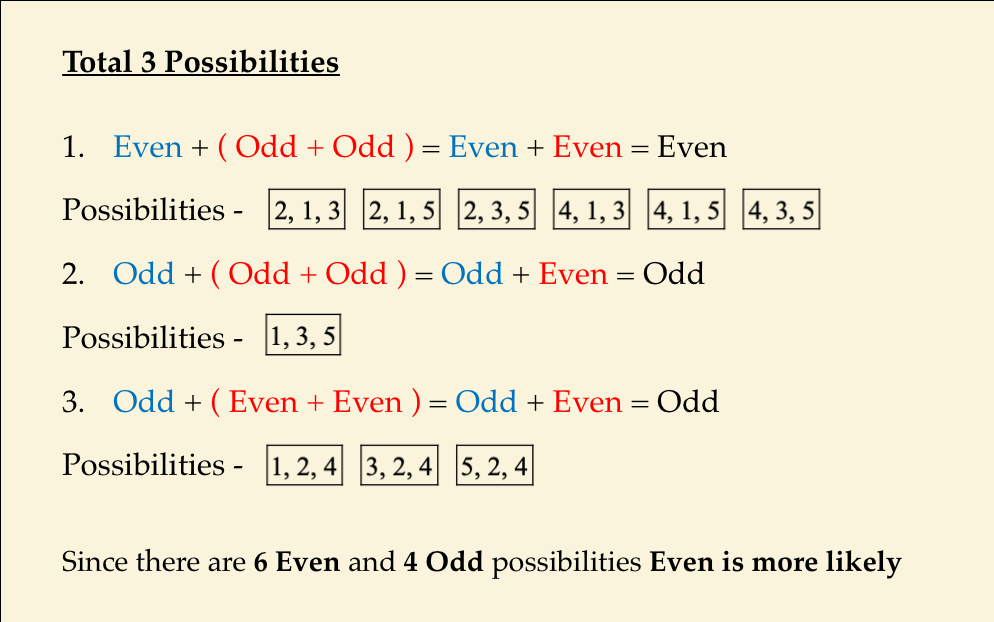

# OddorEven?
https://brilliant.org/daily-problems/parity-probability/

We're going to play a game. First, throw a dart at this dartboard. Then, roll a die and double the result. Finally, spin this spinner. When you add all these numbers together, is your result even or odd? 

It turns out, no matter what happens in all these random processes, the final number in this game will always be odd. 

Why does this happen? It's a result of the properties of number parity. To see why, let's note what happens when we add even and odd numbers together. 

<h2>Odd + Odd = Even</h2>

When we add two odds, we have two ones that are missing a pair (one from each of the odd numbers). When we add these numbers together, the two single ones form a new pair and now all the ones are in pairs; therefore an odd plus an odd makes an <strong>even</strong>. 

<h2>Even + Even = Even</h2>

<h2>Even + Odd = Odd</h2>

 

In the game above, we had a dart (odd), then a doubled die roll (even), and then a spin on the spinner (even). This means that we'll always have an odd result, no matter what we get for the individual results. 

You'll need to think carefully about number parity to solve the problem below as well.

<header class="b-vspace-m">
<h1>Today's Problem</h1>
</header>

5 balls labelled 1 to 5 are placed in a bag, and 3 of them are drawn out simultaneously. 

When you add the three numbers you've drawn together, which is most likely?

* The sum is even.
* The sum is odd.
* Even and odd are equally likely.

===============================================

# 내 멋대로 발직역
# 홀수 혹은 짝수?

게임 한번해보자. 먼저 다트를 이 다트보드에 던져라. 주사위를 돌려서 결과를 두배로하여라. 마지막으로 스핀을 돌려라. 모든 숫자를 더했을때 답은 홀수일까 짝수 일까?

모든 임의의 과정에서 어떤 일이 일어나더라도 이 게임의 마지막 숫자는 항상 홀수 일 것입니다.

왤까요? 이것은 숫자의 parity속성의 결과입니다. 짝수와 홀수를 더할때 어떤 일이 일어나는지 봐봅시다.

홀수와 홀수가 더해지면 짝수가 됩니다.

짝수와 짝수가 더해지면 짝수가 됩니다.

짝수와 홀수가 더해지면 홀수가 됩니다.

숫자의 parity를 고려해서 아래 문제를 잘 풀어보세요.

<header class="b-vspace-m">
<h1>Today's Problem</h1>
</header>

5개의 공들이 1~5의 숫자가 적힌채 주머니에 있다. 이걸 3개를 동시에 꺼낸다. 

이 동시에 꺼낸 세개에 적힌 숫자를 모두 더할때 어떤 결과가 더 많이 나올 것인가?

* 1.합은 짝수일경우
* 2.합은 홀수일경우
* 3.짝수와 홀수 모두 똑같이 나타난다.

===============================================

내가 고른 정답 : 3.짝수와 홀수 모두 똑같이 나타난다.(Question잘못이해함.. 더많은걸 고르는 거였다뉘)

이유 : 먼저 두개를 골랐다고 가정해보자 그러면 경우의 수가 (홀수, 홀수) = 짝수, (짝수, 짝수) = 짝수, (짝수, 홀수) = 홀수, (홀수, 짝수) = 홀수가 될것이다. 이때 (짝수, 짝수) 인경우 이미 짝수 두개를 다 썼으므로 경우의 수가 불균형 해짐

정답 : 1.합은 짝수일경우

모범 답안 : 

