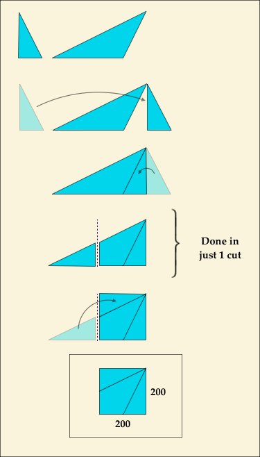

# Triangle+Triangle=Square?
https://brilliant.org/daily-problems/dissect-into-square/

Any polygon can be cut up into triangles, no matter how ugly or irregular it looks at first.

<template style="width: 400px; height: 225px;">

&nbsp;

</template>

 

<video id="wistia_simple_video_112" crossorigin="anonymous" poster="https://fast.wistia.com/assets/images/blank.gif" src="https://embedwistia-a.akamaihd.net/deliveries/d4eb315f872e1d2f948db749884bcd0644986b10/file.mp4" controlslist="nodownload" playsinline="" loop="" preload="auto" type="video/mp4" x-webkit-airplay="allow" style="background: transparent; display: block; height: 100%; max-height: none; max-width: none; position: static; visibility: visible; width: 100%; object-fit: contain;"><source src="https://embedwistia-a.akamaihd.net/deliveries/d4eb315f872e1d2f948db749884bcd0644986b10/file.mp4" type="video/mp4"></video>

<button class="w-big-play-button w-css-reset-button-important w-vulcan-v2-button" aria-label="Play DP Triangle Dissection A" style="cursor: pointer; height: 50px; background: rgba(61, 153, 246, 0.8); box-shadow: none; width: 78.125px;"><svg x="0px" y="0px" viewBox="0 0 125 80" enable-background="new 0 0 125 80" alt="" style="fill: rgb(255, 255, 255); height: 100%; left: 0px; stroke-width: 0px; top: 0px; width: 100%;"><rect fill-rule="evenodd" clip-rule="evenodd" fill="none" width="125" height="80"></rect><polygon fill-rule="evenodd" clip-rule="evenodd" fill="#FFFFFF" points="53,22 53,58 79,40"></polygon></svg></button>

<button class="w-vulcan-v2-button" style="background: rgba(0, 0, 0, 0.4); border: 2px solid transparent; border-radius: 20.25px; cursor: pointer; height: 26.25px; line-height: 26.25px; outline: none; padding-right: 7.5px; pointer-events: auto; position: absolute; right: 9.25px; text-align: left; top: 9.25px;"><svg viewBox="0 0 237 237" style="height: 24px; margin-top: 0.375px; vertical-align: top; width: 26.25px;"><polygon fill="white" points="88 107 65 107 65 131 89 131 112 154 112 84"></polygon><g fill="none" stroke="white" stroke-width="10" stroke-linecap="round"><path class="volume__small-wave" d="M 142 86 C 151 107 151 130 142 151"></path><path class="volume__large-wave" d="M 165 74 C 178 97 178 140 165 163"></path></g></svg>
Click for sound
</button>

<canvas width="400" height="10" style="height: 10px; left: 0px; pointer-events: none; position: absolute; top: 0px; width: 400px;"></canvas>

<button class="w-vulcan-v2-button w-css-reset w-css-reset-tree w-css-reset-button-important" aria-label="Play" title="Play" style="background: rgba(61, 153, 246, 0.95); box-shadow: none; cursor: pointer; height: 100%; position: relative; width: 100%; transition: opacity 400ms ease 0s; opacity: 1;">

<svg x="0px" y="0px" viewBox="0 0 51.556 34" enable-background="new 0 0 51.556 34" class="w-css-reset w-css-reset-tree" style="fill: rgb(255, 255, 255); height: 100%; left: 0px; stroke-width: 0px; top: 0px; width: 100%;"><g><rect x="20" y="11.3" width="3.5" height="12"></rect><rect x="26.5" y="11.3" width="3.5" height="12"></rect></g></svg>

<svg x="0px" y="0px" viewBox="0 0 51.556 34" enable-background="new 0 0 51.556 34" class="w-css-reset w-css-reset-tree" style="fill: rgb(255, 255, 255); height: 100%; left: 0px; stroke-width: 0px; top: 0px; width: 100%;"><polygon points="31.555999999999997,16.5 20,24 20,9"></polygon></svg>

</button>

<canvas width="319" height="21" style="height: 21px; left: 0px; pointer-events: none; position: absolute; top: 0px; width: 319px;"></canvas>

<button class="w-vulcan-v2-button w-css-reset w-css-reset-tree w-css-reset-button-important" aria-label="Mute" title="Mute" style="background: rgba(61, 153, 246, 0.95); box-shadow: none; cursor: pointer; height: 100%; position: relative; width: 100%; transition: opacity 400ms ease 0s; opacity: 1;">
<svg x="0px" y="0px" viewBox="0 0 40 34" enable-background="new 0 0 40 34" style="fill: rgb(255, 255, 255); height: 100%; left: 0px; stroke-width: 0px; top: 0px; width: 100%;"><g style="transform: translateX(1.25px); transition: transform 100ms ease 0s;"><g><path d="M13.8,14.2c-0.5,0.5-1.4,0.8-2,0.8h-1.6C9.5,15,9,15.5,9,16.2v1.6c0,0.7,0.5,1.2,1.2,1.2h1.6c0.7,0,1.6,0.4,2,0.8l2.3,2.3c0.5,0.5,0.8,0.3,0.8-0.4v-9.6c0-0.7-0.4-0.8-0.8-0.4L13.8,14.2z"></path></g><g><path fill="none" stroke="#ffffff" stroke-line-cap="round" stroke-miterlimit="10" stroke-width="2" d="M22,11.7c0,0,1.1,2.5,1.1,5s-1.1,5-1.1,5" style="opacity: 1; transition: opacity 100ms ease 0s;"></path><path fill="none" stroke="#ffffff" stroke-line-cap="round" stroke-miterlimit="10" stroke-width="2" d="M25.8,9.2c0,0,1.7,3.8,1.7,7.5c0,3.7-1.7,7.5-1.7,7.5" style="opacity: 1; transition: opacity 100ms ease 0s;"></path></g><g style="opacity: 0; transition: opacity 100ms ease 0s;"><line fill="none" stroke="#ffffff" stroke-line-cap="round" stroke-miterlimit="10" stroke-width="1.8102" x1="19.2" y1="15" x2="23.2" y2="19"></line><line fill="none" stroke="#ffffff" stroke-line-cap="round" stroke-miterlimit="10" stroke-width="1.8102" x1="19.2" y1="19" x2="23.2" y2="15"></line></g></g></svg>
</button>

<button class="w-vulcan-v2-button w-css-reset w-css-reset-tree w-css-reset-button-important" aria-label="Fullscreen" title="Fullscreen" style="background: rgba(61, 153, 246, 0.95); box-shadow: none; cursor: pointer; height: 100%; position: relative; width: 100%; transition: opacity 400ms ease 0s; opacity: 1;">
<svg x="0px" y="0px" viewBox="0 0 40 34" enable-background="new 0 0 40 34" style="fill: rgb(255, 255, 255); height: 100%; left: 0px; stroke-width: 0px; top: 0px; width: 100%;"><g><g><polyline fill="none" stroke="#ffffff" stroke-width="2" stroke-linecap="round" stroke-linejoin="round" stroke-miterlimit="10" points="31.4,12.6 31.4,8.7 25.8,8.7"></polyline><polyline fill="none" stroke="#ffffff" stroke-width="2" stroke-linecap="round" stroke-linejoin="round" stroke-miterlimit="10" points="14.7,8.7 9.1,8.7 9.1,12.6"></polyline><polyline fill="none" stroke="#ffffff" stroke-width="2" stroke-linecap="round" stroke-linejoin="round" stroke-miterlimit="10" points="25.8,24.8 31.4,24.8 31.4,20.9"></polyline><polyline fill="none" stroke="#ffffff" stroke-width="2" stroke-linecap="round" stroke-linejoin="round" stroke-miterlimit="10" points="9.1,20.9 9.1,24.8 14.7,24.8"></polyline></g><rect x="13.7" y="12.3" fill="none" stroke="#ffffff" stroke-width="2" stroke-linecap="round" stroke-linejoin="round" stroke-miterlimit="10" enable-background="new" width="13.3" height="8.9"></rect></g></svg>
</button>

 

 

 

 

 

On the other hand, it is less well-known that any <em>triangle</em> can be turned into a rectangle. 

In fact, no matter <em>what</em> triangle we start with, we can use straight line cuts to rearrange it into a rectangle. 

Here's one method: 

<template>

&nbsp;

</template>

<video id="wistia_simple_video_132" crossorigin="anonymous" poster="https://fast.wistia.com/assets/images/blank.gif" src="https://embedwistia-a.akamaihd.net/deliveries/3dee7401fc6907798689b87796f68aad38002acb/file.mp4" controlslist="nodownload" playsinline="" loop="" preload="none" type="video/mp4" x-webkit-airplay="allow" style="background: transparent; display: block; height: 100%; max-height: none; max-width: none; position: static; visibility: visible; width: 100%; object-fit: contain;"><source src="https://embedwistia-a.akamaihd.net/deliveries/3dee7401fc6907798689b87796f68aad38002acb/file.mp4" type="video/mp4"></video>

If the triangle is acute (or if the obtuse angle is at the top), the following method works as well: 

<template>

&nbsp;

</template>

<video id="wistia_simple_video_152" crossorigin="anonymous" poster="https://fast.wistia.com/assets/images/blank.gif" src="https://embedwistia-a.akamaihd.net/deliveries/f95a2ac37282c305980cdbab32e4383a3d18c37c/file.mp4" controlslist="nodownload" playsinline="" loop="" preload="none" type="video/mp4" x-webkit-airplay="allow" style="background: transparent; display: block; height: 100%; max-height: none; max-width: none; position: static; visibility: visible; width: 100%; object-fit: contain;"><source src="https://embedwistia-a.akamaihd.net/deliveries/f95a2ac37282c305980cdbab32e4383a3d18c37c/file.mp4" type="video/mp4"></video>

In fact, there are <em>many</em> ways to turn a triangle into a rectangle. So, we now have the tools to turn polygons into triangles—and <em>also</em> to turn triangles back into some polygons. 

What other shapes can we make out of a triangle? The problem below asks you to try something related, but with <em>two</em> triangles as the starting place and a single square as the result.

<header class="b-vspace-m">
<h1>Today's Problem</h1>
</header>

Using only straight line cuts, is it possible to cut up these two triangles and rearrange all of the pieces to make a <svg xmlns:xlink="http://www.w3.org/1999/xlink" style="width: 9.778ex; height: 1.667ex; vertical-align: -0.222ex; margin-top: 1px; margin-right: 0px; margin-bottom: 1px; margin-left: 0px; " viewBox="0 -686.9033013280564 4222.444444444444 729.8066026561128"><defs id="MathJax_SVG_glyphs-619d75082abf11e3bb5c40400601ade9516ac2fd91874960b84276979e42b3c4"><path id="MJMAIN-32-619d75082abf11e3bb5c40400601ade9516ac2fd91874960b84276979e42b3c4" stroke-width="0" d="M109 429Q82 429 66 447T50 491Q50 562 103 614T235 666Q326 666 387 610T449 465Q449 422 429 383T381 315T301 241Q265 210 201 149L142 93L218 92Q375 92 385 97Q392 99 409 186V189H449V186Q448 183 436 95T421 3V0H50V19V31Q50 38 56 46T86 81Q115 113 136 137Q145 147 170 174T204 211T233 244T261 278T284 308T305 340T320 369T333 401T340 431T343 464Q343 527 309 573T212 619Q179 619 154 602T119 569T109 550Q109 549 114 549Q132 549 151 535T170 489Q170 464 154 447T109 429Z"></path><path id="MJMAIN-30-619d75082abf11e3bb5c40400601ade9516ac2fd91874960b84276979e42b3c4" stroke-width="0" d="M96 585Q152 666 249 666Q297 666 345 640T423 548Q460 465 460 320Q460 165 417 83Q397 41 362 16T301 -15T250 -22Q224 -22 198 -16T137 16T82 83Q39 165 39 320Q39 494 96 585ZM321 597Q291 629 250 629Q208 629 178 597Q153 571 145 525T137 333Q137 175 145 125T181 46Q209 16 250 16Q290 16 318 46Q347 76 354 130T362 333Q362 478 354 524T321 597Z"></path><path id="MJMAIN-D7-619d75082abf11e3bb5c40400601ade9516ac2fd91874960b84276979e42b3c4" stroke-width="0" d="M630 29Q630 9 609 9Q604 9 587 25T493 118L389 222L284 117Q178 13 175 11Q171 9 168 9Q160 9 154 15T147 29Q147 36 161 51T255 146L359 250L255 354Q174 435 161 449T147 471Q147 480 153 485T168 490Q173 490 175 489Q178 487 284 383L389 278L493 382Q570 459 587 475T609 491Q630 491 630 471Q630 464 620 453T522 355L418 250L522 145Q606 61 618 48T630 29Z"></path></defs><g stroke="black" fill="black" stroke-width="0" transform="matrix(1 0 0 -1 0 0)"><use xlink:href="#MJMAIN-32-619d75082abf11e3bb5c40400601ade9516ac2fd91874960b84276979e42b3c4"></use><use xlink:href="#MJMAIN-30-619d75082abf11e3bb5c40400601ade9516ac2fd91874960b84276979e42b3c4" x="500" y="0"></use><use xlink:href="#MJMAIN-30-619d75082abf11e3bb5c40400601ade9516ac2fd91874960b84276979e42b3c4" x="1000" y="0"></use><use xlink:href="#MJMAIN-D7-619d75082abf11e3bb5c40400601ade9516ac2fd91874960b84276979e42b3c4" x="1722" y="0"></use><g transform="translate(2722,0)"><use xlink:href="#MJMAIN-32-619d75082abf11e3bb5c40400601ade9516ac2fd91874960b84276979e42b3c4"></use><use xlink:href="#MJMAIN-30-619d75082abf11e3bb5c40400601ade9516ac2fd91874960b84276979e42b3c4" x="500" y="0"></use><use xlink:href="#MJMAIN-30-619d75082abf11e3bb5c40400601ade9516ac2fd91874960b84276979e42b3c4" x="1000" y="0"></use></g></g></svg> square?  

Both triangles have a height of 200.

* It is possible with fewer than ten cuts.
* It is possible, but only with ten or more cuts.
* It is not possible.

===============================================

# 내 멋대로 발직역
# 삼각형 + 삼각형 = 사각형?

어떤 다각형이든 삼각형으로 짜를 수 이씁니다. 그게 불규칙적이거나 못생기게 보이는걸 신경쓰지 않는다면요.

다른 한편으로는 어떤 삼각형도 사각형으로 변할 수 있다는 사실은 잘 알려져 있지는 않습니다.

실제로 우리가 시작하는 삼각형이 무엇이든 관계없이 직선자를 사용하여 직선으로 재배열 할 수 있습니다.

여기 하나의 방법입니다.

만약 삼각형이 너무 예리하거나 뭉특하면, 이 방법이 잘 작동할 것입니다.

실제로 삼각형은 사각형으로 만드는 많은 방법이 있습니다. 그래서 우리는 이제 다각형을 삼각형으로 바꾸고 삼각형을 다시 다각형으로 바꾸는 도구를 가지고 있습니다.

삼각형으로 다른 도형도 만들 수 있을까요? 아래의 문제는 시작점으로 두 개의 삼각형을 사용하고 결과로 하나의 사각형을 사용하여 관련 항목을 시도해보세요.

<header class="b-vspace-m">
<h1>Today's Problem</h1>
</header>

오로지 직선으로 짜르고, 이 짤린 두 삼각형의 모든 조각을 재배열하여 200 * 200 사각형을 만들 수 있을까?두 사각형 모두 200높이이며, 도형 규모를 조절해야 한다.<svg xmlns:xlink="http://www.w3.org/1999/xlink" style="width: 9.778ex; height: 1.667ex; vertical-align: -0.222ex; margin-top: 1px; margin-right: 0px; margin-bottom: 1px; margin-left: 0px; " viewBox="0 -686.9033013280564 4222.444444444444 729.8066026561128"><defs id="MathJax_SVG_glyphs-619d75082abf11e3bb5c40400601ade9516ac2fd91874960b84276979e42b3c4"><path id="MJMAIN-32-619d75082abf11e3bb5c40400601ade9516ac2fd91874960b84276979e42b3c4" stroke-width="0" d="M109 429Q82 429 66 447T50 491Q50 562 103 614T235 666Q326 666 387 610T449 465Q449 422 429 383T381 315T301 241Q265 210 201 149L142 93L218 92Q375 92 385 97Q392 99 409 186V189H449V186Q448 183 436 95T421 3V0H50V19V31Q50 38 56 46T86 81Q115 113 136 137Q145 147 170 174T204 211T233 244T261 278T284 308T305 340T320 369T333 401T340 431T343 464Q343 527 309 573T212 619Q179 619 154 602T119 569T109 550Q109 549 114 549Q132 549 151 535T170 489Q170 464 154 447T109 429Z"></path><path id="MJMAIN-30-619d75082abf11e3bb5c40400601ade9516ac2fd91874960b84276979e42b3c4" stroke-width="0" d="M96 585Q152 666 249 666Q297 666 345 640T423 548Q460 465 460 320Q460 165 417 83Q397 41 362 16T301 -15T250 -22Q224 -22 198 -16T137 16T82 83Q39 165 39 320Q39 494 96 585ZM321 597Q291 629 250 629Q208 629 178 597Q153 571 145 525T137 333Q137 175 145 125T181 46Q209 16 250 16Q290 16 318 46Q347 76 354 130T362 333Q362 478 354 524T321 597Z"></path><path id="MJMAIN-D7-619d75082abf11e3bb5c40400601ade9516ac2fd91874960b84276979e42b3c4" stroke-width="0" d="M630 29Q630 9 609 9Q604 9 587 25T493 118L389 222L284 117Q178 13 175 11Q171 9 168 9Q160 9 154 15T147 29Q147 36 161 51T255 146L359 250L255 354Q174 435 161 449T147 471Q147 480 153 485T168 490Q173 490 175 489Q178 487 284 383L389 278L493 382Q570 459 587 475T609 491Q630 491 630 471Q630 464 620 453T522 355L418 250L522 145Q606 61 618 48T630 29Z"></path></defs><g stroke="black" fill="black" stroke-width="0" transform="matrix(1 0 0 -1 0 0)"><use xlink:href="#MJMAIN-32-619d75082abf11e3bb5c40400601ade9516ac2fd91874960b84276979e42b3c4"></use><use xlink:href="#MJMAIN-30-619d75082abf11e3bb5c40400601ade9516ac2fd91874960b84276979e42b3c4" x="500" y="0"></use><use xlink:href="#MJMAIN-30-619d75082abf11e3bb5c40400601ade9516ac2fd91874960b84276979e42b3c4" x="1000" y="0"></use><use xlink:href="#MJMAIN-D7-619d75082abf11e3bb5c40400601ade9516ac2fd91874960b84276979e42b3c4" x="1722" y="0"></use><g transform="translate(2722,0)"><use xlink:href="#MJMAIN-32-619d75082abf11e3bb5c40400601ade9516ac2fd91874960b84276979e42b3c4"></use><use xlink:href="#MJMAIN-30-619d75082abf11e3bb5c40400601ade9516ac2fd91874960b84276979e42b3c4" x="500" y="0"></use><use xlink:href="#MJMAIN-30-619d75082abf11e3bb5c40400601ade9516ac2fd91874960b84276979e42b3c4" x="1000" y="0"></use></g></g></svg> square?  

Both triangles have a height of 200.

* 1.열번 보다 적게 짤라서 가능
* 2.열번 이상 짤라서 가능
* 3.불가능

===============================================

내가 고른 정답 : 1.열번 보다 적게 짤라서 가능

이유 : 위 방식대로 해보니깐 4번 정도 짜르니깐 되는것 같음(난 안합치고 따로 짤라서 4번 나옴...)

정답 : 1.열번 보다 적게 짤라서 가능

모범 답안 : 

