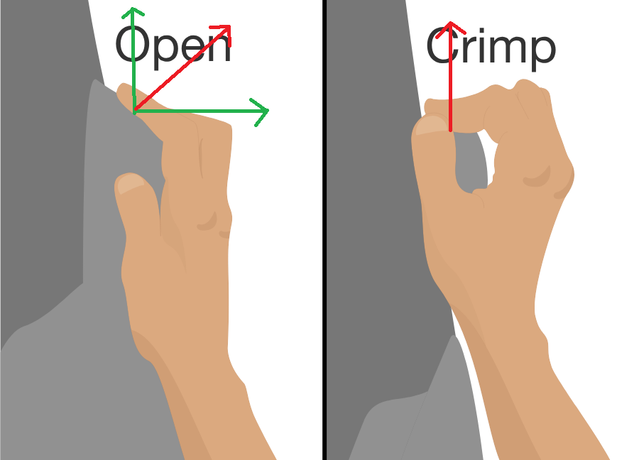

# What'stheSafestWaytoRockClimb?
https://brilliant.org/daily-problems/climbing-grip/

Alex Honnold's <a target="_blank" rel="nofollow" href="https://brilliant.org/daily-problems/mountain-climb-power/">ascent of El Capitan</a> without any safety gear was a truly death defying feat, and most rock climbers (understandably) aspire to much more reasonable heights. However even when safety ropes and harnesses are used properly, rock climbing still has risk of injury. 

Just as we can perform a force balance on a carabiner to calculate the tensions in ropes and loads on anchors, we can apply the same analysis to different points of the body to calculate the strains that climbing puts on your bones, joints, muscles, and other body tissue.

<blockquote>

Take the following rope set up as an example: 

If the bottom carabiner is stationary, that means the net force on it must be zero. The tension forces act along the line of the diagonal ropes, but these tensions can be broken down into horizontal and vertical components based on angle, which are easier to deal with.

You can see how a force acting at a particular angle can be separated into vertical and horizontal components using the interactive visualization below:

For the rope shown above, setting the vertical forces so that they cancel (and we get a net force of zero) reveals how the tension force in the rope relates to the supported weight:

<svg xmlns:xlink="http://www.w3.org/1999/xlink" style="width: 13.333ex; height: 1.778ex; vertical-align: -0.222ex; margin-top: 1px; margin-right: 0px; margin-bottom: 1px; margin-left: 0px; " viewBox="0 -725.9033013280564 5725.88888888889 768.8066026561128"><defs><path id="MJMATHI-57-2bfd14fe2ff411e9a5c902b7b6aa388674592a3ade064586bbf74bdad1a37cd7" stroke-width="0" d="M436 683Q450 683 486 682T553 680Q604 680 638 681T677 682Q695 682 695 674Q695 670 692 659Q687 641 683 639T661 637Q636 636 621 632T600 624T597 615Q597 603 613 377T629 138L631 141Q633 144 637 151T649 170T666 200T690 241T720 295T759 362Q863 546 877 572T892 604Q892 619 873 628T831 637Q817 637 817 647Q817 650 819 660Q823 676 825 679T839 682Q842 682 856 682T895 682T949 681Q1015 681 1034 683Q1048 683 1048 672Q1048 666 1045 655T1038 640T1028 637Q1006 637 988 631T958 617T939 600T927 584L923 578L754 282Q586 -14 585 -15Q579 -22 561 -22Q546 -22 542 -17Q539 -14 523 229T506 480L494 462Q472 425 366 239Q222 -13 220 -15T215 -19Q210 -22 197 -22Q178 -22 176 -15Q176 -12 154 304T131 622Q129 631 121 633T82 637H58Q51 644 51 648Q52 671 64 683H76Q118 680 176 680Q301 680 313 683H323Q329 677 329 674T327 656Q322 641 318 637H297Q236 634 232 620Q262 160 266 136L501 550L499 587Q496 629 489 632Q483 636 447 637Q428 637 422 639T416 648Q416 650 418 660Q419 664 420 669T421 676T424 680T428 682T436 683Z"></path><path id="MJMAIN-3D-2bfd14fe2ff411e9a5c902b7b6aa388674592a3ade064586bbf74bdad1a37cd7" stroke-width="0" d="M56 347Q56 360 70 367H707Q722 359 722 347Q722 336 708 328L390 327H72Q56 332 56 347ZM56 153Q56 168 72 173H708Q722 163 722 153Q722 140 707 133H70Q56 140 56 153Z"></path><path id="MJMAIN-32-2bfd14fe2ff411e9a5c902b7b6aa388674592a3ade064586bbf74bdad1a37cd7" stroke-width="0" d="M109 429Q82 429 66 447T50 491Q50 562 103 614T235 666Q326 666 387 610T449 465Q449 422 429 383T381 315T301 241Q265 210 201 149L142 93L218 92Q375 92 385 97Q392 99 409 186V189H449V186Q448 183 436 95T421 3V0H50V19V31Q50 38 56 46T86 81Q115 113 136 137Q145 147 170 174T204 211T233 244T261 278T284 308T305 340T320 369T333 401T340 431T343 464Q343 527 309 573T212 619Q179 619 154 602T119 569T109 550Q109 549 114 549Q132 549 151 535T170 489Q170 464 154 447T109 429Z"></path><path id="MJMATHI-54-2bfd14fe2ff411e9a5c902b7b6aa388674592a3ade064586bbf74bdad1a37cd7" stroke-width="0" d="M40 437Q21 437 21 445Q21 450 37 501T71 602L88 651Q93 669 101 677H569H659Q691 677 697 676T704 667Q704 661 687 553T668 444Q668 437 649 437Q640 437 637 437T631 442L629 445Q629 451 635 490T641 551Q641 586 628 604T573 629Q568 630 515 631Q469 631 457 630T439 622Q438 621 368 343T298 60Q298 48 386 46Q418 46 427 45T436 36Q436 31 433 22Q429 4 424 1L422 0Q419 0 415 0Q410 0 363 1T228 2Q99 2 64 0H49Q43 6 43 9T45 27Q49 40 55 46H83H94Q174 46 189 55Q190 56 191 56Q196 59 201 76T241 233Q258 301 269 344Q339 619 339 625Q339 630 310 630H279Q212 630 191 624Q146 614 121 583T67 467Q60 445 57 441T43 437H40Z"></path><path id="MJMAIN-63-2bfd14fe2ff411e9a5c902b7b6aa388674592a3ade064586bbf74bdad1a37cd7" stroke-width="0" d="M370 305T349 305T313 320T297 358Q297 381 312 396Q317 401 317 402T307 404Q281 408 258 408Q209 408 178 376Q131 329 131 219Q131 137 162 90Q203 29 272 29Q313 29 338 55T374 117Q376 125 379 127T395 129H409Q415 123 415 120Q415 116 411 104T395 71T366 33T318 2T249 -11Q163 -11 99 53T34 214Q34 318 99 383T250 448T370 421T404 357Q404 334 387 320Z"></path><path id="MJMAIN-6F-2bfd14fe2ff411e9a5c902b7b6aa388674592a3ade064586bbf74bdad1a37cd7" stroke-width="0" d="M28 214Q28 309 93 378T250 448Q340 448 405 380T471 215Q471 120 407 55T250 -10Q153 -10 91 57T28 214ZM250 30Q372 30 372 193V225V250Q372 272 371 288T364 326T348 362T317 390T268 410Q263 411 252 411Q222 411 195 399Q152 377 139 338T126 246V226Q126 130 145 91Q177 30 250 30Z"></path><path id="MJMAIN-73-2bfd14fe2ff411e9a5c902b7b6aa388674592a3ade064586bbf74bdad1a37cd7" stroke-width="0" d="M295 316Q295 356 268 385T190 414Q154 414 128 401Q98 382 98 349Q97 344 98 336T114 312T157 287Q175 282 201 278T245 269T277 256Q294 248 310 236T342 195T359 133Q359 71 321 31T198 -10H190Q138 -10 94 26L86 19L77 10Q71 4 65 -1L54 -11H46H42Q39 -11 33 -5V74V132Q33 153 35 157T45 162H54Q66 162 70 158T75 146T82 119T101 77Q136 26 198 26Q295 26 295 104Q295 133 277 151Q257 175 194 187T111 210Q75 227 54 256T33 318Q33 357 50 384T93 424T143 442T187 447H198Q238 447 268 432L283 424L292 431Q302 440 314 448H322H326Q329 448 335 442V310L329 304H301Q295 310 295 316Z"></path><path id="MJMATHI-3B8-2bfd14fe2ff411e9a5c902b7b6aa388674592a3ade064586bbf74bdad1a37cd7" stroke-width="0" d="M35 200Q35 302 74 415T180 610T319 704Q320 704 327 704T339 705Q393 701 423 656Q462 596 462 495Q462 380 417 261T302 66T168 -10H161Q125 -10 99 10T60 63T41 130T35 200ZM383 566Q383 668 330 668Q294 668 260 623T204 521T170 421T157 371Q206 370 254 370L351 371Q352 372 359 404T375 484T383 566ZM113 132Q113 26 166 26Q181 26 198 36T239 74T287 161T335 307L340 324H145Q145 321 136 286T120 208T113 132Z"></path></defs><g stroke="black" fill="black" stroke-width="0" transform="matrix(1 0 0 -1 0 0)"><use xlink:href="#MJMATHI-57-2bfd14fe2ff411e9a5c902b7b6aa388674592a3ade064586bbf74bdad1a37cd7"></use><use xlink:href="#MJMAIN-3D-2bfd14fe2ff411e9a5c902b7b6aa388674592a3ade064586bbf74bdad1a37cd7" x="1325" y="0"></use><use xlink:href="#MJMAIN-32-2bfd14fe2ff411e9a5c902b7b6aa388674592a3ade064586bbf74bdad1a37cd7" x="2381" y="0"></use><use xlink:href="#MJMATHI-54-2bfd14fe2ff411e9a5c902b7b6aa388674592a3ade064586bbf74bdad1a37cd7" x="2881" y="0"></use><g transform="translate(3752,0)"><use xlink:href="#MJMAIN-63-2bfd14fe2ff411e9a5c902b7b6aa388674592a3ade064586bbf74bdad1a37cd7"></use><use xlink:href="#MJMAIN-6F-2bfd14fe2ff411e9a5c902b7b6aa388674592a3ade064586bbf74bdad1a37cd7" x="444" y="0"></use><use xlink:href="#MJMAIN-73-2bfd14fe2ff411e9a5c902b7b6aa388674592a3ade064586bbf74bdad1a37cd7" x="944" y="0"></use></g><use xlink:href="#MJMATHI-3B8-2bfd14fe2ff411e9a5c902b7b6aa388674592a3ade064586bbf74bdad1a37cd7" x="5256" y="0"></use></g></svg>
<svg xmlns:xlink="http://www.w3.org/1999/xlink" style="width: 11.667ex; height: 4.889ex; vertical-align: -1.778ex; margin-top: 1px; margin-right: 0px; margin-bottom: 1px; margin-left: 0px; " viewBox="0 -1380.4113013280564 5037.888888888889 2099.2656026561126"><defs><path id="MJMATHI-54-2bfd14fe2ff411e9a5c902b7b6aa388674592a3ade064586bbf74bdad1a37cd7" stroke-width="0" d="M40 437Q21 437 21 445Q21 450 37 501T71 602L88 651Q93 669 101 677H569H659Q691 677 697 676T704 667Q704 661 687 553T668 444Q668 437 649 437Q640 437 637 437T631 442L629 445Q629 451 635 490T641 551Q641 586 628 604T573 629Q568 630 515 631Q469 631 457 630T439 622Q438 621 368 343T298 60Q298 48 386 46Q418 46 427 45T436 36Q436 31 433 22Q429 4 424 1L422 0Q419 0 415 0Q410 0 363 1T228 2Q99 2 64 0H49Q43 6 43 9T45 27Q49 40 55 46H83H94Q174 46 189 55Q190 56 191 56Q196 59 201 76T241 233Q258 301 269 344Q339 619 339 625Q339 630 310 630H279Q212 630 191 624Q146 614 121 583T67 467Q60 445 57 441T43 437H40Z"></path><path id="MJMAIN-3D-2bfd14fe2ff411e9a5c902b7b6aa388674592a3ade064586bbf74bdad1a37cd7" stroke-width="0" d="M56 347Q56 360 70 367H707Q722 359 722 347Q722 336 708 328L390 327H72Q56 332 56 347ZM56 153Q56 168 72 173H708Q722 163 722 153Q722 140 707 133H70Q56 140 56 153Z"></path><path id="MJMATHI-57-2bfd14fe2ff411e9a5c902b7b6aa388674592a3ade064586bbf74bdad1a37cd7" stroke-width="0" d="M436 683Q450 683 486 682T553 680Q604 680 638 681T677 682Q695 682 695 674Q695 670 692 659Q687 641 683 639T661 637Q636 636 621 632T600 624T597 615Q597 603 613 377T629 138L631 141Q633 144 637 151T649 170T666 200T690 241T720 295T759 362Q863 546 877 572T892 604Q892 619 873 628T831 637Q817 637 817 647Q817 650 819 660Q823 676 825 679T839 682Q842 682 856 682T895 682T949 681Q1015 681 1034 683Q1048 683 1048 672Q1048 666 1045 655T1038 640T1028 637Q1006 637 988 631T958 617T939 600T927 584L923 578L754 282Q586 -14 585 -15Q579 -22 561 -22Q546 -22 542 -17Q539 -14 523 229T506 480L494 462Q472 425 366 239Q222 -13 220 -15T215 -19Q210 -22 197 -22Q178 -22 176 -15Q176 -12 154 304T131 622Q129 631 121 633T82 637H58Q51 644 51 648Q52 671 64 683H76Q118 680 176 680Q301 680 313 683H323Q329 677 329 674T327 656Q322 641 318 637H297Q236 634 232 620Q262 160 266 136L501 550L499 587Q496 629 489 632Q483 636 447 637Q428 637 422 639T416 648Q416 650 418 660Q419 664 420 669T421 676T424 680T428 682T436 683Z"></path><path id="MJMAIN-32-2bfd14fe2ff411e9a5c902b7b6aa388674592a3ade064586bbf74bdad1a37cd7" stroke-width="0" d="M109 429Q82 429 66 447T50 491Q50 562 103 614T235 666Q326 666 387 610T449 465Q449 422 429 383T381 315T301 241Q265 210 201 149L142 93L218 92Q375 92 385 97Q392 99 409 186V189H449V186Q448 183 436 95T421 3V0H50V19V31Q50 38 56 46T86 81Q115 113 136 137Q145 147 170 174T204 211T233 244T261 278T284 308T305 340T320 369T333 401T340 431T343 464Q343 527 309 573T212 619Q179 619 154 602T119 569T109 550Q109 549 114 549Q132 549 151 535T170 489Q170 464 154 447T109 429Z"></path><path id="MJMAIN-63-2bfd14fe2ff411e9a5c902b7b6aa388674592a3ade064586bbf74bdad1a37cd7" stroke-width="0" d="M370 305T349 305T313 320T297 358Q297 381 312 396Q317 401 317 402T307 404Q281 408 258 408Q209 408 178 376Q131 329 131 219Q131 137 162 90Q203 29 272 29Q313 29 338 55T374 117Q376 125 379 127T395 129H409Q415 123 415 120Q415 116 411 104T395 71T366 33T318 2T249 -11Q163 -11 99 53T34 214Q34 318 99 383T250 448T370 421T404 357Q404 334 387 320Z"></path><path id="MJMAIN-6F-2bfd14fe2ff411e9a5c902b7b6aa388674592a3ade064586bbf74bdad1a37cd7" stroke-width="0" d="M28 214Q28 309 93 378T250 448Q340 448 405 380T471 215Q471 120 407 55T250 -10Q153 -10 91 57T28 214ZM250 30Q372 30 372 193V225V250Q372 272 371 288T364 326T348 362T317 390T268 410Q263 411 252 411Q222 411 195 399Q152 377 139 338T126 246V226Q126 130 145 91Q177 30 250 30Z"></path><path id="MJMAIN-73-2bfd14fe2ff411e9a5c902b7b6aa388674592a3ade064586bbf74bdad1a37cd7" stroke-width="0" d="M295 316Q295 356 268 385T190 414Q154 414 128 401Q98 382 98 349Q97 344 98 336T114 312T157 287Q175 282 201 278T245 269T277 256Q294 248 310 236T342 195T359 133Q359 71 321 31T198 -10H190Q138 -10 94 26L86 19L77 10Q71 4 65 -1L54 -11H46H42Q39 -11 33 -5V74V132Q33 153 35 157T45 162H54Q66 162 70 158T75 146T82 119T101 77Q136 26 198 26Q295 26 295 104Q295 133 277 151Q257 175 194 187T111 210Q75 227 54 256T33 318Q33 357 50 384T93 424T143 442T187 447H198Q238 447 268 432L283 424L292 431Q302 440 314 448H322H326Q329 448 335 442V310L329 304H301Q295 310 295 316Z"></path><path id="MJMATHI-3B8-2bfd14fe2ff411e9a5c902b7b6aa388674592a3ade064586bbf74bdad1a37cd7" stroke-width="0" d="M35 200Q35 302 74 415T180 610T319 704Q320 704 327 704T339 705Q393 701 423 656Q462 596 462 495Q462 380 417 261T302 66T168 -10H161Q125 -10 99 10T60 63T41 130T35 200ZM383 566Q383 668 330 668Q294 668 260 623T204 521T170 421T157 371Q206 370 254 370L351 371Q352 372 359 404T375 484T383 566ZM113 132Q113 26 166 26Q181 26 198 36T239 74T287 161T335 307L340 324H145Q145 321 136 286T120 208T113 132Z"></path></defs><g stroke="black" fill="black" stroke-width="0" transform="matrix(1 0 0 -1 0 0)"><use xlink:href="#MJMATHI-54-2bfd14fe2ff411e9a5c902b7b6aa388674592a3ade064586bbf74bdad1a37cd7"></use><use xlink:href="#MJMAIN-3D-2bfd14fe2ff411e9a5c902b7b6aa388674592a3ade064586bbf74bdad1a37cd7" x="981" y="0"></use><g transform="translate(2157,0)"><rect stroke="none" width="2760" height="60" x="0" y="220"></rect><use xlink:href="#MJMATHI-57-2bfd14fe2ff411e9a5c902b7b6aa388674592a3ade064586bbf74bdad1a37cd7" x="856" y="676"></use><g transform="translate(60,-686)"><use xlink:href="#MJMAIN-32-2bfd14fe2ff411e9a5c902b7b6aa388674592a3ade064586bbf74bdad1a37cd7"></use><g transform="translate(666,0)"><use xlink:href="#MJMAIN-63-2bfd14fe2ff411e9a5c902b7b6aa388674592a3ade064586bbf74bdad1a37cd7"></use><use xlink:href="#MJMAIN-6F-2bfd14fe2ff411e9a5c902b7b6aa388674592a3ade064586bbf74bdad1a37cd7" x="444" y="0"></use><use xlink:href="#MJMAIN-73-2bfd14fe2ff411e9a5c902b7b6aa388674592a3ade064586bbf74bdad1a37cd7" x="944" y="0"></use></g><use xlink:href="#MJMATHI-3B8-2bfd14fe2ff411e9a5c902b7b6aa388674592a3ade064586bbf74bdad1a37cd7" x="2171" y="0"></use></g></g></g></svg>

</blockquote>

Climbers need to grip rock features of various shapes and sizes, which is made possible thanks to the dexterity of human fingers. Fingers have tendons that run along the top and bottom of the finger: the top tendon is put in tension to straighten the finger, and the bottom tendon is put in tension to bend the finger. The bottom tendons are held close to the finger joints by ligaments called pulleys, without which we'd need to have webbing between the tips and bases of our fingers.

<template>

&nbsp;

</template>

<video id="wistia_simple_video_36" crossorigin="anonymous" poster="https://fast.wistia.com/assets/images/blank.gif" src="https://embedwistia-a.akamaihd.net/deliveries/076f896fd7cc79c597b8bd4b33d5d5fcfca9a260/file.mp4" controlslist="nodownload" playsinline="" loop="" preload="none" type="video/mp4" x-webkit-airplay="allow" style="background: transparent; display: block; height: 100%; max-height: none; max-width: none; position: static; visibility: visible; width: 100%; object-fit: contain;"><source src="https://embedwistia-a.akamaihd.net/deliveries/076f896fd7cc79c597b8bd4b33d5d5fcfca9a260/file.mp4" type="video/mp4"></video>

<header class="b-vspace-m">
<h1>Today's Problem</h1>
</header>

One of the most dreaded injuries in rock climbing is tearing a finger pulley—a ligament that holds its tendon close to the finger joint. This injury typically occurs when a climber is supporting themselves on a thin rock edge that just has enough room for the tips of their fingers. Two grips that can be used to hold a thin edge are the "open-hand" grip and the "crimp" grip.

In the open-hand grip, the fingers stay relatively straight. In the crimp grip, a sharp angle is maintained in the proximal interphalangeal joints (i.e., the second joint of each finger).

Which grip is more likely to lead to a finger pulley tear?

* The open-hand grip is more likely to lead to a torn pulley.
* The crimp grip is more likely to lead to a torn pulley.
* Both grips are equally likely to lead to injury.

===============================================

# 내 멋대로 발직역
# 암벽 등반을 안전하게 하는 방법은 무엇인가?

Alex Honnold의 안전장치 없이 El Capitan 등반은 죽음을 무릅쓰고 도전하는 위업이였으다. 많은 암벽 등반가들은 더 높은 고도를 갈망한다. 그러나, 안전 로프와 장치가 적합할때 조차 부상 위험이 있다.

로브의 텐션과 앵커의 하중을 계산하기 위해 카라리너에서 힘 밸런스를 수행 할 수 있는 것처럼 몸의 여러 지점에 동일한 분석을 적용하여 뼈, 관절, 근육에 올라가는 변형을 계산할 수 있습니다.

만약 밑에 카바리너를 고정시키면, 그것은 그물에 가해지는 힘이 0이어야 함을 의미한다.장력은 대각선 로프의 선을 따라 작용하지만 이러한 장력은 다루기가 쉬운 각도를 기반으로 수평 및 수직 구성요소로 나누어 질 수 있습니다.

당신은 볼 수 있다 시각적으로 어떻게 힘의 작용이 특별한 각도로 수직과 수평으로 상호작용하는지 나누어서 말이다.

위에 표시된 로프의 경우 수직 힘을 취하도록 설정하면 그물 힘이 0이 된다. 로프의 인장력이 지지되는 무게와 어떻게 관련되는지 보여준다.

등산가는 다양한 모양과 크기의 돌을 잡아야한다. 사람의 손가락이 그것이 가능함을 감사해야한다. 손가락은 손가락의 위아래를 따라 움직이는 힘 줄을 가지고 있습니다. 손가락을 곧게 펴기 위해 꼭지를 긴장시키고, 손가락을 굽히기 위해 아래 힘줄을 긴장시킵니다. 아래 힘줄은 도르래라고 불리는 인대로 손가락 관절에 가깝게 붙잡힙니다. 그렇게 하지 않으면 손가락 끝과 밑 부분 사이에 막이 있어야합니다.

<header class="b-vspace-m">
<h1>Today's Problem</h1>
</header>

암벽등반 중 두려운 상처 중 하나는 인대가 나간느 것이빈다. 이 상처는 일반적으로 얇은 돌의 가장자리를 잡으며 발생합니다. 이럴때 Open, Crimp 두가지의 그립이 가능합니다.

오픈 핸드 그립에서는 손가락이 상대적으로 똑바로 유지됩니다. 압착 그립에서, 예리한 각은 근위 지 골간 관절 (즉, 각 손가락의 제 2 관절)에서 유지된다.

어느 잡는 방법이 인대 파열로 이어질 가능성이 더 클까요?

* 1.오픈 핸드 그립 방식이 인대 파열이 일어날 가능성이 더 큽니다.
* 2.압착 그립 방식이 인대 파열이 일어날 가능성이 더 큽니다.
* 둘다 상처 입을 가능성이 같습니다.

===============================================

내가 고른 정답 : 1.오픈 핸드 그립 방식이 인대 파열이 일어날 가능성이 더 큽니다.

이유 : 각도가 0에 가까울 수록 사용하는 힘이 적어지므로 Crimp(압착) 방식이 더 가능성이 적을 것이라 생각된다.

정답 :  2.압착 그립 방식이 인대 파열이 일어날 가능성이 더 큽니다.

모범 답안 : 

위에 설명에서 로프 설정을 생각해보면, 밑부분 힘줄은 장력하에 있는 로프로 표시 될 수 있으며 도르래는 몸무게로 표시되는 뼈와 위쪽 힘줄에서 반력을 받습니다. 평형 상태에서 W는 cosθ에 비례하며, θ가 90도보다 0에 가까울수록 커집니다. 힘줄의 힘이 케이스 사이에서 유사하다고 가정하면, crimp 그립은 도르래에 더 큰 힘을 가하고 인대 파열이 일어날 가능성이 더 커집니다.

