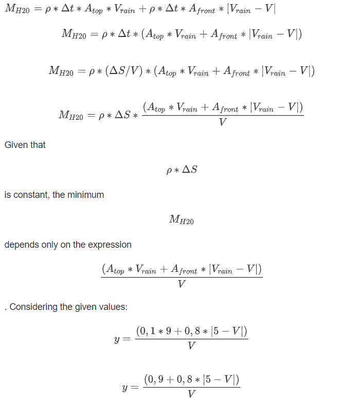
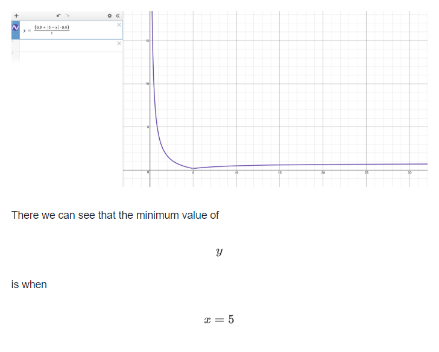

# ShouldYouWalkorRuninWindyRain?
https://brilliant.org/daily-problems/dry-in-the-rain-ii/

In the last two problems, we’ve gotten soaked. First, we investigated the structure of falling rain. Then we came up with a way to think about how it gets you wet. It's all been building up to today’s problem: how to stay driest when walking through a windy rainstorm on your way to work.

First, we learned to think about rain as a uniform mist with density <svg xmlns:xlink="http://www.w3.org/1999/xlink" style="width: 1.889ex; height: 1.667ex; vertical-align: -0.667ex; margin-top: 1px; margin-right: 0px; margin-bottom: 1px; margin-left: 0px; " viewBox="0 -462.9033013280564 795 699.8066026561128"><defs><path id="MJMATHI-3C1-a2bcf11c89a011e4ad84026e3951ed9100507623bdeb43af88c3787268ae13a2" stroke-width="0" d="M58 -216Q25 -216 23 -186Q23 -176 73 26T127 234Q143 289 182 341Q252 427 341 441Q343 441 349 441T359 442Q432 442 471 394T510 276Q510 219 486 165T425 74T345 13T266 -10H255H248Q197 -10 165 35L160 41L133 -71Q108 -168 104 -181T92 -202Q76 -216 58 -216ZM424 322Q424 359 407 382T357 405Q322 405 287 376T231 300Q217 269 193 170L176 102Q193 26 260 26Q298 26 334 62Q367 92 389 158T418 266T424 322Z"></path><path id="MJMAIN-2E-a2bcf11c89a011e4ad84026e3951ed9100507623bdeb43af88c3787268ae13a2" stroke-width="0" d="M78 60Q78 84 95 102T138 120Q162 120 180 104T199 61Q199 36 182 18T139 0T96 17T78 60Z"></path></defs><g stroke="black" fill="black" stroke-width="0" transform="matrix(1 0 0 -1 0 0)"><use xlink:href="#MJMATHI-3C1-a2bcf11c89a011e4ad84026e3951ed9100507623bdeb43af88c3787268ae13a2"></use><use xlink:href="#MJMAIN-2E-a2bcf11c89a011e4ad84026e3951ed9100507623bdeb43af88c3787268ae13a2" x="517" y="0"></use></g></svg> Then we found the two ways someone gets wet when they walk in the rain:

<ol>
<li>rain falls on them from above, or</li>
<li>rain hits them on the front.</li>
</ol>

The box of rain that hits our walker from the top in <svg xmlns:xlink="http://www.w3.org/1999/xlink" style="width: 2.778ex; height: 1.778ex; vertical-align: -0.222ex; margin-top: 1px; margin-right: 0px; margin-bottom: 1px; margin-left: 0px; " viewBox="0 -736.9033013280564 1194 768.8066026561128"><defs id="MathJax_SVG_glyphs-a4dfc4b827ab11e3bb5c40400601ade9cc8a5bd3fad04e619661851f283b34e9"><path id="MJMAIN-394-a4dfc4b827ab11e3bb5c40400601ade9cc8a5bd3fad04e619661851f283b34e9" stroke-width="0" d="M51 0Q46 4 46 7Q46 9 215 357T388 709Q391 716 416 716Q439 716 444 709Q447 705 616 357T786 7Q786 4 781 0H51ZM507 344L384 596L137 92L383 91H630Q630 93 507 344Z"></path><path id="MJMATHI-74-a4dfc4b827ab11e3bb5c40400601ade9cc8a5bd3fad04e619661851f283b34e9" stroke-width="0" d="M26 385Q19 392 19 395Q19 399 22 411T27 425Q29 430 36 430T87 431H140L159 511Q162 522 166 540T173 566T179 586T187 603T197 615T211 624T229 626Q247 625 254 615T261 596Q261 589 252 549T232 470L222 433Q222 431 272 431H323Q330 424 330 420Q330 398 317 385H210L174 240Q135 80 135 68Q135 26 162 26Q197 26 230 60T283 144Q285 150 288 151T303 153H307Q322 153 322 145Q322 142 319 133Q314 117 301 95T267 48T216 6T155 -11Q125 -11 98 4T59 56Q57 64 57 83V101L92 241Q127 382 128 383Q128 385 77 385H26Z"></path></defs><g stroke="black" fill="black" stroke-width="0" transform="matrix(1 0 0 -1 0 0)"><use xlink:href="#MJMAIN-394-a4dfc4b827ab11e3bb5c40400601ade9cc8a5bd3fad04e619661851f283b34e9"></use><use xlink:href="#MJMATHI-74-a4dfc4b827ab11e3bb5c40400601ade9cc8a5bd3fad04e619661851f283b34e9" x="833" y="0"></use></g></svg> seconds has a volume equal to the distance the rain falls times the cross-sectional area of the top: <svg xmlns:xlink="http://www.w3.org/1999/xlink" style="width: 19.444ex; height: 2.556ex; vertical-align: -0.778ex; margin-top: 1px; margin-right: 0px; margin-bottom: 1px; margin-left: 0px; " viewBox="0 -770.9033013280564 8372.124492031431 1078.985318206303"><defs><path id="MJMAIN-28-94974ab834e311e9a5c902b7b6aa38863e1ab6bb1b8c43c895d7b6d902ad3f4f" stroke-width="0" d="M94 250Q94 319 104 381T127 488T164 576T202 643T244 695T277 729T302 750H315H319Q333 750 333 741Q333 738 316 720T275 667T226 581T184 443T167 250T184 58T225 -81T274 -167T316 -220T333 -241Q333 -250 318 -250H315H302L274 -226Q180 -141 137 -14T94 250Z"></path><path id="MJMATHI-76-94974ab834e311e9a5c902b7b6aa38863e1ab6bb1b8c43c895d7b6d902ad3f4f" stroke-width="0" d="M173 380Q173 405 154 405Q130 405 104 376T61 287Q60 286 59 284T58 281T56 279T53 278T49 278T41 278H27Q21 284 21 287Q21 294 29 316T53 368T97 419T160 441Q202 441 225 417T249 361Q249 344 246 335Q246 329 231 291T200 202T182 113Q182 86 187 69Q200 26 250 26Q287 26 319 60T369 139T398 222T409 277Q409 300 401 317T383 343T365 361T357 383Q357 405 376 424T417 443Q436 443 451 425T467 367Q467 340 455 284T418 159T347 40T241 -11Q177 -11 139 22Q102 54 102 117Q102 148 110 181T151 298Q173 362 173 380Z"></path><path id="MJMAIN-72-94974ab834e311e9a5c902b7b6aa38863e1ab6bb1b8c43c895d7b6d902ad3f4f" stroke-width="0" d="M36 46H50Q89 46 97 60V68Q97 77 97 91T98 122T98 161T98 203Q98 234 98 269T98 328L97 351Q94 370 83 376T38 385H20V408Q20 431 22 431L32 432Q42 433 60 434T96 436Q112 437 131 438T160 441T171 442H174V373Q213 441 271 441H277Q322 441 343 419T364 373Q364 352 351 337T313 322Q288 322 276 338T263 372Q263 381 265 388T270 400T273 405Q271 407 250 401Q234 393 226 386Q179 341 179 207V154Q179 141 179 127T179 101T180 81T180 66V61Q181 59 183 57T188 54T193 51T200 49T207 48T216 47T225 47T235 46T245 46H276V0H267Q249 3 140 3Q37 3 28 0H20V46H36Z"></path><path id="MJMAIN-61-94974ab834e311e9a5c902b7b6aa38863e1ab6bb1b8c43c895d7b6d902ad3f4f" stroke-width="0" d="M137 305T115 305T78 320T63 359Q63 394 97 421T218 448Q291 448 336 416T396 340Q401 326 401 309T402 194V124Q402 76 407 58T428 40Q443 40 448 56T453 109V145H493V106Q492 66 490 59Q481 29 455 12T400 -6T353 12T329 54V58L327 55Q325 52 322 49T314 40T302 29T287 17T269 6T247 -2T221 -8T190 -11Q130 -11 82 20T34 107Q34 128 41 147T68 188T116 225T194 253T304 268H318V290Q318 324 312 340Q290 411 215 411Q197 411 181 410T156 406T148 403Q170 388 170 359Q170 334 154 320ZM126 106Q126 75 150 51T209 26Q247 26 276 49T315 109Q317 116 318 175Q318 233 317 233Q309 233 296 232T251 223T193 203T147 166T126 106Z"></path><path id="MJMAIN-69-94974ab834e311e9a5c902b7b6aa38863e1ab6bb1b8c43c895d7b6d902ad3f4f" stroke-width="0" d="M69 609Q69 637 87 653T131 669Q154 667 171 652T188 609Q188 579 171 564T129 549Q104 549 87 564T69 609ZM247 0Q232 3 143 3Q132 3 106 3T56 1L34 0H26V46H42Q70 46 91 49Q100 53 102 60T104 102V205V293Q104 345 102 359T88 378Q74 385 41 385H30V408Q30 431 32 431L42 432Q52 433 70 434T106 436Q123 437 142 438T171 441T182 442H185V62Q190 52 197 50T232 46H255V0H247Z"></path><path id="MJMAIN-6E-94974ab834e311e9a5c902b7b6aa38863e1ab6bb1b8c43c895d7b6d902ad3f4f" stroke-width="0" d="M41 46H55Q94 46 102 60V68Q102 77 102 91T102 122T103 161T103 203Q103 234 103 269T102 328V351Q99 370 88 376T43 385H25V408Q25 431 27 431L37 432Q47 433 65 434T102 436Q119 437 138 438T167 441T178 442H181V402Q181 364 182 364T187 369T199 384T218 402T247 421T285 437Q305 442 336 442Q450 438 463 329Q464 322 464 190V104Q464 66 466 59T477 49Q498 46 526 46H542V0H534L510 1Q487 2 460 2T422 3Q319 3 310 0H302V46H318Q379 46 379 62Q380 64 380 200Q379 335 378 343Q372 371 358 385T334 402T308 404Q263 404 229 370Q202 343 195 315T187 232V168V108Q187 78 188 68T191 55T200 49Q221 46 249 46H265V0H257L234 1Q210 2 183 2T145 3Q42 3 33 0H25V46H41Z"></path><path id="MJMAIN-D7-94974ab834e311e9a5c902b7b6aa38863e1ab6bb1b8c43c895d7b6d902ad3f4f" stroke-width="0" d="M630 29Q630 9 609 9Q604 9 587 25T493 118L389 222L284 117Q178 13 175 11Q171 9 168 9Q160 9 154 15T147 29Q147 36 161 51T255 146L359 250L255 354Q174 435 161 449T147 471Q147 480 153 485T168 490Q173 490 175 489Q178 487 284 383L389 278L493 382Q570 459 587 475T609 491Q630 491 630 471Q630 464 620 453T522 355L418 250L522 145Q606 61 618 48T630 29Z"></path><path id="MJMAIN-394-94974ab834e311e9a5c902b7b6aa38863e1ab6bb1b8c43c895d7b6d902ad3f4f" stroke-width="0" d="M51 0Q46 4 46 7Q46 9 215 357T388 709Q391 716 416 716Q439 716 444 709Q447 705 616 357T786 7Q786 4 781 0H51ZM507 344L384 596L137 92L383 91H630Q630 93 507 344Z"></path><path id="MJMATHI-74-94974ab834e311e9a5c902b7b6aa38863e1ab6bb1b8c43c895d7b6d902ad3f4f" stroke-width="0" d="M26 385Q19 392 19 395Q19 399 22 411T27 425Q29 430 36 430T87 431H140L159 511Q162 522 166 540T173 566T179 586T187 603T197 615T211 624T229 626Q247 625 254 615T261 596Q261 589 252 549T232 470L222 433Q222 431 272 431H323Q330 424 330 420Q330 398 317 385H210L174 240Q135 80 135 68Q135 26 162 26Q197 26 230 60T283 144Q285 150 288 151T303 153H307Q322 153 322 145Q322 142 319 133Q314 117 301 95T267 48T216 6T155 -11Q125 -11 98 4T59 56Q57 64 57 83V101L92 241Q127 382 128 383Q128 385 77 385H26Z"></path><path id="MJMAIN-29-94974ab834e311e9a5c902b7b6aa38863e1ab6bb1b8c43c895d7b6d902ad3f4f" stroke-width="0" d="M60 749L64 750Q69 750 74 750H86L114 726Q208 641 251 514T294 250Q294 182 284 119T261 12T224 -76T186 -143T145 -194T113 -227T90 -246Q87 -249 86 -250H74Q66 -250 63 -250T58 -247T55 -238Q56 -237 66 -225Q221 -64 221 250T66 725Q56 737 55 738Q55 746 60 749Z"></path><path id="MJMAIN-D7-94974ab834e311e9a5c902b7b6aa38863e1ab6bb1b8c43c895d7b6d902ad3f4f" stroke-width="0" d="M630 29Q630 9 609 9Q604 9 587 25T493 118L389 222L284 117Q178 13 175 11Q171 9 168 9Q160 9 154 15T147 29Q147 36 161 51T255 146L359 250L255 354Q174 435 161 449T147 471Q147 480 153 485T168 490Q173 490 175 489Q178 487 284 383L389 278L493 382Q570 459 587 475T609 491Q630 491 630 471Q630 464 620 453T522 355L418 250L522 145Q606 61 618 48T630 29Z"></path><path id="MJMATHI-41-94974ab834e311e9a5c902b7b6aa38863e1ab6bb1b8c43c895d7b6d902ad3f4f" stroke-width="0" d="M208 74Q208 50 254 46Q272 46 272 35Q272 34 270 22Q267 8 264 4T251 0Q249 0 239 0T205 1T141 2Q70 2 50 0H42Q35 7 35 11Q37 38 48 46H62Q132 49 164 96Q170 102 345 401T523 704Q530 716 547 716H555H572Q578 707 578 706L606 383Q634 60 636 57Q641 46 701 46Q726 46 726 36Q726 34 723 22Q720 7 718 4T704 0Q701 0 690 0T651 1T578 2Q484 2 455 0H443Q437 6 437 9T439 27Q443 40 445 43L449 46H469Q523 49 533 63L521 213H283L249 155Q208 86 208 74ZM516 260Q516 271 504 416T490 562L463 519Q447 492 400 412L310 260L413 259Q516 259 516 260Z"></path><path id="MJMAIN-74-94974ab834e311e9a5c902b7b6aa38863e1ab6bb1b8c43c895d7b6d902ad3f4f" stroke-width="0" d="M27 422Q80 426 109 478T141 600V615H181V431H316V385H181V241Q182 116 182 100T189 68Q203 29 238 29Q282 29 292 100Q293 108 293 146V181H333V146V134Q333 57 291 17Q264 -10 221 -10Q187 -10 162 2T124 33T105 68T98 100Q97 107 97 248V385H18V422H27Z"></path><path id="MJMAIN-6F-94974ab834e311e9a5c902b7b6aa38863e1ab6bb1b8c43c895d7b6d902ad3f4f" stroke-width="0" d="M28 214Q28 309 93 378T250 448Q340 448 405 380T471 215Q471 120 407 55T250 -10Q153 -10 91 57T28 214ZM250 30Q372 30 372 193V225V250Q372 272 371 288T364 326T348 362T317 390T268 410Q263 411 252 411Q222 411 195 399Q152 377 139 338T126 246V226Q126 130 145 91Q177 30 250 30Z"></path><path id="MJMAIN-70-94974ab834e311e9a5c902b7b6aa38863e1ab6bb1b8c43c895d7b6d902ad3f4f" stroke-width="0" d="M36 -148H50Q89 -148 97 -134V-126Q97 -119 97 -107T97 -77T98 -38T98 6T98 55T98 106Q98 140 98 177T98 243T98 296T97 335T97 351Q94 370 83 376T38 385H20V408Q20 431 22 431L32 432Q42 433 61 434T98 436Q115 437 135 438T165 441T176 442H179V416L180 390L188 397Q247 441 326 441Q407 441 464 377T522 216Q522 115 457 52T310 -11Q242 -11 190 33L182 40V-45V-101Q182 -128 184 -134T195 -145Q216 -148 244 -148H260V-194H252L228 -193Q205 -192 178 -192T140 -191Q37 -191 28 -194H20V-148H36ZM424 218Q424 292 390 347T305 402Q234 402 182 337V98Q222 26 294 26Q345 26 384 80T424 218Z"></path><path id="MJMAIN-2E-94974ab834e311e9a5c902b7b6aa38863e1ab6bb1b8c43c895d7b6d902ad3f4f" stroke-width="0" d="M78 60Q78 84 95 102T138 120Q162 120 180 104T199 61Q199 36 182 18T139 0T96 17T78 60Z"></path></defs><g stroke="black" fill="black" stroke-width="0" transform="matrix(1 0 0 -1 0 0)"><use xlink:href="#MJMAIN-28-94974ab834e311e9a5c902b7b6aa38863e1ab6bb1b8c43c895d7b6d902ad3f4f"></use><g transform="translate(389,0)"><use xlink:href="#MJMATHI-76-94974ab834e311e9a5c902b7b6aa38863e1ab6bb1b8c43c895d7b6d902ad3f4f"></use><g transform="translate(485,-150)"><use transform="scale(0.7071067811865476)" xlink:href="#MJMAIN-72-94974ab834e311e9a5c902b7b6aa38863e1ab6bb1b8c43c895d7b6d902ad3f4f"></use><use transform="scale(0.7071067811865476)" xlink:href="#MJMAIN-61-94974ab834e311e9a5c902b7b6aa38863e1ab6bb1b8c43c895d7b6d902ad3f4f" x="392" y="0"></use><use transform="scale(0.7071067811865476)" xlink:href="#MJMAIN-69-94974ab834e311e9a5c902b7b6aa38863e1ab6bb1b8c43c895d7b6d902ad3f4f" x="892" y="0"></use><use transform="scale(0.7071067811865476)" xlink:href="#MJMAIN-6E-94974ab834e311e9a5c902b7b6aa38863e1ab6bb1b8c43c895d7b6d902ad3f4f" x="1170" y="0"></use></g></g><use xlink:href="#MJMAIN-D7-94974ab834e311e9a5c902b7b6aa38863e1ab6bb1b8c43c895d7b6d902ad3f4f" x="2416" y="0"></use><use xlink:href="#MJMAIN-394-94974ab834e311e9a5c902b7b6aa38863e1ab6bb1b8c43c895d7b6d902ad3f4f" x="3416" y="0"></use><use xlink:href="#MJMATHI-74-94974ab834e311e9a5c902b7b6aa38863e1ab6bb1b8c43c895d7b6d902ad3f4f" x="4249" y="0"></use><use xlink:href="#MJMAIN-29-94974ab834e311e9a5c902b7b6aa38863e1ab6bb1b8c43c895d7b6d902ad3f4f" x="4610" y="0"></use><use xlink:href="#MJMAIN-D7-94974ab834e311e9a5c902b7b6aa38863e1ab6bb1b8c43c895d7b6d902ad3f4f" x="5222" y="0"></use><g transform="translate(6222,0)"><use xlink:href="#MJMATHI-41-94974ab834e311e9a5c902b7b6aa38863e1ab6bb1b8c43c895d7b6d902ad3f4f"></use><g transform="translate(750,-150)"><use transform="scale(0.7071067811865476)" xlink:href="#MJMAIN-74-94974ab834e311e9a5c902b7b6aa38863e1ab6bb1b8c43c895d7b6d902ad3f4f"></use><use transform="scale(0.7071067811865476)" xlink:href="#MJMAIN-6F-94974ab834e311e9a5c902b7b6aa38863e1ab6bb1b8c43c895d7b6d902ad3f4f" x="389" y="0"></use><use transform="scale(0.7071067811865476)" xlink:href="#MJMAIN-70-94974ab834e311e9a5c902b7b6aa38863e1ab6bb1b8c43c895d7b6d902ad3f4f" x="888" y="0"></use></g></g><use xlink:href="#MJMAIN-2E-94974ab834e311e9a5c902b7b6aa38863e1ab6bb1b8c43c895d7b6d902ad3f4f" x="8094" y="0"></use></g></svg>

The box of rain that hits our walker from the front as they walk a distance of <svg xmlns:xlink="http://www.w3.org/1999/xlink" style="width: 3.222ex; height: 1.778ex; vertical-align: -0.222ex; margin-top: 1px; margin-right: 0px; margin-bottom: 1px; margin-left: 0px; " viewBox="0 -736.9033013280564 1405 768.8066026561128"><defs><path id="MJMAIN-394-dbede730512911e38dd940400601ade9c6effac5059a45938e45b1919c6ea679" stroke-width="0" d="M51 0Q46 4 46 7Q46 9 215 357T388 709Q391 716 416 716Q439 716 444 709Q447 705 616 357T786 7Q786 4 781 0H51ZM507 344L384 596L137 92L383 91H630Q630 93 507 344Z"></path><path id="MJMATHI-78-dbede730512911e38dd940400601ade9c6effac5059a45938e45b1919c6ea679" stroke-width="0" d="M52 289Q59 331 106 386T222 442Q257 442 286 424T329 379Q371 442 430 442Q467 442 494 420T522 361Q522 332 508 314T481 292T458 288Q439 288 427 299T415 328Q415 374 465 391Q454 404 425 404Q412 404 406 402Q368 386 350 336Q290 115 290 78Q290 50 306 38T341 26Q378 26 414 59T463 140Q466 150 469 151T485 153H489Q504 153 504 145Q504 144 502 134Q486 77 440 33T333 -11Q263 -11 227 52Q186 -10 133 -10H127Q78 -10 57 16T35 71Q35 103 54 123T99 143Q142 143 142 101Q142 81 130 66T107 46T94 41L91 40Q91 39 97 36T113 29T132 26Q168 26 194 71Q203 87 217 139T245 247T261 313Q266 340 266 352Q266 380 251 392T217 404Q177 404 142 372T93 290Q91 281 88 280T72 278H58Q52 284 52 289Z"></path></defs><g stroke="black" fill="black" stroke-width="0" transform="matrix(1 0 0 -1 0 0)"><use xlink:href="#MJMAIN-394-dbede730512911e38dd940400601ade9c6effac5059a45938e45b1919c6ea679"></use><use xlink:href="#MJMATHI-78-dbede730512911e38dd940400601ade9c6effac5059a45938e45b1919c6ea679" x="833" y="0"></use></g></svg> has a volume equal to <svg xmlns:xlink="http://www.w3.org/1999/xlink" style="width: 12.222ex; height: 2.111ex; vertical-align: -0.556ex; margin-top: 1px; margin-right: 0px; margin-bottom: 1px; margin-left: 0px; " viewBox="0 -736.9033013280564 5270.774276527216 918.9447512044943"><defs><path id="MJMATHI-41-94974ab834e311e9a5c902b7b6aa38863e1ab6bb1b8c43c895d7b6d902ad3f4f" stroke-width="0" d="M208 74Q208 50 254 46Q272 46 272 35Q272 34 270 22Q267 8 264 4T251 0Q249 0 239 0T205 1T141 2Q70 2 50 0H42Q35 7 35 11Q37 38 48 46H62Q132 49 164 96Q170 102 345 401T523 704Q530 716 547 716H555H572Q578 707 578 706L606 383Q634 60 636 57Q641 46 701 46Q726 46 726 36Q726 34 723 22Q720 7 718 4T704 0Q701 0 690 0T651 1T578 2Q484 2 455 0H443Q437 6 437 9T439 27Q443 40 445 43L449 46H469Q523 49 533 63L521 213H283L249 155Q208 86 208 74ZM516 260Q516 271 504 416T490 562L463 519Q447 492 400 412L310 260L413 259Q516 259 516 260Z"></path><path id="MJMAIN-66-94974ab834e311e9a5c902b7b6aa38863e1ab6bb1b8c43c895d7b6d902ad3f4f" stroke-width="0" d="M273 0Q255 3 146 3Q43 3 34 0H26V46H42Q70 46 91 49Q99 52 103 60Q104 62 104 224V385H33V431H104V497L105 564L107 574Q126 639 171 668T266 704Q267 704 275 704T289 705Q330 702 351 679T372 627Q372 604 358 590T321 576T284 590T270 627Q270 647 288 667H284Q280 668 273 668Q245 668 223 647T189 592Q183 572 182 497V431H293V385H185V225Q185 63 186 61T189 57T194 54T199 51T206 49T213 48T222 47T231 47T241 46T251 46H282V0H273Z"></path><path id="MJMAIN-72-94974ab834e311e9a5c902b7b6aa38863e1ab6bb1b8c43c895d7b6d902ad3f4f" stroke-width="0" d="M36 46H50Q89 46 97 60V68Q97 77 97 91T98 122T98 161T98 203Q98 234 98 269T98 328L97 351Q94 370 83 376T38 385H20V408Q20 431 22 431L32 432Q42 433 60 434T96 436Q112 437 131 438T160 441T171 442H174V373Q213 441 271 441H277Q322 441 343 419T364 373Q364 352 351 337T313 322Q288 322 276 338T263 372Q263 381 265 388T270 400T273 405Q271 407 250 401Q234 393 226 386Q179 341 179 207V154Q179 141 179 127T179 101T180 81T180 66V61Q181 59 183 57T188 54T193 51T200 49T207 48T216 47T225 47T235 46T245 46H276V0H267Q249 3 140 3Q37 3 28 0H20V46H36Z"></path><path id="MJMAIN-6F-94974ab834e311e9a5c902b7b6aa38863e1ab6bb1b8c43c895d7b6d902ad3f4f" stroke-width="0" d="M28 214Q28 309 93 378T250 448Q340 448 405 380T471 215Q471 120 407 55T250 -10Q153 -10 91 57T28 214ZM250 30Q372 30 372 193V225V250Q372 272 371 288T364 326T348 362T317 390T268 410Q263 411 252 411Q222 411 195 399Q152 377 139 338T126 246V226Q126 130 145 91Q177 30 250 30Z"></path><path id="MJMAIN-6E-94974ab834e311e9a5c902b7b6aa38863e1ab6bb1b8c43c895d7b6d902ad3f4f" stroke-width="0" d="M41 46H55Q94 46 102 60V68Q102 77 102 91T102 122T103 161T103 203Q103 234 103 269T102 328V351Q99 370 88 376T43 385H25V408Q25 431 27 431L37 432Q47 433 65 434T102 436Q119 437 138 438T167 441T178 442H181V402Q181 364 182 364T187 369T199 384T218 402T247 421T285 437Q305 442 336 442Q450 438 463 329Q464 322 464 190V104Q464 66 466 59T477 49Q498 46 526 46H542V0H534L510 1Q487 2 460 2T422 3Q319 3 310 0H302V46H318Q379 46 379 62Q380 64 380 200Q379 335 378 343Q372 371 358 385T334 402T308 404Q263 404 229 370Q202 343 195 315T187 232V168V108Q187 78 188 68T191 55T200 49Q221 46 249 46H265V0H257L234 1Q210 2 183 2T145 3Q42 3 33 0H25V46H41Z"></path><path id="MJMAIN-74-94974ab834e311e9a5c902b7b6aa38863e1ab6bb1b8c43c895d7b6d902ad3f4f" stroke-width="0" d="M27 422Q80 426 109 478T141 600V615H181V431H316V385H181V241Q182 116 182 100T189 68Q203 29 238 29Q282 29 292 100Q293 108 293 146V181H333V146V134Q333 57 291 17Q264 -10 221 -10Q187 -10 162 2T124 33T105 68T98 100Q97 107 97 248V385H18V422H27Z"></path><path id="MJMAIN-D7-94974ab834e311e9a5c902b7b6aa38863e1ab6bb1b8c43c895d7b6d902ad3f4f" stroke-width="0" d="M630 29Q630 9 609 9Q604 9 587 25T493 118L389 222L284 117Q178 13 175 11Q171 9 168 9Q160 9 154 15T147 29Q147 36 161 51T255 146L359 250L255 354Q174 435 161 449T147 471Q147 480 153 485T168 490Q173 490 175 489Q178 487 284 383L389 278L493 382Q570 459 587 475T609 491Q630 491 630 471Q630 464 620 453T522 355L418 250L522 145Q606 61 618 48T630 29Z"></path><path id="MJMAIN-394-94974ab834e311e9a5c902b7b6aa38863e1ab6bb1b8c43c895d7b6d902ad3f4f" stroke-width="0" d="M51 0Q46 4 46 7Q46 9 215 357T388 709Q391 716 416 716Q439 716 444 709Q447 705 616 357T786 7Q786 4 781 0H51ZM507 344L384 596L137 92L383 91H630Q630 93 507 344Z"></path><path id="MJMATHI-78-94974ab834e311e9a5c902b7b6aa38863e1ab6bb1b8c43c895d7b6d902ad3f4f" stroke-width="0" d="M52 289Q59 331 106 386T222 442Q257 442 286 424T329 379Q371 442 430 442Q467 442 494 420T522 361Q522 332 508 314T481 292T458 288Q439 288 427 299T415 328Q415 374 465 391Q454 404 425 404Q412 404 406 402Q368 386 350 336Q290 115 290 78Q290 50 306 38T341 26Q378 26 414 59T463 140Q466 150 469 151T485 153H489Q504 153 504 145Q504 144 502 134Q486 77 440 33T333 -11Q263 -11 227 52Q186 -10 133 -10H127Q78 -10 57 16T35 71Q35 103 54 123T99 143Q142 143 142 101Q142 81 130 66T107 46T94 41L91 40Q91 39 97 36T113 29T132 26Q168 26 194 71Q203 87 217 139T245 247T261 313Q266 340 266 352Q266 380 251 392T217 404Q177 404 142 372T93 290Q91 281 88 280T72 278H58Q52 284 52 289Z"></path><path id="MJMAIN-2E-94974ab834e311e9a5c902b7b6aa38863e1ab6bb1b8c43c895d7b6d902ad3f4f" stroke-width="0" d="M78 60Q78 84 95 102T138 120Q162 120 180 104T199 61Q199 36 182 18T139 0T96 17T78 60Z"></path></defs><g stroke="black" fill="black" stroke-width="0" transform="matrix(1 0 0 -1 0 0)"><use xlink:href="#MJMATHI-41-94974ab834e311e9a5c902b7b6aa38863e1ab6bb1b8c43c895d7b6d902ad3f4f"></use><g transform="translate(750,-155)"><use transform="scale(0.7071067811865476)" xlink:href="#MJMAIN-66-94974ab834e311e9a5c902b7b6aa38863e1ab6bb1b8c43c895d7b6d902ad3f4f"></use><use transform="scale(0.7071067811865476)" xlink:href="#MJMAIN-72-94974ab834e311e9a5c902b7b6aa38863e1ab6bb1b8c43c895d7b6d902ad3f4f" x="306" y="0"></use><use transform="scale(0.7071067811865476)" xlink:href="#MJMAIN-6F-94974ab834e311e9a5c902b7b6aa38863e1ab6bb1b8c43c895d7b6d902ad3f4f" x="698" y="0"></use><use transform="scale(0.7071067811865476)" xlink:href="#MJMAIN-6E-94974ab834e311e9a5c902b7b6aa38863e1ab6bb1b8c43c895d7b6d902ad3f4f" x="1198" y="0"></use><use transform="scale(0.7071067811865476)" xlink:href="#MJMAIN-74-94974ab834e311e9a5c902b7b6aa38863e1ab6bb1b8c43c895d7b6d902ad3f4f" x="1754" y="0"></use></g><use xlink:href="#MJMAIN-D7-94974ab834e311e9a5c902b7b6aa38863e1ab6bb1b8c43c895d7b6d902ad3f4f" x="2587" y="0"></use><use xlink:href="#MJMAIN-394-94974ab834e311e9a5c902b7b6aa38863e1ab6bb1b8c43c895d7b6d902ad3f4f" x="3587" y="0"></use><use xlink:href="#MJMATHI-78-94974ab834e311e9a5c902b7b6aa38863e1ab6bb1b8c43c895d7b6d902ad3f4f" x="4420" y="0"></use><use xlink:href="#MJMAIN-2E-94974ab834e311e9a5c902b7b6aa38863e1ab6bb1b8c43c895d7b6d902ad3f4f" x="4992" y="0"></use></g></svg>

Their head gets wetter the more time they stay in the rain, while their front will always get wet over the same distance no matter how long they take.

Adding it up, the total amount of water that hits their body on the way to work is
<svg xmlns:xlink="http://www.w3.org/1999/xlink" style="width: 31.556ex; height: 2.889ex; vertical-align: -1ex; margin-top: 1px; margin-right: 0px; margin-bottom: 1px; margin-left: 0px; " viewBox="0 -870.4033013280564 13585.565435225315 1240.8066026561128"><defs><path id="MJMATHI-57-c70f031634f011e9a5c902b7b6aa38869b38b8de4a3b48b19f3ff3de93c5720e" stroke-width="0" d="M436 683Q450 683 486 682T553 680Q604 680 638 681T677 682Q695 682 695 674Q695 670 692 659Q687 641 683 639T661 637Q636 636 621 632T600 624T597 615Q597 603 613 377T629 138L631 141Q633 144 637 151T649 170T666 200T690 241T720 295T759 362Q863 546 877 572T892 604Q892 619 873 628T831 637Q817 637 817 647Q817 650 819 660Q823 676 825 679T839 682Q842 682 856 682T895 682T949 681Q1015 681 1034 683Q1048 683 1048 672Q1048 666 1045 655T1038 640T1028 637Q1006 637 988 631T958 617T939 600T927 584L923 578L754 282Q586 -14 585 -15Q579 -22 561 -22Q546 -22 542 -17Q539 -14 523 229T506 480L494 462Q472 425 366 239Q222 -13 220 -15T215 -19Q210 -22 197 -22Q178 -22 176 -15Q176 -12 154 304T131 622Q129 631 121 633T82 637H58Q51 644 51 648Q52 671 64 683H76Q118 680 176 680Q301 680 313 683H323Q329 677 329 674T327 656Q322 641 318 637H297Q236 634 232 620Q262 160 266 136L501 550L499 587Q496 629 489 632Q483 636 447 637Q428 637 422 639T416 648Q416 650 418 660Q419 664 420 669T421 676T424 680T428 682T436 683Z"></path><path id="MJMAIN-3D-c70f031634f011e9a5c902b7b6aa38869b38b8de4a3b48b19f3ff3de93c5720e" stroke-width="0" d="M56 347Q56 360 70 367H707Q722 359 722 347Q722 336 708 328L390 327H72Q56 332 56 347ZM56 153Q56 168 72 173H708Q722 163 722 153Q722 140 707 133H70Q56 140 56 153Z"></path><path id="MJMATHI-3C1-c70f031634f011e9a5c902b7b6aa38869b38b8de4a3b48b19f3ff3de93c5720e" stroke-width="0" d="M58 -216Q25 -216 23 -186Q23 -176 73 26T127 234Q143 289 182 341Q252 427 341 441Q343 441 349 441T359 442Q432 442 471 394T510 276Q510 219 486 165T425 74T345 13T266 -10H255H248Q197 -10 165 35L160 41L133 -71Q108 -168 104 -181T92 -202Q76 -216 58 -216ZM424 322Q424 359 407 382T357 405Q322 405 287 376T231 300Q217 269 193 170L176 102Q193 26 260 26Q298 26 334 62Q367 92 389 158T418 266T424 322Z"></path><path id="MJSZ1-5B-c70f031634f011e9a5c902b7b6aa38869b38b8de4a3b48b19f3ff3de93c5720e" stroke-width="0" d="M202 -349V850H394V810H242V-309H394V-349H202Z"></path><path id="MJMATHI-41-c70f031634f011e9a5c902b7b6aa38869b38b8de4a3b48b19f3ff3de93c5720e" stroke-width="0" d="M208 74Q208 50 254 46Q272 46 272 35Q272 34 270 22Q267 8 264 4T251 0Q249 0 239 0T205 1T141 2Q70 2 50 0H42Q35 7 35 11Q37 38 48 46H62Q132 49 164 96Q170 102 345 401T523 704Q530 716 547 716H555H572Q578 707 578 706L606 383Q634 60 636 57Q641 46 701 46Q726 46 726 36Q726 34 723 22Q720 7 718 4T704 0Q701 0 690 0T651 1T578 2Q484 2 455 0H443Q437 6 437 9T439 27Q443 40 445 43L449 46H469Q523 49 533 63L521 213H283L249 155Q208 86 208 74ZM516 260Q516 271 504 416T490 562L463 519Q447 492 400 412L310 260L413 259Q516 259 516 260Z"></path><path id="MJMAIN-74-c70f031634f011e9a5c902b7b6aa38869b38b8de4a3b48b19f3ff3de93c5720e" stroke-width="0" d="M27 422Q80 426 109 478T141 600V615H181V431H316V385H181V241Q182 116 182 100T189 68Q203 29 238 29Q282 29 292 100Q293 108 293 146V181H333V146V134Q333 57 291 17Q264 -10 221 -10Q187 -10 162 2T124 33T105 68T98 100Q97 107 97 248V385H18V422H27Z"></path><path id="MJMAIN-6F-c70f031634f011e9a5c902b7b6aa38869b38b8de4a3b48b19f3ff3de93c5720e" stroke-width="0" d="M28 214Q28 309 93 378T250 448Q340 448 405 380T471 215Q471 120 407 55T250 -10Q153 -10 91 57T28 214ZM250 30Q372 30 372 193V225V250Q372 272 371 288T364 326T348 362T317 390T268 410Q263 411 252 411Q222 411 195 399Q152 377 139 338T126 246V226Q126 130 145 91Q177 30 250 30Z"></path><path id="MJMAIN-70-c70f031634f011e9a5c902b7b6aa38869b38b8de4a3b48b19f3ff3de93c5720e" stroke-width="0" d="M36 -148H50Q89 -148 97 -134V-126Q97 -119 97 -107T97 -77T98 -38T98 6T98 55T98 106Q98 140 98 177T98 243T98 296T97 335T97 351Q94 370 83 376T38 385H20V408Q20 431 22 431L32 432Q42 433 61 434T98 436Q115 437 135 438T165 441T176 442H179V416L180 390L188 397Q247 441 326 441Q407 441 464 377T522 216Q522 115 457 52T310 -11Q242 -11 190 33L182 40V-45V-101Q182 -128 184 -134T195 -145Q216 -148 244 -148H260V-194H252L228 -193Q205 -192 178 -192T140 -191Q37 -191 28 -194H20V-148H36ZM424 218Q424 292 390 347T305 402Q234 402 182 337V98Q222 26 294 26Q345 26 384 80T424 218Z"></path><path id="MJMAIN-28-c70f031634f011e9a5c902b7b6aa38869b38b8de4a3b48b19f3ff3de93c5720e" stroke-width="0" d="M94 250Q94 319 104 381T127 488T164 576T202 643T244 695T277 729T302 750H315H319Q333 750 333 741Q333 738 316 720T275 667T226 581T184 443T167 250T184 58T225 -81T274 -167T316 -220T333 -241Q333 -250 318 -250H315H302L274 -226Q180 -141 137 -14T94 250Z"></path><path id="MJMATHI-76-c70f031634f011e9a5c902b7b6aa38869b38b8de4a3b48b19f3ff3de93c5720e" stroke-width="0" d="M173 380Q173 405 154 405Q130 405 104 376T61 287Q60 286 59 284T58 281T56 279T53 278T49 278T41 278H27Q21 284 21 287Q21 294 29 316T53 368T97 419T160 441Q202 441 225 417T249 361Q249 344 246 335Q246 329 231 291T200 202T182 113Q182 86 187 69Q200 26 250 26Q287 26 319 60T369 139T398 222T409 277Q409 300 401 317T383 343T365 361T357 383Q357 405 376 424T417 443Q436 443 451 425T467 367Q467 340 455 284T418 159T347 40T241 -11Q177 -11 139 22Q102 54 102 117Q102 148 110 181T151 298Q173 362 173 380Z"></path><path id="MJMAIN-72-c70f031634f011e9a5c902b7b6aa38869b38b8de4a3b48b19f3ff3de93c5720e" stroke-width="0" d="M36 46H50Q89 46 97 60V68Q97 77 97 91T98 122T98 161T98 203Q98 234 98 269T98 328L97 351Q94 370 83 376T38 385H20V408Q20 431 22 431L32 432Q42 433 60 434T96 436Q112 437 131 438T160 441T171 442H174V373Q213 441 271 441H277Q322 441 343 419T364 373Q364 352 351 337T313 322Q288 322 276 338T263 372Q263 381 265 388T270 400T273 405Q271 407 250 401Q234 393 226 386Q179 341 179 207V154Q179 141 179 127T179 101T180 81T180 66V61Q181 59 183 57T188 54T193 51T200 49T207 48T216 47T225 47T235 46T245 46H276V0H267Q249 3 140 3Q37 3 28 0H20V46H36Z"></path><path id="MJMAIN-61-c70f031634f011e9a5c902b7b6aa38869b38b8de4a3b48b19f3ff3de93c5720e" stroke-width="0" d="M137 305T115 305T78 320T63 359Q63 394 97 421T218 448Q291 448 336 416T396 340Q401 326 401 309T402 194V124Q402 76 407 58T428 40Q443 40 448 56T453 109V145H493V106Q492 66 490 59Q481 29 455 12T400 -6T353 12T329 54V58L327 55Q325 52 322 49T314 40T302 29T287 17T269 6T247 -2T221 -8T190 -11Q130 -11 82 20T34 107Q34 128 41 147T68 188T116 225T194 253T304 268H318V290Q318 324 312 340Q290 411 215 411Q197 411 181 410T156 406T148 403Q170 388 170 359Q170 334 154 320ZM126 106Q126 75 150 51T209 26Q247 26 276 49T315 109Q317 116 318 175Q318 233 317 233Q309 233 296 232T251 223T193 203T147 166T126 106Z"></path><path id="MJMAIN-69-c70f031634f011e9a5c902b7b6aa38869b38b8de4a3b48b19f3ff3de93c5720e" stroke-width="0" d="M69 609Q69 637 87 653T131 669Q154 667 171 652T188 609Q188 579 171 564T129 549Q104 549 87 564T69 609ZM247 0Q232 3 143 3Q132 3 106 3T56 1L34 0H26V46H42Q70 46 91 49Q100 53 102 60T104 102V205V293Q104 345 102 359T88 378Q74 385 41 385H30V408Q30 431 32 431L42 432Q52 433 70 434T106 436Q123 437 142 438T171 441T182 442H185V62Q190 52 197 50T232 46H255V0H247Z"></path><path id="MJMAIN-6E-c70f031634f011e9a5c902b7b6aa38869b38b8de4a3b48b19f3ff3de93c5720e" stroke-width="0" d="M41 46H55Q94 46 102 60V68Q102 77 102 91T102 122T103 161T103 203Q103 234 103 269T102 328V351Q99 370 88 376T43 385H25V408Q25 431 27 431L37 432Q47 433 65 434T102 436Q119 437 138 438T167 441T178 442H181V402Q181 364 182 364T187 369T199 384T218 402T247 421T285 437Q305 442 336 442Q450 438 463 329Q464 322 464 190V104Q464 66 466 59T477 49Q498 46 526 46H542V0H534L510 1Q487 2 460 2T422 3Q319 3 310 0H302V46H318Q379 46 379 62Q380 64 380 200Q379 335 378 343Q372 371 358 385T334 402T308 404Q263 404 229 370Q202 343 195 315T187 232V168V108Q187 78 188 68T191 55T200 49Q221 46 249 46H265V0H257L234 1Q210 2 183 2T145 3Q42 3 33 0H25V46H41Z"></path><path id="MJMATHI-54-c70f031634f011e9a5c902b7b6aa38869b38b8de4a3b48b19f3ff3de93c5720e" stroke-width="0" d="M40 437Q21 437 21 445Q21 450 37 501T71 602L88 651Q93 669 101 677H569H659Q691 677 697 676T704 667Q704 661 687 553T668 444Q668 437 649 437Q640 437 637 437T631 442L629 445Q629 451 635 490T641 551Q641 586 628 604T573 629Q568 630 515 631Q469 631 457 630T439 622Q438 621 368 343T298 60Q298 48 386 46Q418 46 427 45T436 36Q436 31 433 22Q429 4 424 1L422 0Q419 0 415 0Q410 0 363 1T228 2Q99 2 64 0H49Q43 6 43 9T45 27Q49 40 55 46H83H94Q174 46 189 55Q190 56 191 56Q196 59 201 76T241 233Q258 301 269 344Q339 619 339 625Q339 630 310 630H279Q212 630 191 624Q146 614 121 583T67 467Q60 445 57 441T43 437H40Z"></path><path id="MJMAIN-29-c70f031634f011e9a5c902b7b6aa38869b38b8de4a3b48b19f3ff3de93c5720e" stroke-width="0" d="M60 749L64 750Q69 750 74 750H86L114 726Q208 641 251 514T294 250Q294 182 284 119T261 12T224 -76T186 -143T145 -194T113 -227T90 -246Q87 -249 86 -250H74Q66 -250 63 -250T58 -247T55 -238Q56 -237 66 -225Q221 -64 221 250T66 725Q56 737 55 738Q55 746 60 749Z"></path><path id="MJMAIN-2B-c70f031634f011e9a5c902b7b6aa38869b38b8de4a3b48b19f3ff3de93c5720e" stroke-width="0" d="M56 237T56 250T70 270H369V420L370 570Q380 583 389 583Q402 583 409 568V270H707Q722 262 722 250T707 230H409V-68Q401 -82 391 -82H389H387Q375 -82 369 -68V230H70Q56 237 56 250Z"></path><path id="MJMATHI-41-c70f031634f011e9a5c902b7b6aa38869b38b8de4a3b48b19f3ff3de93c5720e" stroke-width="0" d="M208 74Q208 50 254 46Q272 46 272 35Q272 34 270 22Q267 8 264 4T251 0Q249 0 239 0T205 1T141 2Q70 2 50 0H42Q35 7 35 11Q37 38 48 46H62Q132 49 164 96Q170 102 345 401T523 704Q530 716 547 716H555H572Q578 707 578 706L606 383Q634 60 636 57Q641 46 701 46Q726 46 726 36Q726 34 723 22Q720 7 718 4T704 0Q701 0 690 0T651 1T578 2Q484 2 455 0H443Q437 6 437 9T439 27Q443 40 445 43L449 46H469Q523 49 533 63L521 213H283L249 155Q208 86 208 74ZM516 260Q516 271 504 416T490 562L463 519Q447 492 400 412L310 260L413 259Q516 259 516 260Z"></path><path id="MJMAIN-66-c70f031634f011e9a5c902b7b6aa38869b38b8de4a3b48b19f3ff3de93c5720e" stroke-width="0" d="M273 0Q255 3 146 3Q43 3 34 0H26V46H42Q70 46 91 49Q99 52 103 60Q104 62 104 224V385H33V431H104V497L105 564L107 574Q126 639 171 668T266 704Q267 704 275 704T289 705Q330 702 351 679T372 627Q372 604 358 590T321 576T284 590T270 627Q270 647 288 667H284Q280 668 273 668Q245 668 223 647T189 592Q183 572 182 497V431H293V385H185V225Q185 63 186 61T189 57T194 54T199 51T206 49T213 48T222 47T231 47T241 46T251 46H282V0H273Z"></path><path id="MJMAIN-72-c70f031634f011e9a5c902b7b6aa38869b38b8de4a3b48b19f3ff3de93c5720e" stroke-width="0" d="M36 46H50Q89 46 97 60V68Q97 77 97 91T98 122T98 161T98 203Q98 234 98 269T98 328L97 351Q94 370 83 376T38 385H20V408Q20 431 22 431L32 432Q42 433 60 434T96 436Q112 437 131 438T160 441T171 442H174V373Q213 441 271 441H277Q322 441 343 419T364 373Q364 352 351 337T313 322Q288 322 276 338T263 372Q263 381 265 388T270 400T273 405Q271 407 250 401Q234 393 226 386Q179 341 179 207V154Q179 141 179 127T179 101T180 81T180 66V61Q181 59 183 57T188 54T193 51T200 49T207 48T216 47T225 47T235 46T245 46H276V0H267Q249 3 140 3Q37 3 28 0H20V46H36Z"></path><path id="MJMAIN-6F-c70f031634f011e9a5c902b7b6aa38869b38b8de4a3b48b19f3ff3de93c5720e" stroke-width="0" d="M28 214Q28 309 93 378T250 448Q340 448 405 380T471 215Q471 120 407 55T250 -10Q153 -10 91 57T28 214ZM250 30Q372 30 372 193V225V250Q372 272 371 288T364 326T348 362T317 390T268 410Q263 411 252 411Q222 411 195 399Q152 377 139 338T126 246V226Q126 130 145 91Q177 30 250 30Z"></path><path id="MJMAIN-6E-c70f031634f011e9a5c902b7b6aa38869b38b8de4a3b48b19f3ff3de93c5720e" stroke-width="0" d="M41 46H55Q94 46 102 60V68Q102 77 102 91T102 122T103 161T103 203Q103 234 103 269T102 328V351Q99 370 88 376T43 385H25V408Q25 431 27 431L37 432Q47 433 65 434T102 436Q119 437 138 438T167 441T178 442H181V402Q181 364 182 364T187 369T199 384T218 402T247 421T285 437Q305 442 336 442Q450 438 463 329Q464 322 464 190V104Q464 66 466 59T477 49Q498 46 526 46H542V0H534L510 1Q487 2 460 2T422 3Q319 3 310 0H302V46H318Q379 46 379 62Q380 64 380 200Q379 335 378 343Q372 371 358 385T334 402T308 404Q263 404 229 370Q202 343 195 315T187 232V168V108Q187 78 188 68T191 55T200 49Q221 46 249 46H265V0H257L234 1Q210 2 183 2T145 3Q42 3 33 0H25V46H41Z"></path><path id="MJMAIN-74-c70f031634f011e9a5c902b7b6aa38869b38b8de4a3b48b19f3ff3de93c5720e" stroke-width="0" d="M27 422Q80 426 109 478T141 600V615H181V431H316V385H181V241Q182 116 182 100T189 68Q203 29 238 29Q282 29 292 100Q293 108 293 146V181H333V146V134Q333 57 291 17Q264 -10 221 -10Q187 -10 162 2T124 33T105 68T98 100Q97 107 97 248V385H18V422H27Z"></path><path id="MJMATHI-44-c70f031634f011e9a5c902b7b6aa38869b38b8de4a3b48b19f3ff3de93c5720e" stroke-width="0" d="M287 628Q287 635 230 637Q207 637 200 638T193 647Q193 655 197 667T204 682Q206 683 403 683Q570 682 590 682T630 676Q702 659 752 597T803 431Q803 275 696 151T444 3L430 1L236 0H125H72Q48 0 41 2T33 11Q33 13 36 25Q40 41 44 43T67 46Q94 46 127 49Q141 52 146 61Q149 65 218 339T287 628ZM703 469Q703 507 692 537T666 584T629 613T590 629T555 636Q553 636 541 636T512 636T479 637H436Q392 637 386 627Q384 623 313 339T242 52Q242 48 253 48T330 47Q335 47 349 47T373 46Q499 46 581 128Q617 164 640 212T683 339T703 469Z"></path><path id="MJSZ1-5D-c70f031634f011e9a5c902b7b6aa38869b38b8de4a3b48b19f3ff3de93c5720e" stroke-width="0" d="M22 810V850H214V-349H22V-309H174V810H22Z"></path><path id="MJMAIN-2C-c70f031634f011e9a5c902b7b6aa38869b38b8de4a3b48b19f3ff3de93c5720e" stroke-width="0" d="M78 35T78 60T94 103T137 121Q165 121 187 96T210 8Q210 -27 201 -60T180 -117T154 -158T130 -185T117 -194Q113 -194 104 -185T95 -172Q95 -168 106 -156T131 -126T157 -76T173 -3V9L172 8Q170 7 167 6T161 3T152 1T140 0Q113 0 96 17Z"></path></defs><g stroke="black" fill="black" stroke-width="0" transform="matrix(1 0 0 -1 0 0)"><use xlink:href="#MJMATHI-57-c70f031634f011e9a5c902b7b6aa38869b38b8de4a3b48b19f3ff3de93c5720e"></use><use xlink:href="#MJMAIN-3D-c70f031634f011e9a5c902b7b6aa38869b38b8de4a3b48b19f3ff3de93c5720e" x="1325" y="0"></use><use xlink:href="#MJMATHI-3C1-c70f031634f011e9a5c902b7b6aa38869b38b8de4a3b48b19f3ff3de93c5720e" x="2381" y="0"></use><g transform="translate(2898,0)"><use xlink:href="#MJSZ1-5B-c70f031634f011e9a5c902b7b6aa38869b38b8de4a3b48b19f3ff3de93c5720e"></use><g transform="translate(417,0)"><use xlink:href="#MJMATHI-41-c70f031634f011e9a5c902b7b6aa38869b38b8de4a3b48b19f3ff3de93c5720e"></use><g transform="translate(750,-150)"><use transform="scale(0.7071067811865476)" xlink:href="#MJMAIN-74-c70f031634f011e9a5c902b7b6aa38869b38b8de4a3b48b19f3ff3de93c5720e"></use><use transform="scale(0.7071067811865476)" xlink:href="#MJMAIN-6F-c70f031634f011e9a5c902b7b6aa38869b38b8de4a3b48b19f3ff3de93c5720e" x="389" y="0"></use><use transform="scale(0.7071067811865476)" xlink:href="#MJMAIN-70-c70f031634f011e9a5c902b7b6aa38869b38b8de4a3b48b19f3ff3de93c5720e" x="888" y="0"></use></g></g><g transform="translate(2288,0)"><use xlink:href="#MJMAIN-28-c70f031634f011e9a5c902b7b6aa38869b38b8de4a3b48b19f3ff3de93c5720e"></use><g transform="translate(389,0)"><use xlink:href="#MJMATHI-76-c70f031634f011e9a5c902b7b6aa38869b38b8de4a3b48b19f3ff3de93c5720e"></use><g transform="translate(485,-150)"><use transform="scale(0.7071067811865476)" xlink:href="#MJMAIN-72-c70f031634f011e9a5c902b7b6aa38869b38b8de4a3b48b19f3ff3de93c5720e"></use><use transform="scale(0.7071067811865476)" xlink:href="#MJMAIN-61-c70f031634f011e9a5c902b7b6aa38869b38b8de4a3b48b19f3ff3de93c5720e" x="392" y="0"></use><use transform="scale(0.7071067811865476)" xlink:href="#MJMAIN-69-c70f031634f011e9a5c902b7b6aa38869b38b8de4a3b48b19f3ff3de93c5720e" x="892" y="0"></use><use transform="scale(0.7071067811865476)" xlink:href="#MJMAIN-6E-c70f031634f011e9a5c902b7b6aa38869b38b8de4a3b48b19f3ff3de93c5720e" x="1170" y="0"></use></g></g><use xlink:href="#MJMATHI-54-c70f031634f011e9a5c902b7b6aa38869b38b8de4a3b48b19f3ff3de93c5720e" x="2194" y="0"></use><use xlink:href="#MJMAIN-29-c70f031634f011e9a5c902b7b6aa38869b38b8de4a3b48b19f3ff3de93c5720e" x="2898" y="0"></use></g><use xlink:href="#MJMAIN-2B-c70f031634f011e9a5c902b7b6aa38869b38b8de4a3b48b19f3ff3de93c5720e" x="5798" y="0"></use><g transform="translate(6798,0)"><use xlink:href="#MJMATHI-41-c70f031634f011e9a5c902b7b6aa38869b38b8de4a3b48b19f3ff3de93c5720e"></use><g transform="translate(750,-155)"><use transform="scale(0.7071067811865476)" xlink:href="#MJMAIN-66-c70f031634f011e9a5c902b7b6aa38869b38b8de4a3b48b19f3ff3de93c5720e"></use><use transform="scale(0.7071067811865476)" xlink:href="#MJMAIN-72-c70f031634f011e9a5c902b7b6aa38869b38b8de4a3b48b19f3ff3de93c5720e" x="306" y="0"></use><use transform="scale(0.7071067811865476)" xlink:href="#MJMAIN-6F-c70f031634f011e9a5c902b7b6aa38869b38b8de4a3b48b19f3ff3de93c5720e" x="698" y="0"></use><use transform="scale(0.7071067811865476)" xlink:href="#MJMAIN-6E-c70f031634f011e9a5c902b7b6aa38869b38b8de4a3b48b19f3ff3de93c5720e" x="1198" y="0"></use><use transform="scale(0.7071067811865476)" xlink:href="#MJMAIN-74-c70f031634f011e9a5c902b7b6aa38869b38b8de4a3b48b19f3ff3de93c5720e" x="1754" y="0"></use></g></g><use xlink:href="#MJMATHI-44-c70f031634f011e9a5c902b7b6aa38869b38b8de4a3b48b19f3ff3de93c5720e" x="9164" y="0"></use><use xlink:href="#MJSZ1-5D-c70f031634f011e9a5c902b7b6aa38869b38b8de4a3b48b19f3ff3de93c5720e" x="9992" y="-1"></use></g><use xlink:href="#MJMAIN-2C-c70f031634f011e9a5c902b7b6aa38869b38b8de4a3b48b19f3ff3de93c5720e" x="13307" y="0"></use></g></svg>
where <svg xmlns:xlink="http://www.w3.org/1999/xlink" style="width: 1.889ex; height: 1.667ex; vertical-align: -0.111ex; margin-top: 1px; margin-right: 0px; margin-bottom: 1px; margin-left: 0px; " viewBox="0 -703.9033013280564 828 724.8066026561128"><defs id="MathJax_SVG_glyphs-9a1f04ec262c11e389b940400601ade98338ea64ad1e4ae1b1136cf88466945d"><path id="MJMATHI-44-9a1f04ec262c11e389b940400601ade98338ea64ad1e4ae1b1136cf88466945d" stroke-width="0" d="M287 628Q287 635 230 637Q207 637 200 638T193 647Q193 655 197 667T204 682Q206 683 403 683Q570 682 590 682T630 676Q702 659 752 597T803 431Q803 275 696 151T444 3L430 1L236 0H125H72Q48 0 41 2T33 11Q33 13 36 25Q40 41 44 43T67 46Q94 46 127 49Q141 52 146 61Q149 65 218 339T287 628ZM703 469Q703 507 692 537T666 584T629 613T590 629T555 636Q553 636 541 636T512 636T479 637H436Q392 637 386 627Q384 623 313 339T242 52Q242 48 253 48T330 47Q335 47 349 47T373 46Q499 46 581 128Q617 164 640 212T683 339T703 469Z"></path></defs><g stroke="black" fill="black" stroke-width="0" transform="matrix(1 0 0 -1 0 0)"><use xlink:href="#MJMATHI-44-9a1f04ec262c11e389b940400601ade98338ea64ad1e4ae1b1136cf88466945d"></use></g></svg> is the distance they walk to work and <svg xmlns:xlink="http://www.w3.org/1999/xlink" style="width: 1.667ex; height: 1.667ex; vertical-align: -0.111ex; margin-top: 1px; margin-right: 0px; margin-bottom: 1px; margin-left: 0px; " viewBox="0 -697.9033013280564 704 718.8066026561128"><defs id="MathJax_SVG_glyphs-21a8ae7a27a111e3bb5c40400601ade928ed4fb952ea47adb2a757d243e7b76d"><path id="MJMATHI-54-21a8ae7a27a111e3bb5c40400601ade928ed4fb952ea47adb2a757d243e7b76d" stroke-width="0" d="M40 437Q21 437 21 445Q21 450 37 501T71 602L88 651Q93 669 101 677H569H659Q691 677 697 676T704 667Q704 661 687 553T668 444Q668 437 649 437Q640 437 637 437T631 442L629 445Q629 451 635 490T641 551Q641 586 628 604T573 629Q568 630 515 631Q469 631 457 630T439 622Q438 621 368 343T298 60Q298 48 386 46Q418 46 427 45T436 36Q436 31 433 22Q429 4 424 1L422 0Q419 0 415 0Q410 0 363 1T228 2Q99 2 64 0H49Q43 6 43 9T45 27Q49 40 55 46H83H94Q174 46 189 55Q190 56 191 56Q196 59 201 76T241 233Q258 301 269 344Q339 619 339 625Q339 630 310 630H279Q212 630 191 624Q146 614 121 583T67 467Q60 445 57 441T43 437H40Z"></path></defs><g stroke="black" fill="black" stroke-width="0" transform="matrix(1 0 0 -1 0 0)"><use xlink:href="#MJMATHI-54-21a8ae7a27a111e3bb5c40400601ade928ed4fb952ea47adb2a757d243e7b76d"></use></g></svg> is the total time they take.

In this case they can minimize their wetness by making <svg xmlns:xlink="http://www.w3.org/1999/xlink" style="width: 1.667ex; height: 1.667ex; vertical-align: -0.111ex; margin-top: 1px; margin-right: 0px; margin-bottom: 1px; margin-left: 0px; " viewBox="0 -697.9033013280564 704 718.8066026561128"><defs id="MathJax_SVG_glyphs-21a8ae7a27a111e3bb5c40400601ade928ed4fb952ea47adb2a757d243e7b76d"><path id="MJMATHI-54-21a8ae7a27a111e3bb5c40400601ade928ed4fb952ea47adb2a757d243e7b76d" stroke-width="0" d="M40 437Q21 437 21 445Q21 450 37 501T71 602L88 651Q93 669 101 677H569H659Q691 677 697 676T704 667Q704 661 687 553T668 444Q668 437 649 437Q640 437 637 437T631 442L629 445Q629 451 635 490T641 551Q641 586 628 604T573 629Q568 630 515 631Q469 631 457 630T439 622Q438 621 368 343T298 60Q298 48 386 46Q418 46 427 45T436 36Q436 31 433 22Q429 4 424 1L422 0Q419 0 415 0Q410 0 363 1T228 2Q99 2 64 0H49Q43 6 43 9T45 27Q49 40 55 46H83H94Q174 46 189 55Q190 56 191 56Q196 59 201 76T241 233Q258 301 269 344Q339 619 339 625Q339 630 310 630H279Q212 630 191 624Q146 614 121 583T67 467Q60 445 57 441T43 437H40Z"></path></defs><g stroke="black" fill="black" stroke-width="0" transform="matrix(1 0 0 -1 0 0)"><use xlink:href="#MJMATHI-54-21a8ae7a27a111e3bb5c40400601ade928ed4fb952ea47adb2a757d243e7b76d"></use></g></svg> as small as possible, by running as fast as they can.

But what happens when they walk during a blustering storm? 

You'll need to put all the lessons we learned together to solve this problem. Best of luck and see you in the solutions!

<header class="b-vspace-m">
<h1>Today's Problem</h1>
</header>

Suppose you’re a few blocks from work when a rainstorm rolls in, pouring down rain that falls at speed <svg xmlns:xlink="http://www.w3.org/1999/xlink" style="width: 13.667ex; height: 2.444ex; vertical-align: -0.778ex; margin-top: 1px; margin-right: 0px; margin-bottom: 1px; margin-left: 0px; " viewBox="0 -770.9033013280564 5866.244082105759 1041.8066026561128"><defs><path id="MJMATHI-76-5d47321434eb11e9a5c902b7b6aa3886e23e99bcaa534258a6a0f2466ee67516" stroke-width="0" d="M173 380Q173 405 154 405Q130 405 104 376T61 287Q60 286 59 284T58 281T56 279T53 278T49 278T41 278H27Q21 284 21 287Q21 294 29 316T53 368T97 419T160 441Q202 441 225 417T249 361Q249 344 246 335Q246 329 231 291T200 202T182 113Q182 86 187 69Q200 26 250 26Q287 26 319 60T369 139T398 222T409 277Q409 300 401 317T383 343T365 361T357 383Q357 405 376 424T417 443Q436 443 451 425T467 367Q467 340 455 284T418 159T347 40T241 -11Q177 -11 139 22Q102 54 102 117Q102 148 110 181T151 298Q173 362 173 380Z"></path><path id="MJMAIN-72-5d47321434eb11e9a5c902b7b6aa3886e23e99bcaa534258a6a0f2466ee67516" stroke-width="0" d="M36 46H50Q89 46 97 60V68Q97 77 97 91T98 122T98 161T98 203Q98 234 98 269T98 328L97 351Q94 370 83 376T38 385H20V408Q20 431 22 431L32 432Q42 433 60 434T96 436Q112 437 131 438T160 441T171 442H174V373Q213 441 271 441H277Q322 441 343 419T364 373Q364 352 351 337T313 322Q288 322 276 338T263 372Q263 381 265 388T270 400T273 405Q271 407 250 401Q234 393 226 386Q179 341 179 207V154Q179 141 179 127T179 101T180 81T180 66V61Q181 59 183 57T188 54T193 51T200 49T207 48T216 47T225 47T235 46T245 46H276V0H267Q249 3 140 3Q37 3 28 0H20V46H36Z"></path><path id="MJMAIN-61-5d47321434eb11e9a5c902b7b6aa3886e23e99bcaa534258a6a0f2466ee67516" stroke-width="0" d="M137 305T115 305T78 320T63 359Q63 394 97 421T218 448Q291 448 336 416T396 340Q401 326 401 309T402 194V124Q402 76 407 58T428 40Q443 40 448 56T453 109V145H493V106Q492 66 490 59Q481 29 455 12T400 -6T353 12T329 54V58L327 55Q325 52 322 49T314 40T302 29T287 17T269 6T247 -2T221 -8T190 -11Q130 -11 82 20T34 107Q34 128 41 147T68 188T116 225T194 253T304 268H318V290Q318 324 312 340Q290 411 215 411Q197 411 181 410T156 406T148 403Q170 388 170 359Q170 334 154 320ZM126 106Q126 75 150 51T209 26Q247 26 276 49T315 109Q317 116 318 175Q318 233 317 233Q309 233 296 232T251 223T193 203T147 166T126 106Z"></path><path id="MJMAIN-69-5d47321434eb11e9a5c902b7b6aa3886e23e99bcaa534258a6a0f2466ee67516" stroke-width="0" d="M69 609Q69 637 87 653T131 669Q154 667 171 652T188 609Q188 579 171 564T129 549Q104 549 87 564T69 609ZM247 0Q232 3 143 3Q132 3 106 3T56 1L34 0H26V46H42Q70 46 91 49Q100 53 102 60T104 102V205V293Q104 345 102 359T88 378Q74 385 41 385H30V408Q30 431 32 431L42 432Q52 433 70 434T106 436Q123 437 142 438T171 441T182 442H185V62Q190 52 197 50T232 46H255V0H247Z"></path><path id="MJMAIN-6E-5d47321434eb11e9a5c902b7b6aa3886e23e99bcaa534258a6a0f2466ee67516" stroke-width="0" d="M41 46H55Q94 46 102 60V68Q102 77 102 91T102 122T103 161T103 203Q103 234 103 269T102 328V351Q99 370 88 376T43 385H25V408Q25 431 27 431L37 432Q47 433 65 434T102 436Q119 437 138 438T167 441T178 442H181V402Q181 364 182 364T187 369T199 384T218 402T247 421T285 437Q305 442 336 442Q450 438 463 329Q464 322 464 190V104Q464 66 466 59T477 49Q498 46 526 46H542V0H534L510 1Q487 2 460 2T422 3Q319 3 310 0H302V46H318Q379 46 379 62Q380 64 380 200Q379 335 378 343Q372 371 358 385T334 402T308 404Q263 404 229 370Q202 343 195 315T187 232V168V108Q187 78 188 68T191 55T200 49Q221 46 249 46H265V0H257L234 1Q210 2 183 2T145 3Q42 3 33 0H25V46H41Z"></path><path id="MJMAIN-3D-5d47321434eb11e9a5c902b7b6aa3886e23e99bcaa534258a6a0f2466ee67516" stroke-width="0" d="M56 347Q56 360 70 367H707Q722 359 722 347Q722 336 708 328L390 327H72Q56 332 56 347ZM56 153Q56 168 72 173H708Q722 163 722 153Q722 140 707 133H70Q56 140 56 153Z"></path><path id="MJMAIN-39-5d47321434eb11e9a5c902b7b6aa3886e23e99bcaa534258a6a0f2466ee67516" stroke-width="0" d="M352 287Q304 211 232 211Q154 211 104 270T44 396Q42 412 42 436V444Q42 537 111 606Q171 666 243 666Q245 666 249 666T257 665H261Q273 665 286 663T323 651T370 619T413 560Q456 472 456 334Q456 194 396 97Q361 41 312 10T208 -22Q147 -22 108 7T68 93T121 149Q143 149 158 135T173 96Q173 78 164 65T148 49T135 44L131 43Q131 41 138 37T164 27T206 22H212Q272 22 313 86Q352 142 352 280V287ZM244 248Q292 248 321 297T351 430Q351 508 343 542Q341 552 337 562T323 588T293 615T246 625Q208 625 181 598Q160 576 154 546T147 441Q147 358 152 329T172 282Q197 248 244 248Z"></path><path id="MJMAIN-6D-5d47321434eb11e9a5c902b7b6aa3886e23e99bcaa534258a6a0f2466ee67516" stroke-width="0" d="M41 46H55Q94 46 102 60V68Q102 77 102 91T102 122T103 161T103 203Q103 234 103 269T102 328V351Q99 370 88 376T43 385H25V408Q25 431 27 431L37 432Q47 433 65 434T102 436Q119 437 138 438T167 441T178 442H181V402Q181 364 182 364T187 369T199 384T218 402T247 421T285 437Q305 442 336 442Q351 442 364 440T387 434T406 426T421 417T432 406T441 395T448 384T452 374T455 366L457 361L460 365Q463 369 466 373T475 384T488 397T503 410T523 422T546 432T572 439T603 442Q729 442 740 329Q741 322 741 190V104Q741 66 743 59T754 49Q775 46 803 46H819V0H811L788 1Q764 2 737 2T699 3Q596 3 587 0H579V46H595Q656 46 656 62Q657 64 657 200Q656 335 655 343Q649 371 635 385T611 402T585 404Q540 404 506 370Q479 343 472 315T464 232V168V108Q464 78 465 68T468 55T477 49Q498 46 526 46H542V0H534L510 1Q487 2 460 2T422 3Q319 3 310 0H302V46H318Q379 46 379 62Q380 64 380 200Q379 335 378 343Q372 371 358 385T334 402T308 404Q263 404 229 370Q202 343 195 315T187 232V168V108Q187 78 188 68T191 55T200 49Q221 46 249 46H265V0H257L234 1Q210 2 183 2T145 3Q42 3 33 0H25V46H41Z"></path><path id="MJMAIN-2F-5d47321434eb11e9a5c902b7b6aa3886e23e99bcaa534258a6a0f2466ee67516" stroke-width="0" d="M423 750Q432 750 438 744T444 730Q444 725 271 248T92 -240Q85 -250 75 -250Q68 -250 62 -245T56 -231Q56 -221 230 257T407 740Q411 750 423 750Z"></path><path id="MJMAIN-73-5d47321434eb11e9a5c902b7b6aa3886e23e99bcaa534258a6a0f2466ee67516" stroke-width="0" d="M295 316Q295 356 268 385T190 414Q154 414 128 401Q98 382 98 349Q97 344 98 336T114 312T157 287Q175 282 201 278T245 269T277 256Q294 248 310 236T342 195T359 133Q359 71 321 31T198 -10H190Q138 -10 94 26L86 19L77 10Q71 4 65 -1L54 -11H46H42Q39 -11 33 -5V74V132Q33 153 35 157T45 162H54Q66 162 70 158T75 146T82 119T101 77Q136 26 198 26Q295 26 295 104Q295 133 277 151Q257 175 194 187T111 210Q75 227 54 256T33 318Q33 357 50 384T93 424T143 442T187 447H198Q238 447 268 432L283 424L292 431Q302 440 314 448H322H326Q329 448 335 442V310L329 304H301Q295 310 295 316Z"></path><path id="MJMAIN-2C-5d47321434eb11e9a5c902b7b6aa3886e23e99bcaa534258a6a0f2466ee67516" stroke-width="0" d="M78 35T78 60T94 103T137 121Q165 121 187 96T210 8Q210 -27 201 -60T180 -117T154 -158T130 -185T117 -194Q113 -194 104 -185T95 -172Q95 -168 106 -156T131 -126T157 -76T173 -3V9L172 8Q170 7 167 6T161 3T152 1T140 0Q113 0 96 17Z"></path></defs><g stroke="black" fill="black" stroke-width="0" transform="matrix(1 0 0 -1 0 0)"><use xlink:href="#MJMATHI-76-5d47321434eb11e9a5c902b7b6aa3886e23e99bcaa534258a6a0f2466ee67516"></use><g transform="translate(485,-150)"><use transform="scale(0.7071067811865476)" xlink:href="#MJMAIN-72-5d47321434eb11e9a5c902b7b6aa3886e23e99bcaa534258a6a0f2466ee67516"></use><use transform="scale(0.7071067811865476)" xlink:href="#MJMAIN-61-5d47321434eb11e9a5c902b7b6aa3886e23e99bcaa534258a6a0f2466ee67516" x="392" y="0"></use><use transform="scale(0.7071067811865476)" xlink:href="#MJMAIN-69-5d47321434eb11e9a5c902b7b6aa3886e23e99bcaa534258a6a0f2466ee67516" x="892" y="0"></use><use transform="scale(0.7071067811865476)" xlink:href="#MJMAIN-6E-5d47321434eb11e9a5c902b7b6aa3886e23e99bcaa534258a6a0f2466ee67516" x="1170" y="0"></use></g><use xlink:href="#MJMAIN-3D-5d47321434eb11e9a5c902b7b6aa3886e23e99bcaa534258a6a0f2466ee67516" x="2083" y="0"></use><use xlink:href="#MJMAIN-39-5d47321434eb11e9a5c902b7b6aa3886e23e99bcaa534258a6a0f2466ee67516" x="3139" y="0"></use><g transform="translate(3861,0)"><use xlink:href="#MJMAIN-6D-5d47321434eb11e9a5c902b7b6aa3886e23e99bcaa534258a6a0f2466ee67516"></use><use xlink:href="#MJMAIN-2F-5d47321434eb11e9a5c902b7b6aa3886e23e99bcaa534258a6a0f2466ee67516" x="833" y="0"></use><use xlink:href="#MJMAIN-73-5d47321434eb11e9a5c902b7b6aa3886e23e99bcaa534258a6a0f2466ee67516" x="1333" y="0"></use></g><use xlink:href="#MJMAIN-2C-5d47321434eb11e9a5c902b7b6aa3886e23e99bcaa534258a6a0f2466ee67516" x="5588" y="0"></use></g></svg> in a wind that blows at your back with speed <svg xmlns:xlink="http://www.w3.org/1999/xlink" style="width: 14.222ex; height: 2.444ex; vertical-align: -0.778ex; margin-top: 1px; margin-right: 0px; margin-bottom: 1px; margin-left: 0px; " viewBox="0 -770.9033013280564 6139.187299643767 1041.8066026561128"><defs><path id="MJMATHI-76-9304c0c834ec11e9a5c902b7b6aa3886bbdb7c6c3bf44670bd2cafcb27d64967" stroke-width="0" d="M173 380Q173 405 154 405Q130 405 104 376T61 287Q60 286 59 284T58 281T56 279T53 278T49 278T41 278H27Q21 284 21 287Q21 294 29 316T53 368T97 419T160 441Q202 441 225 417T249 361Q249 344 246 335Q246 329 231 291T200 202T182 113Q182 86 187 69Q200 26 250 26Q287 26 319 60T369 139T398 222T409 277Q409 300 401 317T383 343T365 361T357 383Q357 405 376 424T417 443Q436 443 451 425T467 367Q467 340 455 284T418 159T347 40T241 -11Q177 -11 139 22Q102 54 102 117Q102 148 110 181T151 298Q173 362 173 380Z"></path><path id="MJMAIN-77-9304c0c834ec11e9a5c902b7b6aa3886bbdb7c6c3bf44670bd2cafcb27d64967" stroke-width="0" d="M90 368Q84 378 76 380T40 385H18V431H24L43 430Q62 430 84 429T116 428Q206 428 221 431H229V385H215Q177 383 177 368Q177 367 221 239L265 113L339 328L333 345Q323 374 316 379Q308 384 278 385H258V431H264Q270 428 348 428Q439 428 454 431H461V385H452Q404 385 404 369Q404 366 418 324T449 234T481 143L496 100L537 219Q579 341 579 347Q579 363 564 373T530 385H522V431H529Q541 428 624 428Q692 428 698 431H703V385H697Q696 385 691 385T682 384Q635 377 619 334L559 161Q546 124 528 71Q508 12 503 1T487 -11H479Q460 -11 456 -4Q455 -3 407 133L361 267Q359 263 266 -4Q261 -11 243 -11H238Q225 -11 220 -3L90 368Z"></path><path id="MJMAIN-69-9304c0c834ec11e9a5c902b7b6aa3886bbdb7c6c3bf44670bd2cafcb27d64967" stroke-width="0" d="M69 609Q69 637 87 653T131 669Q154 667 171 652T188 609Q188 579 171 564T129 549Q104 549 87 564T69 609ZM247 0Q232 3 143 3Q132 3 106 3T56 1L34 0H26V46H42Q70 46 91 49Q100 53 102 60T104 102V205V293Q104 345 102 359T88 378Q74 385 41 385H30V408Q30 431 32 431L42 432Q52 433 70 434T106 436Q123 437 142 438T171 441T182 442H185V62Q190 52 197 50T232 46H255V0H247Z"></path><path id="MJMAIN-6E-9304c0c834ec11e9a5c902b7b6aa3886bbdb7c6c3bf44670bd2cafcb27d64967" stroke-width="0" d="M41 46H55Q94 46 102 60V68Q102 77 102 91T102 122T103 161T103 203Q103 234 103 269T102 328V351Q99 370 88 376T43 385H25V408Q25 431 27 431L37 432Q47 433 65 434T102 436Q119 437 138 438T167 441T178 442H181V402Q181 364 182 364T187 369T199 384T218 402T247 421T285 437Q305 442 336 442Q450 438 463 329Q464 322 464 190V104Q464 66 466 59T477 49Q498 46 526 46H542V0H534L510 1Q487 2 460 2T422 3Q319 3 310 0H302V46H318Q379 46 379 62Q380 64 380 200Q379 335 378 343Q372 371 358 385T334 402T308 404Q263 404 229 370Q202 343 195 315T187 232V168V108Q187 78 188 68T191 55T200 49Q221 46 249 46H265V0H257L234 1Q210 2 183 2T145 3Q42 3 33 0H25V46H41Z"></path><path id="MJMAIN-64-9304c0c834ec11e9a5c902b7b6aa3886bbdb7c6c3bf44670bd2cafcb27d64967" stroke-width="0" d="M376 495Q376 511 376 535T377 568Q377 613 367 624T316 637H298V660Q298 683 300 683L310 684Q320 685 339 686T376 688Q393 689 413 690T443 693T454 694H457V390Q457 84 458 81Q461 61 472 55T517 46H535V0Q533 0 459 -5T380 -11H373V44L365 37Q307 -11 235 -11Q158 -11 96 50T34 215Q34 315 97 378T244 442Q319 442 376 393V495ZM373 342Q328 405 260 405Q211 405 173 369Q146 341 139 305T131 211Q131 155 138 120T173 59Q203 26 251 26Q322 26 373 103V342Z"></path><path id="MJMAIN-3D-9304c0c834ec11e9a5c902b7b6aa3886bbdb7c6c3bf44670bd2cafcb27d64967" stroke-width="0" d="M56 347Q56 360 70 367H707Q722 359 722 347Q722 336 708 328L390 327H72Q56 332 56 347ZM56 153Q56 168 72 173H708Q722 163 722 153Q722 140 707 133H70Q56 140 56 153Z"></path><path id="MJMAIN-35-9304c0c834ec11e9a5c902b7b6aa3886bbdb7c6c3bf44670bd2cafcb27d64967" stroke-width="0" d="M164 157Q164 133 148 117T109 101H102Q148 22 224 22Q294 22 326 82Q345 115 345 210Q345 313 318 349Q292 382 260 382H254Q176 382 136 314Q132 307 129 306T114 304Q97 304 95 310Q93 314 93 485V614Q93 664 98 664Q100 666 102 666Q103 666 123 658T178 642T253 634Q324 634 389 662Q397 666 402 666Q410 666 410 648V635Q328 538 205 538Q174 538 149 544L139 546V374Q158 388 169 396T205 412T256 420Q337 420 393 355T449 201Q449 109 385 44T229 -22Q148 -22 99 32T50 154Q50 178 61 192T84 210T107 214Q132 214 148 197T164 157Z"></path><path id="MJMAIN-6D-9304c0c834ec11e9a5c902b7b6aa3886bbdb7c6c3bf44670bd2cafcb27d64967" stroke-width="0" d="M41 46H55Q94 46 102 60V68Q102 77 102 91T102 122T103 161T103 203Q103 234 103 269T102 328V351Q99 370 88 376T43 385H25V408Q25 431 27 431L37 432Q47 433 65 434T102 436Q119 437 138 438T167 441T178 442H181V402Q181 364 182 364T187 369T199 384T218 402T247 421T285 437Q305 442 336 442Q351 442 364 440T387 434T406 426T421 417T432 406T441 395T448 384T452 374T455 366L457 361L460 365Q463 369 466 373T475 384T488 397T503 410T523 422T546 432T572 439T603 442Q729 442 740 329Q741 322 741 190V104Q741 66 743 59T754 49Q775 46 803 46H819V0H811L788 1Q764 2 737 2T699 3Q596 3 587 0H579V46H595Q656 46 656 62Q657 64 657 200Q656 335 655 343Q649 371 635 385T611 402T585 404Q540 404 506 370Q479 343 472 315T464 232V168V108Q464 78 465 68T468 55T477 49Q498 46 526 46H542V0H534L510 1Q487 2 460 2T422 3Q319 3 310 0H302V46H318Q379 46 379 62Q380 64 380 200Q379 335 378 343Q372 371 358 385T334 402T308 404Q263 404 229 370Q202 343 195 315T187 232V168V108Q187 78 188 68T191 55T200 49Q221 46 249 46H265V0H257L234 1Q210 2 183 2T145 3Q42 3 33 0H25V46H41Z"></path><path id="MJMAIN-2F-9304c0c834ec11e9a5c902b7b6aa3886bbdb7c6c3bf44670bd2cafcb27d64967" stroke-width="0" d="M423 750Q432 750 438 744T444 730Q444 725 271 248T92 -240Q85 -250 75 -250Q68 -250 62 -245T56 -231Q56 -221 230 257T407 740Q411 750 423 750Z"></path><path id="MJMAIN-73-9304c0c834ec11e9a5c902b7b6aa3886bbdb7c6c3bf44670bd2cafcb27d64967" stroke-width="0" d="M295 316Q295 356 268 385T190 414Q154 414 128 401Q98 382 98 349Q97 344 98 336T114 312T157 287Q175 282 201 278T245 269T277 256Q294 248 310 236T342 195T359 133Q359 71 321 31T198 -10H190Q138 -10 94 26L86 19L77 10Q71 4 65 -1L54 -11H46H42Q39 -11 33 -5V74V132Q33 153 35 157T45 162H54Q66 162 70 158T75 146T82 119T101 77Q136 26 198 26Q295 26 295 104Q295 133 277 151Q257 175 194 187T111 210Q75 227 54 256T33 318Q33 357 50 384T93 424T143 442T187 447H198Q238 447 268 432L283 424L292 431Q302 440 314 448H322H326Q329 448 335 442V310L329 304H301Q295 310 295 316Z"></path><path id="MJMAIN-2E-9304c0c834ec11e9a5c902b7b6aa3886bbdb7c6c3bf44670bd2cafcb27d64967" stroke-width="0" d="M78 60Q78 84 95 102T138 120Q162 120 180 104T199 61Q199 36 182 18T139 0T96 17T78 60Z"></path></defs><g stroke="black" fill="black" stroke-width="0" transform="matrix(1 0 0 -1 0 0)"><use xlink:href="#MJMATHI-76-9304c0c834ec11e9a5c902b7b6aa3886bbdb7c6c3bf44670bd2cafcb27d64967"></use><g transform="translate(485,-150)"><use transform="scale(0.7071067811865476)" xlink:href="#MJMAIN-77-9304c0c834ec11e9a5c902b7b6aa3886bbdb7c6c3bf44670bd2cafcb27d64967"></use><use transform="scale(0.7071067811865476)" xlink:href="#MJMAIN-69-9304c0c834ec11e9a5c902b7b6aa3886bbdb7c6c3bf44670bd2cafcb27d64967" x="722" y="0"></use><use transform="scale(0.7071067811865476)" xlink:href="#MJMAIN-6E-9304c0c834ec11e9a5c902b7b6aa3886bbdb7c6c3bf44670bd2cafcb27d64967" x="1000" y="0"></use><use transform="scale(0.7071067811865476)" xlink:href="#MJMAIN-64-9304c0c834ec11e9a5c902b7b6aa3886bbdb7c6c3bf44670bd2cafcb27d64967" x="1556" y="0"></use></g><use xlink:href="#MJMAIN-3D-9304c0c834ec11e9a5c902b7b6aa3886bbdb7c6c3bf44670bd2cafcb27d64967" x="2356" y="0"></use><use xlink:href="#MJMAIN-35-9304c0c834ec11e9a5c902b7b6aa3886bbdb7c6c3bf44670bd2cafcb27d64967" x="3411" y="0"></use><g transform="translate(4134,0)"><use xlink:href="#MJMAIN-6D-9304c0c834ec11e9a5c902b7b6aa3886bbdb7c6c3bf44670bd2cafcb27d64967"></use><use xlink:href="#MJMAIN-2F-9304c0c834ec11e9a5c902b7b6aa3886bbdb7c6c3bf44670bd2cafcb27d64967" x="833" y="0"></use><use xlink:href="#MJMAIN-73-9304c0c834ec11e9a5c902b7b6aa3886bbdb7c6c3bf44670bd2cafcb27d64967" x="1333" y="0"></use></g><use xlink:href="#MJMAIN-2E-9304c0c834ec11e9a5c902b7b6aa3886bbdb7c6c3bf44670bd2cafcb27d64967" x="5861" y="0"></use></g></svg>

If you want to stay as dry as possible, how should you move through the rain? 

<strong>Assume</strong> that the top of your body has cross-sectional area <svg xmlns:xlink="http://www.w3.org/1999/xlink" style="width: 14.556ex; height: 2.667ex; vertical-align: -0.778ex; margin-top: 1px; margin-right: 0px; margin-bottom: 1px; margin-left: 0px; " viewBox="0 -854.728417598297 6270.1004671856135 1162.8104344765436"><defs><path id="MJMATHI-41-5d47321434eb11e9a5c902b7b6aa3886e23e99bcaa534258a6a0f2466ee67516" stroke-width="0" d="M208 74Q208 50 254 46Q272 46 272 35Q272 34 270 22Q267 8 264 4T251 0Q249 0 239 0T205 1T141 2Q70 2 50 0H42Q35 7 35 11Q37 38 48 46H62Q132 49 164 96Q170 102 345 401T523 704Q530 716 547 716H555H572Q578 707 578 706L606 383Q634 60 636 57Q641 46 701 46Q726 46 726 36Q726 34 723 22Q720 7 718 4T704 0Q701 0 690 0T651 1T578 2Q484 2 455 0H443Q437 6 437 9T439 27Q443 40 445 43L449 46H469Q523 49 533 63L521 213H283L249 155Q208 86 208 74ZM516 260Q516 271 504 416T490 562L463 519Q447 492 400 412L310 260L413 259Q516 259 516 260Z"></path><path id="MJMAIN-74-5d47321434eb11e9a5c902b7b6aa3886e23e99bcaa534258a6a0f2466ee67516" stroke-width="0" d="M27 422Q80 426 109 478T141 600V615H181V431H316V385H181V241Q182 116 182 100T189 68Q203 29 238 29Q282 29 292 100Q293 108 293 146V181H333V146V134Q333 57 291 17Q264 -10 221 -10Q187 -10 162 2T124 33T105 68T98 100Q97 107 97 248V385H18V422H27Z"></path><path id="MJMAIN-6F-5d47321434eb11e9a5c902b7b6aa3886e23e99bcaa534258a6a0f2466ee67516" stroke-width="0" d="M28 214Q28 309 93 378T250 448Q340 448 405 380T471 215Q471 120 407 55T250 -10Q153 -10 91 57T28 214ZM250 30Q372 30 372 193V225V250Q372 272 371 288T364 326T348 362T317 390T268 410Q263 411 252 411Q222 411 195 399Q152 377 139 338T126 246V226Q126 130 145 91Q177 30 250 30Z"></path><path id="MJMAIN-70-5d47321434eb11e9a5c902b7b6aa3886e23e99bcaa534258a6a0f2466ee67516" stroke-width="0" d="M36 -148H50Q89 -148 97 -134V-126Q97 -119 97 -107T97 -77T98 -38T98 6T98 55T98 106Q98 140 98 177T98 243T98 296T97 335T97 351Q94 370 83 376T38 385H20V408Q20 431 22 431L32 432Q42 433 61 434T98 436Q115 437 135 438T165 441T176 442H179V416L180 390L188 397Q247 441 326 441Q407 441 464 377T522 216Q522 115 457 52T310 -11Q242 -11 190 33L182 40V-45V-101Q182 -128 184 -134T195 -145Q216 -148 244 -148H260V-194H252L228 -193Q205 -192 178 -192T140 -191Q37 -191 28 -194H20V-148H36ZM424 218Q424 292 390 347T305 402Q234 402 182 337V98Q222 26 294 26Q345 26 384 80T424 218Z"></path><path id="MJMAIN-3D-5d47321434eb11e9a5c902b7b6aa3886e23e99bcaa534258a6a0f2466ee67516" stroke-width="0" d="M56 347Q56 360 70 367H707Q722 359 722 347Q722 336 708 328L390 327H72Q56 332 56 347ZM56 153Q56 168 72 173H708Q722 163 722 153Q722 140 707 133H70Q56 140 56 153Z"></path><path id="MJMAIN-30-5d47321434eb11e9a5c902b7b6aa3886e23e99bcaa534258a6a0f2466ee67516" stroke-width="0" d="M96 585Q152 666 249 666Q297 666 345 640T423 548Q460 465 460 320Q460 165 417 83Q397 41 362 16T301 -15T250 -22Q224 -22 198 -16T137 16T82 83Q39 165 39 320Q39 494 96 585ZM321 597Q291 629 250 629Q208 629 178 597Q153 571 145 525T137 333Q137 175 145 125T181 46Q209 16 250 16Q290 16 318 46Q347 76 354 130T362 333Q362 478 354 524T321 597Z"></path><path id="MJMAIN-2E-5d47321434eb11e9a5c902b7b6aa3886e23e99bcaa534258a6a0f2466ee67516" stroke-width="0" d="M78 60Q78 84 95 102T138 120Q162 120 180 104T199 61Q199 36 182 18T139 0T96 17T78 60Z"></path><path id="MJMAIN-31-5d47321434eb11e9a5c902b7b6aa3886e23e99bcaa534258a6a0f2466ee67516" stroke-width="0" d="M213 578L200 573Q186 568 160 563T102 556H83V602H102Q149 604 189 617T245 641T273 663Q275 666 285 666Q294 666 302 660V361L303 61Q310 54 315 52T339 48T401 46H427V0H416Q395 3 257 3Q121 3 100 0H88V46H114Q136 46 152 46T177 47T193 50T201 52T207 57T213 61V578Z"></path><path id="MJMAIN-6D-5d47321434eb11e9a5c902b7b6aa3886e23e99bcaa534258a6a0f2466ee67516" stroke-width="0" d="M41 46H55Q94 46 102 60V68Q102 77 102 91T102 122T103 161T103 203Q103 234 103 269T102 328V351Q99 370 88 376T43 385H25V408Q25 431 27 431L37 432Q47 433 65 434T102 436Q119 437 138 438T167 441T178 442H181V402Q181 364 182 364T187 369T199 384T218 402T247 421T285 437Q305 442 336 442Q351 442 364 440T387 434T406 426T421 417T432 406T441 395T448 384T452 374T455 366L457 361L460 365Q463 369 466 373T475 384T488 397T503 410T523 422T546 432T572 439T603 442Q729 442 740 329Q741 322 741 190V104Q741 66 743 59T754 49Q775 46 803 46H819V0H811L788 1Q764 2 737 2T699 3Q596 3 587 0H579V46H595Q656 46 656 62Q657 64 657 200Q656 335 655 343Q649 371 635 385T611 402T585 404Q540 404 506 370Q479 343 472 315T464 232V168V108Q464 78 465 68T468 55T477 49Q498 46 526 46H542V0H534L510 1Q487 2 460 2T422 3Q319 3 310 0H302V46H318Q379 46 379 62Q380 64 380 200Q379 335 378 343Q372 371 358 385T334 402T308 404Q263 404 229 370Q202 343 195 315T187 232V168V108Q187 78 188 68T191 55T200 49Q221 46 249 46H265V0H257L234 1Q210 2 183 2T145 3Q42 3 33 0H25V46H41Z"></path><path id="MJMAIN-32-5d47321434eb11e9a5c902b7b6aa3886e23e99bcaa534258a6a0f2466ee67516" stroke-width="0" d="M109 429Q82 429 66 447T50 491Q50 562 103 614T235 666Q326 666 387 610T449 465Q449 422 429 383T381 315T301 241Q265 210 201 149L142 93L218 92Q375 92 385 97Q392 99 409 186V189H449V186Q448 183 436 95T421 3V0H50V19V31Q50 38 56 46T86 81Q115 113 136 137Q145 147 170 174T204 211T233 244T261 278T284 308T305 340T320 369T333 401T340 431T343 464Q343 527 309 573T212 619Q179 619 154 602T119 569T109 550Q109 549 114 549Q132 549 151 535T170 489Q170 464 154 447T109 429Z"></path><path id="MJMAIN-2C-5d47321434eb11e9a5c902b7b6aa3886e23e99bcaa534258a6a0f2466ee67516" stroke-width="0" d="M78 35T78 60T94 103T137 121Q165 121 187 96T210 8Q210 -27 201 -60T180 -117T154 -158T130 -185T117 -194Q113 -194 104 -185T95 -172Q95 -168 106 -156T131 -126T157 -76T173 -3V9L172 8Q170 7 167 6T161 3T152 1T140 0Q113 0 96 17Z"></path></defs><g stroke="black" fill="black" stroke-width="0" transform="matrix(1 0 0 -1 0 0)"><use xlink:href="#MJMATHI-41-5d47321434eb11e9a5c902b7b6aa3886e23e99bcaa534258a6a0f2466ee67516"></use><g transform="translate(750,-150)"><use transform="scale(0.7071067811865476)" xlink:href="#MJMAIN-74-5d47321434eb11e9a5c902b7b6aa3886e23e99bcaa534258a6a0f2466ee67516"></use><use transform="scale(0.7071067811865476)" xlink:href="#MJMAIN-6F-5d47321434eb11e9a5c902b7b6aa3886e23e99bcaa534258a6a0f2466ee67516" x="389" y="0"></use><use transform="scale(0.7071067811865476)" xlink:href="#MJMAIN-70-5d47321434eb11e9a5c902b7b6aa3886e23e99bcaa534258a6a0f2466ee67516" x="888" y="0"></use></g><use xlink:href="#MJMAIN-3D-5d47321434eb11e9a5c902b7b6aa3886e23e99bcaa534258a6a0f2466ee67516" x="2149" y="0"></use><g transform="translate(3205,0)"><use xlink:href="#MJMAIN-30-5d47321434eb11e9a5c902b7b6aa3886e23e99bcaa534258a6a0f2466ee67516"></use><use xlink:href="#MJMAIN-2E-5d47321434eb11e9a5c902b7b6aa3886e23e99bcaa534258a6a0f2466ee67516" x="500" y="0"></use><use xlink:href="#MJMAIN-31-5d47321434eb11e9a5c902b7b6aa3886e23e99bcaa534258a6a0f2466ee67516" x="778" y="0"></use></g><g transform="translate(4705,0)"><use xlink:href="#MJMAIN-6D-5d47321434eb11e9a5c902b7b6aa3886e23e99bcaa534258a6a0f2466ee67516"></use><use transform="scale(0.7071067811865476)" xlink:href="#MJMAIN-32-5d47321434eb11e9a5c902b7b6aa3886e23e99bcaa534258a6a0f2466ee67516" x="1178" y="513"></use></g><use xlink:href="#MJMAIN-2C-5d47321434eb11e9a5c902b7b6aa3886e23e99bcaa534258a6a0f2466ee67516" x="5992" y="0"></use></g></svg> and that the front/back of your body has cross-sectional area <svg xmlns:xlink="http://www.w3.org/1999/xlink" style="width: 15.667ex; height: 2.444ex; vertical-align: -0.556ex; margin-top: 1px; margin-right: 0px; margin-bottom: 1px; margin-left: 0px; " viewBox="0 -854.728417598297 6763.661000453823 1036.769867474735"><defs><path id="MJMATHI-41-291b543834ec11e9a5c902b7b6aa38864293dd04a5a04da98374a6176f95c0db" stroke-width="0" d="M208 74Q208 50 254 46Q272 46 272 35Q272 34 270 22Q267 8 264 4T251 0Q249 0 239 0T205 1T141 2Q70 2 50 0H42Q35 7 35 11Q37 38 48 46H62Q132 49 164 96Q170 102 345 401T523 704Q530 716 547 716H555H572Q578 707 578 706L606 383Q634 60 636 57Q641 46 701 46Q726 46 726 36Q726 34 723 22Q720 7 718 4T704 0Q701 0 690 0T651 1T578 2Q484 2 455 0H443Q437 6 437 9T439 27Q443 40 445 43L449 46H469Q523 49 533 63L521 213H283L249 155Q208 86 208 74ZM516 260Q516 271 504 416T490 562L463 519Q447 492 400 412L310 260L413 259Q516 259 516 260Z"></path><path id="MJMAIN-66-291b543834ec11e9a5c902b7b6aa38864293dd04a5a04da98374a6176f95c0db" stroke-width="0" d="M273 0Q255 3 146 3Q43 3 34 0H26V46H42Q70 46 91 49Q99 52 103 60Q104 62 104 224V385H33V431H104V497L105 564L107 574Q126 639 171 668T266 704Q267 704 275 704T289 705Q330 702 351 679T372 627Q372 604 358 590T321 576T284 590T270 627Q270 647 288 667H284Q280 668 273 668Q245 668 223 647T189 592Q183 572 182 497V431H293V385H185V225Q185 63 186 61T189 57T194 54T199 51T206 49T213 48T222 47T231 47T241 46T251 46H282V0H273Z"></path><path id="MJMAIN-72-291b543834ec11e9a5c902b7b6aa38864293dd04a5a04da98374a6176f95c0db" stroke-width="0" d="M36 46H50Q89 46 97 60V68Q97 77 97 91T98 122T98 161T98 203Q98 234 98 269T98 328L97 351Q94 370 83 376T38 385H20V408Q20 431 22 431L32 432Q42 433 60 434T96 436Q112 437 131 438T160 441T171 442H174V373Q213 441 271 441H277Q322 441 343 419T364 373Q364 352 351 337T313 322Q288 322 276 338T263 372Q263 381 265 388T270 400T273 405Q271 407 250 401Q234 393 226 386Q179 341 179 207V154Q179 141 179 127T179 101T180 81T180 66V61Q181 59 183 57T188 54T193 51T200 49T207 48T216 47T225 47T235 46T245 46H276V0H267Q249 3 140 3Q37 3 28 0H20V46H36Z"></path><path id="MJMAIN-6F-291b543834ec11e9a5c902b7b6aa38864293dd04a5a04da98374a6176f95c0db" stroke-width="0" d="M28 214Q28 309 93 378T250 448Q340 448 405 380T471 215Q471 120 407 55T250 -10Q153 -10 91 57T28 214ZM250 30Q372 30 372 193V225V250Q372 272 371 288T364 326T348 362T317 390T268 410Q263 411 252 411Q222 411 195 399Q152 377 139 338T126 246V226Q126 130 145 91Q177 30 250 30Z"></path><path id="MJMAIN-6E-291b543834ec11e9a5c902b7b6aa38864293dd04a5a04da98374a6176f95c0db" stroke-width="0" d="M41 46H55Q94 46 102 60V68Q102 77 102 91T102 122T103 161T103 203Q103 234 103 269T102 328V351Q99 370 88 376T43 385H25V408Q25 431 27 431L37 432Q47 433 65 434T102 436Q119 437 138 438T167 441T178 442H181V402Q181 364 182 364T187 369T199 384T218 402T247 421T285 437Q305 442 336 442Q450 438 463 329Q464 322 464 190V104Q464 66 466 59T477 49Q498 46 526 46H542V0H534L510 1Q487 2 460 2T422 3Q319 3 310 0H302V46H318Q379 46 379 62Q380 64 380 200Q379 335 378 343Q372 371 358 385T334 402T308 404Q263 404 229 370Q202 343 195 315T187 232V168V108Q187 78 188 68T191 55T200 49Q221 46 249 46H265V0H257L234 1Q210 2 183 2T145 3Q42 3 33 0H25V46H41Z"></path><path id="MJMAIN-74-291b543834ec11e9a5c902b7b6aa38864293dd04a5a04da98374a6176f95c0db" stroke-width="0" d="M27 422Q80 426 109 478T141 600V615H181V431H316V385H181V241Q182 116 182 100T189 68Q203 29 238 29Q282 29 292 100Q293 108 293 146V181H333V146V134Q333 57 291 17Q264 -10 221 -10Q187 -10 162 2T124 33T105 68T98 100Q97 107 97 248V385H18V422H27Z"></path><path id="MJMAIN-3D-291b543834ec11e9a5c902b7b6aa38864293dd04a5a04da98374a6176f95c0db" stroke-width="0" d="M56 347Q56 360 70 367H707Q722 359 722 347Q722 336 708 328L390 327H72Q56 332 56 347ZM56 153Q56 168 72 173H708Q722 163 722 153Q722 140 707 133H70Q56 140 56 153Z"></path><path id="MJMAIN-30-291b543834ec11e9a5c902b7b6aa38864293dd04a5a04da98374a6176f95c0db" stroke-width="0" d="M96 585Q152 666 249 666Q297 666 345 640T423 548Q460 465 460 320Q460 165 417 83Q397 41 362 16T301 -15T250 -22Q224 -22 198 -16T137 16T82 83Q39 165 39 320Q39 494 96 585ZM321 597Q291 629 250 629Q208 629 178 597Q153 571 145 525T137 333Q137 175 145 125T181 46Q209 16 250 16Q290 16 318 46Q347 76 354 130T362 333Q362 478 354 524T321 597Z"></path><path id="MJMAIN-2E-291b543834ec11e9a5c902b7b6aa38864293dd04a5a04da98374a6176f95c0db" stroke-width="0" d="M78 60Q78 84 95 102T138 120Q162 120 180 104T199 61Q199 36 182 18T139 0T96 17T78 60Z"></path><path id="MJMAIN-38-291b543834ec11e9a5c902b7b6aa38864293dd04a5a04da98374a6176f95c0db" stroke-width="0" d="M70 417T70 494T124 618T248 666Q319 666 374 624T429 515Q429 485 418 459T392 417T361 389T335 371T324 363L338 354Q352 344 366 334T382 323Q457 264 457 174Q457 95 399 37T249 -22Q159 -22 101 29T43 155Q43 263 172 335L154 348Q133 361 127 368Q70 417 70 494ZM286 386L292 390Q298 394 301 396T311 403T323 413T334 425T345 438T355 454T364 471T369 491T371 513Q371 556 342 586T275 624Q268 625 242 625Q201 625 165 599T128 534Q128 511 141 492T167 463T217 431Q224 426 228 424L286 386ZM250 21Q308 21 350 55T392 137Q392 154 387 169T375 194T353 216T330 234T301 253T274 270Q260 279 244 289T218 306L210 311Q204 311 181 294T133 239T107 157Q107 98 150 60T250 21Z"></path><path id="MJMAIN-6D-291b543834ec11e9a5c902b7b6aa38864293dd04a5a04da98374a6176f95c0db" stroke-width="0" d="M41 46H55Q94 46 102 60V68Q102 77 102 91T102 122T103 161T103 203Q103 234 103 269T102 328V351Q99 370 88 376T43 385H25V408Q25 431 27 431L37 432Q47 433 65 434T102 436Q119 437 138 438T167 441T178 442H181V402Q181 364 182 364T187 369T199 384T218 402T247 421T285 437Q305 442 336 442Q351 442 364 440T387 434T406 426T421 417T432 406T441 395T448 384T452 374T455 366L457 361L460 365Q463 369 466 373T475 384T488 397T503 410T523 422T546 432T572 439T603 442Q729 442 740 329Q741 322 741 190V104Q741 66 743 59T754 49Q775 46 803 46H819V0H811L788 1Q764 2 737 2T699 3Q596 3 587 0H579V46H595Q656 46 656 62Q657 64 657 200Q656 335 655 343Q649 371 635 385T611 402T585 404Q540 404 506 370Q479 343 472 315T464 232V168V108Q464 78 465 68T468 55T477 49Q498 46 526 46H542V0H534L510 1Q487 2 460 2T422 3Q319 3 310 0H302V46H318Q379 46 379 62Q380 64 380 200Q379 335 378 343Q372 371 358 385T334 402T308 404Q263 404 229 370Q202 343 195 315T187 232V168V108Q187 78 188 68T191 55T200 49Q221 46 249 46H265V0H257L234 1Q210 2 183 2T145 3Q42 3 33 0H25V46H41Z"></path><path id="MJMAIN-32-291b543834ec11e9a5c902b7b6aa38864293dd04a5a04da98374a6176f95c0db" stroke-width="0" d="M109 429Q82 429 66 447T50 491Q50 562 103 614T235 666Q326 666 387 610T449 465Q449 422 429 383T381 315T301 241Q265 210 201 149L142 93L218 92Q375 92 385 97Q392 99 409 186V189H449V186Q448 183 436 95T421 3V0H50V19V31Q50 38 56 46T86 81Q115 113 136 137Q145 147 170 174T204 211T233 244T261 278T284 308T305 340T320 369T333 401T340 431T343 464Q343 527 309 573T212 619Q179 619 154 602T119 569T109 550Q109 549 114 549Q132 549 151 535T170 489Q170 464 154 447T109 429Z"></path><path id="MJMAIN-2E-291b543834ec11e9a5c902b7b6aa38864293dd04a5a04da98374a6176f95c0db" stroke-width="0" d="M78 60Q78 84 95 102T138 120Q162 120 180 104T199 61Q199 36 182 18T139 0T96 17T78 60Z"></path></defs><g stroke="black" fill="black" stroke-width="0" transform="matrix(1 0 0 -1 0 0)"><use xlink:href="#MJMATHI-41-291b543834ec11e9a5c902b7b6aa38864293dd04a5a04da98374a6176f95c0db"></use><g transform="translate(750,-155)"><use transform="scale(0.7071067811865476)" xlink:href="#MJMAIN-66-291b543834ec11e9a5c902b7b6aa38864293dd04a5a04da98374a6176f95c0db"></use><use transform="scale(0.7071067811865476)" xlink:href="#MJMAIN-72-291b543834ec11e9a5c902b7b6aa38864293dd04a5a04da98374a6176f95c0db" x="306" y="0"></use><use transform="scale(0.7071067811865476)" xlink:href="#MJMAIN-6F-291b543834ec11e9a5c902b7b6aa38864293dd04a5a04da98374a6176f95c0db" x="698" y="0"></use><use transform="scale(0.7071067811865476)" xlink:href="#MJMAIN-6E-291b543834ec11e9a5c902b7b6aa38864293dd04a5a04da98374a6176f95c0db" x="1198" y="0"></use><use transform="scale(0.7071067811865476)" xlink:href="#MJMAIN-74-291b543834ec11e9a5c902b7b6aa38864293dd04a5a04da98374a6176f95c0db" x="1754" y="0"></use></g><use xlink:href="#MJMAIN-3D-291b543834ec11e9a5c902b7b6aa38864293dd04a5a04da98374a6176f95c0db" x="2643" y="0"></use><g transform="translate(3698,0)"><use xlink:href="#MJMAIN-30-291b543834ec11e9a5c902b7b6aa38864293dd04a5a04da98374a6176f95c0db"></use><use xlink:href="#MJMAIN-2E-291b543834ec11e9a5c902b7b6aa38864293dd04a5a04da98374a6176f95c0db" x="500" y="0"></use><use xlink:href="#MJMAIN-38-291b543834ec11e9a5c902b7b6aa38864293dd04a5a04da98374a6176f95c0db" x="778" y="0"></use></g><g transform="translate(5199,0)"><use xlink:href="#MJMAIN-6D-291b543834ec11e9a5c902b7b6aa38864293dd04a5a04da98374a6176f95c0db"></use><use transform="scale(0.7071067811865476)" xlink:href="#MJMAIN-32-291b543834ec11e9a5c902b7b6aa38864293dd04a5a04da98374a6176f95c0db" x="1178" y="513"></use></g><use xlink:href="#MJMAIN-2E-291b543834ec11e9a5c902b7b6aa38864293dd04a5a04da98374a6176f95c0db" x="6485" y="0"></use></g></svg>

* Walk at
* Walk at
* Run at
* Run as fast as possible

===============================================

# 내 멋대로 발직역
# 비바람이 불때 걸을래 뛸래?

지난 두문제에서 우리는 특정 조건하에 떨어지는 비에 대하여 얼마나 젖는가에 대해 조사해봤습니다. 이것은 이번 문제를 위한 발판이였습니다. 비바람이 불때 걷는것과 뛰는것중 어느게 덜 젖을까요?

먼저 우리는 비를 밀도 p의 균일한 안개로 생각하는 법을 배웠습니다. 그런 다음 비가 오는 사람들이 젖는 두가지 방법을 발견했습니다.

1. 비가 위에서 떨어지는것을 맞는것
2. 움직일때 비가 정면에서 맞는것

머리가 더 많은 시간을 지체할 경우 더 젖고, 앞쪽은 움직이는 거리만큼 젖기 때문에 얼마나 지체하든 상관없습니다.

추가적으로 우리 몸에 떨어지는의 물의 양은 이러합니다.

W = p[Atop(vrainT)+AfrontD]

D는 거리, T는 전체시간을 말합니다.

T를 줄일수록 젖는량을 줄일 수 있습니다. 우리가 최대한 빨리 달리면 말이죠.

하지만 바람까지 불때는 어떨까요?

이전에 배운것을 이용해 이문제를 풀어보세요.

<header class="b-vspace-m">
<h1>Today's Problem</h1>
</header>

비바람이 몰아칠때 비가 떨어지는 속도는<svg xmlns:xlink="http://www.w3.org/1999/xlink" style="width: 13.667ex; height: 2.444ex; vertical-align: -0.778ex; margin-top: 1px; margin-right: 0px; margin-bottom: 1px; margin-left: 0px; " viewBox="0 -770.9033013280564 5866.244082105759 1041.8066026561128"><defs><path id="MJMATHI-76-5d47321434eb11e9a5c902b7b6aa3886e23e99bcaa534258a6a0f2466ee67516" stroke-width="0" d="M173 380Q173 405 154 405Q130 405 104 376T61 287Q60 286 59 284T58 281T56 279T53 278T49 278T41 278H27Q21 284 21 287Q21 294 29 316T53 368T97 419T160 441Q202 441 225 417T249 361Q249 344 246 335Q246 329 231 291T200 202T182 113Q182 86 187 69Q200 26 250 26Q287 26 319 60T369 139T398 222T409 277Q409 300 401 317T383 343T365 361T357 383Q357 405 376 424T417 443Q436 443 451 425T467 367Q467 340 455 284T418 159T347 40T241 -11Q177 -11 139 22Q102 54 102 117Q102 148 110 181T151 298Q173 362 173 380Z"></path><path id="MJMAIN-72-5d47321434eb11e9a5c902b7b6aa3886e23e99bcaa534258a6a0f2466ee67516" stroke-width="0" d="M36 46H50Q89 46 97 60V68Q97 77 97 91T98 122T98 161T98 203Q98 234 98 269T98 328L97 351Q94 370 83 376T38 385H20V408Q20 431 22 431L32 432Q42 433 60 434T96 436Q112 437 131 438T160 441T171 442H174V373Q213 441 271 441H277Q322 441 343 419T364 373Q364 352 351 337T313 322Q288 322 276 338T263 372Q263 381 265 388T270 400T273 405Q271 407 250 401Q234 393 226 386Q179 341 179 207V154Q179 141 179 127T179 101T180 81T180 66V61Q181 59 183 57T188 54T193 51T200 49T207 48T216 47T225 47T235 46T245 46H276V0H267Q249 3 140 3Q37 3 28 0H20V46H36Z"></path><path id="MJMAIN-61-5d47321434eb11e9a5c902b7b6aa3886e23e99bcaa534258a6a0f2466ee67516" stroke-width="0" d="M137 305T115 305T78 320T63 359Q63 394 97 421T218 448Q291 448 336 416T396 340Q401 326 401 309T402 194V124Q402 76 407 58T428 40Q443 40 448 56T453 109V145H493V106Q492 66 490 59Q481 29 455 12T400 -6T353 12T329 54V58L327 55Q325 52 322 49T314 40T302 29T287 17T269 6T247 -2T221 -8T190 -11Q130 -11 82 20T34 107Q34 128 41 147T68 188T116 225T194 253T304 268H318V290Q318 324 312 340Q290 411 215 411Q197 411 181 410T156 406T148 403Q170 388 170 359Q170 334 154 320ZM126 106Q126 75 150 51T209 26Q247 26 276 49T315 109Q317 116 318 175Q318 233 317 233Q309 233 296 232T251 223T193 203T147 166T126 106Z"></path><path id="MJMAIN-69-5d47321434eb11e9a5c902b7b6aa3886e23e99bcaa534258a6a0f2466ee67516" stroke-width="0" d="M69 609Q69 637 87 653T131 669Q154 667 171 652T188 609Q188 579 171 564T129 549Q104 549 87 564T69 609ZM247 0Q232 3 143 3Q132 3 106 3T56 1L34 0H26V46H42Q70 46 91 49Q100 53 102 60T104 102V205V293Q104 345 102 359T88 378Q74 385 41 385H30V408Q30 431 32 431L42 432Q52 433 70 434T106 436Q123 437 142 438T171 441T182 442H185V62Q190 52 197 50T232 46H255V0H247Z"></path><path id="MJMAIN-6E-5d47321434eb11e9a5c902b7b6aa3886e23e99bcaa534258a6a0f2466ee67516" stroke-width="0" d="M41 46H55Q94 46 102 60V68Q102 77 102 91T102 122T103 161T103 203Q103 234 103 269T102 328V351Q99 370 88 376T43 385H25V408Q25 431 27 431L37 432Q47 433 65 434T102 436Q119 437 138 438T167 441T178 442H181V402Q181 364 182 364T187 369T199 384T218 402T247 421T285 437Q305 442 336 442Q450 438 463 329Q464 322 464 190V104Q464 66 466 59T477 49Q498 46 526 46H542V0H534L510 1Q487 2 460 2T422 3Q319 3 310 0H302V46H318Q379 46 379 62Q380 64 380 200Q379 335 378 343Q372 371 358 385T334 402T308 404Q263 404 229 370Q202 343 195 315T187 232V168V108Q187 78 188 68T191 55T200 49Q221 46 249 46H265V0H257L234 1Q210 2 183 2T145 3Q42 3 33 0H25V46H41Z"></path><path id="MJMAIN-3D-5d47321434eb11e9a5c902b7b6aa3886e23e99bcaa534258a6a0f2466ee67516" stroke-width="0" d="M56 347Q56 360 70 367H707Q722 359 722 347Q722 336 708 328L390 327H72Q56 332 56 347ZM56 153Q56 168 72 173H708Q722 163 722 153Q722 140 707 133H70Q56 140 56 153Z"></path><path id="MJMAIN-39-5d47321434eb11e9a5c902b7b6aa3886e23e99bcaa534258a6a0f2466ee67516" stroke-width="0" d="M352 287Q304 211 232 211Q154 211 104 270T44 396Q42 412 42 436V444Q42 537 111 606Q171 666 243 666Q245 666 249 666T257 665H261Q273 665 286 663T323 651T370 619T413 560Q456 472 456 334Q456 194 396 97Q361 41 312 10T208 -22Q147 -22 108 7T68 93T121 149Q143 149 158 135T173 96Q173 78 164 65T148 49T135 44L131 43Q131 41 138 37T164 27T206 22H212Q272 22 313 86Q352 142 352 280V287ZM244 248Q292 248 321 297T351 430Q351 508 343 542Q341 552 337 562T323 588T293 615T246 625Q208 625 181 598Q160 576 154 546T147 441Q147 358 152 329T172 282Q197 248 244 248Z"></path><path id="MJMAIN-6D-5d47321434eb11e9a5c902b7b6aa3886e23e99bcaa534258a6a0f2466ee67516" stroke-width="0" d="M41 46H55Q94 46 102 60V68Q102 77 102 91T102 122T103 161T103 203Q103 234 103 269T102 328V351Q99 370 88 376T43 385H25V408Q25 431 27 431L37 432Q47 433 65 434T102 436Q119 437 138 438T167 441T178 442H181V402Q181 364 182 364T187 369T199 384T218 402T247 421T285 437Q305 442 336 442Q351 442 364 440T387 434T406 426T421 417T432 406T441 395T448 384T452 374T455 366L457 361L460 365Q463 369 466 373T475 384T488 397T503 410T523 422T546 432T572 439T603 442Q729 442 740 329Q741 322 741 190V104Q741 66 743 59T754 49Q775 46 803 46H819V0H811L788 1Q764 2 737 2T699 3Q596 3 587 0H579V46H595Q656 46 656 62Q657 64 657 200Q656 335 655 343Q649 371 635 385T611 402T585 404Q540 404 506 370Q479 343 472 315T464 232V168V108Q464 78 465 68T468 55T477 49Q498 46 526 46H542V0H534L510 1Q487 2 460 2T422 3Q319 3 310 0H302V46H318Q379 46 379 62Q380 64 380 200Q379 335 378 343Q372 371 358 385T334 402T308 404Q263 404 229 370Q202 343 195 315T187 232V168V108Q187 78 188 68T191 55T200 49Q221 46 249 46H265V0H257L234 1Q210 2 183 2T145 3Q42 3 33 0H25V46H41Z"></path><path id="MJMAIN-2F-5d47321434eb11e9a5c902b7b6aa3886e23e99bcaa534258a6a0f2466ee67516" stroke-width="0" d="M423 750Q432 750 438 744T444 730Q444 725 271 248T92 -240Q85 -250 75 -250Q68 -250 62 -245T56 -231Q56 -221 230 257T407 740Q411 750 423 750Z"></path><path id="MJMAIN-73-5d47321434eb11e9a5c902b7b6aa3886e23e99bcaa534258a6a0f2466ee67516" stroke-width="0" d="M295 316Q295 356 268 385T190 414Q154 414 128 401Q98 382 98 349Q97 344 98 336T114 312T157 287Q175 282 201 278T245 269T277 256Q294 248 310 236T342 195T359 133Q359 71 321 31T198 -10H190Q138 -10 94 26L86 19L77 10Q71 4 65 -1L54 -11H46H42Q39 -11 33 -5V74V132Q33 153 35 157T45 162H54Q66 162 70 158T75 146T82 119T101 77Q136 26 198 26Q295 26 295 104Q295 133 277 151Q257 175 194 187T111 210Q75 227 54 256T33 318Q33 357 50 384T93 424T143 442T187 447H198Q238 447 268 432L283 424L292 431Q302 440 314 448H322H326Q329 448 335 442V310L329 304H301Q295 310 295 316Z"></path><path id="MJMAIN-2C-5d47321434eb11e9a5c902b7b6aa3886e23e99bcaa534258a6a0f2466ee67516" stroke-width="0" d="M78 35T78 60T94 103T137 121Q165 121 187 96T210 8Q210 -27 201 -60T180 -117T154 -158T130 -185T117 -194Q113 -194 104 -185T95 -172Q95 -168 106 -156T131 -126T157 -76T173 -3V9L172 8Q170 7 167 6T161 3T152 1T140 0Q113 0 96 17Z"></path></defs><g stroke="black" fill="black" stroke-width="0" transform="matrix(1 0 0 -1 0 0)"><use xlink:href="#MJMATHI-76-5d47321434eb11e9a5c902b7b6aa3886e23e99bcaa534258a6a0f2466ee67516"></use><g transform="translate(485,-150)"><use transform="scale(0.7071067811865476)" xlink:href="#MJMAIN-72-5d47321434eb11e9a5c902b7b6aa3886e23e99bcaa534258a6a0f2466ee67516"></use><use transform="scale(0.7071067811865476)" xlink:href="#MJMAIN-61-5d47321434eb11e9a5c902b7b6aa3886e23e99bcaa534258a6a0f2466ee67516" x="392" y="0"></use><use transform="scale(0.7071067811865476)" xlink:href="#MJMAIN-69-5d47321434eb11e9a5c902b7b6aa3886e23e99bcaa534258a6a0f2466ee67516" x="892" y="0"></use><use transform="scale(0.7071067811865476)" xlink:href="#MJMAIN-6E-5d47321434eb11e9a5c902b7b6aa3886e23e99bcaa534258a6a0f2466ee67516" x="1170" y="0"></use></g><use xlink:href="#MJMAIN-3D-5d47321434eb11e9a5c902b7b6aa3886e23e99bcaa534258a6a0f2466ee67516" x="2083" y="0"></use><use xlink:href="#MJMAIN-39-5d47321434eb11e9a5c902b7b6aa3886e23e99bcaa534258a6a0f2466ee67516" x="3139" y="0"></use><g transform="translate(3861,0)"><use xlink:href="#MJMAIN-6D-5d47321434eb11e9a5c902b7b6aa3886e23e99bcaa534258a6a0f2466ee67516"></use><use xlink:href="#MJMAIN-2F-5d47321434eb11e9a5c902b7b6aa3886e23e99bcaa534258a6a0f2466ee67516" x="833" y="0"></use><use xlink:href="#MJMAIN-73-5d47321434eb11e9a5c902b7b6aa3886e23e99bcaa534258a6a0f2466ee67516" x="1333" y="0"></use></g><use xlink:href="#MJMAIN-2C-5d47321434eb11e9a5c902b7b6aa3886e23e99bcaa534258a6a0f2466ee67516" x="5588" y="0"></use></g></svg> 바람은 당신의 등뒤에서 <svg xmlns:xlink="http://www.w3.org/1999/xlink" style="width: 14.222ex; height: 2.444ex; vertical-align: -0.778ex; margin-top: 1px; margin-right: 0px; margin-bottom: 1px; margin-left: 0px; " viewBox="0 -770.9033013280564 6139.187299643767 1041.8066026561128"><defs><path id="MJMATHI-76-9304c0c834ec11e9a5c902b7b6aa3886bbdb7c6c3bf44670bd2cafcb27d64967" stroke-width="0" d="M173 380Q173 405 154 405Q130 405 104 376T61 287Q60 286 59 284T58 281T56 279T53 278T49 278T41 278H27Q21 284 21 287Q21 294 29 316T53 368T97 419T160 441Q202 441 225 417T249 361Q249 344 246 335Q246 329 231 291T200 202T182 113Q182 86 187 69Q200 26 250 26Q287 26 319 60T369 139T398 222T409 277Q409 300 401 317T383 343T365 361T357 383Q357 405 376 424T417 443Q436 443 451 425T467 367Q467 340 455 284T418 159T347 40T241 -11Q177 -11 139 22Q102 54 102 117Q102 148 110 181T151 298Q173 362 173 380Z"></path><path id="MJMAIN-77-9304c0c834ec11e9a5c902b7b6aa3886bbdb7c6c3bf44670bd2cafcb27d64967" stroke-width="0" d="M90 368Q84 378 76 380T40 385H18V431H24L43 430Q62 430 84 429T116 428Q206 428 221 431H229V385H215Q177 383 177 368Q177 367 221 239L265 113L339 328L333 345Q323 374 316 379Q308 384 278 385H258V431H264Q270 428 348 428Q439 428 454 431H461V385H452Q404 385 404 369Q404 366 418 324T449 234T481 143L496 100L537 219Q579 341 579 347Q579 363 564 373T530 385H522V431H529Q541 428 624 428Q692 428 698 431H703V385H697Q696 385 691 385T682 384Q635 377 619 334L559 161Q546 124 528 71Q508 12 503 1T487 -11H479Q460 -11 456 -4Q455 -3 407 133L361 267Q359 263 266 -4Q261 -11 243 -11H238Q225 -11 220 -3L90 368Z"></path><path id="MJMAIN-69-9304c0c834ec11e9a5c902b7b6aa3886bbdb7c6c3bf44670bd2cafcb27d64967" stroke-width="0" d="M69 609Q69 637 87 653T131 669Q154 667 171 652T188 609Q188 579 171 564T129 549Q104 549 87 564T69 609ZM247 0Q232 3 143 3Q132 3 106 3T56 1L34 0H26V46H42Q70 46 91 49Q100 53 102 60T104 102V205V293Q104 345 102 359T88 378Q74 385 41 385H30V408Q30 431 32 431L42 432Q52 433 70 434T106 436Q123 437 142 438T171 441T182 442H185V62Q190 52 197 50T232 46H255V0H247Z"></path><path id="MJMAIN-6E-9304c0c834ec11e9a5c902b7b6aa3886bbdb7c6c3bf44670bd2cafcb27d64967" stroke-width="0" d="M41 46H55Q94 46 102 60V68Q102 77 102 91T102 122T103 161T103 203Q103 234 103 269T102 328V351Q99 370 88 376T43 385H25V408Q25 431 27 431L37 432Q47 433 65 434T102 436Q119 437 138 438T167 441T178 442H181V402Q181 364 182 364T187 369T199 384T218 402T247 421T285 437Q305 442 336 442Q450 438 463 329Q464 322 464 190V104Q464 66 466 59T477 49Q498 46 526 46H542V0H534L510 1Q487 2 460 2T422 3Q319 3 310 0H302V46H318Q379 46 379 62Q380 64 380 200Q379 335 378 343Q372 371 358 385T334 402T308 404Q263 404 229 370Q202 343 195 315T187 232V168V108Q187 78 188 68T191 55T200 49Q221 46 249 46H265V0H257L234 1Q210 2 183 2T145 3Q42 3 33 0H25V46H41Z"></path><path id="MJMAIN-64-9304c0c834ec11e9a5c902b7b6aa3886bbdb7c6c3bf44670bd2cafcb27d64967" stroke-width="0" d="M376 495Q376 511 376 535T377 568Q377 613 367 624T316 637H298V660Q298 683 300 683L310 684Q320 685 339 686T376 688Q393 689 413 690T443 693T454 694H457V390Q457 84 458 81Q461 61 472 55T517 46H535V0Q533 0 459 -5T380 -11H373V44L365 37Q307 -11 235 -11Q158 -11 96 50T34 215Q34 315 97 378T244 442Q319 442 376 393V495ZM373 342Q328 405 260 405Q211 405 173 369Q146 341 139 305T131 211Q131 155 138 120T173 59Q203 26 251 26Q322 26 373 103V342Z"></path><path id="MJMAIN-3D-9304c0c834ec11e9a5c902b7b6aa3886bbdb7c6c3bf44670bd2cafcb27d64967" stroke-width="0" d="M56 347Q56 360 70 367H707Q722 359 722 347Q722 336 708 328L390 327H72Q56 332 56 347ZM56 153Q56 168 72 173H708Q722 163 722 153Q722 140 707 133H70Q56 140 56 153Z"></path><path id="MJMAIN-35-9304c0c834ec11e9a5c902b7b6aa3886bbdb7c6c3bf44670bd2cafcb27d64967" stroke-width="0" d="M164 157Q164 133 148 117T109 101H102Q148 22 224 22Q294 22 326 82Q345 115 345 210Q345 313 318 349Q292 382 260 382H254Q176 382 136 314Q132 307 129 306T114 304Q97 304 95 310Q93 314 93 485V614Q93 664 98 664Q100 666 102 666Q103 666 123 658T178 642T253 634Q324 634 389 662Q397 666 402 666Q410 666 410 648V635Q328 538 205 538Q174 538 149 544L139 546V374Q158 388 169 396T205 412T256 420Q337 420 393 355T449 201Q449 109 385 44T229 -22Q148 -22 99 32T50 154Q50 178 61 192T84 210T107 214Q132 214 148 197T164 157Z"></path><path id="MJMAIN-6D-9304c0c834ec11e9a5c902b7b6aa3886bbdb7c6c3bf44670bd2cafcb27d64967" stroke-width="0" d="M41 46H55Q94 46 102 60V68Q102 77 102 91T102 122T103 161T103 203Q103 234 103 269T102 328V351Q99 370 88 376T43 385H25V408Q25 431 27 431L37 432Q47 433 65 434T102 436Q119 437 138 438T167 441T178 442H181V402Q181 364 182 364T187 369T199 384T218 402T247 421T285 437Q305 442 336 442Q351 442 364 440T387 434T406 426T421 417T432 406T441 395T448 384T452 374T455 366L457 361L460 365Q463 369 466 373T475 384T488 397T503 410T523 422T546 432T572 439T603 442Q729 442 740 329Q741 322 741 190V104Q741 66 743 59T754 49Q775 46 803 46H819V0H811L788 1Q764 2 737 2T699 3Q596 3 587 0H579V46H595Q656 46 656 62Q657 64 657 200Q656 335 655 343Q649 371 635 385T611 402T585 404Q540 404 506 370Q479 343 472 315T464 232V168V108Q464 78 465 68T468 55T477 49Q498 46 526 46H542V0H534L510 1Q487 2 460 2T422 3Q319 3 310 0H302V46H318Q379 46 379 62Q380 64 380 200Q379 335 378 343Q372 371 358 385T334 402T308 404Q263 404 229 370Q202 343 195 315T187 232V168V108Q187 78 188 68T191 55T200 49Q221 46 249 46H265V0H257L234 1Q210 2 183 2T145 3Q42 3 33 0H25V46H41Z"></path><path id="MJMAIN-2F-9304c0c834ec11e9a5c902b7b6aa3886bbdb7c6c3bf44670bd2cafcb27d64967" stroke-width="0" d="M423 750Q432 750 438 744T444 730Q444 725 271 248T92 -240Q85 -250 75 -250Q68 -250 62 -245T56 -231Q56 -221 230 257T407 740Q411 750 423 750Z"></path><path id="MJMAIN-73-9304c0c834ec11e9a5c902b7b6aa3886bbdb7c6c3bf44670bd2cafcb27d64967" stroke-width="0" d="M295 316Q295 356 268 385T190 414Q154 414 128 401Q98 382 98 349Q97 344 98 336T114 312T157 287Q175 282 201 278T245 269T277 256Q294 248 310 236T342 195T359 133Q359 71 321 31T198 -10H190Q138 -10 94 26L86 19L77 10Q71 4 65 -1L54 -11H46H42Q39 -11 33 -5V74V132Q33 153 35 157T45 162H54Q66 162 70 158T75 146T82 119T101 77Q136 26 198 26Q295 26 295 104Q295 133 277 151Q257 175 194 187T111 210Q75 227 54 256T33 318Q33 357 50 384T93 424T143 442T187 447H198Q238 447 268 432L283 424L292 431Q302 440 314 448H322H326Q329 448 335 442V310L329 304H301Q295 310 295 316Z"></path><path id="MJMAIN-2E-9304c0c834ec11e9a5c902b7b6aa3886bbdb7c6c3bf44670bd2cafcb27d64967" stroke-width="0" d="M78 60Q78 84 95 102T138 120Q162 120 180 104T199 61Q199 36 182 18T139 0T96 17T78 60Z"></path></defs><g stroke="black" fill="black" stroke-width="0" transform="matrix(1 0 0 -1 0 0)"><use xlink:href="#MJMATHI-76-9304c0c834ec11e9a5c902b7b6aa3886bbdb7c6c3bf44670bd2cafcb27d64967"></use><g transform="translate(485,-150)"><use transform="scale(0.7071067811865476)" xlink:href="#MJMAIN-77-9304c0c834ec11e9a5c902b7b6aa3886bbdb7c6c3bf44670bd2cafcb27d64967"></use><use transform="scale(0.7071067811865476)" xlink:href="#MJMAIN-69-9304c0c834ec11e9a5c902b7b6aa3886bbdb7c6c3bf44670bd2cafcb27d64967" x="722" y="0"></use><use transform="scale(0.7071067811865476)" xlink:href="#MJMAIN-6E-9304c0c834ec11e9a5c902b7b6aa3886bbdb7c6c3bf44670bd2cafcb27d64967" x="1000" y="0"></use><use transform="scale(0.7071067811865476)" xlink:href="#MJMAIN-64-9304c0c834ec11e9a5c902b7b6aa3886bbdb7c6c3bf44670bd2cafcb27d64967" x="1556" y="0"></use></g><use xlink:href="#MJMAIN-3D-9304c0c834ec11e9a5c902b7b6aa3886bbdb7c6c3bf44670bd2cafcb27d64967" x="2356" y="0"></use><use xlink:href="#MJMAIN-35-9304c0c834ec11e9a5c902b7b6aa3886bbdb7c6c3bf44670bd2cafcb27d64967" x="3411" y="0"></use><g transform="translate(4134,0)"><use xlink:href="#MJMAIN-6D-9304c0c834ec11e9a5c902b7b6aa3886bbdb7c6c3bf44670bd2cafcb27d64967"></use><use xlink:href="#MJMAIN-2F-9304c0c834ec11e9a5c902b7b6aa3886bbdb7c6c3bf44670bd2cafcb27d64967" x="833" y="0"></use><use xlink:href="#MJMAIN-73-9304c0c834ec11e9a5c902b7b6aa3886bbdb7c6c3bf44670bd2cafcb27d64967" x="1333" y="0"></use></g><use xlink:href="#MJMAIN-2E-9304c0c834ec11e9a5c902b7b6aa3886bbdb7c6c3bf44670bd2cafcb27d64967" x="5861" y="0"></use></g></svg>

속도로 불고 있는 상태에서 몇블록의 당신의 근무지가 있다고 가정해봅시다.

최대한 마른상태로 있으렴ㄴ 어떻게 비속에서 움직여야 할까? 

<strong>추정해보자</strong> 당신이 몸이  <svg xmlns:xlink="http://www.w3.org/1999/xlink" style="width: 14.556ex; height: 2.667ex; vertical-align: -0.778ex; margin-top: 1px; margin-right: 0px; margin-bottom: 1px; margin-left: 0px; " viewBox="0 -854.728417598297 6270.1004671856135 1162.8104344765436"><defs><path id="MJMATHI-41-5d47321434eb11e9a5c902b7b6aa3886e23e99bcaa534258a6a0f2466ee67516" stroke-width="0" d="M208 74Q208 50 254 46Q272 46 272 35Q272 34 270 22Q267 8 264 4T251 0Q249 0 239 0T205 1T141 2Q70 2 50 0H42Q35 7 35 11Q37 38 48 46H62Q132 49 164 96Q170 102 345 401T523 704Q530 716 547 716H555H572Q578 707 578 706L606 383Q634 60 636 57Q641 46 701 46Q726 46 726 36Q726 34 723 22Q720 7 718 4T704 0Q701 0 690 0T651 1T578 2Q484 2 455 0H443Q437 6 437 9T439 27Q443 40 445 43L449 46H469Q523 49 533 63L521 213H283L249 155Q208 86 208 74ZM516 260Q516 271 504 416T490 562L463 519Q447 492 400 412L310 260L413 259Q516 259 516 260Z"></path><path id="MJMAIN-74-5d47321434eb11e9a5c902b7b6aa3886e23e99bcaa534258a6a0f2466ee67516" stroke-width="0" d="M27 422Q80 426 109 478T141 600V615H181V431H316V385H181V241Q182 116 182 100T189 68Q203 29 238 29Q282 29 292 100Q293 108 293 146V181H333V146V134Q333 57 291 17Q264 -10 221 -10Q187 -10 162 2T124 33T105 68T98 100Q97 107 97 248V385H18V422H27Z"></path><path id="MJMAIN-6F-5d47321434eb11e9a5c902b7b6aa3886e23e99bcaa534258a6a0f2466ee67516" stroke-width="0" d="M28 214Q28 309 93 378T250 448Q340 448 405 380T471 215Q471 120 407 55T250 -10Q153 -10 91 57T28 214ZM250 30Q372 30 372 193V225V250Q372 272 371 288T364 326T348 362T317 390T268 410Q263 411 252 411Q222 411 195 399Q152 377 139 338T126 246V226Q126 130 145 91Q177 30 250 30Z"></path><path id="MJMAIN-70-5d47321434eb11e9a5c902b7b6aa3886e23e99bcaa534258a6a0f2466ee67516" stroke-width="0" d="M36 -148H50Q89 -148 97 -134V-126Q97 -119 97 -107T97 -77T98 -38T98 6T98 55T98 106Q98 140 98 177T98 243T98 296T97 335T97 351Q94 370 83 376T38 385H20V408Q20 431 22 431L32 432Q42 433 61 434T98 436Q115 437 135 438T165 441T176 442H179V416L180 390L188 397Q247 441 326 441Q407 441 464 377T522 216Q522 115 457 52T310 -11Q242 -11 190 33L182 40V-45V-101Q182 -128 184 -134T195 -145Q216 -148 244 -148H260V-194H252L228 -193Q205 -192 178 -192T140 -191Q37 -191 28 -194H20V-148H36ZM424 218Q424 292 390 347T305 402Q234 402 182 337V98Q222 26 294 26Q345 26 384 80T424 218Z"></path><path id="MJMAIN-3D-5d47321434eb11e9a5c902b7b6aa3886e23e99bcaa534258a6a0f2466ee67516" stroke-width="0" d="M56 347Q56 360 70 367H707Q722 359 722 347Q722 336 708 328L390 327H72Q56 332 56 347ZM56 153Q56 168 72 173H708Q722 163 722 153Q722 140 707 133H70Q56 140 56 153Z"></path><path id="MJMAIN-30-5d47321434eb11e9a5c902b7b6aa3886e23e99bcaa534258a6a0f2466ee67516" stroke-width="0" d="M96 585Q152 666 249 666Q297 666 345 640T423 548Q460 465 460 320Q460 165 417 83Q397 41 362 16T301 -15T250 -22Q224 -22 198 -16T137 16T82 83Q39 165 39 320Q39 494 96 585ZM321 597Q291 629 250 629Q208 629 178 597Q153 571 145 525T137 333Q137 175 145 125T181 46Q209 16 250 16Q290 16 318 46Q347 76 354 130T362 333Q362 478 354 524T321 597Z"></path><path id="MJMAIN-2E-5d47321434eb11e9a5c902b7b6aa3886e23e99bcaa534258a6a0f2466ee67516" stroke-width="0" d="M78 60Q78 84 95 102T138 120Q162 120 180 104T199 61Q199 36 182 18T139 0T96 17T78 60Z"></path><path id="MJMAIN-31-5d47321434eb11e9a5c902b7b6aa3886e23e99bcaa534258a6a0f2466ee67516" stroke-width="0" d="M213 578L200 573Q186 568 160 563T102 556H83V602H102Q149 604 189 617T245 641T273 663Q275 666 285 666Q294 666 302 660V361L303 61Q310 54 315 52T339 48T401 46H427V0H416Q395 3 257 3Q121 3 100 0H88V46H114Q136 46 152 46T177 47T193 50T201 52T207 57T213 61V578Z"></path><path id="MJMAIN-6D-5d47321434eb11e9a5c902b7b6aa3886e23e99bcaa534258a6a0f2466ee67516" stroke-width="0" d="M41 46H55Q94 46 102 60V68Q102 77 102 91T102 122T103 161T103 203Q103 234 103 269T102 328V351Q99 370 88 376T43 385H25V408Q25 431 27 431L37 432Q47 433 65 434T102 436Q119 437 138 438T167 441T178 442H181V402Q181 364 182 364T187 369T199 384T218 402T247 421T285 437Q305 442 336 442Q351 442 364 440T387 434T406 426T421 417T432 406T441 395T448 384T452 374T455 366L457 361L460 365Q463 369 466 373T475 384T488 397T503 410T523 422T546 432T572 439T603 442Q729 442 740 329Q741 322 741 190V104Q741 66 743 59T754 49Q775 46 803 46H819V0H811L788 1Q764 2 737 2T699 3Q596 3 587 0H579V46H595Q656 46 656 62Q657 64 657 200Q656 335 655 343Q649 371 635 385T611 402T585 404Q540 404 506 370Q479 343 472 315T464 232V168V108Q464 78 465 68T468 55T477 49Q498 46 526 46H542V0H534L510 1Q487 2 460 2T422 3Q319 3 310 0H302V46H318Q379 46 379 62Q380 64 380 200Q379 335 378 343Q372 371 358 385T334 402T308 404Q263 404 229 370Q202 343 195 315T187 232V168V108Q187 78 188 68T191 55T200 49Q221 46 249 46H265V0H257L234 1Q210 2 183 2T145 3Q42 3 33 0H25V46H41Z"></path><path id="MJMAIN-32-5d47321434eb11e9a5c902b7b6aa3886e23e99bcaa534258a6a0f2466ee67516" stroke-width="0" d="M109 429Q82 429 66 447T50 491Q50 562 103 614T235 666Q326 666 387 610T449 465Q449 422 429 383T381 315T301 241Q265 210 201 149L142 93L218 92Q375 92 385 97Q392 99 409 186V189H449V186Q448 183 436 95T421 3V0H50V19V31Q50 38 56 46T86 81Q115 113 136 137Q145 147 170 174T204 211T233 244T261 278T284 308T305 340T320 369T333 401T340 431T343 464Q343 527 309 573T212 619Q179 619 154 602T119 569T109 550Q109 549 114 549Q132 549 151 535T170 489Q170 464 154 447T109 429Z"></path><path id="MJMAIN-2C-5d47321434eb11e9a5c902b7b6aa3886e23e99bcaa534258a6a0f2466ee67516" stroke-width="0" d="M78 35T78 60T94 103T137 121Q165 121 187 96T210 8Q210 -27 201 -60T180 -117T154 -158T130 -185T117 -194Q113 -194 104 -185T95 -172Q95 -168 106 -156T131 -126T157 -76T173 -3V9L172 8Q170 7 167 6T161 3T152 1T140 0Q113 0 96 17Z"></path></defs><g stroke="black" fill="black" stroke-width="0" transform="matrix(1 0 0 -1 0 0)"><use xlink:href="#MJMATHI-41-5d47321434eb11e9a5c902b7b6aa3886e23e99bcaa534258a6a0f2466ee67516"></use><g transform="translate(750,-150)"><use transform="scale(0.7071067811865476)" xlink:href="#MJMAIN-74-5d47321434eb11e9a5c902b7b6aa3886e23e99bcaa534258a6a0f2466ee67516"></use><use transform="scale(0.7071067811865476)" xlink:href="#MJMAIN-6F-5d47321434eb11e9a5c902b7b6aa3886e23e99bcaa534258a6a0f2466ee67516" x="389" y="0"></use><use transform="scale(0.7071067811865476)" xlink:href="#MJMAIN-70-5d47321434eb11e9a5c902b7b6aa3886e23e99bcaa534258a6a0f2466ee67516" x="888" y="0"></use></g><use xlink:href="#MJMAIN-3D-5d47321434eb11e9a5c902b7b6aa3886e23e99bcaa534258a6a0f2466ee67516" x="2149" y="0"></use><g transform="translate(3205,0)"><use xlink:href="#MJMAIN-30-5d47321434eb11e9a5c902b7b6aa3886e23e99bcaa534258a6a0f2466ee67516"></use><use xlink:href="#MJMAIN-2E-5d47321434eb11e9a5c902b7b6aa3886e23e99bcaa534258a6a0f2466ee67516" x="500" y="0"></use><use xlink:href="#MJMAIN-31-5d47321434eb11e9a5c902b7b6aa3886e23e99bcaa534258a6a0f2466ee67516" x="778" y="0"></use></g><g transform="translate(4705,0)"><use xlink:href="#MJMAIN-6D-5d47321434eb11e9a5c902b7b6aa3886e23e99bcaa534258a6a0f2466ee67516"></use><use transform="scale(0.7071067811865476)" xlink:href="#MJMAIN-32-5d47321434eb11e9a5c902b7b6aa3886e23e99bcaa534258a6a0f2466ee67516" x="1178" y="513"></use></g><use xlink:href="#MJMAIN-2C-5d47321434eb11e9a5c902b7b6aa3886e23e99bcaa534258a6a0f2466ee67516" x="5992" y="0"></use></g></svg>윗단면이고, 앞뒤는 <svg xmlns:xlink="http://www.w3.org/1999/xlink" style="width: 15.667ex; height: 2.444ex; vertical-align: -0.556ex; margin-top: 1px; margin-right: 0px; margin-bottom: 1px; margin-left: 0px; " viewBox="0 -854.728417598297 6763.661000453823 1036.769867474735"><defs><path id="MJMATHI-41-291b543834ec11e9a5c902b7b6aa38864293dd04a5a04da98374a6176f95c0db" stroke-width="0" d="M208 74Q208 50 254 46Q272 46 272 35Q272 34 270 22Q267 8 264 4T251 0Q249 0 239 0T205 1T141 2Q70 2 50 0H42Q35 7 35 11Q37 38 48 46H62Q132 49 164 96Q170 102 345 401T523 704Q530 716 547 716H555H572Q578 707 578 706L606 383Q634 60 636 57Q641 46 701 46Q726 46 726 36Q726 34 723 22Q720 7 718 4T704 0Q701 0 690 0T651 1T578 2Q484 2 455 0H443Q437 6 437 9T439 27Q443 40 445 43L449 46H469Q523 49 533 63L521 213H283L249 155Q208 86 208 74ZM516 260Q516 271 504 416T490 562L463 519Q447 492 400 412L310 260L413 259Q516 259 516 260Z"></path><path id="MJMAIN-66-291b543834ec11e9a5c902b7b6aa38864293dd04a5a04da98374a6176f95c0db" stroke-width="0" d="M273 0Q255 3 146 3Q43 3 34 0H26V46H42Q70 46 91 49Q99 52 103 60Q104 62 104 224V385H33V431H104V497L105 564L107 574Q126 639 171 668T266 704Q267 704 275 704T289 705Q330 702 351 679T372 627Q372 604 358 590T321 576T284 590T270 627Q270 647 288 667H284Q280 668 273 668Q245 668 223 647T189 592Q183 572 182 497V431H293V385H185V225Q185 63 186 61T189 57T194 54T199 51T206 49T213 48T222 47T231 47T241 46T251 46H282V0H273Z"></path><path id="MJMAIN-72-291b543834ec11e9a5c902b7b6aa38864293dd04a5a04da98374a6176f95c0db" stroke-width="0" d="M36 46H50Q89 46 97 60V68Q97 77 97 91T98 122T98 161T98 203Q98 234 98 269T98 328L97 351Q94 370 83 376T38 385H20V408Q20 431 22 431L32 432Q42 433 60 434T96 436Q112 437 131 438T160 441T171 442H174V373Q213 441 271 441H277Q322 441 343 419T364 373Q364 352 351 337T313 322Q288 322 276 338T263 372Q263 381 265 388T270 400T273 405Q271 407 250 401Q234 393 226 386Q179 341 179 207V154Q179 141 179 127T179 101T180 81T180 66V61Q181 59 183 57T188 54T193 51T200 49T207 48T216 47T225 47T235 46T245 46H276V0H267Q249 3 140 3Q37 3 28 0H20V46H36Z"></path><path id="MJMAIN-6F-291b543834ec11e9a5c902b7b6aa38864293dd04a5a04da98374a6176f95c0db" stroke-width="0" d="M28 214Q28 309 93 378T250 448Q340 448 405 380T471 215Q471 120 407 55T250 -10Q153 -10 91 57T28 214ZM250 30Q372 30 372 193V225V250Q372 272 371 288T364 326T348 362T317 390T268 410Q263 411 252 411Q222 411 195 399Q152 377 139 338T126 246V226Q126 130 145 91Q177 30 250 30Z"></path><path id="MJMAIN-6E-291b543834ec11e9a5c902b7b6aa38864293dd04a5a04da98374a6176f95c0db" stroke-width="0" d="M41 46H55Q94 46 102 60V68Q102 77 102 91T102 122T103 161T103 203Q103 234 103 269T102 328V351Q99 370 88 376T43 385H25V408Q25 431 27 431L37 432Q47 433 65 434T102 436Q119 437 138 438T167 441T178 442H181V402Q181 364 182 364T187 369T199 384T218 402T247 421T285 437Q305 442 336 442Q450 438 463 329Q464 322 464 190V104Q464 66 466 59T477 49Q498 46 526 46H542V0H534L510 1Q487 2 460 2T422 3Q319 3 310 0H302V46H318Q379 46 379 62Q380 64 380 200Q379 335 378 343Q372 371 358 385T334 402T308 404Q263 404 229 370Q202 343 195 315T187 232V168V108Q187 78 188 68T191 55T200 49Q221 46 249 46H265V0H257L234 1Q210 2 183 2T145 3Q42 3 33 0H25V46H41Z"></path><path id="MJMAIN-74-291b543834ec11e9a5c902b7b6aa38864293dd04a5a04da98374a6176f95c0db" stroke-width="0" d="M27 422Q80 426 109 478T141 600V615H181V431H316V385H181V241Q182 116 182 100T189 68Q203 29 238 29Q282 29 292 100Q293 108 293 146V181H333V146V134Q333 57 291 17Q264 -10 221 -10Q187 -10 162 2T124 33T105 68T98 100Q97 107 97 248V385H18V422H27Z"></path><path id="MJMAIN-3D-291b543834ec11e9a5c902b7b6aa38864293dd04a5a04da98374a6176f95c0db" stroke-width="0" d="M56 347Q56 360 70 367H707Q722 359 722 347Q722 336 708 328L390 327H72Q56 332 56 347ZM56 153Q56 168 72 173H708Q722 163 722 153Q722 140 707 133H70Q56 140 56 153Z"></path><path id="MJMAIN-30-291b543834ec11e9a5c902b7b6aa38864293dd04a5a04da98374a6176f95c0db" stroke-width="0" d="M96 585Q152 666 249 666Q297 666 345 640T423 548Q460 465 460 320Q460 165 417 83Q397 41 362 16T301 -15T250 -22Q224 -22 198 -16T137 16T82 83Q39 165 39 320Q39 494 96 585ZM321 597Q291 629 250 629Q208 629 178 597Q153 571 145 525T137 333Q137 175 145 125T181 46Q209 16 250 16Q290 16 318 46Q347 76 354 130T362 333Q362 478 354 524T321 597Z"></path><path id="MJMAIN-2E-291b543834ec11e9a5c902b7b6aa38864293dd04a5a04da98374a6176f95c0db" stroke-width="0" d="M78 60Q78 84 95 102T138 120Q162 120 180 104T199 61Q199 36 182 18T139 0T96 17T78 60Z"></path><path id="MJMAIN-38-291b543834ec11e9a5c902b7b6aa38864293dd04a5a04da98374a6176f95c0db" stroke-width="0" d="M70 417T70 494T124 618T248 666Q319 666 374 624T429 515Q429 485 418 459T392 417T361 389T335 371T324 363L338 354Q352 344 366 334T382 323Q457 264 457 174Q457 95 399 37T249 -22Q159 -22 101 29T43 155Q43 263 172 335L154 348Q133 361 127 368Q70 417 70 494ZM286 386L292 390Q298 394 301 396T311 403T323 413T334 425T345 438T355 454T364 471T369 491T371 513Q371 556 342 586T275 624Q268 625 242 625Q201 625 165 599T128 534Q128 511 141 492T167 463T217 431Q224 426 228 424L286 386ZM250 21Q308 21 350 55T392 137Q392 154 387 169T375 194T353 216T330 234T301 253T274 270Q260 279 244 289T218 306L210 311Q204 311 181 294T133 239T107 157Q107 98 150 60T250 21Z"></path><path id="MJMAIN-6D-291b543834ec11e9a5c902b7b6aa38864293dd04a5a04da98374a6176f95c0db" stroke-width="0" d="M41 46H55Q94 46 102 60V68Q102 77 102 91T102 122T103 161T103 203Q103 234 103 269T102 328V351Q99 370 88 376T43 385H25V408Q25 431 27 431L37 432Q47 433 65 434T102 436Q119 437 138 438T167 441T178 442H181V402Q181 364 182 364T187 369T199 384T218 402T247 421T285 437Q305 442 336 442Q351 442 364 440T387 434T406 426T421 417T432 406T441 395T448 384T452 374T455 366L457 361L460 365Q463 369 466 373T475 384T488 397T503 410T523 422T546 432T572 439T603 442Q729 442 740 329Q741 322 741 190V104Q741 66 743 59T754 49Q775 46 803 46H819V0H811L788 1Q764 2 737 2T699 3Q596 3 587 0H579V46H595Q656 46 656 62Q657 64 657 200Q656 335 655 343Q649 371 635 385T611 402T585 404Q540 404 506 370Q479 343 472 315T464 232V168V108Q464 78 465 68T468 55T477 49Q498 46 526 46H542V0H534L510 1Q487 2 460 2T422 3Q319 3 310 0H302V46H318Q379 46 379 62Q380 64 380 200Q379 335 378 343Q372 371 358 385T334 402T308 404Q263 404 229 370Q202 343 195 315T187 232V168V108Q187 78 188 68T191 55T200 49Q221 46 249 46H265V0H257L234 1Q210 2 183 2T145 3Q42 3 33 0H25V46H41Z"></path><path id="MJMAIN-32-291b543834ec11e9a5c902b7b6aa38864293dd04a5a04da98374a6176f95c0db" stroke-width="0" d="M109 429Q82 429 66 447T50 491Q50 562 103 614T235 666Q326 666 387 610T449 465Q449 422 429 383T381 315T301 241Q265 210 201 149L142 93L218 92Q375 92 385 97Q392 99 409 186V189H449V186Q448 183 436 95T421 3V0H50V19V31Q50 38 56 46T86 81Q115 113 136 137Q145 147 170 174T204 211T233 244T261 278T284 308T305 340T320 369T333 401T340 431T343 464Q343 527 309 573T212 619Q179 619 154 602T119 569T109 550Q109 549 114 549Q132 549 151 535T170 489Q170 464 154 447T109 429Z"></path><path id="MJMAIN-2E-291b543834ec11e9a5c902b7b6aa38864293dd04a5a04da98374a6176f95c0db" stroke-width="0" d="M78 60Q78 84 95 102T138 120Q162 120 180 104T199 61Q199 36 182 18T139 0T96 17T78 60Z"></path></defs><g stroke="black" fill="black" stroke-width="0" transform="matrix(1 0 0 -1 0 0)"><use xlink:href="#MJMATHI-41-291b543834ec11e9a5c902b7b6aa38864293dd04a5a04da98374a6176f95c0db"></use><g transform="translate(750,-155)"><use transform="scale(0.7071067811865476)" xlink:href="#MJMAIN-66-291b543834ec11e9a5c902b7b6aa38864293dd04a5a04da98374a6176f95c0db"></use><use transform="scale(0.7071067811865476)" xlink:href="#MJMAIN-72-291b543834ec11e9a5c902b7b6aa38864293dd04a5a04da98374a6176f95c0db" x="306" y="0"></use><use transform="scale(0.7071067811865476)" xlink:href="#MJMAIN-6F-291b543834ec11e9a5c902b7b6aa38864293dd04a5a04da98374a6176f95c0db" x="698" y="0"></use><use transform="scale(0.7071067811865476)" xlink:href="#MJMAIN-6E-291b543834ec11e9a5c902b7b6aa38864293dd04a5a04da98374a6176f95c0db" x="1198" y="0"></use><use transform="scale(0.7071067811865476)" xlink:href="#MJMAIN-74-291b543834ec11e9a5c902b7b6aa38864293dd04a5a04da98374a6176f95c0db" x="1754" y="0"></use></g><use xlink:href="#MJMAIN-3D-291b543834ec11e9a5c902b7b6aa38864293dd04a5a04da98374a6176f95c0db" x="2643" y="0"></use><g transform="translate(3698,0)"><use xlink:href="#MJMAIN-30-291b543834ec11e9a5c902b7b6aa38864293dd04a5a04da98374a6176f95c0db"></use><use xlink:href="#MJMAIN-2E-291b543834ec11e9a5c902b7b6aa38864293dd04a5a04da98374a6176f95c0db" x="500" y="0"></use><use xlink:href="#MJMAIN-38-291b543834ec11e9a5c902b7b6aa38864293dd04a5a04da98374a6176f95c0db" x="778" y="0"></use></g><g transform="translate(5199,0)"><use xlink:href="#MJMAIN-6D-291b543834ec11e9a5c902b7b6aa38864293dd04a5a04da98374a6176f95c0db"></use><use transform="scale(0.7071067811865476)" xlink:href="#MJMAIN-32-291b543834ec11e9a5c902b7b6aa38864293dd04a5a04da98374a6176f95c0db" x="1178" y="513"></use></g><use xlink:href="#MJMAIN-2E-291b543834ec11e9a5c902b7b6aa38864293dd04a5a04da98374a6176f95c0db" x="6485" y="0"></use></g></svg>이다.

* 1.Walk at 1 m/s.
* 2.Walk at 2.5 m/s.
* 3.Run at 5 m/s.
* 4.Run as fast as possible (about 10m/s).

===============================================

내가 고른 정답 : 4.Run as fast as possible (about 10m/s).

이유 : 바람이 불어도 앞/뒷에서 맞는 비의 양이 같을거라 생각했기 때문이다. 따라서 수직으로 떨어질때 가정한것과 같은 수식이 작용될줄 알았다.

정답 : 3.Run at 5 m/s.

모범 답안 : 

위쪽보다 앞/뒷쪽의 표면적이 더 크기 때문에 우리는 앞/뒷쪽이 맞는 비의 양을 최소화해야한다. 물리학적으로 비가 수평으로 맞을때 앞면이 덜 맞기 때문에 5m/s로 달릴경우 비가 수평으로 맞는것처럼 수식이 적용되게 된다.

