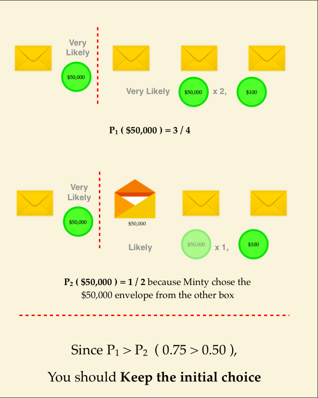

# CanYouWinBig?
https://brilliant.org/daily-problems/minty-hull/

Would you rather have a new car, or be consumed by a man-eating goat? These are your options on the <em>Monty Hall Game Show</em> today. 

    

There are three doors: behind one is a new car and behind the other two are man-eating goats. After you've chosen a door, the host opens one of the <em>other</em> doors and shows you a goat and then offers you the option to keep your initial choice or switch to the remaining door. What should you do?  

When the game is over, you're leaving the studio inside a car or inside a goat, so play the game <em>carefully</em>. 

Watch below for more details about the game and a helpful way to think about the solution. 

<template>

&nbsp;

</template>

The first decision is irrelevant—no matter what door you pick, the odds of getting the car are one in three. The key question is what to do when the host gives us more information and offers the option to switch. 

In the video above, the game is modified to have twenty doors and nineteen goats, and many people find this version easier to reason about. After the host has opened eighteen doors with goats, do you find the decision to stay or switch easier? 

If your intuition is stronger for the second scenario, try to transfer that understanding to the original game show. Considering a more extreme case to aid the development of your intuition is a helpful technique in many problems, and it might even help you with today's daily problem.

<header class="b-vspace-m">
<h1>Today's Problem</h1>
</header>

On the Minty Hull game show, there are two boxes and two envelopes in each box. Three of the envelopes contain $50,000 each and one contains $100. 

You begin by selecting an envelope from one of the boxes.  After that, Minty (who has knowledge of all of the envelopes' prizes) opens up an envelope containing $50,000 from the <em>other</em> box, and donates this money to charity.

Minty now gives you a choice: you can keep your first envelope, or you can switch to the remaining envelope in the box Minty already chose one envelope from. To have the best chance at the $50,000, what should you do?

* Keep your initial choice.
* Switch to the other box and select the envelope that Minty didn't open.
* It doesn't matter what choice you make.

===============================================

# 내 멋대로 발직역
# 큰 내기를 이길 수 있겠어?

새로운차 또는 식용염소 중 어떤게 났습니까? 이 게임 옵션은 몬티홀 게임쇼에서 소개됩니다.

세개의 문이 있습니다. 여기 중 1개에는 차가 있고 2개에는 염소가 있죠. 당신이 문을 고른 후 호스트는 염소가 있는 문을 하나 열어서 보여줄 것입니다. 이때 당신은 처음 선택을 유지할것인가요? 아님 번복할것인가요?

게임이 끝나고나면 스튜디오에 당신은 염소 또는 차와 남겨지게 될것입니다. 신중히 게임을 진행하세요.

첫번째 결정은 엉뚱합니다. 당신이 고른 문과 관련없이 당신이 차를 얻을 확률은 1/3입니다. 문제의 핵심은 호스트가 우리에게 정보를 주는것이고 바꿀수 있는 기회가 주어지는 것입니다.

위에 비디오에서는 게임이 수정되어 20개의 문과 9개의 염소가 있어 많은 사람이 이 버젼을 쉽게 풀어냅니다. 호스트가 8개의 염소가 있는 문을 연다면 당신의 결정이 더 쉬워질까요?

만약 당신의 직관이 두번째에 더 끌린다면 원래의 게임쇼를 이해하려 해보세요. 확장된 경우는 많은 문제를 풀때 도움이 됩니다.

<header class="b-vspace-m">
<h1>Today's Problem</h1>
</header>

몬티 게임홀쇼에서 두개의 박스와 두개의 동봉된 편지가 각 박스에 있습니다. 세개는 50000달러가 있고 하나는 100달러가 있습니다. 

당신이 하나의 박스에서 하나의 동봉된 편지를 골랐을때 다른박스에 50000달러가 있는 봉투를 개봉할것입니다.

당신은 다른 편지로 바꿀 수 있는 기회가 남아있습니다. 50000달러를 얻기위해서 어떻게 하는게 최고의 기회가 될까요?

* 1.Keep your initial choice.
* 2.Switch to the other box and select the envelope that Minty didn't open.
* 3.It doesn't matter what choice you make.

===============================================

내가 고른 정답 : 2.Switch to the other box and select the envelope that Minty didn't open.

이유 : 위의 몬티홀 문제와 마찬가지로 영향을 줄것같아서...

정답 : 1.Keep your initial choice.

모범 답안 : 

