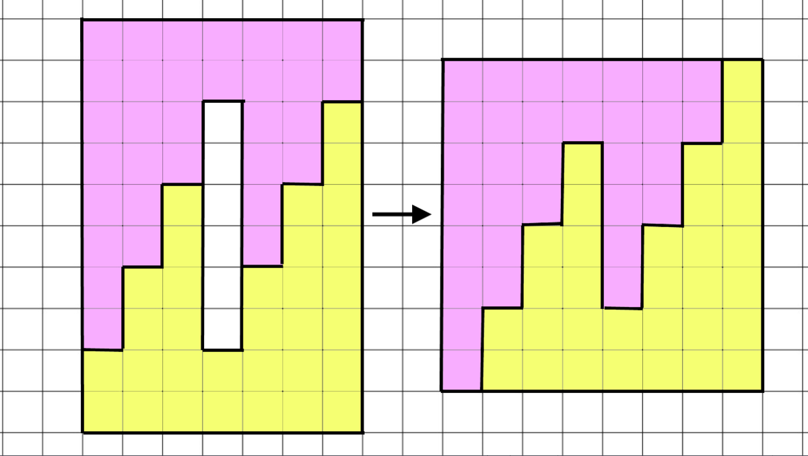

# OnlyTwoPieces?
https://brilliant.org/daily-problems/two-pieces/

A tetromino is a polygon made by connecting four squares together. These shapes are familiar to many because they are used in the game Tetris. 

Now, let's pack them into a <svg xmlns:xlink="http://www.w3.org/1999/xlink" style="width: 5.111ex; height: 1.667ex; vertical-align: -0.111ex; margin-top: 1px; margin-right: 0px; margin-bottom: 1px; margin-left: 0px; " viewBox="0 -697.9033013280564 2222.4444444444443 718.8066026561128"><defs><path id="MJMAIN-34-b40097c031ff11e39e2840400601ade95cb9ff27466847ada34da956b3ef3510" stroke-width="0" d="M462 0Q444 3 333 3Q217 3 199 0H190V46H221Q241 46 248 46T265 48T279 53T286 61Q287 63 287 115V165H28V211L179 442Q332 674 334 675Q336 677 355 677H373L379 671V211H471V165H379V114Q379 73 379 66T385 54Q393 47 442 46H471V0H462ZM293 211V545L74 212L183 211H293Z"></path><path id="MJMAIN-D7-b40097c031ff11e39e2840400601ade95cb9ff27466847ada34da956b3ef3510" stroke-width="0" d="M630 29Q630 9 609 9Q604 9 587 25T493 118L389 222L284 117Q178 13 175 11Q171 9 168 9Q160 9 154 15T147 29Q147 36 161 51T255 146L359 250L255 354Q174 435 161 449T147 471Q147 480 153 485T168 490Q173 490 175 489Q178 487 284 383L389 278L493 382Q570 459 587 475T609 491Q630 491 630 471Q630 464 620 453T522 355L418 250L522 145Q606 61 618 48T630 29Z"></path><path id="MJMAIN-34-b40097c031ff11e39e2840400601ade95cb9ff27466847ada34da956b3ef3510" stroke-width="0" d="M462 0Q444 3 333 3Q217 3 199 0H190V46H221Q241 46 248 46T265 48T279 53T286 61Q287 63 287 115V165H28V211L179 442Q332 674 334 675Q336 677 355 677H373L379 671V211H471V165H379V114Q379 73 379 66T385 54Q393 47 442 46H471V0H462ZM293 211V545L74 212L183 211H293Z"></path></defs><g stroke="black" fill="black" stroke-width="0" transform="matrix(1 0 0 -1 0 0)"><use xlink:href="#MJMAIN-34-b40097c031ff11e39e2840400601ade95cb9ff27466847ada34da956b3ef3510"></use><use xlink:href="#MJMAIN-D7-b40097c031ff11e39e2840400601ade95cb9ff27466847ada34da956b3ef3510" x="722" y="0"></use><use xlink:href="#MJMAIN-34-b40097c031ff11e39e2840400601ade95cb9ff27466847ada34da956b3ef3510" x="1722" y="0"></use></g></svg> square. 

Unsurprisingly, four copies of the square tetromino can pack perfectly into a <svg xmlns:xlink="http://www.w3.org/1999/xlink" style="width: 5.111ex; height: 1.667ex; vertical-align: -0.111ex; margin-top: 1px; margin-right: 0px; margin-bottom: 1px; margin-left: 0px; " viewBox="0 -697.9033013280564 2222.4444444444443 718.8066026561128"><defs><path id="MJMAIN-34-3d5c030650d711e38dd940400601ade99f5bb9006cc24861ac7e3084af6dded9" stroke-width="0" d="M462 0Q444 3 333 3Q217 3 199 0H190V46H221Q241 46 248 46T265 48T279 53T286 61Q287 63 287 115V165H28V211L179 442Q332 674 334 675Q336 677 355 677H373L379 671V211H471V165H379V114Q379 73 379 66T385 54Q393 47 442 46H471V0H462ZM293 211V545L74 212L183 211H293Z"></path><path id="MJMAIN-D7-3d5c030650d711e38dd940400601ade99f5bb9006cc24861ac7e3084af6dded9" stroke-width="0" d="M630 29Q630 9 609 9Q604 9 587 25T493 118L389 222L284 117Q178 13 175 11Q171 9 168 9Q160 9 154 15T147 29Q147 36 161 51T255 146L359 250L255 354Q174 435 161 449T147 471Q147 480 153 485T168 490Q173 490 175 489Q178 487 284 383L389 278L493 382Q570 459 587 475T609 491Q630 491 630 471Q630 464 620 453T522 355L418 250L522 145Q606 61 618 48T630 29Z"></path><path id="MJMAIN-34-3d5c030650d711e38dd940400601ade99f5bb9006cc24861ac7e3084af6dded9" stroke-width="0" d="M462 0Q444 3 333 3Q217 3 199 0H190V46H221Q241 46 248 46T265 48T279 53T286 61Q287 63 287 115V165H28V211L179 442Q332 674 334 675Q336 677 355 677H373L379 671V211H471V165H379V114Q379 73 379 66T385 54Q393 47 442 46H471V0H462ZM293 211V545L74 212L183 211H293Z"></path></defs><g stroke="black" fill="black" stroke-width="0" transform="matrix(1 0 0 -1 0 0)"><use xlink:href="#MJMAIN-34-3d5c030650d711e38dd940400601ade99f5bb9006cc24861ac7e3084af6dded9"></use><use xlink:href="#MJMAIN-D7-3d5c030650d711e38dd940400601ade99f5bb9006cc24861ac7e3084af6dded9" x="722" y="0"></use><use xlink:href="#MJMAIN-34-3d5c030650d711e38dd940400601ade99f5bb9006cc24861ac7e3084af6dded9" x="1722" y="0"></use></g></svg> square.  

Which of the tetrominoes does <strong>not</strong> have that property?  

While it might look difficult or even impossible at first glance, most of the tetrominoes <em>can</em> be packed into a <svg xmlns:xlink="http://www.w3.org/1999/xlink" style="width: 5.111ex; height: 1.667ex; vertical-align: -0.111ex; margin-top: 1px; margin-right: 0px; margin-bottom: 1px; margin-left: 0px; " viewBox="0 -697.9033013280564 2222.4444444444443 718.8066026561128"><defs><path id="MJMAIN-34-3d5c030650d711e38dd940400601ade99f5bb9006cc24861ac7e3084af6dded9" stroke-width="0" d="M462 0Q444 3 333 3Q217 3 199 0H190V46H221Q241 46 248 46T265 48T279 53T286 61Q287 63 287 115V165H28V211L179 442Q332 674 334 675Q336 677 355 677H373L379 671V211H471V165H379V114Q379 73 379 66T385 54Q393 47 442 46H471V0H462ZM293 211V545L74 212L183 211H293Z"></path><path id="MJMAIN-D7-3d5c030650d711e38dd940400601ade99f5bb9006cc24861ac7e3084af6dded9" stroke-width="0" d="M630 29Q630 9 609 9Q604 9 587 25T493 118L389 222L284 117Q178 13 175 11Q171 9 168 9Q160 9 154 15T147 29Q147 36 161 51T255 146L359 250L255 354Q174 435 161 449T147 471Q147 480 153 485T168 490Q173 490 175 489Q178 487 284 383L389 278L493 382Q570 459 587 475T609 491Q630 491 630 471Q630 464 620 453T522 355L418 250L522 145Q606 61 618 48T630 29Z"></path><path id="MJMAIN-34-3d5c030650d711e38dd940400601ade99f5bb9006cc24861ac7e3084af6dded9" stroke-width="0" d="M462 0Q444 3 333 3Q217 3 199 0H190V46H221Q241 46 248 46T265 48T279 53T286 61Q287 63 287 115V165H28V211L179 442Q332 674 334 675Q336 677 355 677H373L379 671V211H471V165H379V114Q379 73 379 66T385 54Q393 47 442 46H471V0H462ZM293 211V545L74 212L183 211H293Z"></path></defs><g stroke="black" fill="black" stroke-width="0" transform="matrix(1 0 0 -1 0 0)"><use xlink:href="#MJMAIN-34-3d5c030650d711e38dd940400601ade99f5bb9006cc24861ac7e3084af6dded9"></use><use xlink:href="#MJMAIN-D7-3d5c030650d711e38dd940400601ade99f5bb9006cc24861ac7e3084af6dded9" x="722" y="0"></use><use xlink:href="#MJMAIN-34-3d5c030650d711e38dd940400601ade99f5bb9006cc24861ac7e3084af6dded9" x="1722" y="0"></use></g></svg> square. The trick is exploring a way to fit two pieces together so that they fill exactly half the square. 

In fact, only one of these tetrominoes cannot be packed into a square. Can you see why? There is no way to fill a corner with the zig-zag tetromino without leaving a gap along the edge of the square. Here are a few different possible combinations that help to show the problem. 

The problem below is not based on tetrominoes, but it does require the same kind of careful packing. After cutting the shape below into two pieces, are the pieces more like the zig-zag tetromino or more like the other tetrominoes?

Here are some possible cuts for the problem below. Is there one that lets you perfectly pack the pieces into a square? 

<header class="b-vspace-m">
<h1>Today's Problem</h1>
</header>

There's a <svg xmlns:xlink="http://www.w3.org/1999/xlink" style="width: 5.125ex; height: 1.625ex; vertical-align: -0.125ex; margin-top: 1px; margin-right: 0px; margin-bottom: 1px; margin-left: 0px; " viewBox="0 -684.5807122916057 2222.4444444444443 725.1614245832114"><defs><path id="MJMAIN-31-d05ab1868b0511e7ae5f0214570faa50390bfd32c9df41a7948e173c4fa1270c" stroke-width="0" d="M213 578L200 573Q186 568 160 563T102 556H83V602H102Q149 604 189 617T245 641T273 663Q275 666 285 666Q294 666 302 660V361L303 61Q310 54 315 52T339 48T401 46H427V0H416Q395 3 257 3Q121 3 100 0H88V46H114Q136 46 152 46T177 47T193 50T201 52T207 57T213 61V578Z"></path><path id="MJMAIN-D7-d05ab1868b0511e7ae5f0214570faa50390bfd32c9df41a7948e173c4fa1270c" stroke-width="0" d="M630 29Q630 9 609 9Q604 9 587 25T493 118L389 222L284 117Q178 13 175 11Q171 9 168 9Q160 9 154 15T147 29Q147 36 161 51T255 146L359 250L255 354Q174 435 161 449T147 471Q147 480 153 485T168 490Q173 490 175 489Q178 487 284 383L389 278L493 382Q570 459 587 475T609 491Q630 491 630 471Q630 464 620 453T522 355L418 250L522 145Q606 61 618 48T630 29Z"></path><path id="MJMAIN-36-d05ab1868b0511e7ae5f0214570faa50390bfd32c9df41a7948e173c4fa1270c" stroke-width="0" d="M42 313Q42 476 123 571T303 666Q372 666 402 630T432 550Q432 525 418 510T379 495Q356 495 341 509T326 548Q326 592 373 601Q351 623 311 626Q240 626 194 566Q147 500 147 364L148 360Q153 366 156 373Q197 433 263 433H267Q313 433 348 414Q372 400 396 374T435 317Q456 268 456 210V192Q456 169 451 149Q440 90 387 34T253 -22Q225 -22 199 -14T143 16T92 75T56 172T42 313ZM257 397Q227 397 205 380T171 335T154 278T148 216Q148 133 160 97T198 39Q222 21 251 21Q302 21 329 59Q342 77 347 104T352 209Q352 289 347 316T329 361Q302 397 257 397Z"></path></defs><g stroke="black" fill="black" stroke-width="0" transform="matrix(1 0 0 -1 0 0)"><use xlink:href="#MJMAIN-31-d05ab1868b0511e7ae5f0214570faa50390bfd32c9df41a7948e173c4fa1270c"></use><use xlink:href="#MJMAIN-D7-d05ab1868b0511e7ae5f0214570faa50390bfd32c9df41a7948e173c4fa1270c" x="722" y="0"></use><use xlink:href="#MJMAIN-36-d05ab1868b0511e7ae5f0214570faa50390bfd32c9df41a7948e173c4fa1270c" x="1722" y="0"></use></g></svg>사각형 홈의 중간에  <svg xmlns:xlink="http://www.w3.org/1999/xlink" style="width: 6.333ex; height: 1.667ex; vertical-align: -0.222ex; margin-top: 1px; margin-right: 0px; margin-bottom: 1px; margin-left: 0px; " viewBox="0 -696.9033013280564 2722.4444444444443 739.8066026561128"><defs><path id="MJMAIN-37-e6c039f848cf11e49a5b026e3951ed9124858cfbcbd84a01a5129d54459990a9" stroke-width="0" d="M55 458Q56 460 72 567L88 674Q88 676 108 676H128V672Q128 662 143 655T195 646T364 644H485V605L417 512Q408 500 387 472T360 435T339 403T319 367T305 330T292 284T284 230T278 162T275 80Q275 66 275 52T274 28V19Q270 2 255 -10T221 -22Q210 -22 200 -19T179 0T168 40Q168 198 265 368Q285 400 349 489L395 552H302Q128 552 119 546Q113 543 108 522T98 479L95 458V455H55V458Z"></path><path id="MJMAIN-D7-e6c039f848cf11e49a5b026e3951ed9124858cfbcbd84a01a5129d54459990a9" stroke-width="0" d="M630 29Q630 9 609 9Q604 9 587 25T493 118L389 222L284 117Q178 13 175 11Q171 9 168 9Q160 9 154 15T147 29Q147 36 161 51T255 146L359 250L255 354Q174 435 161 449T147 471Q147 480 153 485T168 490Q173 490 175 489Q178 487 284 383L389 278L493 382Q570 459 587 475T609 491Q630 491 630 471Q630 464 620 453T522 355L418 250L522 145Q606 61 618 48T630 29Z"></path><path id="MJMAIN-31-e6c039f848cf11e49a5b026e3951ed9124858cfbcbd84a01a5129d54459990a9" stroke-width="0" d="M213 578L200 573Q186 568 160 563T102 556H83V602H102Q149 604 189 617T245 641T273 663Q275 666 285 666Q294 666 302 660V361L303 61Q310 54 315 52T339 48T401 46H427V0H416Q395 3 257 3Q121 3 100 0H88V46H114Q136 46 152 46T177 47T193 50T201 52T207 57T213 61V578Z"></path><path id="MJMAIN-30-e6c039f848cf11e49a5b026e3951ed9124858cfbcbd84a01a5129d54459990a9" stroke-width="0" d="M96 585Q152 666 249 666Q297 666 345 640T423 548Q460 465 460 320Q460 165 417 83Q397 41 362 16T301 -15T250 -22Q224 -22 198 -16T137 16T82 83Q39 165 39 320Q39 494 96 585ZM321 597Q291 629 250 629Q208 629 178 597Q153 571 145 525T137 333Q137 175 145 125T181 46Q209 16 250 16Q290 16 318 46Q347 76 354 130T362 333Q362 478 354 524T321 597Z"></path></defs><g stroke="black" fill="black" stroke-width="0" transform="matrix(1 0 0 -1 0 0)"><use xlink:href="#MJMAIN-37-e6c039f848cf11e49a5b026e3951ed9124858cfbcbd84a01a5129d54459990a9"></use><use xlink:href="#MJMAIN-D7-e6c039f848cf11e49a5b026e3951ed9124858cfbcbd84a01a5129d54459990a9" x="722" y="0"></use><g transform="translate(1722,0)"><use xlink:href="#MJMAIN-31-e6c039f848cf11e49a5b026e3951ed9124858cfbcbd84a01a5129d54459990a9"></use><use xlink:href="#MJMAIN-30-e6c039f848cf11e49a5b026e3951ed9124858cfbcbd84a01a5129d54459990a9" x="500" y="0"></use></g></g></svg> rectangle. 

구멍이 있는 파란색 직사각형을  <strong>두조각</strong> 으로 잘라서 사각형 조각으로 다시 배열 할 수 있을까?

* It is possible.
* It is not possible.

===============================================

# 내 멋대로 발직역
# 단지 두조각?
테트로미노는 4개의 사각형들을 연결하여 다각형을 만드는 것이다. 이 모양은 테트리스에서 봤기 때문에 친근할 것이다.

이제 4*4사각형을 보자.

4개로 이루어진 정사각형으로 이 사각형을 완전히 채울 수 있는건 당연하다.

얼핏보면 어렵거나 불가능해 보일 수 있지만, 대부분의 tetromino는 4*4사각형으로 포장 될 수 있다. 정확히 두개의 사각형을 채울 수 있는 두개의 조각을 맞추는 방법을 먼저 모색해야한다.

이렇게 지그재그 형식이 될 경우에는 테트리놈을 채울 수 없습니다.

아래 문제는 테트리놈을 기반으로하지는 않지만 같은 종류의 포장이 필요하다. 아래의 모양을 두조각으로 자른 후에 조각들은 지그재그형 테트로미노와 비슷하거나 다른 테트로미노처럼 한다.

조각을 정사각형으로 완벽하게 채울 수 있는가?

<header class="b-vspace-m">
<h1>Today's Problem</h1>
</header>

여기 <svg xmlns:xlink="http://www.w3.org/1999/xlink" style="width: 5.125ex; height: 1.625ex; vertical-align: -0.125ex; margin-top: 1px; margin-right: 0px; margin-bottom: 1px; margin-left: 0px; " viewBox="0 -684.5807122916057 2222.4444444444443 725.1614245832114"><defs><path id="MJMAIN-31-d05ab1868b0511e7ae5f0214570faa50390bfd32c9df41a7948e173c4fa1270c" stroke-width="0" d="M213 578L200 573Q186 568 160 563T102 556H83V602H102Q149 604 189 617T245 641T273 663Q275 666 285 666Q294 666 302 660V361L303 61Q310 54 315 52T339 48T401 46H427V0H416Q395 3 257 3Q121 3 100 0H88V46H114Q136 46 152 46T177 47T193 50T201 52T207 57T213 61V578Z"></path><path id="MJMAIN-D7-d05ab1868b0511e7ae5f0214570faa50390bfd32c9df41a7948e173c4fa1270c" stroke-width="0" d="M630 29Q630 9 609 9Q604 9 587 25T493 118L389 222L284 117Q178 13 175 11Q171 9 168 9Q160 9 154 15T147 29Q147 36 161 51T255 146L359 250L255 354Q174 435 161 449T147 471Q147 480 153 485T168 490Q173 490 175 489Q178 487 284 383L389 278L493 382Q570 459 587 475T609 491Q630 491 630 471Q630 464 620 453T522 355L418 250L522 145Q606 61 618 48T630 29Z"></path><path id="MJMAIN-36-d05ab1868b0511e7ae5f0214570faa50390bfd32c9df41a7948e173c4fa1270c" stroke-width="0" d="M42 313Q42 476 123 571T303 666Q372 666 402 630T432 550Q432 525 418 510T379 495Q356 495 341 509T326 548Q326 592 373 601Q351 623 311 626Q240 626 194 566Q147 500 147 364L148 360Q153 366 156 373Q197 433 263 433H267Q313 433 348 414Q372 400 396 374T435 317Q456 268 456 210V192Q456 169 451 149Q440 90 387 34T253 -22Q225 -22 199 -14T143 16T92 75T56 172T42 313ZM257 397Q227 397 205 380T171 335T154 278T148 216Q148 133 160 97T198 39Q222 21 251 21Q302 21 329 59Q342 77 347 104T352 209Q352 289 347 316T329 361Q302 397 257 397Z"></path></defs><g stroke="black" fill="black" stroke-width="0" transform="matrix(1 0 0 -1 0 0)"><use xlink:href="#MJMAIN-31-d05ab1868b0511e7ae5f0214570faa50390bfd32c9df41a7948e173c4fa1270c"></use><use xlink:href="#MJMAIN-D7-d05ab1868b0511e7ae5f0214570faa50390bfd32c9df41a7948e173c4fa1270c" x="722" y="0"></use><use xlink:href="#MJMAIN-36-d05ab1868b0511e7ae5f0214570faa50390bfd32c9df41a7948e173c4fa1270c" x="1722" y="0"></use></g></svg> rectangular hole in the middle of a <svg xmlns:xlink="http://www.w3.org/1999/xlink" style="width: 6.333ex; height: 1.667ex; vertical-align: -0.222ex; margin-top: 1px; margin-right: 0px; margin-bottom: 1px; margin-left: 0px; " viewBox="0 -696.9033013280564 2722.4444444444443 739.8066026561128"><defs><path id="MJMAIN-37-e6c039f848cf11e49a5b026e3951ed9124858cfbcbd84a01a5129d54459990a9" stroke-width="0" d="M55 458Q56 460 72 567L88 674Q88 676 108 676H128V672Q128 662 143 655T195 646T364 644H485V605L417 512Q408 500 387 472T360 435T339 403T319 367T305 330T292 284T284 230T278 162T275 80Q275 66 275 52T274 28V19Q270 2 255 -10T221 -22Q210 -22 200 -19T179 0T168 40Q168 198 265 368Q285 400 349 489L395 552H302Q128 552 119 546Q113 543 108 522T98 479L95 458V455H55V458Z"></path><path id="MJMAIN-D7-e6c039f848cf11e49a5b026e3951ed9124858cfbcbd84a01a5129d54459990a9" stroke-width="0" d="M630 29Q630 9 609 9Q604 9 587 25T493 118L389 222L284 117Q178 13 175 11Q171 9 168 9Q160 9 154 15T147 29Q147 36 161 51T255 146L359 250L255 354Q174 435 161 449T147 471Q147 480 153 485T168 490Q173 490 175 489Q178 487 284 383L389 278L493 382Q570 459 587 475T609 491Q630 491 630 471Q630 464 620 453T522 355L418 250L522 145Q606 61 618 48T630 29Z"></path><path id="MJMAIN-31-e6c039f848cf11e49a5b026e3951ed9124858cfbcbd84a01a5129d54459990a9" stroke-width="0" d="M213 578L200 573Q186 568 160 563T102 556H83V602H102Q149 604 189 617T245 641T273 663Q275 666 285 666Q294 666 302 660V361L303 61Q310 54 315 52T339 48T401 46H427V0H416Q395 3 257 3Q121 3 100 0H88V46H114Q136 46 152 46T177 47T193 50T201 52T207 57T213 61V578Z"></path><path id="MJMAIN-30-e6c039f848cf11e49a5b026e3951ed9124858cfbcbd84a01a5129d54459990a9" stroke-width="0" d="M96 585Q152 666 249 666Q297 666 345 640T423 548Q460 465 460 320Q460 165 417 83Q397 41 362 16T301 -15T250 -22Q224 -22 198 -16T137 16T82 83Q39 165 39 320Q39 494 96 585ZM321 597Q291 629 250 629Q208 629 178 597Q153 571 145 525T137 333Q137 175 145 125T181 46Q209 16 250 16Q290 16 318 46Q347 76 354 130T362 333Q362 478 354 524T321 597Z"></path></defs><g stroke="black" fill="black" stroke-width="0" transform="matrix(1 0 0 -1 0 0)"><use xlink:href="#MJMAIN-37-e6c039f848cf11e49a5b026e3951ed9124858cfbcbd84a01a5129d54459990a9"></use><use xlink:href="#MJMAIN-D7-e6c039f848cf11e49a5b026e3951ed9124858cfbcbd84a01a5129d54459990a9" x="722" y="0"></use><g transform="translate(1722,0)"><use xlink:href="#MJMAIN-31-e6c039f848cf11e49a5b026e3951ed9124858cfbcbd84a01a5129d54459990a9"></use><use xlink:href="#MJMAIN-30-e6c039f848cf11e49a5b026e3951ed9124858cfbcbd84a01a5129d54459990a9" x="500" y="0"></use></g></g></svg> 사각형이있다. 

Is it possible to cut the blue rectangle with a hole into exactly <strong>two pieces</strong> and rearrange the pieces into a square?

* It is possible.
* It is not possible.

===============================================

내가 고른 정답 : It is possible.

이유 : 7 * 10 - 1 * 6 = 64라 8 * 8 형태의 사각형이 나올꺼구 충분히 가능하다고 머리가 말하고 있다.. ㅋㅋ

정답 : It is possible.

모범 답안 : 

굿

